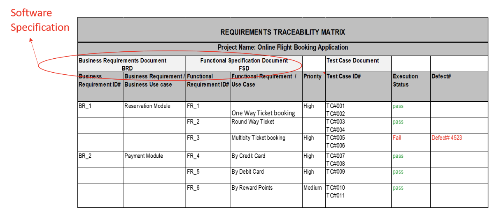

<!-- 

📋 This is the tech-news archives to help me keep track of what I am interested in!

- Reference tech news link: <https://thenextweb.com/news/blockchain-development-tech-career>
  

{{ notice-2 | markdownify }}
 -->

📋 This is my note-taking from what I learned in the class "Software Requirements Engng"
{: .notice--danger}

 

# Requirements Traceability

`Traceability` is a software engineering term that that refers to documented links between software engineering work products.

A `Traceability matrix` allows a requirements engineer to relate requirements to other software other software engineering products such as test cases, code... etc.

`Rows of the traceability` matrix express requirements.

`Columns of the traceability` matrix describe the working products of the software engineering for example a use case, design element, test case related to the traceability matrix.

Below an example:

Traceability matrices can support a variety of software engineering activities such as:

1. Continuity for developers as a project moves forward from one phase to another
2. Ensure all the Engineering work products have taken all the requirements into account

 

---

 

    🖋️ This is my self-taught blog! Feel free to let me know
    if there are some errors or wrong parts 😆

[Back to Top](#){: .btn .btn--primary }{: .align-right}
