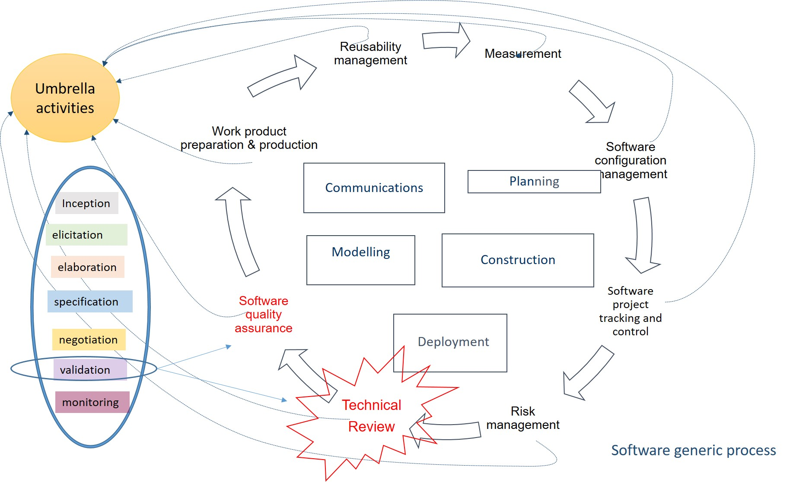
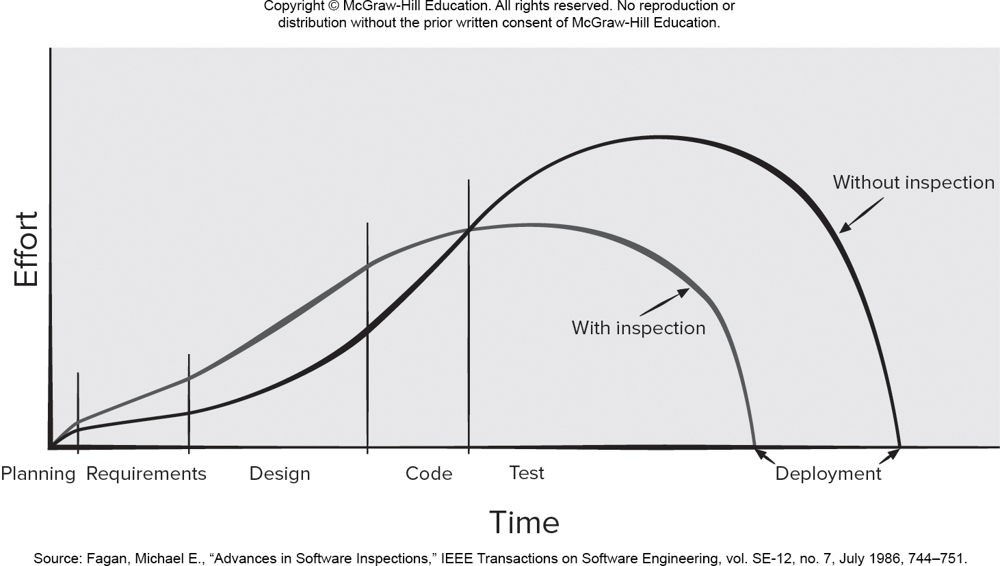
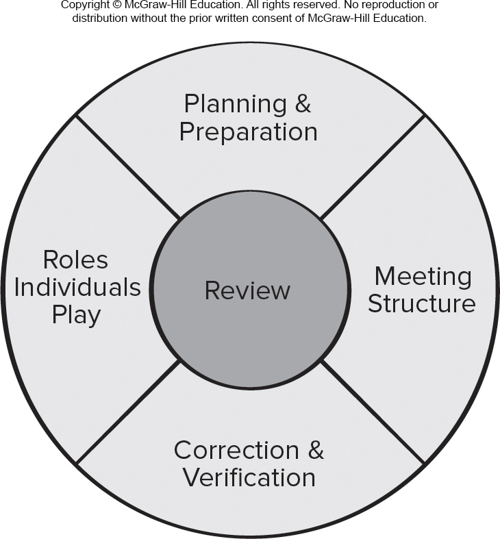

<!-- 

📋 This is the tech-news archives to help me keep track of what I am interested in!

- Reference tech news link: <https://thenextweb.com/news/blockchain-development-tech-career>
  

{{ notice-2 | markdownify }}
 -->

📋 This is my note-taking from what I learned in the class "Software Requirements Engng"
{: .notice--danger}

 

# Requirements Validation and Technical Review

Recall from the previous unit one of the requirements engineering tasks was "`requirements validation`", a requirements validation checklist was discussed. In this topic we discuss the primary `requirements validation mechanism` which is Technical reviews. The review team that validates the requirements includes software engineers, customers, users, and other stakeholders who examine the `specification` looking for `errors` in content or interpretation, areas where clarification may be required, missing information, inconsistencies (a major problem when large products or systems are engineered), conflicting requirements, or unrealistic (un-achievable) requirements.

Looking at the figure below, notice the requirements engineering tasks in relation to the software engineering process and the main activities and umbrella activities.

For Example: consider two seemingly innocuous requirements:

1. The software should be user friendly.
   : The first requirement is too vague for developers to test or assess. What exactly does “user friendly” mean? To validate it, it must be `quantified or qualified` in some manner.
2. The probability of a successful unauthorized database intrusion should be less than 0.0001.
   : The second requirement has a quantitative element (“less than 0.0001”), but intrusion testing will be `difficult and time consuming`. Is this level of security even warranted for the application? Can other complementary requirements associated with security (e.g., password protection, specialized handshaking) replace the quantitative requirement noted?

 

# Technical review

The primary requirements validation happens through a `"Technical review" (TR)`

So, what is a Software review?

Software reviews are a `"Filter"` for the software process Workflow.

| Too few       | Too many              |
| :------------ | :-------------------- |
| flow is dirty | flow slows to trickle |

 

# Defect Amplification and Removal

1. Defect amplification
   : It is a term used to describe how an defect introduced early in the software engineering work flow (for example: during requirement modeling) and undetected, can and often will be amplified into multiple errors during design and more errors in construction.
2. Defect propagation
   : It is a term used to describe the impact an undiscovered defect has on future development activities or product behavior.
3. Technical debt
   : It is the term used to describe the costs incurred by failing to find and fix defects early or failing to update documentation following software changes.

The figure below shows that if proper technical reviews (inspections) are carried out then an earlier project deployment is possible,

 

# The review process

Reviews are applied at various points during the software engineering process and uncover `errors and defects & bugs`. There are many types of reviews that happens at different points of the software process. A technical review(TR) exemplified by casual reviews, walk-through and inspections

- Formal
- Informal
- Somewhere in between

The level of formality is chosen to match the the type of product to be built.

As shown in the figure below, The formality of a review increases when:

1. Distinct roles are explicitly defined for the reviewer.
2. There is a sufficient amount of planning and preparation for the review.
3. A distinct structure for the review (including tasks and internal work products) is defined.
4. Follow-up by the reviewers occurs for any corrections that are made.

1. Informal meetings
   : The benefit is immediate discovery of errors and better work product quality. Informal reviews include:
   : - A simple desk check of a software engineering work product with a colleague.
   : - A casual meeting (involving more than 2 people) for the purpose of reviewing a work product, or
   : - The review-oriented aspects of pair programming which encourages continuous review as work is created.
2. Formal meetings
   : The objectives of an Formal Technical Review (FTR), walk through or inspection, are:
   : - To uncover errors in function, logic, or implementation for any representation of the software.
   : - To verify that the software under review meets its requirements.
   : - To ensure that the software has been represented according to predefined standards.
   : - To achieve software that is developed in a uniform manner.
   : - To make projects more manageable.
3. Review Meeting
   : - Between three and five people (typically) should be involved in the review.
   : - Advance preparation should occur but should require no more than two hours of work for each person.
   : - The duration of the review meeting should be less than two hours.
   : - Focus is on a work product (for example: a portion of a requirements model, a detailed component design, source code for a component).
4. Review Players
   : - Producer — the individual who has developed the work product.
   : - Review leader — evaluates the product for readiness, generates copies of product materials, and distributes them to two or three reviewers for advance preparation and facilitates the meeting discussion.
   : - Reviewer(s) — expected to spend between one and two hours reviewing the product, making notes, and otherwise becoming familiar with the work.
   : - Recorder — reviewer who records (in writing) all important issues raised during the review.
5. Review Outcomes
   : At the end of the review, all attendees of the (FTR) must decide whether to:
   : - Accept the product without further modification.
   : - Reject the product due to severe errors (once corrected, another review must be performed).
   : - Accept the product provisionally (minor errors have been encountered and must be corrected, but no additional review will be required).
6. Review Reporting and Record Keeping
   : During the (FTR), the recorder records all issues raised and summarizes these in a review issues list to serve as an action list for the producer.
   : A formal technical review summary report is created that answers three questions:
   : - What was reviewed?
   : - Who reviewed it?
   : - What were the findings and conclusions?

`Design activities` introduce `50 to 65%` of all software `defects`.

`Review activities` have been shown to be `75%` effective in uncovering design flaws.

Technical reviews are the most effective mechanism to find mistakes early in the software process. The sooner you find a defect the cheaper it is to fix it. The output of a review is a list of issues and/or errors that have been uncovered.

 

# Review metrics

Software quality problems are referred to by various names `Errors, Defects, Bugs`. The goal is to detect as many as possible of these problems. Let us first define these terms:

- Defects & Bugs:
  : A quality problem found only `after` the software has been released to end users or other stakeholders
- Error:
  : A quality problem found only `before` the software has been released to end users or other stakeholders

We want to avoid defects because they make software engineers look bad.

The following review metrics can be collected for each review that is conducted:

1. Preparation effort, **Ep** — the effort (in person-hours) required to review a work product prior to the actual review meeting
2. Assessment effort, **Ea** — the effort (in person-hours) that is expended during the actual review
3. Rework effort, **Er** — the effort (in person-hours) that is dedicated to the correction of those errors uncovered during the review
4. Work product size, **WPS** — a measure of the size of the work product that has been reviewed (e.g., the number of UML models, or the number of document pages, or the number of lines of code)
5. Minor errors found, **Errminor** — the number of errors found that can be categorized as minor (requiring less than some pre-specified effort to correct)
6. Major errors found, Errmajor — the number of errors found that can be categorized as major (requiring more than some pre-specified effort to correct)
7. Total errors found, Errtot - Represents the sum of the errors found: Errtot = Errminor + Errmajor
8. Error density Represents the error found per unit of work product reviewed:
9. Error density = Errtot / WPS

These metrics can be further refined by associating the type of work product that was reviewed for the metrics collected.

How might these metrics be used for requirements engineering validation?

 

---

 

    🖋️ This is my self-taught blog! Feel free to let me know
    if there are some errors or wrong parts 😆

[Back to Top](#){: .btn .btn--primary }{: .align-right}
