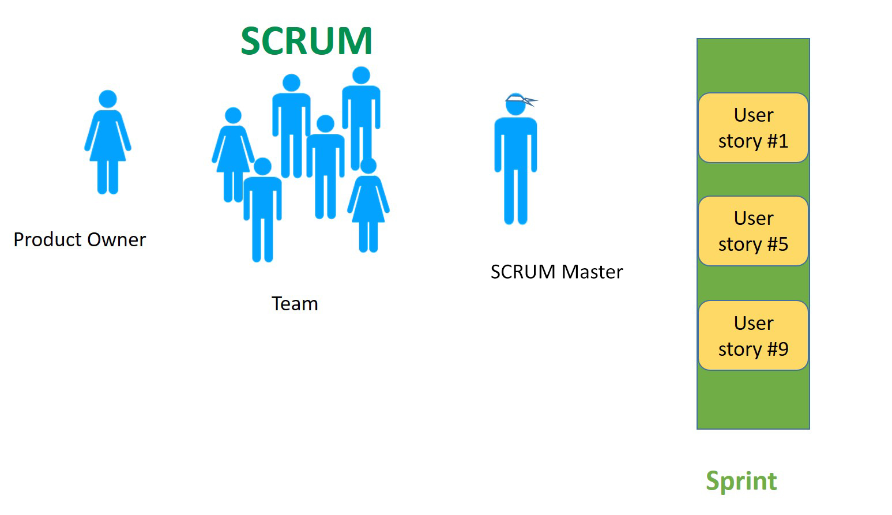

<!-- 

📋 This is the tech-news archives to help me keep track of what I am interested in!

- Reference tech news link: <https://thenextweb.com/news/blockchain-development-tech-career>
  

{{ notice-2 | markdownify }}
 -->

📋 This is my note-taking from what I learned in the class "Software Requirements Engng"
{: .notice--danger}

 

# Agile Reviews

How do we do review in Agile projects?

We conduct reviews to `catch defects early` on in the process. Failing to catch defects early can be costly in time and resources.

Agile developers have the same need to `find defects early and often`.

Throughout the scrum process there are several places where `informal and formal reviews` take place as follows:

1. During the Sprint meeting (informal)
2. During Pair Programming (informal)
3. The sprint review meeting (formal)
4. During Evaluation of the prototype (formal)

During the sprint planning meeting, user stories are reviewed and ordered according to priority. The daily Scrum meeting is an informal way to ensure that team members are all working on the same priorities and try to catch any defects that may cause the sprint to fail. The sprint review meeting is often conducted using guidelines like the formal technical review discussed in this chapter. The sprint retrospective meeting really a postmortem meeting in that the development team is trying to capture its lessons learned.

 

---

 

    🖋️ This is my self-taught blog! Feel free to let me know
    if there are some errors or wrong parts 😆

[Back to Top](#){: .btn .btn--primary }{: .align-right}
