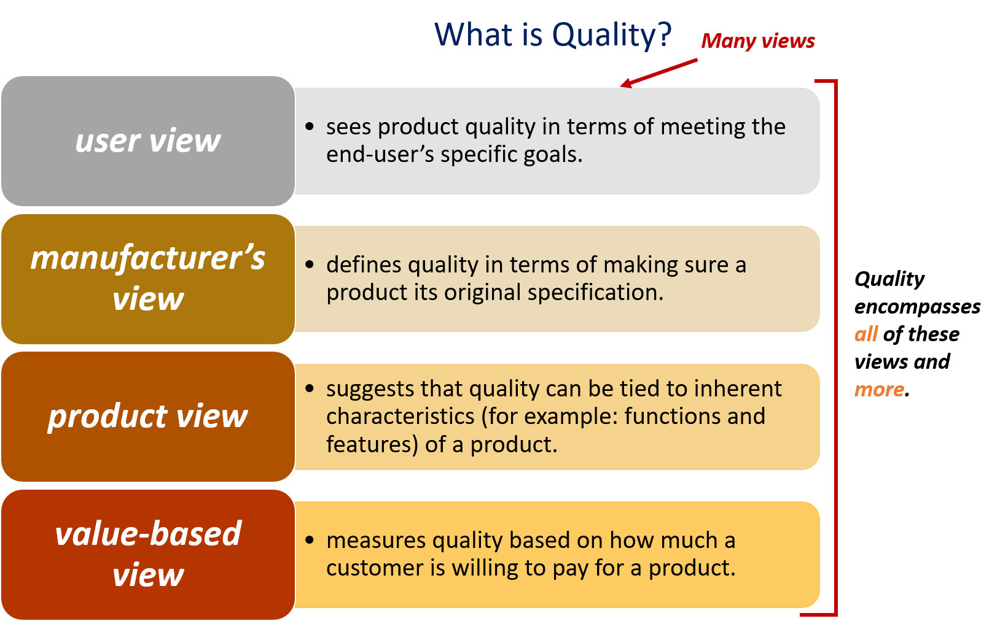
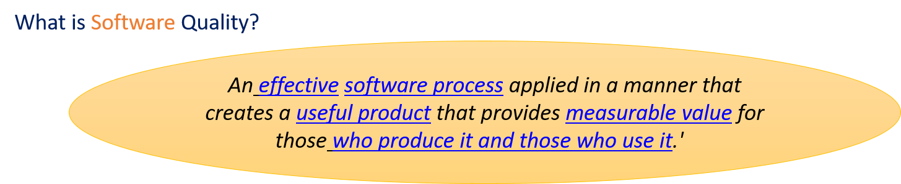
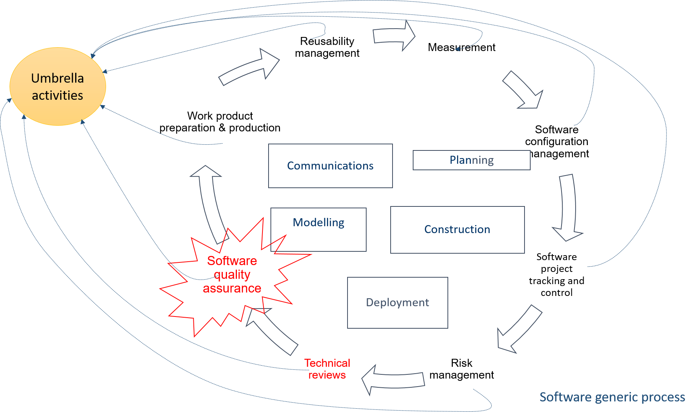
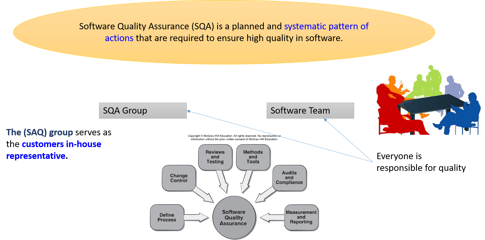
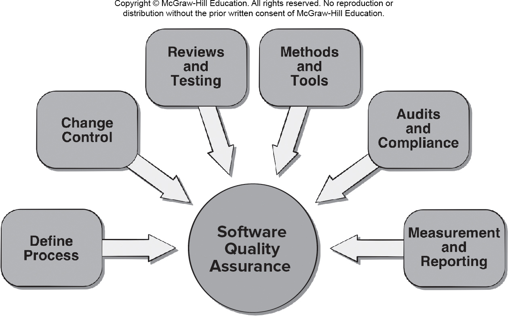

<!-- 

📋 This is the tech-news archives to help me keep track of what I am interested in!

- Reference tech news link: <https://thenextweb.com/news/blockchain-development-tech-career>
  

{{ notice-2 | markdownify }}
 -->

📋 This is my note-taking from what I learned in the class "Software Requirements Engng"
{: .notice--danger}

 

# What is quality in software engineering?

Quality is `challenging concept`, some software developers continue to believe that software quality is something that you worry about after code has been generated. This is not true!! Software quality assurance (AKA software quality management) is an umbrella activity that is applied `throughout the software process`.

There are multiple views about quality, as per the below figure depending from what perspective we look at quality the definition varies, but quality encompasses all these views and more.

[Robert Glass] argues that a more “intuitive” relationship is in order:

> user satisfaction = compliant product + good quality + delivery within budget and schedule

> What is a good software quality? Software Quality can be defined as:
>
> An effective software process applied in a manner that creates a useful product that provides measurable value for those who produce it and those who use it.

- Effective software process
  : - An effective software process establishes infrastructure that supports building a high-quality software product.
  : - The management aspects of process create the checks and balances that help avoid project chaos—a key contributor to poor quality.
  : - Software engineering practices allow the developer to analyze the problem and design a solid solution—both critical to building high quality software.
  : - Umbrella activities such as change management and technical reviews have as much to do with quality as any other part of software engineering practice.
- Advantages of providing a useful product
  : - An effective software process establishes infrastructure that supports building a high-quality software product.
  : - The management aspects of process create the checks and balances that help avoid project chaos—a key contributor to poor quality.
  : - Software engineering practices allow the developer to analyze the problem and design a solid solution—both critical to building high quality software.
  : - Umbrella activities such as change management and technical reviews have as much to do with quality as any other part of software engineering practice.
- Measurable value for those who produce it and those who use it
  : - By adding value for both the producer and user of a software product, high quality software provides benefits for the software organization and the end-user community.
  : - The software organization gains added value because high quality software requires less maintenance effort, fewer bug fixes, and reduced customer support.
  : - The user community gains added value because the application provides a useful capability in a way that expedites some business process.

In software development, `quality of design` encompasses the degree to which `the design` meets the functions and features specified in the `requirements model`.

`Quality of conformance` focuses on the degree to which the implementation follows the design and the resulting system meets its requirements and performance goals.

`Quality Factors: ISO25010`

Several models and standards have been introduced but the newest standard is the `ISO 25010 quality model`. This standard defines two quality models:

- The quality in use model
  : The Quality in use model describes five characteristics:
  : 1. Effectiveness
  : 2. Efficiency
  : 3. Satisfaction
  : 4. Freedom from risk
  : 5. Context coverage
- The product quality model
  : The Product quality model describes eight characteristics and
  : 1. Functional stability
  : 2. Performance efficiency
  : 3. Compatibility
  : 4. Usability
  : 5. Reliability &rarr; Non functional requirements are the base for these factors and differ for each project
  : 6. Security  
  : 7. Maintainability
  : 8. Portability

 

# Software quality assurance?

One of the umbrella activities was software quality assurance. As per the below figure the Software assurance quality (SAQ) is an umbrella activity that defines and conducts the activities required to ensure software quality. Similar to other umbrella activities this activity is applied throughout a software project.

`Software Quality Assurance (SQA)` is a planned and systematic pattern of actions that are required to ensure high quality in software. `The (SQA) group` serves as the `customers in-house representative`. As the figure below illustrates SQA is the responsibility of everyone involved:

## Responsibilities of the SQA group

1. Prepares an SQA plan for a project which identifies:
   : - Evaluations to be performed.
   : - Audits and reviews to be performed.
   : - Standards that are applicable to the project.
   : - Procedures for error reporting and tracking.
   : - Documents to be produced by the S Q A group.
   : - Amount of feedback provided to the software project team.
2. Participates in the development of the project’s software process description.
   : - Reviews the process description for compliance with organizational policy, internal software standards, externally imposed standards (for example, ISO-9001), and other parts of the software project plan.

## Responsibilities of the Software team

1. Reviews software engineering activities to verify compliance with the defined software process.
   : - Identifies, documents, and tracks deviations from the process and verifies that corrections have been made.
2. Audits designated software work products to verify compliance with those defined as part of the software process.
   : - Reviews selected work products; identifies, documents, and tracks deviations; verifies that corrections have been made.
   : - Periodically reports the results of its work to the project manager.
3. Ensures that deviations in software work and work products are documented and handled according to a documented procedure.
4. Records any noncompliance and reports to senior management. Noncompliance items are tracked until they are resolved

## Software quality assurance (SQA) encompasses a set of activities

1. An SQA process.
2. Specific quality assurance and quality control tasks (including technical reviews and a multi-tiered testing strategy)
3. Effective software engineering practice(methods and tools)
4. Control of all software work products and the changes made to them
5. A procedure to ensure compliance with software development standards (when applicable)
6. Measurement and reporting mechanisms

The figure below illustrates the main activities of SQA

SQA is data driven &rarr; As the figure below indicates SQA depends highly on data collected throughout audits/reviews and testing.

 

# Requirements quality (Goals, Attributes, and Metrics)

The SQA activities described in the preceding section are performed to achieve a set of pragmatic goals at the levels of:

1. Requirements.
2. Design quality.
3. Code quality.
4. Quality control effectiveness.

In this course we focus on the requirements quality.

`Requirements quality`: The correctness, completeness, and consistency of the requirements model will have a strong influence on the quality of all work products that follow. SQA must ensure that the software team has properly `reviewed` the requirements model to achieve a high level of quality.

Basically there are six important attributes that the SQA process should control/measure for a requirements engineering model. The below table illustrates these attributes and the metrics that can be used to indicate the relative strength of each attribute.

| Attribute            | Metric                                                           |
| :------------------- | :--------------------------------------------------------------- |
| 1. Ambiguity         | Number of ambiguous modifiers (e.g., many, large,human-friendly) |
| 2. Completeness      | Number of TBA, TBD                                               |
| 3. Understandability | Number of sections/subsections                                   |
| 4. Volatility        | Number of changes per requirement                                |
|                      | Time (by activity) when change is requested                      |
| 5. Traceability      | Number of requirements not traceable to design/code              |
| 6. Model clarity     | Number of UML models                                             |
|                      | Number of descriptive pages per model                            |
|                      | Number of UML errors                                             |

Example:

- If a requirement states that "The user interface should be user friendly" this would be consider an ambiguous requirement and should raise a red flag.
- If the class diagram contains a class named "Payment" yet the use case model diagram does not have a use case related to make a payment or make a paid order another red flag should be raised.

 

---

 

    🖋️ This is my self-taught blog! Feel free to let me know
    if there are some errors or wrong parts 😆

[Back to Top](#){: .btn .btn--primary }{: .align-right}
