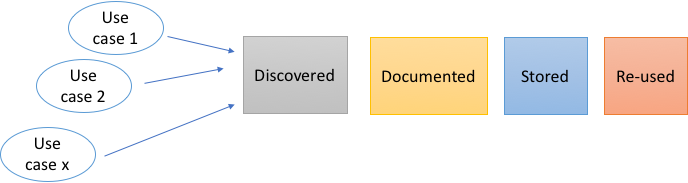
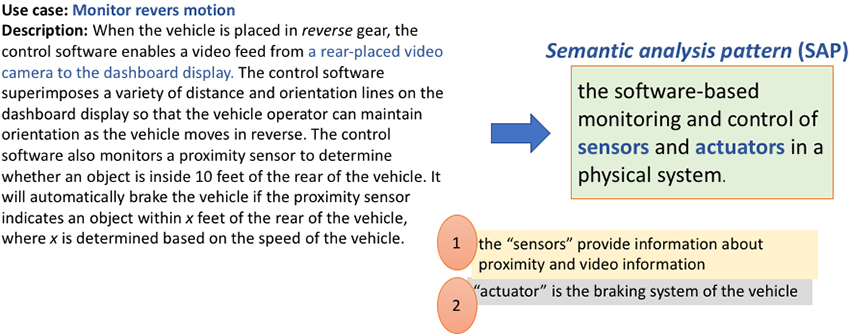
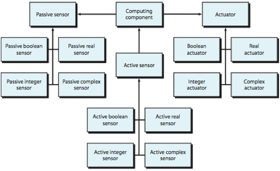
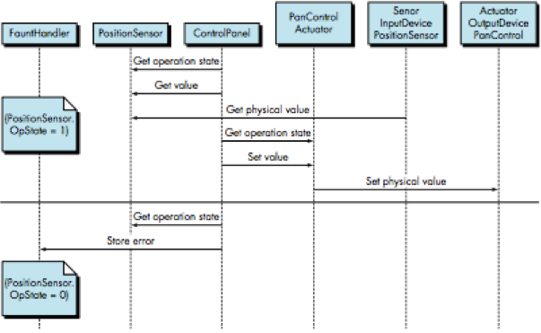

<!-- 

📋 This is the tech-news archives to help me keep track of what I am interested in!

- Reference tech news link: <https://thenextweb.com/news/blockchain-development-tech-career>
  

{{ notice-2 | markdownify }}
 -->

📋 This is my note-taking from what I learned in the class "Software Requirements Engng"
{: .notice--danger}

 

# Analysis Patterns

Software patterns are a mechanism for capturing domain knowledge in a way that allows it to be reapplied when a new problem is encountered.

In some cases, the domain knowledge is applied to a new problem within the same application domain.

In other cases, the domain knowledge captured by a pattern can be applied by analogy to a completely different application domain.

Analysis patterns are:

- Discovered (not created) during requirements engineering work
- Should be documented by describing the general problem pattern is applicable to, the prescribed solution, assumptions, constraints, advantages, disadvantages, and references to known examples
- Documented analysis patterns are stored in an indexed repository facilitate its reuse by other team members

A semantic analysis pattern(SAP) is a pattern that describes a small set of coherent use cases that together describe a basic generic application [Fernandez, E. B.]

The Analysis patterns are very useful in cases of complicated software systems. They are not the same as design patterns.

The `analysis pattern template` is as follows:

| Analysis Pattern Template |                                                                                                                                                                                                  |
| :------------------------ | :----------------------------------------------------------------------------------------------------------------------------------------------------------------------------------------------- |
| 1. Pattern name           | General name of pattern                                                                                                                                                                          |
| 2. Intent                 | This section indicates the intention of the pattern and in which situations to use the pattern                                                                                                   |
| 3. Motivation             | This section gives a background about the pattern and a high-level view of its functionalities                                                                                                   |
| 4. Constraints            | This section lists the assumptions such as the operations each class would be responsible for                                                                                                    |
| 5. Applicability          | This section talks about which situations that this pattern can be used                                                                                                                          |
| 6. Structure              | UML class diagram                                                                                                                                                                                |
| 7. Behavior               | UML sequence diagram or state diagram                                                                                                                                                            |
| 8. Participants           | This section of the patterns description “itemizes the classes/objects that are included in the requirements pattern” [Konrad, S. et al] and describes the responsibilities of each class/object |
| 9. Collaborations         | This section describes how objects and classes interact with one another and how each carries out its responsibilities                                                                           |
| 10. Consequences          | This section lists any consequences of using the patterns                                                                                                                                        |

Example:

Let us assume you have the following preliminary use case narrative.

Use case: Monitor reverse motion

Description: When the vehicle is placed in reverse gear, the control software enables a video feed from a rear-placed video camera to the dashboard display. The control software superimposes a variety of distance and orientation lines on the dashboard display so that the vehicle operator can maintain orientation as the vehicle moves in reverse. The control software also monitors a proximity sensor to determine whether an object is inside 10 feet of the rear of the vehicle. It will automatically brake the vehicle if the proximity sensor indicates an object within x feet of the rear of the vehicle, where x is determined based on the speed of the vehicle.

Instead of starting from scratch in the analysis modelling exercise, we can research and find that there is a pattern that can be reused for this case.

Example:

| Example           |                                                                                                                                                                                                                                                                                                                                                                                                                                                                           |
| :---------------- | :------------------------------------------------------------------------------------------------------------------------------------------------------------------------------------------------------------------------------------------------------------------------------------------------------------------------------------------------------------------------------------------------------------------------------------------------------------------------ |
| 1. Pattern name   | Actuator-Sensor                                                                                                                                                                                                                                                                                                                                                                                                                                                           |
| 2. Intent         | Specify various kinds of sensors and actuators in an embedded system                                                                                                                                                                                                                                                                                                                                                                                                      |
| 3. Motivation     | Embedded systems usually have various kinds of sensors and actuators. These sensors and actuators are all either directly or indirectly connected to a control unit. The Actuator-Sensor pattern uses a pull mechanism (explicit re-quest for information) for PassiveSensors and a push mechanism (broadcast of information) for the ActiveSensors                                                                                                                       |
| 4. Constraints    | - Each passive sensor must have some method to read sensor input and attributes that represent the sensor value.                                                                                                                                                                                                                                                                                                                                                          |
|                   | - Each active sensor must have capabilities to broadcast update messages when its value changes.                                                                                                                                                                                                                                                                                                                                                                          |
|                   | - Each active sensor should send a life tick, a status message issued within a specified time frame, to detect malfunctions.                                                                                                                                                                                                                                                                                                                                              |
|                   | - Each actuator must have some method to invoke the appropriate response determined by the ComputingComponent.                                                                                                                                                                                                                                                                                                                                                            |
|                   | - Each sensor and actuator should have a function implemented to check its own operation state.                                                                                                                                                                                                                                                                                                                                                                           |
|                   | - Each sensor and actuator should be able to test the validity of the values received or sent and set its operation state if the values are outside of the specifications.                                                                                                                                                                                                                                                                                                |
| 5. Applicability  | Useful in any system in which multiple sensors and actuators are present                                                                                                                                                                                                                                                                                                                                                                                                  |
| 6. Structure      |                                                                                                                                                                                                                                                                                                                                                                                                                                    |
| 7. Behavior       |                                                                                                                                                                                                                                                                                                                                                                                                                                    |
| 8. Participants   | - PassiveSensor abstract: Defines an interface for passive sensors.                                                                                                                                                                                                                                                                                                                                                                                                       |
|                   | - PassiveBooleanSensor: Defines passive Boolean sensors.                                                                                                                                                                                                                                                                                                                                                                                                                  |
|                   | - PassiveIntegerSensor: Defines passive integer sensors.                                                                                                                                                                                                                                                                                                                                                                                                                  |
|                   | - PassiveRealSensor: Defines passive real sensors.                                                                                                                                                                                                                                                                                                                                                                                                                        |
|                   | - ActiveSensor abstract: Defines an interface for active sensors.                                                                                                                                                                                                                                                                                                                                                                                                         |
|                   | - ActiveBooleanSensor: Defines active Boolean sensors.                                                                                                                                                                                                                                                                                                                                                                                                                    |
|                   | - ActiveIntegerSensor: Defines active integer sensors.                                                                                                                                                                                                                                                                                                                                                                                                                    |
|                   | - ActiveRealSensor: Defines active real sensors.                                                                                                                                                                                                                                                                                                                                                                                                                          |
|                   | - Actuator abstract: Defines an interface for actuators.                                                                                                                                                                                                                                                                                                                                                                                                                  |
|                   | - BooleanActuator: Defines Boolean actuators.                                                                                                                                                                                                                                                                                                                                                                                                                             |
|                   | - IntegerActuator: Defines integer actuators.                                                                                                                                                                                                                                                                                                                                                                                                                             |
|                   | - RealActuator: Defines real actuators.                                                                                                                                                                                                                                                                                                                                                                                                                                   |
|                   | - ComputingComponent: The central part of the controller; it gets the data from the sensors and computes the required response for the actuators.                                                                                                                                                                                                                                                                                                                         |
|                   | - ActiveComplexSensor: Complex active sensors have the basic functionality of the abstract ActiveSensor class, but additional, more elaborate, methods and attributes need to be specified.                                                                                                                                                                                                                                                                               |
|                   | - PassiveComplexSensor: Complex passive sensors have the basic functionality of the abstract PassiveSensor class, but additional, more elaborate, methods and attributes need to be specified.                                                                                                                                                                                                                                                                            |
|                   | - ComplexActuator: Complex actuators also have the base functionality of the abstract Actuator class, but additional, more elaborate methods and attributes need to be specified.                                                                                                                                                                                                                                                                                         |
| 9. Collaborations | 1. When the ComputingComponent needs to update the value of a PassiveSensor, it queries the sensors, requesting the value by sending the appropriate message.                                                                                                                                                                                                                                                                                                             |
|                   | 2. ActiveSensors are not queried. They initiate the transmission of sensor values to the computing unit, using the appropriate method to set the value in the ComputingComponent. They send a life tick at least once during a specified time frame in order to update their timestamps with the system clock’s time.                                                                                                                                                     |
|                   | 3. When the ComputingComponent needs to set the value of an actuator, it sends the value to the actuator.                                                                                                                                                                                                                                                                                                                                                                 |
|                   | 4. The ComputingComponent can query and set the operation state of the sensors and actuators using the appropriate methods. If an operation state is found to be zero, then the error is sent to the FaultHandler, a class that contains methods for handling error messages, such as starting a more elaborate recovery mechanism or a backup device. If no recovery is possible, then the system can only use the last known value for the sensor or the default value. |
|                   | 5. The ActiveSensors offer methods to add or remove the addresses or address ranges of the components that want to receive the messages in case of a value change.                                                                                                                                                                                                                                                                                                        |
| 10. Consequences  | 1. Sensor and actuator classes have a common interface.                                                                                                                                                                                                                                                                                                                                                                                                                   |
|                   | 2. Class attributes can only be accessed through messages, and the class decides whether or not to accept the message. For example, if a value of an actuator is set above a maximum value, then the actuator class may not accept the message, or it might use a default maximum value.                                                                                                                                                                                  |
|                   | 3. The complexity of the system is potentially reduced because of the uniformity of interfaces for actuators and sensors.                                                                                                                                                                                                                                                                                                                                                 |

 

---

 

    🖋️ This is my self-taught blog! Feel free to let me know
    if there are some errors or wrong parts 😆

[Back to Top](#){: .btn .btn--primary }{: .align-right}
