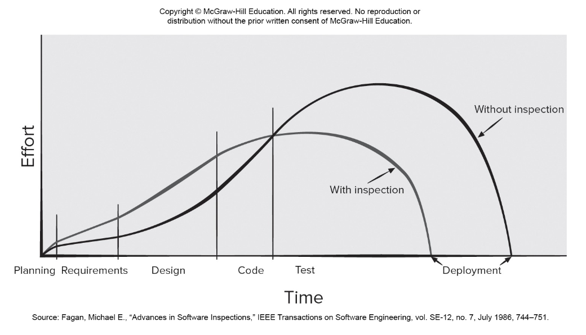
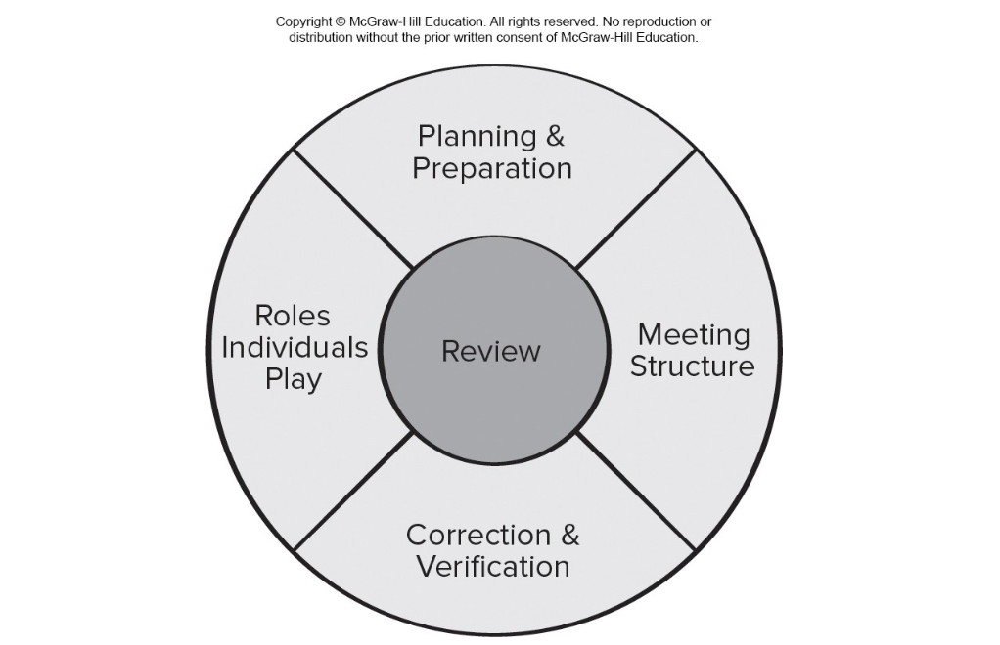

<!-- 

📋 This is the tech-news archives to help me keep track of what I am interested in!

- Reference tech news link: <https://thenextweb.com/news/blockchain-development-tech-career>
  

{{ notice-2 | markdownify }}
 -->

📋 This is my note-taking from what I learned in the class "Software Requirements Engng"
{: .notice--danger}

 

# Reviews

What are they?

- A meeting conducted by technical people.
- A technical assessment of a work product created during the software engineering process.
- A software quality assurance mechanism.
- A training ground.

What they are not!

- A project summary or progress assessment.
- A meeting intended solely to impart information.
- A mechanism for political or personal reprisal!

 

# Cost Impact of Software Defects

- `Error` — a quality problem found `before` the software is released to end users.
- `Defect` — a quality problem found only `after` the software has been released to end-users.
- We make this distinction because errors and defects have very different economic, business, psychological, and human impact.
- Design activities introduce 50 to 65% of all software defects.
- Review activities have been shown to be 75% effective in uncovering design flaws.
- The sooner you find a defect the cheaper it is to fix it.

 

# Defect Amplification and Removal

- `Defect amplification` is a term used to describe how an defect introduced early in the software engineering work flow (for example: during requirement modeling) and undetected, can and often will be amplified into multiple errors during design and more errors in construction.
- `Defect propagation` is a term used to describe the impact an undiscovered defect has on future development activities or product behavior.
- `Technical debt` is the term used to describe the costs incurred by failing to find and fix defects early or failing to update documentation following software changes.

 

# Review Metrics

- Preparation effort, Ep — the effort (in person-hours) required to review a work product prior to the actual review meeting.
- Assessment effort, Ea — the effort (in person-hours) that is expending during the actual review.
- Rework effort, Er — the effort (in person-hours) that is dedicated to the correction of those errors uncovered during the review.
- Work product size, WPS — a measure of the size of the work product that has been reviewed (for example: the number of U ML models, or the number of document pages, or the number of lines of code).
- Minor errors found, Errminor — the number of errors found that can be categorized as minor (requiring less than some pre-specified effort to correct).
- Major errors found, Errmajor — the number of errors found that can be categorized as major (requiring more than some pre-specified effort to correct).
- Total errors found, Errtot. Represents the sum of the errors found: Errtot = Errminor + Errmajor
- Error density. Represents the errors found per unit of work product reviewed: Error density = Errtot ÷ WPS

 

# Metrics Example

- The average defect density for a requirements model is 0.68 errors per page, and a new requirement model is 40 pages long.
- A rough estimate suggests that your software team will find about 27 errors during the review of the document.
- If you find only 9 errors, you’ve done an extremely good job in developing the requirements model or your review approach was not thorough enough.
- The effort required to correct a minor model error (immediately after the review) was found to require 4 person-hours.
- The effort required for a major requirement error was found to be 18 person-hours.
- Examining the review data collected, you find that minor errors occur about 6 times more frequently than major errors.
- Therefore, you can estimate that the average effort to find and correct a requirements error during review is about 6 person-hours.
- Requirements related errors uncovered during testing require an average of 45 person-hours to find and correct. Using the averages noted, we get:
- Effort saved per error = Etesting – Ereviews = 45 – 6 = 39 person-hours/error
- Since 22 errors were found during the review of the requirements model, a saving of about 858 person-hours of testing effort would be achieved. And that’s just for requirements-related errors.

 

# Effort Expended With and Without Reviews

 

# Reference Model for Technical Reviews

 

# Informal Reviews

The benefit is immediate discovery of errors and better work product quality.

Informal reviews include:

- A simple desk check of a software engineering work product with a colleague.
- A casual meeting (involving more than 2 people) for the purpose of reviewing a work product, or
- The review-oriented aspects of pair programming which encourages continuous review as work is created.

 

# Formal Technical Reviews

The objectives of an FTR (`walkthrough` or `inspection`) are:

1. To uncover errors in function, logic, or implementation for any representation of the software.
2. To verify that the software under review meets its requirements.
3. To ensure that the software has been represented according to predefined standards.
4. To achieve software that is developed in a uniform manner.
5. To make projects more manageable.

 

# Review Meeting

- Between three and five people (typically) should be involved in the review.
- Advance preparation should occur but should require no more than two hours of work for each person.
- The duration of the review meeting should be less than two hours.
- Focus is on a work product (for example: a portion of a requirements model, a detailed component design, source code for a component).

 

# Review Players

- `Producer` — the individual who has developed the work product.
- `Review leader` — evaluates the product for readiness, generates copies of product materials, and distributes them to two or three `reviewers` for advance preparation and facilitates the meeting discussion.
- `Reviewer(s)` — expected to spend between one and two hours reviewing the product, making notes, and otherwise becoming familiar with the work.
- `Recorder` — reviewer who records (in writing) all important issues raised during the review.

 

# Review Outcome

At the end of the review, all attendees of the FTR must decide whether to:

1. Accept the product without further modification.
2. Reject the product due to severe errors (once corrected, another review must be performed).
3. Accept the product provisionally (minor errors have been encountered and must be corrected, but no additional review will be required).

 

# Review Reporting and Record Keeping

- During the FTR, the recorder records all issues raised and summarizes these in a `review issues list` to serve as an action list for the producer.
- A `formal technical review summary report` is created that answers three questions:
  : 1. What was reviewed?
  : 2. Who reviewed it?
  : 3. What were the findings and conclusions?
- You should establish a follow-up procedure to ensure that items on the issues list have been properly corrected.

 

# Review Guidelines

- Review the product, not the producer.
- Set an agenda and maintain it.
- Limit debate and rebuttal.
- Enunciate problem areas, but don't try to solve every problem noted.
- Take written notes.
- Limit the number of participants and insist upon advance preparation.
- Develop a checklist for each product that is likely to be reviewed.
- Allocate resources and schedule time for FTRs.
- Conduct meaningful training for all reviewers.
- Review your early reviews.

 

# Postmortem Evaluations

- A `postmortem evaluation` (PME) is a mechanism to determine what went right and what went wrong with the software engineering process and practices applied to a specific project.
- A PME is attended by members of the software team and stakeholders who examine the entire software project, focusing on `excellences` (achievements and positive experiences) and `challenges` (problems and negative experiences).
- The intent is to extract lessons learned from the challenges and excellences and to suggest improvements to process and practice moving forward.

 

# Agile Reviews

- During the sprint planning meeting, user stories are reviewed and ordered according to priority.
- The daily Scrum meeting is an informal way to ensure that team members are all working on the same priorities and try to catch any defects that may cause the sprint to fail.
- The sprint review meeting is often conducted using guidelines like the formal technical review discussed in this chapter.
- The sprint retrospective meeting really a postmortem meeting in that the development team is trying to capture its lessons learned.

 

---

 

    🖋️ This is my self-taught blog! Feel free to let me know
    if there are some errors or wrong parts 😆

[Back to Top](#){: .btn .btn--primary }{: .align-right}
