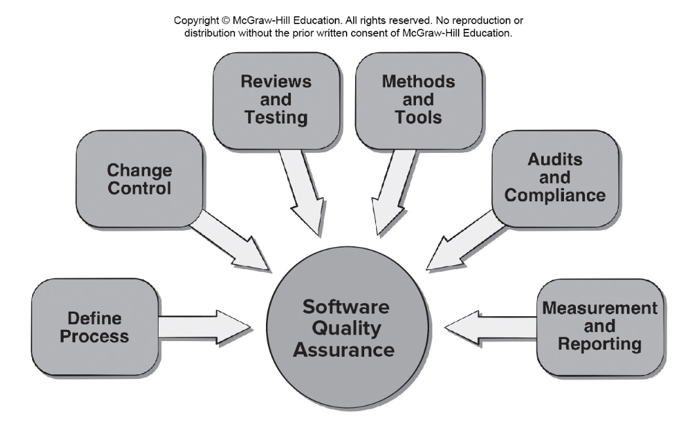
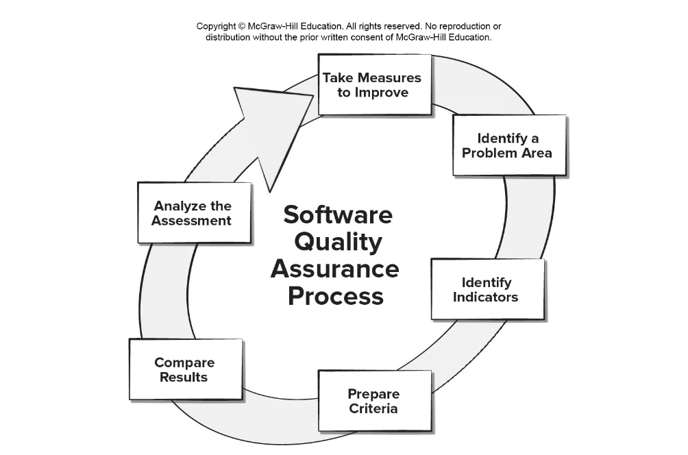

<!-- 

📋 This is the tech-news archives to help me keep track of what I am interested in!

- Reference tech news link: <https://thenextweb.com/news/blockchain-development-tech-career>
  

{{ notice-2 | markdownify }}
 -->

📋 This is my note-taking from what I learned in the class "Software Requirements Engng"
{: .notice--danger}

 

# Quality Management

Phil Crosby once said:

- The problem of quality management is not what people don't know about it. The problem is what they think they do.
- `Everybody is for it`. (Under certain conditions, of course.)
- `Everyone feels they understand it`. (Even though they wouldn't want to explain it.)
- `Everyone thinks execution is only a matter of following natural inclinations`. (After all, we do get along somehow.)
- `Most people feel that problems in these areas are caused by other people`. (If only they would take the time to do things right.)

 

# Software Quality Assurance

 

# Elements of SQA

- Standards.
- Reviews and Audits.
- Testing.
- Error/defect collection and analysis.
- Change management.
- Education.
- Vendor management.
- Security management.
- Safety.
- Risk management.

 

# Data Driven SQA

 

# Role of SQA Group

- Prepares an SQA plan for a project which identifies:
  : - Evaluations to be performed.
  : - Audits and reviews to be performed.
  : - Standards that are applicable to the project.
  : - Procedures for error reporting and tracking.
  : - Documents to be produced by the S QA group.
  : - Amount of feedback provided to the software project team.
- Participates in the development of the project’s software process description.
  : - Reviews the process description for compliance with organizational policy, internal software standards, externally imposed standards (for example, ISO-9001), and other parts of the software project plan.
- Reviews software engineering activities to verify compliance with the defined software process.
  : - Identifies, documents, and tracks deviations from the process and verifies that corrections have been made.
- Audits designated software work products to verify compliance with those defined as part of the software process.
  : - Reviews selected work products; identifies, documents, and tracks deviations; verifies that corrections have been made.
  : - Periodically reports the results of its work to the project manager.
- Ensures that deviations in software work and work products are documented and handled according to a documented procedure.
- Records any noncompliance and reports to senior management.
  : - Noncompliance items are tracked until they are resolved.

 

# SQA Goals

- `Requirements quality.` The correctness, completeness, and consistency of the requirements model will have a strong influence on the quality of all work products.
- `Design quality.` Every element of the design model should be assessed to ensure that it exhibits high quality and that the design itself conforms to requirements.
- `Code quality.` Source code and related work products must conform to local coding standards and exhibit characteristics that will facilitate maintainability.
- `Quality control effectiveness.` A software team should apply limited resources in a way that has the highest likelihood of achieving a high quality result.

 

# Formal SQA

- Assumes that a rigorous syntax and semantics can be defined for every programming language.
- Allows the use of a rigorous approach to the specification of software requirements.
- Applies mathematical proof of correctness techniques to demonstrate that a program conforms to its specification.
- Although formal methods are interesting to some software engineering researchers, most commercial developers rarely use of formal methods.

 

# Statistical SQA

1. Information about software errors and defects is collected and categorized.
2. An attempt is made to trace each error and defect to its underlying cause (for example, design error, violation of standards, non-conformance to specifications, poor communication with the customer).
3. Using the Pareto principle (80 percent of the defects can be traced to 20 percent of all possible causes), isolate the 20 percent (the `vital few`).
4. Once the vital few causes have been identified, move to correct the problems that caused the errors and defects.

 

# Six Sigma for Software Engineering

The term "six sigma" is derived from six standard deviations from the mean - 3.4 instances (defects) per million occurrences - implying an extremely high quality standard.

The three cores steps:

- `Define` customer requirements and deliverables and project goals via well-defined methods of customer communication.
- `Measure` the existing process and its output to determine current quality performance (collect defect metrics).
- `Analyze` defect metrics and determine the vital few causes.

For an existing process the needs improvement:

- `Improve` the process by eliminating the root causes of defects.
- `Control` the process to ensure that future work does not reintroduce the causes of defects.

For a new process being developed:

- `Design` the process to: (1) avoid the root causes of defects and (2) to meet customer requirements.
- `Verify` that the process model will, in fact, avoid defects and meet customer requirements.

 

# Software Reliability and Availability

A simple measure of reliability is `mean-time-between-failure` (MTBF):

> MTBF = MTTF + MTTR

- MTTF is `mean-time-to-failure`
- MTTR is `mean-time-to-repair`, respectively.

`Software availability` is the probability that a program is operating according to requirements at a given point in time and is defined as

> Availability = [MTTF/(MTTF + MTTR)] × 100%

 

# AI and Reliability Models

- `Software reliability` is the probability of failure-free software operation for a specified time period in a specified environment.
- `Bayesian inference` is a method of statistical inference in which Bayes' theorem is used to update the probability for a hypothesis (such as system reliability) being correct as more evidence or information becomes available.
- Bayesian inference can be used to estimate probabilistic quantities using historic data even when some of the information is missing.
- Making use of predictive data analytics tools such as a `regression model` involving MTBF can been used to estimate where and what types of defects might occur in future prototypes.
- `Genetic algorithms` can be used to grow reliability models by discovering relationships using historic system data to predict future software component failures.

 

# Software Safety

`Software safety` is a software quality assurance activity that focuses on the identification and assessment of potential hazards that may affect software negatively and cause an entire system to fail.

If hazards can be identified early in the software process, software design features can be specified that will either eliminate or control potential hazards.

 

# ISO 9001:2015 Standard

- ISO 9001:2015 is the quality assurance standard that applies to software engineering.
- The requirements delineated by ISO 9001:2008 address topics such as:
  : Management responsibility, quality system, contract review, design control, document and data control, product identification and traceability, process control, inspection and testing, corrective and preventive action, control of quality records, internal quality audits, training, servicing, and statistical techniques.
- For an organization to become registered to ISO 9001:2015, it must establish procedures to address each of the requirements listed and able to demonstrate these policies and being followed.

 

# SQA Plan Contents

1. Purpose and scope of the plan.
2. Description of all software engineering work products that fall within the purview of SQA.
3. Applicable standards and practices that are applied during the software process.
4. SQA actions and tasks (including reviews and audits) and their placement throughout the software process.
5. Tools and methods supporting SQA actions and tasks.
6. Software configuration management procedures.
7. Methods for safeguarding and maintaining SQA records.
8. Organizational roles and responsibilities.

 

---

 

    🖋️ This is my self-taught blog! Feel free to let me know
    if there are some errors or wrong parts 😆

[Back to Top](#){: .btn .btn--primary }{: .align-right}
