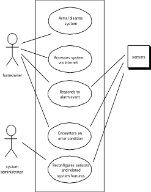
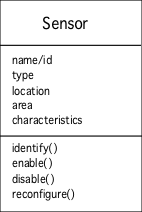
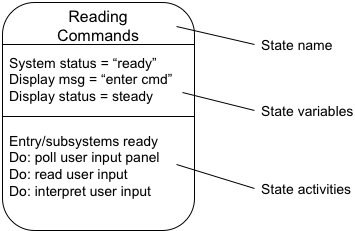
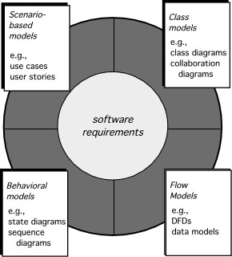

<!-- 

📋 This is the tech-news archives to help me keep track of what I am interested in!

- Reference tech news link: <https://thenextweb.com/news/blockchain-development-tech-career>
  

{{ notice-2 | markdownify }}
 -->

📋 This is my note-taking from what I learned in the class "Software Requirements Engng"
{: .notice--danger}

 

# Overall Objectives & Philosophy

Throughout `analysis modelling` the primary focus is on `what`, not how. For some types of software (small projects) a user story may be the only requirements representation that is required. While for other more complicated (large projects) formal use cases, class-based models, behavioral-models might be required.

One important thing to keep in mind is to only create the models that will be used by the development team.

There are two requirements Modeling Approaches:

- Structured Analysis
  : Considers data and processes that transform data as separate entities
  : - Data objects are modeled to define their attributes and relationships
  : - Process are modeled to show how they transform data as it flows thought the system
- Object-oriented Analysis
  : Focuses on the definition of classes and the manner in which they collaborate to effect the customer requirements. UML and the unified process are predominantly object oriented.

 

# Requirements Models Objectives and Types

Requirements Analysis results in:

1. The specification of software's operational characteristics.
2. The identification of software's `interface with other systems.`
3. The constraints that software must meet.

The `requirements analysis` or `analysis model` actions result in one of the following models:

- Scenario-based
  : System from the user’s point of view:
  : 
- Class-oriented scenarios
  : Defines objects, attributes, and relationships, for example from the "Safe home" case study below a class for the Sensors, more in units (5 & 6):
  : 
- Behavioral scenarios
  : Show the impact of events on the system states, for example from the "Safe home" case study below a state diagram showing actions based on state, more in unit 7 & 8:
  : 
- Data
  : Shows how data are transformed inside the system
- Flow-oriented
  : Shows how data are transformed inside the system

The last two were/are heavily used in the structured analysis. While the first three are used heavily in the object-oriented analysis and are more common these days.

These models are the first technical representation of the system. Each type of the requirements model present the problem from a different dimension (point of view).

These models provide the software engineer with information that can be translated into:

- Architectural designs
- Interface designs
- Component level designs

 

# Rules of Thumb

- The model should focus on requirements that are visible within the problem or business domain and be written as a relatively high level of abstraction.
- Each element of the analysis model should add to the understanding of the requirements and provide insight into the information domain, function, and behavior of the system.
- Delay consideration of infrastructure and other non-functional models until design.
- Database type, Backups, Logins indirectly assume the perfect technology assumption during "Requirements analysis."
- Minimize coupling throughout the system. Coupling is defined as the extent to which a system, subsystem, method or module connects with (depends on) others. In other words, it measures inter-dependency.
- Be certain the analysis model provides value to all stakeholders.
  : Example:
  : - Business stakeholder will use the model to validate the requirements.
  : - System designer will use the model to base their designs.
  : - Quality Assurance will use the model to test the systems and plan user acceptance testing.
- Keep the model as simple as possible. Don't add additional diagrams and don't use complex notations.

 

# Requirements modeling principles

1. The information domain of a problem must be represented and understood.
2. The functions that the software performs must be defined.
3. The behavior of the software (as a consequence of external events) must be represented.
4. The models that depict information, function, and behavior must be partitioned in a manner that uncovers detail in a layered (or hierarchical) fashion.
5. The analysis task should move from essential information toward implementation detail.

 

---

 

    🖋️ This is my self-taught blog! Feel free to let me know
    if there are some errors or wrong parts 😆

[Back to Top](#){: .btn .btn--primary }{: .align-right}
