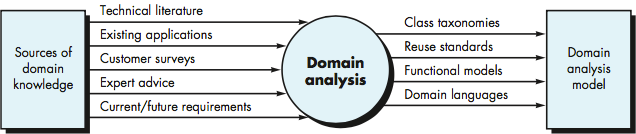

<!-- 

📋 This is the tech-news archives to help me keep track of what I am interested in!

- Reference tech news link: <https://thenextweb.com/news/blockchain-development-tech-career>
  

{{ notice-2 | markdownify }}
 -->

📋 This is my note-taking from what I learned in the class "Software Requirements Engng"
{: .notice--danger}

 

# Domain Analysis and Analysis Patterns

Analysis patterns suggest solutions for a class, a function, or a behavior that can be reused when modeling future applications. If available and deployed correctly, analysis patterns can:

- Can speed up the development of abstract analysis models by providing reusable analysis models with their advantages and disadvantages
- Facilitate the transformation of the analysis model into a design model by suggesting design patterns and reliable solutions to common patterns

So, we start with `Domain Analysis`

What is `Domain Analysis`?

Software domain analysis is the identification, analysis, and specification of common requirements from a specific application domain, typically for reuse on multiple projects within that application domain.

Domain analysis doesn’t look at a specific application, but rather at the domain in which the application resides. The intent is to identify common problem-solving elements that are applicable to all applications within the domain. [Donald Firesmith]

For example, a domain could be:

- Airline applications
- Heath software applications
- Banking applications
- College applications
- Auto applications
- Video application games

These domains have existing software systems, so, why not re-use the best of practice from their experiences?

The minute software engineers manage to find a suitable analysis pattern, the whole software development process is likely to be reduced and would further carry a better degree of overall quality.

- Define the domain to be investigated.
- Collect a representative sample of applications in the domain.
- Analyze each application in the sample.
- Develop an analysis model for the objects.

 

---

 

    🖋️ This is my self-taught blog! Feel free to let me know
    if there are some errors or wrong parts 😆

[Back to Top](#){: .btn .btn--primary }{: .align-right}
