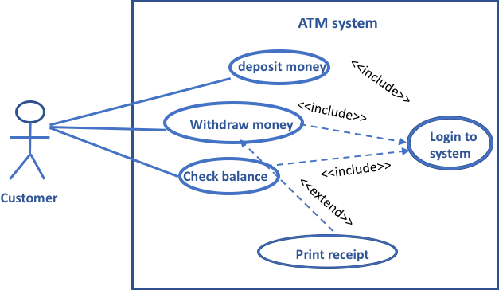
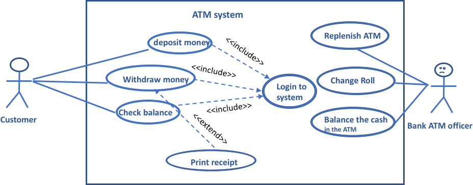

<!-- 

📋 This is the tech-news archives to help me keep track of what I am interested in!

- Reference tech news link: <https://thenextweb.com/news/blockchain-development-tech-career>
  

{{ notice-2 | markdownify }}
 -->

📋 This is my note-taking from what I learned in the class "Software Requirements Engng"
{: .notice--danger}

 

# Developing Case Models

One of the most important aspects of developing a use case model is making sure we don't miss any actors requirements and point of view.

In the example of an ATM system, identify the `customer` as an actor and guessed that customer needed to interact with the system to carry out three goals, as per the following diagram:

This is the customer point of view. But are there any other actors who will interact with the ATM system?

> He also needs to use the ATM system. Remember that the customer `Withdraws money` ans optionally `Print receipt`. So what happens when there are no more 20 dollars bills in the machine or the receipt roll is out of paper?
>
> Here comes the roll of another the `Bank ATM officer`, if we stop and ask him about his needs from the ATM system to be able to do his job, we might identify the following set of use cases:
>
> - Replenish ATM means fill the machine with cash
> - Change receipt roll
> - Balance the cash in the ATM machine

Based on the above, our model would change and look like this:

So to develop a full use case model you need to add all the functionalities from the point of view of all actors (operational stakeholders). In some large sized projects, it is a good idea to group these functionalities (use cases) into groups called `sub-systems`.

For example, in the above ATM system we might group the all the use cases related to customers in a sub-system and name it the "customer services sub-system". And group the functionalities (use cases) related to the ATM officer under another sub-system and name it "ATM administration sub-system". This would be easier for managing the functional as the project moves forward.

 

---

 

    🖋️ This is my self-taught blog! Feel free to let me know
    if there are some errors or wrong parts 😆

[Back to Top](#){: .btn .btn--primary }{: .align-right}
