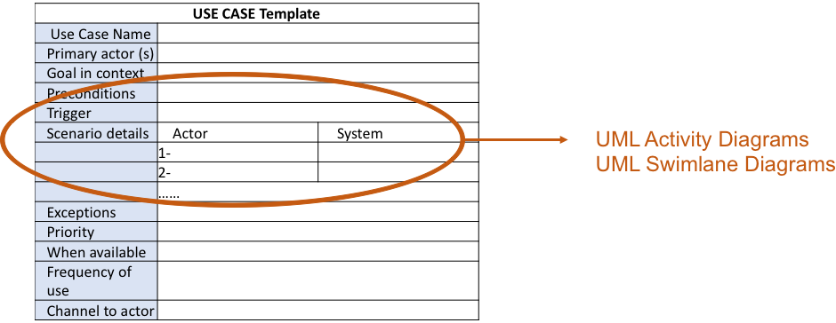

<!-- 

📋 This is the tech-news archives to help me keep track of what I am interested in!

- Reference tech news link: <https://thenextweb.com/news/blockchain-development-tech-career>
  

{{ notice-2 | markdownify }}
 -->

📋 This is my note-taking from what I learned in the class "Software Requirements Engng"
{: .notice--danger}

 

# UML Activity and Swim-lane Diagrams

Requirements modeling situations in which a text-based model, even one as simple as a use case &rarr; May not impart information in a clear and concise manner.

In this case, choose from a broad array of UML graphical models.

Two very useful UML diagrams that supplement the use case diagrams:

- UML Activity Diagram
- UML Swimlane Diagram

Re-call that we when documented a use case we used a "Scenario details" to list the specific actions that are required by the actor and the appropriate system responses. These "Scenario details" can be represented by workflow diagrams. Supplements use-case by providing graphical representation of the interaction flow within a specific scenario.

## UML Activity Diagrams

- Similar to flow chart
  : - Rounded rectangles used to represent functions
  : - Diamonds used to represent decision points
  : - Labeled arrows represent system flow transition line
  : - Solid horizontal lines indicate parallel activities, also called synchronization bars.

## UML Swimlane Diagrams

- Variation of activity diagrams used show flow of activities in use case as well as indicating which actor has responsibility for activity rectangle actions
- Responsibilities are represented by parallel line segments that divide the diagram vertically headed by the responsible actor

 

# Workflow(Activity Diagram) Symbols

[Link to Basic Activity Diagram](https://www.google.com/search?q=basic+activity+diagram&oq=basic+activity+dia&gs_lcrp=EgZjaHJvbWUqCQgAEAAYExiABDIJCAAQABgTGIAEMgYIARBFGDkyCggCEAAYCBgTGB4yCggDEAAYCBgTGB7SAQg0MjA0ajBqN6gCALACAA&sourceid=chrome&ie=UTF-8)
[Link to Sequential Activity Diagram](https://www.google.com/search?q=Sequential+activity+diagram&sxsrf=APwXEdcRXpHwa5pac31v5ZfxZKQWOYBOkw%3A1687377616590&ei=0FaTZLPCI42bptQPya-62AI&ved=0ahUKEwiz6sC7k9X_AhWNjYkEHcmXDisQ4dUDCBA&uact=5&oq=Sequential+activity+diagram&gs_lcp=Cgxnd3Mtd2l6LXNlcnAQAzIICCEQoAEQwwQyCAghEKABEMMEOgoIABBHENYEELADSgQIQRgAUOQEWOQEYLUIaAJwAXgAgAF5iAF5kgEDMC4xmAEAoAECoAEBwAEByAEK&sclient=gws-wiz-serp)
[Link to Parallel Activity Diagram](https://www.google.com/search?q=Parallel+activity+diagram&sxsrf=APwXEddzfiTYME728mpumgCsiuo8Y9muTg%3A1687377694484&ei=HleTZL-fHcWKptQPoN2PyA8&ved=0ahUKEwi_ptPgk9X_AhVFhYkEHaDuA_kQ4dUDCBA&uact=5&oq=Parallel+activity+diagram&gs_lcp=Cgxnd3Mtd2l6LXNlcnAQAzIICAAQBxAeEBMyCAgAEAcQHhATMgYIABAeEBMyCAgAEAUQHhATMggIABAIEB4QEzIICAAQCBAeEBMyCAgAEAgQHhATMggIABAIEB4QEzIICAAQCBAeEBMyCAgAEAgQHhATOgoIABBHENYEELADSgQIQRgAUJoDWJoDYJ0GaAJwAXgAgAGXAYgBlwGSAQMwLjGYAQCgAQKgAQHAAQHIAQo&sclient=gws-wiz-serp)
[Link to Decision Activity Diagram](https://www.google.com/search?q=Decision+activity+diagram&sxsrf=APwXEdfxbio9Eh-aszTjIhx9QrqHmfo-wg%3A1687377704421&ei=KFeTZN2xGbyHptQPiJSYoA4&ved=0ahUKEwjd5bHlk9X_AhW8g4kEHQgKBuQQ4dUDCBA&uact=5&oq=Decision+activity+diagram&gs_lcp=Cgxnd3Mtd2l6LXNlcnAQAzIGCAAQBxAeMgYIABAHEB4yBggAEAcQHjIGCAAQBxAeMgYIABAHEB4yCAgAEIAEEMsBMggIABAIEAcQHjIICAAQBRAHEB4yCAgAEAUQBxAeMggIABAFEAcQHjoKCAAQRxDWBBCwA0oECEEYAFCCCliCCmCEEWgCcAF4AIABa4gBa5IBAzAuMZgBAKABAqABAcABAcgBCg&sclient=gws-wiz-serp)

 

---

 

    🖋️ This is my self-taught blog! Feel free to let me know
    if there are some errors or wrong parts 😆

[Back to Top](#){: .btn .btn--primary }{: .align-right}
