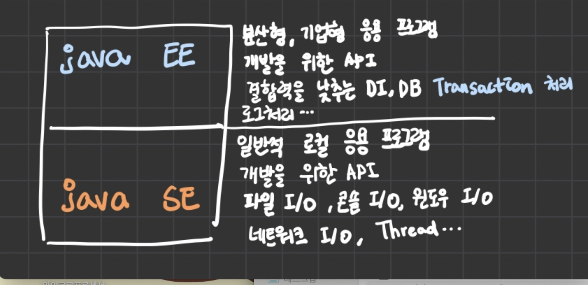

# 스프링을  왜 쓰는가하면 !?

바로 이 기능 때문이다. !! 

 

**dependency injection 과 transaction management !!!**

이 두가지가 매우 중요한 기능이다. 

일반적 소프트웨어 개발에는 저 2가지 기능이 별로 안 중요할 수 있다. 하지만 엔터프라이즈 어플리케이션을 만들 땐 **dependency injection** 이 매우 중요하다 ! 

transaction management는 Enterprise Edition에서 관리하기 어려웠지만(복잡도/대처상황), Spring으로 관리하면 더욱 쉽다   

즉 모듈 결합이 매우 쉽다는 것!  따라서 스프링이 매우 광범위하게 쓰이고있다. 

 

 Java EE 에서는 결합력을 낮추는 DI,DB Transaction 처리, 로그처리 등이 매우 중요했다.  

어느 순간 Spring이 EE가 가진 주요기능을 더 쉽게 처리할 수 있게 되고 모든 기능을 커버하기 시작했다.

 

그래서 Java EE를 들어내고 Spring 하나만으로  대신하였다. 

근데 !!!!! 우리들은 이클립스 뚱땅뚱땅 깔아서 엔터프라이즈 정도의 어플리케이션을 만드는 것 같은데  SE JDK만 설치했지 EE JDK를 설치한 적이 없는데 !?~?~

바로 그것은 EE 영역을 Spring 으로 바꾸었기 때문이다 !! 

# 그럼 EE는 없어진 것인가??

Nono !!! EE 는 유료화가 되고 뭐 이러는데 ..... 요새는 Spring 보다 더 쉽다고 뭐 어쩌고 .. 한다해도 우리는 Spring에 이미 젖어있으므로 굳이 EE 를 안찾는 것이다 

 

우리는 이렇게 자바 SE 위에 EE 를 써도 되고 Spring을 써도 된다 . 아니면 Hybrid로 두 개 다 쓰는 기업도 있다! 
