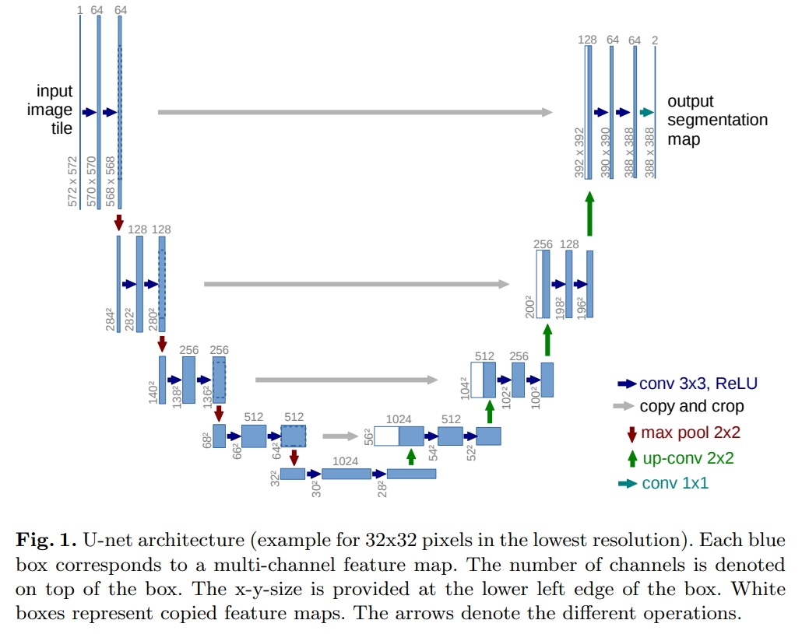
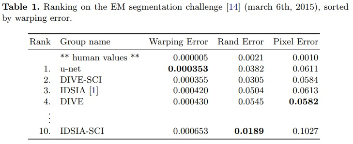

*깊은 네트워크의 성공적인 학습에는 수천 개의 주석이 달린 학습 샘플이 필요하다는 것에 대해 대체로 동의한다. 본 논문에서는 사용 가능한 주석이 달린 샘플을 보다 효율적으로 사용하기 위해 데이터 증강에 크게 의존하는 네트워크 및 학습 전략을 제시한다. 이 아키텍처는 맥락을 포착하기 위한 수축 경로와 정밀한 위치 지정을 가능하게 하는 대칭적 확장 경로로 구성된다. 이러한 네트워크는 매우 적은 이미지로부터 end-to-end로 학습될 수 있으며, 전자 현미경 스택에서 신경 구조 분할을 위한 ISBI 챌린지에서 이전의 최고 방법인 슬라이딩-윈도우 컨볼루션 네트워크를 능가함을 보여준다. 같은 네트워크를 전송 광학 현미경 이미지(위상 대비 및 DIC)에 학습시켜, 2015년 ISBI 세포 추적 챌린지에서 이러한 부문에서 큰 차이로 우승했다. 더욱이, 이 네트워크는 빠르다. 512x512 이미지의 분할은 최신 GPU에서 1초 미만이 걸린다. 전체 구현(카페 기반)과 학습된 네트워크는 본 연구 관련 웹사이트에서 제공된다.*

## 📋 Table of Contents

- [1. Introduction](#1-introduction)
- [2. Network Architecture](#2-network-architecture)
- [3. Training](#3-training)
- [4. Experiments](#4-experiments)
- [5. Conclusion](#5-Conclusion)

## 1. Introduction
 - 연구 배경으로는 깊은 컨볼루션 네트워크가 시각 인식 작업에서 뛰어난 성과를 보이고 있지만, 대부분 기존 접근법은 대규모 학습 데이터 세트에 의존적이었다.
 - 연구 목적은 본 연구에서는 적은 수의 학습 이미지로도 효과적인 학습이 가능한 새로운 네트워크 구조와 학습 전략을 제안한다.
 - 딥 컨볼루셔널 네트워크의 성공적인 발전은 학습 데이터셋의 크기와 네트워크의 규모(수백 만 개의 매개변수)로 학습된다.
 - 컨볼루셔널 네트워크는 전통적으로 이미지의 단일 클래스 레이블을 분류하는 데 활용된다.
 - 생물의학 이미지 처리와 같은 많은 시각 과제에서는 각 픽셀에 클래스 레이블을 할당하는 위치 정밀화가 필요하다.
 - 이전 연구인 Ciresan 등의 연구는 각 픽셀 주변의 지역(패치)을 입력으로 하여 픽셀의 클래스 레이블을 예측하는 슬라이딩 윈도우 설정을 사용한다.
 - 이 방법은 학습 데이터가 패치 기반으로 제한되어 속도가 느리며, 컨텍스트 사용과 위치 정확성 사이의 트레이드 오프가 존재하는 한계가 있다.
 - 본 논문에서는 "fully convolutional network"를 기반으로 한 수정 및 확장된 아키텍처를 제안한다.
 - 이 아키텍처는 적은 학습 이미지로도 더 정밀한 분할 결과를 달성한다.

## 2. Network Architecture

 - U-Net의 구조는 크게 컨텍스트를 포착하기 위한 축소 경로(contracting path; left side)와 정확한 위치를 결정하기 위한 대칭적 확장 경로(expanding path; right side)로 구성된다(Fig 1).
 - U-Net 아키텍처의 목적은 이미지의 정확한 분류뿐만 아니라, 픽셀 수준에서의 정밀한 위치 결정을 가능하게 한다.
 - 축소 경로(Contracting Path)
   - 이 경로의 구조는 전형적인 컨볼루셔널 네트워크 구조를 따른다.
   - 기본적으로 두 개의 3x3 컨볼루션을 반복 적용하며, 각 컨볼루션 뒤에는 ReLU 활성화 함수가 있다.
   - 2x2 최대 풀링 연산이 뒤따르며, 이 과정에서 피쳐 맵의 크기는 줄어들지만, 피쳐 채널의 수는 두 배로 증가한다.
 - 확장 경로(Expansive Path)
   - 이 경로는 특징 맵을 업샘플링한 후 2x2 컨볼루션("up-convolution")을 통해 특징 채널 수를 절반으로 줄인다.
   - 업샘플링된 특징 맵과 축소 경로의 해당 특징 맵을 결합한 후, 두 개의 3x3 컨볼루션과 ReLU 활성 함수를 적용한다.
   - 네트워크 최종 레이어에서는 1x1 컨볼루션을 사용하여 각 64-컴포넌트 특징 벡터를 원하는 클래스 수로 매핑한다.
 - 네트워크는 총 23개의 컨볼루션 레이어를 포함한다.
 - 출력 세그먼테이션 맵의 원활한 타일링을 위해 입력 타일 크기가 중요하다.
 - 입력 타일 크기는 모든 2x2 최대 풀링 연산이 짝수 x 및 y-size의 레이어에 적용되도록 입력 타일 크기를 선택해야 한다.

## 3. Training
 - 네트워크 학습은 Caffe의 스토캐스틱 그래디언트 디센트(stochastic gradient descent)를 사용하여 수행된다.
 - 비패딩 컨볼루션(unpadded convolution)으로 인해 출력 이미지는 입력보다 일정한 테두리 너비만큼 작아진다. 이는 컨볼루션 네트워크의 일반적인 특징이다.
 - GPU 메모리의 최대 활용을 위해 큰 배치 크기보다 큰 입력 타일을 선호하고, 단일 이미지로 배치를 줄였다. 이는 효율적인 메모리 사용과 연산 속도 향상에 도움이 된다.
 - 높은 모멘텀(0.99)의 사용은 이전에 본 많은 학습 샘플이 현재 최적화 단계에서의 업데이트에 영향을 미친다.
 - 에너지 함수(Energy Function)는  최종 특징 맵에 대한 픽셀별 소프트맥스와 교차 엔트로피 손실 함수를 결합하여 계산된다.
 - 소프트맥스는 $p_k(x) = exp(a_k(x))/\sum_{k^t=1}^{K}exp(a_{k^t}(x))$로 정의된다.
 - $a_k(x)$는 픽셀 위치 $x \in \Omega$에서 특징 채널 $k$의 활성화를 나타낸다.
 - $K$는 클래스의 수이고, $p_k(x)$는 근사 최대 함수이다.
 - 교차 엔트로피는 각 위치에서 $p_{l(x)}(x)$의 1로부터의 편차를 패널티 준다.
 - 가중치 맵은 학습 데이터 세트에서 특정 클래스에서 픽셀 빈도 차이를 보상하기 위해 사전에 계산된다.
 - 가중치 맵의 수식은 $w(x)=w_c(x)+w_0\cdot exp\left ( \frac{(d_1(x)+d_2(x))^2}{2\sigma ^2} \right )$와 같다.
 - 네트워크 일부가 excessive activations가 되고, 다른 부분은 정상 작동하지 않을 수 있으므로, 네트워크의 좋은 초기화는 매우 중요하다.
 - 초기 가중치는 네트워크의 각 특징 맵이 대략 단위 분산을 갖도록 조정되어야 한다.

### 3.1 Data Augmentation
 - 데이터 증강은 네트워크에 필요한 invariance(불변성) 및 robustness(강인성)을 가르치는 데 필수적이다.
 - 특히 마이크로스코픽 이미지의 경우 이동 및 회전 불변성과 변형 및 회색 값 변화에 대한 강인성이 필요하다.
 - 학습 샘플에 대한 무작위 Elastic Deformation은 소수의 주석이 달린 이미지로 세분화 네트워크를 학습시키는 핵심 개념으로 본다.

## 4. Experiments
 - 본 실험은 U-Net 아키텍처의 다양한 생물 의학적 이미지 세분화 작업에 대한 적용성 평가를 목표로 하고 있다.
 - 실험 데이터는 전자 현미경 기록에서 신경 구조 세분화(EM segmentation challenge), ISBI 셀 트래킹 챌린지 2015에서의 세포 세분화(ISBI cell tracking challenge)로 평가했다.
 - EM segmentation challenge
   - 학습 데이터는 전자 현미경에서 얻은 30개의 이미지(512x512 픽셀)로 구성된다.
   - 각 이미지는 세포(흰색)와 막(검은색)에 대한 완전히 주석이 달린 대응하는 세분화 맵과 함께 제공된다.
   - 테스트 세트는 공개적으로 이용 가능하지만, 그 세분화 맵은 비밀로 유지된다.
   - 평가는 맵을 10가지 다른 수준에서 임계값 처리하고 "warping error", "Rand error", "pixel error"를 계산함으로써 이루어진다.
   - 실험 결과는 Table 1과 같다.

 - ISBI cell tracking challenge
   - 이 작업은 ISBI 세포 추적 챌린지 2014 및 2015의 일부이다.
   - 데이터셋은 "PhC-U373"와 "DIC-HeLa"로 구성된다(Fig 4).
   - PhC-U373는 35개의 부분적으로 주석이 달린 학습 이미지를 포함하고, DIC-HeLa는 20개의 부분적으로 주석이 달린 학습 이미지를 포함한다.

   - 실험 결과는 Table 2와 같다.

## 5. Conclusion
 - U-Net 아키텍처는 매우 다른 생의학적 세분화 응용 프로그램에서 매우 우수한 성능을 달성한다.
 - Elastic Deforamtion을 사용한 데이터 증강 덕분에 매우 적은 수의 주석이 달린 이미지만 필요하다.
 - 합리적인 학습 시간을 가지고 있으며, NVidia Titan GPU(6 GB)에서 단 10시간만에 학습된다.
 - 전체 Caffe[6] 기반 구현과 학습된 네트워크를 제공한다.