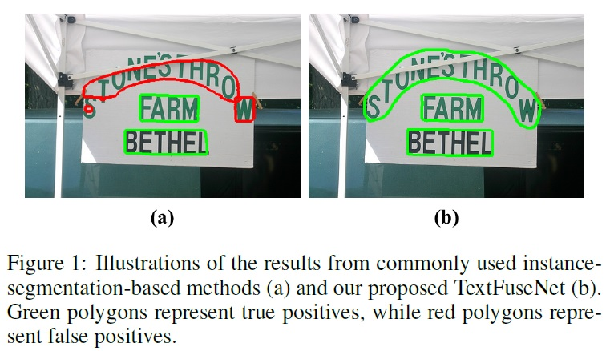
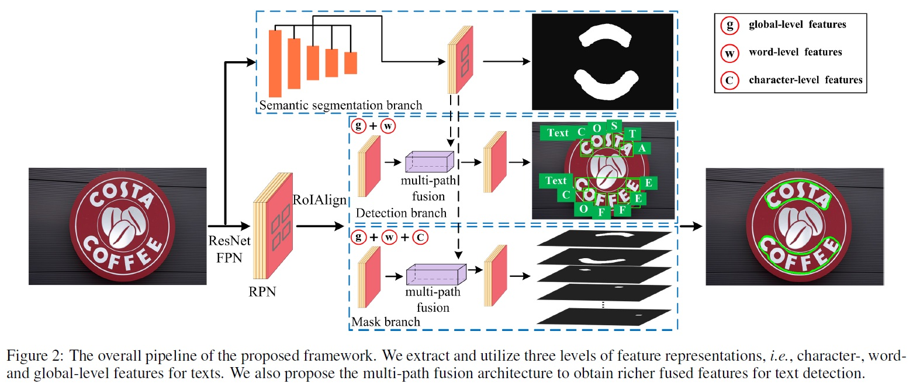
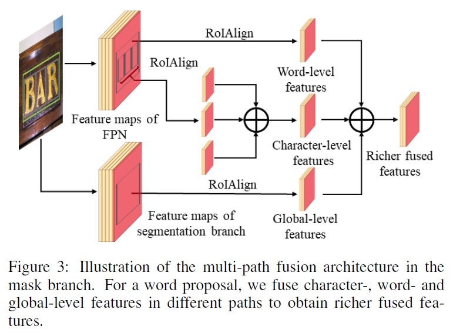
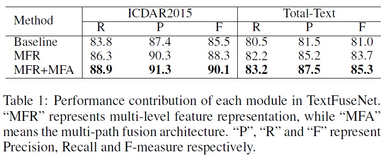
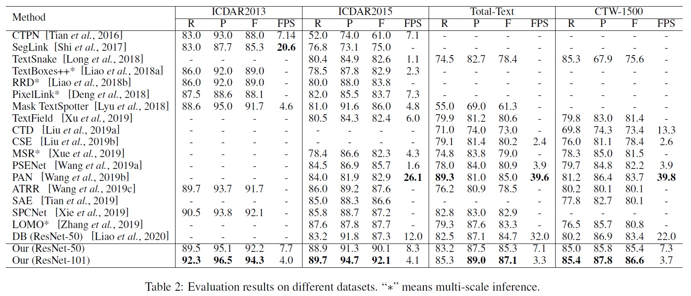

*자연 장면에서 임의 형태의 텍스트를 탐지하는 것은 매우 도전적인 작업이다. 기존의 텍스트 탐지 방법들이 제한된 특징 표현을 기반으로 텍스트를 인식하는 것과 달리, 이 연구에서는 더 풍부한 특징을 융합하여 텍스트 탐지를 수행하는 새로운 프레임워크인 TextFuseNet을 제안한다. 더 구체적으로 본 논문에서는 문자-, 단어-, 글로벌 수준의 세 가지 특징 표현에서 텍스트를 인식하고, 강력한 임의 형태 텍스트 탐지를 달성하기 위한 새로운 텍스트 표현 융합 기술을 도입한다. 제안된 TextFuseNet은 임의 형태의 텍스트를 보다 적절하게 설명하고, 거짓 긍정을 억제하며, 더 정확한 탐지 결과를 생성할 수 있다. 제안된 프레임워크는 문자 수준 주석이 없는 데이터셋에 대해서도 약한 감독으로 학습될 수 있다. 여러 데이터셋에서의 실험 결과, 제안된 TextFuseNet은 최고의 성능을 달성했다. 구체적으로 ICDAR2013에서 94.3%, ICDAR2015에서 92.1%, Total-Text에서 87.1%, CTW-1500에서 86.6%의 F-측정값을 달성했다.*

## 📋 Table of Contents

- [1 Introduction](#1-introduction)
- [2 Related Work](#2-related-work)
- [3 Methodology](#3-methodology)
- [4 Experiments](#4-experiments)
- [5 Conclusion](#5-conclusion)

## 1 Introduction
- 텍스트의 다양한 형태, 복잡한 배경, 불규칙한 모양, 질감 간섭 등으로 텍스트 탐지에 영향을 준다.
- 기존 방법들을 문자 기반과 단어 기반 접근으로 구분된다.
- 문자 기반 방법은 텍스트를 여러 문자의 조합으로 간주하므로 문자를 추출한 다음 이를 단어로 그룹화한다. 
- 문자 기반 한계는 생성된 문자 후보가 많아서 일반적으로 시간이 많이 소요된다. 
- 단어 기반 방법은 일반 객체 탐지를 기반으로 직접 단어를 탐지하였지만, 임의의 형태 텍스트를 효과적으로 탐지하기 어렵다.
- 기존 인스턴스 세그멘테이션으로 다양한 형태의 텍스트를 탐지하였지만 Fig1 (a)와 같이 두 가지 한계가 존재한다.
  - 글로벌 컨텍스트를 고려하지 않고 단일 RoI만을 탐지하므로 부정확하다.
  - 단어 의미의 다양한 수준을 모델링하지 않아 false positive 위험이 있다.
- 본 논문에서는 임의의 형태의 텍스트를 효과적으로 검출하기 위해 **TextFuseNet**을 제안한다.
- TextFuseNet 프레임워크는 문자-, 단어-, 전역 수준 특징을 융합하여 임의의 모양의 텍스트를 탐지할 수 있도록 Mask R-CNN을 확장한다.
- 글로벌 의미론적 특징을 검출 및 마스크 분기의 검출 파이프라인에 사용한다.
- 다중 경로 특징 융합 아키텍처를 도입으로 차별화된 표현 학습이 가능하다.
- 문자 수준 레이블이 없는 경우에도 효과적인 학습을 가능하게 하는 약한 감독 학습 방식을 소개한다.
- 주요 기여도는 세가지로 요약된다.
  - (1) 텍스트 탐지를 위해 특징을 융합하는 새로운 프레임워크인 TextFuseNet을 도입한다.
  - (2) 단어 수준 주석을 활용하는 약한 감독 학습 방식을 개발한다.
  - (3) 임의의 모양을 가진 텍스트가 포함된 여러 벤치마크에서 최고 성능을 달성했다.

  

   
  

## 2 Related Work
- 기존 주요 방법의 카테고리는 문자 기반과 단어 기반 방법이 있다.
- **문자 기반 방법**
  - 복잡한 문자 탐지기 (예: SWT, MSER, FASText)를 사용하여 문자 후보를 추출한다.
  - 문자/비문자 분류기로 거짓 후보를 제거한다.
  - 선행 지식이나 군집/그룹화 모델에 따른 단어로의 그룹화한다.
  - 이 방식은 정교한 설계가 요구되며 여러 단계의 처리로 인한 복잡성과 오류 축적이 되고 시간 소요가 크다.
- **단어 기반 방법**
  - 일반 객체 탐지 방법에서 영감을 받아 직접 단어를 탐지한다.
  - CTPN (CNN과 RNN 사용, [Tian et al., 2016]) - 작은 텍스트 박스 연결한다.
  - TextBoxes 및 TextBoxes++ ([Liao et al., 2018a]) - 여러 텍스트 박스 레이어 추가한다.
  - SegLink ([Shi et al., 2017]) - 텍스트 세그먼트와 연결 관계를 검출한다.
  - 이 방법들은 주로 수평 또는 다양한 방향의 텍스트에 적합하다.
- 임의 형태 텍스트 탐지를 위한 **인스턴스 세그멘테이션** 기반 방법
  - CNN을 통한 텍스트/비텍스트 예측 및 링크를 예측한다.
  - SPCNet (Mask R-CNN 기반, [Xie et al., 2019]) - 텍스트 영역을 찾는다.
  - PSENet ([Wang et al., 2019a]) - 임의의 형태의 텍스트를 탐지한다.
  - 형태 인식 임베딩 학습 ([Tian et al., 2019]) - 다양한 비율의 텍스트 인스턴스에 적응적으로 수용하도록 학습하는 형태 인식 손실을 도입했다.

## 3 Methodology
### 3.1 Framework
- TextFuseNet의 전체 아키텍처는 Fig 2와 같다.
- TextFuseNet에서는 먼저 다중 수준의 특징 표현(multi-level feature representations)을 추출한 다음, 다중 경로 융합(multi-path fusion)을 수행하여 텍스트 탐지를 진행한다.
- TextFuseNet은 피라미드 네트워크(FPN), 영역 제안 네트워크(RPN), 시맨틱 세분화 분기, 탐지 분기, 마스크 분기 다섯 가지 구성 요소로 구현된다.
- 프레임워크의 주요 과정
  - 백본(FPN): Mask R-CNN과 Mask TextSpotter를 따라 ResNet 사용한다.
  - RPN: 텍스트 제안 생성을 위해 사용한다.
  - 시맨틱 세분화 분기: 입력 이미지에 대한 시맨틱 세그멘테이션 수행 및 글로벌 수준의 특징 추출한다.
  - 탐지 분기: 카테고리 예측 및 바운딩 박스 회귀 적용을 통해 단어 및 글로벌 수준의 특징을 추출 및 융합, 단어와 문자 탐지한다.
  - 마스크 분기: 검출된 객체에 대한 인스턴스 세분화 수행 및 모든 수준의 특징을 추출 및 융합, 최종 텍스트 검출 작업 완수한다.

  

   
  

### 3.2 Multi-level Feature Representation
- 탐지 및 마스크 분기에서 제안된 영역 내의 단어와 문자를 탐지함으로써 문자 및 단어 수준 특징을 쉽게 얻을 수 있다.
- RoIAlign을 사용하여 다양한 특징을 추출하고 단어 및 문자 탐지를 수행한다.
- 글로벌 수준 특징을 얻기 위해 시맨틱 세그멘테이션 분기를 탐지기에 추가로 도입한다.
- FPN의 출력을 기반으로 구축된 시맨틱 세그멘테이션 분기는 모든 수준의 특징을 하나의 통합된 표현으로 융합하고, 이 통합된 표현에 대해 세분화를 수행하여 글로벌하게 세분화된 텍스트 탐지 결과를 얻는다.
- 다른 수준의 특징에서 특징 맵의 채널 번호를 맞추기 위해 1×1 컨볼루션 적용한다.

### 3.3 Multi-path Fusion Architecture
- **탐지 분기의 다중 경로 유합:** RPN에서 얻은 텍스트 제안을 기반으로 글로벌 및 단어 수준 특징을 추출하고, 두 유형의 특징을 융합하여 단어 및 문자 형태로 텍스트 탐지를 수행한다.
- 다만, 탐지를 수행하기 전에 문자가 아직 인식되지 않았기 때문에 탐지 분기에서 문자 수준 특징을 추출하고 융합할 수 없다.
- **마스크 분기에서의 융합:** 각 단어 수준 인스턴스에 대해 해당하는 문자-, 단어-, 글로벌 수준 특징을 다중 경로 융합 아키텍처 내에서 인스턴스 세그멘테이션을 위해 융합한다.
- 특징 추출 및 융합 과정
  - RoIAlign을 사용하여 글로벌 및 단어 수준의 특징을 7×7 크기로, 문자 수준의 특징을 14×14 크기로 추출한다.
  - 추출된 특징들을 원소별 합으로 융합 후 3×3 컨볼루션 레이어와 1×1 컨볼루션 레이어를 통해 전달한다.
- 텍스트 검출 문제 해결을 위한 TextFuseNet의 목표는 $L = L_{rpn} + L_{seg} + L_{det} + L_{mask} 으로 표현되며 RPN, 시맨틱 세그멘테이션 분기, 탐지 분기, 마스크 분기의 손실 함수 합이다.

  

   
  

### 3.4 Weakly Supervised Learning
- TextFuseNet은 단어와 문자 모두를 탐지하기 위해 설계되었으므로 문자 수준 주석이 필요하지만, 문자 수준의 주석 데이터셋의 수집 한계가 있다.
- 문자 주석을 직접 달기보다는 약한 감독 학습(weakly supervised learning) 기반 방식을 제안한다.
- 제안된 프레임워크를 기반으로 사전 학습된 모델을 단어 수준으로 주석된 데이터셋을 사용하여 사전 학습 모델 $M$을 학습한다.
- 사전 학습된 모델 $M$을 적용하여 데이터셋 $A$에서 문자 후보 샘플 세트를 얻는다(각 샘플은 예측된 카테고리, 신뢰도 점수, 바운딩 박스, 마스크 포함).
- 신뢰도 점수 임계값과 약한 감독 단어 수준 주석을 기반으로 false positive 샘플을 필터링하여 positive 문자 샘플을 식별한다(카테고리, 신뢰도 점수, 단어와의 교차 비율을 고려).
- 식별된 positive 문자 샘플을 문자 수준 주석으로 사용하고, 단어 수준 주석과 결합하여 더 견고하고 정확한 텍스트 탐지 모델을 학습한다.

## 4 Experiments
### 4.1 Datasets
- **SynthText**
  - 800,000개의 이미지와 800만 개의 합성 단어 인스턴스를 포함한 합성 데이터셋이다.
  - 단어 및 문자 수준 주석이 회전된 사각형 형태가 포함된다.
  - 일반적으로 텍스트 탐지 모델의 사전 학습에 사용된다.
- **ICDAR 2013**
  - 전형적인 수평 텍스트 데이터셋이다.
  - 229개의 학습 이미지와 233개의 테스트 이미지가 있다.
  - 단어 및 문자 수준 주석을 제공한다.
- **ICDAR 2015**
  - 다양한 방향의 텍스트를 포함한 데이터셋이다.
  - 1000개의 학습 이미지와 500개의 테스트 이미지가 있다.
  - 단어 수준에서 사각형으로 주석을 제공한다.
- **Total-Text**
   - 장면 텍스트 읽기(scene text reading)를 위한 임의 형태 텍스트 데이터셋이다.
   - 1255개의 학습 이미지와 300개의 테스트 이미지가 있다.
   - 단어 수준에서 다각형으로 주석을 제공한다.
- **CTW-1500**
   - 임의 형태 텍스트 읽기에 중점을 둔 데이터셋이다.
   - 1000개의 학습 이미지와 500개의 테스트 이미지를 포함한다.
   - Total-Text와는 다르게 텍스트 라인 수준에서 다각형으로 주석을 제공한다.

### 4.2 Implementation Details
- Maskrcnn-benchmark를 기반으로 프레임워크를 구현하며, NVidia Tesla V100(16G) GPU를 사용한 고성능 서버에서 4개의 GPU로 학습, 1개의 GPU로 평가 실험을 진행한다.
- **Training.**
  - SynthText을 이용하여 full supervision으로 사전 학습한다.
  - ICDAR 2015, Total-Text, CTW-1500을 이용하여 약한 감독 학습하고 문자 학습 샘플을 찾는다.
  - 식별된 문자 샘플과 원래의 단어 수준 주석을 결합하여 새 데이터셋에서 모델을 미세 조정(fine tuning)한다.
  - 백본으로 ResNet의 두 가지 다른 깊이(50, 101)를 채택한다.
  - 다중 스케일 학습, 무작위 회전, 무작위 색상 조정 등의 데이터 증강 전략 적용한다.
  - SGD를 사용하여 최적화한다.
  - 가중치 감소는 0.0001, 모멘텀은 0.9, 배치 크기는 8로 설정한다.
  - 사전 학습: 20 에포크, 학습률 0.01에서 시작하여 마지막 10 에포크에서 10으로 나눈다.
  - 미세 조정: 학습 반복 20K, 첫 10K 반복에서 학습률 0.005, 나머지에서 10으로 나눈다.
- **Inference.**
  - 테스트 이미지의 짧은 측면을 1000으로 스케일링한다.
  - 시맨틱 세그멘테이션 분기에서 글로벌 의미론적 특징을 추출한다.
  - RPN에서 생성된 텍스트 제안 중 상위 1,000개를 선택한다.
  - Soft NMS를 사용하여 중복된 바운딩 박스를 억제한다.
  - 인스턴스 세그멘테이션 수행 후 단어 인스턴스의 인스턴스 세그멘테이션 결과를 유지한다.

### 4.3 Ablation Study
- Baseline으로는 Mask R-CNN으로 학습된 모델을 채택한다.
- TextFuseNet에서는 멀티 레벨 특징 표현(MFR)과 멀티 경로 특징 융합 아키텍처(MFA) 두 가지 모듈을 도입하여 텍스트 탐지 성능을 향상시킨다.
  - MFR (Multi-Level Feature Representation): 다중 수준 특징 표현을 사용하여 학습된 모델이다.
  - MFR+MFA (Multi-Level Feature Representation + Multi-Path Feature Fusion): 다중 수준 특징 표현과 다중 경로 특징 융합을 모두 포함한 TextFuseNet의 전체를 구현한 모델이다.
- 학습 데이터셋은 ICDAR 2015와 Total-Text을 활용하였다.
- MFR만 사용한 경우 ICDAR 2015와 Total-Text에서 F-측정값이 기준선 대비 약 2% 이상 향상되었다.
- MFR과 MFA를 함께 사용했을 때(MFR+MFA 모델)는 ICDAR 2015에서 기준선 대비 F-측정값 4.6% 향상되었고, Total-Text에서 기준선 대비 F-측정값 4.3% 향상되었다.
- 멀티 레벨 특징 표현과 멀티 경로 특징 융합은 텍스트 탐지 성능을 개선하는데 크게 기여한다

  

   
  

### 4.4 Comparisons with State-of-the-Art Methods
- **Arbitrary Shape Text Detection.**
  - CTW-1500:
    - TextFuseNet (ResNet-50 백본): F-측정값 85.4%, 최고 성능 대비 1.7% 향상했다.
    - TextFuseNet (ResNet-101 백본): F-측정값 86.6%, 모든 경쟁자보다 최소 2.9% 능가했다.
  - Total-Text:
    - TextFuseNet (ResNet-50 백본): 이미 최신 결과 달성했다.
    - TextFuseNet (ResNet-101 백본): 다른 접근 방식보다 최소 2.1% 능가했다.
- **Multi-oriented Text Detection.**
  - ICDAR 2015에서 다중 방향 텍스트 탐지의 효과를 평가했다.
  - TextFuseNet은 ResNet-50과 ResNet-101을 사용하여 각각 90.1%와 92.1%의 F-측정값을 달성하며 최고 성능을 보였다.
- **Horizontal Text Detection.**
  - ICDAR 2013에서 수평 텍스트 탐지의 효과를 평가했다.
  - TextFuseNet은 ResNet-50과 ResNet-101을 사용하여 각각 92.2%와 94.3%의 F-측정값을 달성하며 이전 작업을 능가했다.

  

   
    
   
  

## 5 Conclusion
- 문자-, 단어-, 글로벌 수준 특징을 탐구하여 임의 형태의 텍스트를 탐지하기 위한 새로운 프레임워크 TextFuseNet을 제안한다.
- 다양한 수준의 특징을 완전하고 세밀하게 탐구하여 텍스트 탐지에 유리한 더 풍부한 융합 특징을 학습한다.
- TextFuseNet은 임의 형태의 텍스트 탐지에서 최고의 성능을 달성한다.