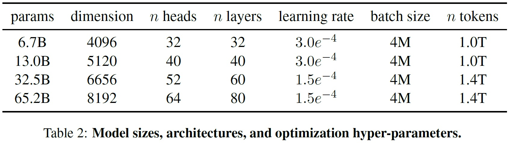
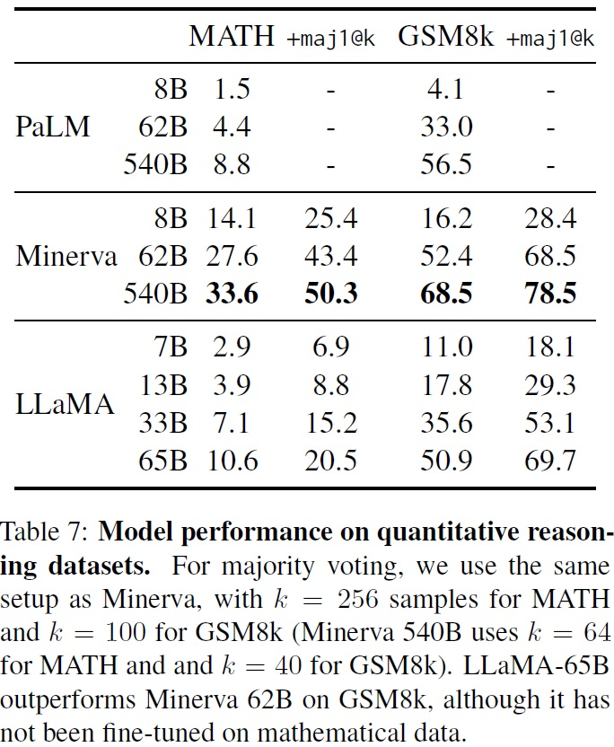
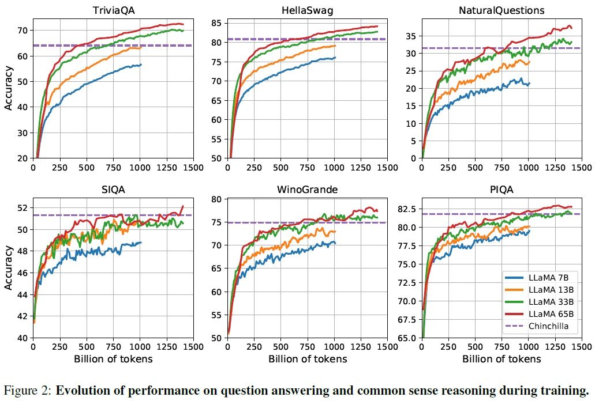
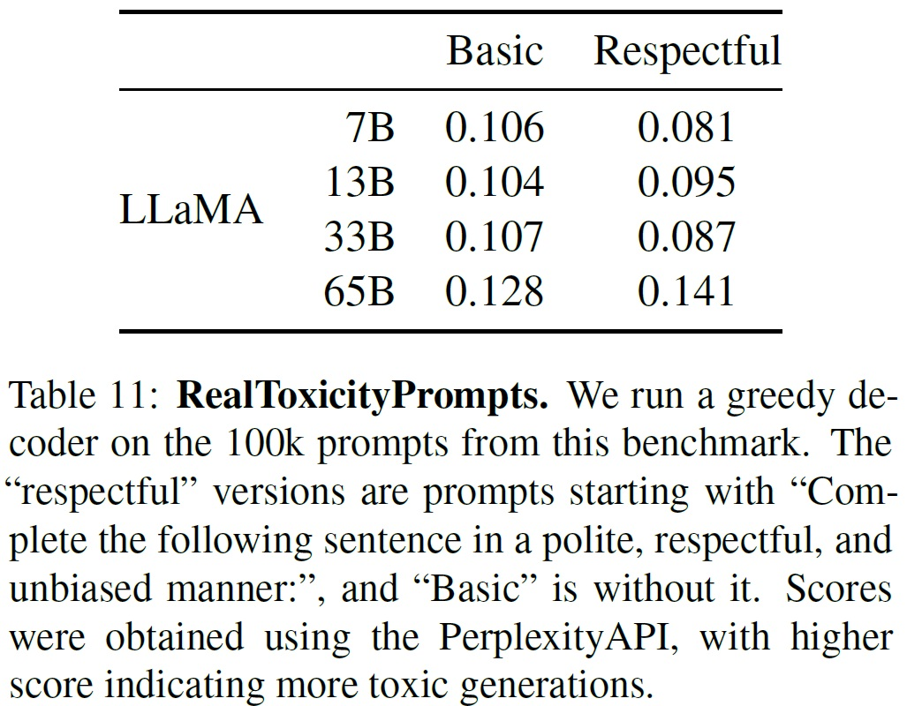

## 📋 Table of Contents

- [1. Introduction](#1-introduction)
- [2. Approach](#2-approach)
- [3. Main Results](#3-main-results)
- [4. Instruction Finetuning](#4-instruction-finetuning)
- [5. Bias, Toxicity and Misinformation](#5-bias-toxicity-and-misinformation)
- [6. Carbon Footprint](#6-carbon-footprint)
- [7. Related Work](#7-related-work)
- [8. Conclusion](#8-conclusion)
- [Appendix](#appendix)

## 1. Introduction
 - 모델의 규모를 더 크게 확장하는 것이 성능 향상에 중점을 둔 연구의 방향이 되었다. (Chowdhery et al., 2022; Rae et al., 2021)
 - Hoffmann et al. (2022)의 연구에서는 주어진 컴퓨팅 예산에 대해 가장 큰 모델이 아닌, 더 많은 데이터에 대한 학습이 최고 성능을 달성할 수 있음을 보여줬다.
 - 큰 모델을 학습하는 것보다 작은 모델을 더 오래 학습하는 것이 추론 비용을 줄일 수 있다. (서비스 시 중요도: 학습 시간 < 추론 시간)
 - LLaMA 모델은 다양한 추론 예산에 대해 최적의 성능을 달성하도록 개발되었으며, 7B에서 65B 매개변수 범위에 걸쳐 있다.
 - LLaMA-13B는 GPT-3보다 우수한 성능을 보이며 단일 GPU에서 실행 가능하고, LLaMA-65B는 Chinchilla와 PaLM-540B와 비교하여 경쟁력 있는 성능을 제공한다.
 - Chinchilla, PaLM, 또는 GPT-3와 달리 LLaMA는 공개 데이터를 사용하여 학습했으며, 이는 모델의 공개와 연구를 위한 접근성을 높였다.
 - 본 논문은 트랜스포머 아키텍처에 대한 수정 사항과 학습 방법을 소개한다.
 - 모델에 인코딩된 편향과 독성을 평가하고, 이를 최신 벤치마크 세트에서 다른 LLM과 비교한다.
 - 향후 학습 데이터셋과 모델 크기의 확장을 통한 성능 개선 가능성 제시한다.

## 2. Approach
### 2.1 Pre-training Data
 - 학습 데이터셋은 여러 소스를 혼합하여 다양한 도메인을 포함했다.(Table 1)

 - 공개적으로 사용 가능하고, 오픈 소싱과 호환되는 데이터만 사용했다.
 - 데이터 구성 요소: 
   - English CommonCrawl [67%]: 2017년부터 2020년까지의 CommonCrawl 덤프를 CCNet 파이프라인을 통해 전처리했다. fastText linear classifier로 비영어 페이지를 제거하고, n-gram 언어 모델로 저품질 콘테츠를 필터링했다. 
   - C4 [15%]: CommonCrawl 데이터셋(Raffel et al., 2020) 포함했다. C4의 전처리는 중복 제거와 언어 식별 단계가 포함되었다. 구두점의 존재나 웹페이지의 단어 및 문장 수와 같은 휴리스틱에 주로 의존한다. 
   - GitHub [4.5%]: Google BigQuery에서 제공하는 공개 GitHub 데이터셋 사용했다. 라인 길이나 영숫자 문자의 비율에 기반한 휴리스틱을 사용하여 저품질 파일을 필터링하고, 정규 표현식으로 헤더와 같은 보일러플레이트(boilerplate)를 제거한다. 
   - Wikipedia [4.5%]: 2022년 6~8월 기간의 위키피디아 덤프를 사용했다. 라틴 및 키릴 문자를 사용하는 20개 언어 포함한다. 하이퍼링크, 댓글, 기타 서식 보일러플레이트를 제거하여 데이터를 처리했다. 
   - Gutenberg 및 Books3 [4.5%]: 공개 도메인의 Gutenberg 프로젝트와 ThePile의 Books3 섹션을 포함했다. 90% 이상 내용이 중복되는 책을 제거하였다. 
   - ArXiv [2.5%]: 과학 데이터를 추가하기 위해 ArXiv의 LaTeX 파일 처리했다. 첫 번째 섹션 이전의 모든 것과 참고 문헌을 제거했다. 
   - Stack Exchange [2%]: Stack Exchange의 덤프를 포함했다. 가장 큰 28개 웹사이트에서 데이터를 포함하고, 텍스트에서 HTML 태그를 제거하였다. 다양한 도메인의 고품질 질문과 답변을 포함한다. 
 - 데이터는 바이트쌍 인코딩(BPE) 알고리즘을 사용하는 토크나이저를 사용했다.
 - 전체 학습 데이터셋 규모는 토큰화 후 약 1.4T 토큰을 포함한다.
 - 대부분의 학습 데이터는 학습 중 한 번만 사용되었고, 위키피디아와 책 도메인에서만 약 두 번의 epoch을 진행했다.

### 2.2 Architecture
 - 트랜스포머 아키텍처를 기반으로 한다.
 - 다양한 거대 언어 모델에서 사용된 기술을 적용하였다.
 - Pre-normalization [GPT-3]: 학습 안정성 향상을 위해 각 트랜스포머 하위 층의 입력을 정규화한다. 출력을 정규화하는 대신, RMSNorm 정규화 함수를 사용했다.
 - SwiGLU 활성화 함수 [PaLM]: ReLU 비선형 함수 대신 SwiGLU 활성화 함수(Shazeer (2020))로 대체하여 성능 향상했다.  PaLM에서 사용된 4d 대신 2/3 4d의 차원을 사용했다.
 - Rotary Embeddings [GPTNeo]: 절대 위치 임베딩을 제거하고, 대신 네트워크의 각 층에 로터리 위치 임베딩(RoPE) 추가했다.
 - 다양한 모델에 대한 하이퍼파라미터 세부 사항은 Table 2에서 제공한다.

### 2.3 Optimizer
 - AdamW optimizer(Loshchilov and Hutter, 2017)를 사용하여 학습했다.
 - 하이퍼파라미터 설정:
    - 베타 값: β1 = 0.9, β2 = 0.95.
    - cosine learning rate schedule: 최종 학습률이 최대 학습률의 10%가 되도록 설정.
    - weight decay: 0.1의 가중치 감소 사용.
    - gradient clipping: 1.0의 그래디언트 클리핑 사용.
    - warmup steps: 2,000 웜업 스텝 사용.
    - learning rate and batch size: 모델 크기에 따라 학습률과 배치 크기를 변동.
 - 세부 사항은 Table 2에서 제공한다.

### 2.4 Efficient implementation
 - 모델의 학습 속도를 향상하기 위해 다양한 최적화를 수행한다.
 - 주요 최적화 기술:
   - Causal Multi-Head Attention: 메모리 사용량과 런타임을 줄이기 위해 효율적인 구현(xformers 라이브러리에서 제공)을 사용한다. 이는 Rabe와 Staats (2021)에서 영감을 받았다.
   - Dao et al. (2022)의 Backward 사용: 어텐션 가중치 저장하지 않고, 언어 모델링 작업의 인과 관계(causal)1로 인해 마스킹된 키/쿼리 점수 계산하지 않는다.
   - Activation Checkpointing: 체크포인팅은 중간 레이어의 출력값(활성화)을 메모리에 저장하는 기술로써, backward pass 중에 재계산되는 활성화의 양을 줄여준다. 특히, 선형 레이어의 출력과 같이 계산 비용이 높은 레이어에 대해 유용하다.
   - 수동 Backward 함수 구현: 트랜스포머의 레이어에 대해 PyTorch autograd에 의존하지 않고, 역함수(backward function)를 수동으로 구현하여 더 효율적으로 역전파를 수행한다.
 - 모델과 시퀀스 병렬성을 사용하여 모델의 메모리 사용량을 절감한다.
 - GPU 간 통신(예: all_reduce 연산)과 활성화 계산을 최대한 중첩(overlap)한다.
 - 65B 매개변수 모델을 학습할 때, 2,048개의 A100 GPU(80GB RAM)에서 약 380 토큰/초/GPU를 처리했다.
 - 총 1.4T 토큰의 데이터셋에서 약 21일간 학습 기간이 소요되었다.

  *인과 관계(causal)1: 일반적으로 attention 매커니즘은 키와 쿼리 간 유사도를 계산하고 이를 가중치로 사용하여 value에 적용하지만, attention weight를 저장하지 않는다는 것은 계산 결과를 메모리에 보관하지 않는다는 의미로 즉, 계산 효율성을 높이고 메모리 사용량을 줄이기 위한 전략으로 볼 수 있다. 또한, '인과 관계(casual)'은 모델이 주어진 텍스트의 이전 부분만을 고려하여 다음 단어를 예측한다는 것을 의미한다.*

## 3. Main Results
 - LLaMA 모델은 총 20개의 벤치마크에서 zero-shot과 few-shot 작업을 수행하여 평가한다.
 - Zero-shot 및 Few-shot 작업 평가:
   - Zero-shot: 테스트 예시와 태스크의 텍스트 설명을 제공되며, 모델은 개방형 생성(open-ended generation)을 사용하여 답을 제공하거나 제안된 답변에 순위를 매긴다.
   - Few-shot: 태스크의 몇 가지 예시(1~64개)와 테스트 예시를 제공하며, 모델은 이 텍스트를 입력으로 받아 답을 생성하거나 다른 옵션을 순위 매긴다.
 - LLaMA는 비공개 언어 모델인 GPT-3, Gopher, Chinchilla, PaLM과 비교한다.
 - LLaMA는 공개된 OPT 모델, GPT-J, GPT-Neo와도 비교한다. 
 - LLaMA는 자유 형태 생성(free-form generation) 태스크와 다중 선택(multiple choice) 태스크에서 평가한다.
 - 다중 선택 태스크에서는 주어진 옵션들 중 맥락을 고려하여 가장 완성도 높은 컨텍스트를 선택하는 것이 목표이다.
 - 특정 벤치마크(OpenBookQA, BoolQ 등) 중 일부 데이터셋에서는 특정 평가 방법을 따른다.

### 3.1 Common Sense Reasoning
 - 상식 추론을 평가하기 위해 8가지 표준 벤치마크 사용했다.
   - BoolQ (Clark et al., 2019)
   - PIQA (Bisk et al., 2020)
   - SIQA (Sap et al., 2019)
   - HellaSwag (Zellers et al., 2019)
   - WinoGrande (Sakaguchi et al., 2021)
   - ARC Easy (Clark et al., 2018)
   - ARC Challenge (Clark et al., 2018)
   - OpenBookQA (Mihaylov et al., 2018)
 - 벤치마크의 형태는  Cloze 스타일과 Winograd 스타일, 다중 선택형 질문 응답을 포함한다.
 - 다중 선택형 질문 응답을 포함한다.
 - Zero-shot 설정에서 평가를 진행한다.
 - LLaMA-65B 모델은 BoolQ를 제외한 모든 벤치마크에서 Chinchilla-70B를 능가했다.
 - LLaMA-65B 모델은 BoolQ와 WinoGrande를 제외한 벤치마크에서 PaLM-540B를 능가했다.
 - LLaMA-13B 모델은 GPT-3보다 10배가 작음에도 대부분의 벤치마크에서 우수한 성능을 보였다.

### 3.2 Closed-book Question Answering
 - LLaMA 모델은 두 가지 closed-book 질문 답변 벤치마크인 Natural Questions (Kwiatkowski et al., 2019)와 TriviaQA (Joshi et al., 2017)에서 평가한다.
   - Natural Questions: Google 검색 엔진 기반이며 질문에 대해 자연스러운 답변을 생성할 수 있는지 평가한다.(Table 4)
   - TriviaQA: 각 질문은 관련 wikipedia 페이지와 함께 제공되며, 모델은 이 페이지 내에서 정확한 답변을 찾아야 한다.(Table 5)

  
  

 - 정확한 일치(exact match) 메트릭을 사용하여 생성된 답변을 평가한다.
 - LLaMA-65B는 zero-shot 및 few-shot 설정에서 모두 최고 수준의 성능을 달성했다.
 - LLaMA-13B는 GPT-3 및 Chinchilla와 비교하여 5~10배 더 작음에도 경쟁력 있는 성능을 보였다.
 - LLaMA-13B 모델은 단일 V100 GPU에서 추론이 가능하다.

### 3.3 Reading Comprehension
 - LLaMA 모델은 RACE 독해 이해 벤치마크(Lai et al., 2017)로 평가한다.
 - RACE 벤치마크는 중국 중고등학생을 위한 영어 독해 시험에서 수집된 데이터셋이다.
 - Brown et al. (2020)의 평가 방식(질문-답변, 자연어 추론, 번역, 요약 등이 포함)을 따른다.(Table 6)

 - LLaMA-65B는 PaLM-540B와 경쟁력 있는 성능을 보였다.
 - LLaMA-13B는 GPT-3보다 몇 퍼센트 높은 성능을 보였다.

### 3.4 Mathematical reasoning
 - LLaMA 모델은 두 가지 수학적 추론 벤치마크인 MATH (Hendrycks et al., 2021)와 GSM8k (Cobbe et al., 2021)에서 모델을 평가한다.
   - MATH: 중학교 및 고등학교 수준의 12K 수학 문제를 포함하는 데이터셋.
   - GSM8k: 중학교 수준의 수학 문제 세트.
 - PaLM 및 Minerva 모델과 비교한다.(Table 7)

 - Minerva는 ArXiv와 수학 웹 페이지에서 추출한 38.5B 토큰으로 파인튜닝한 PaLM 모델이다.
 - PaLM과 LLaMA는 수학 데이터에 대해 파인튜닝되지 않았다.
 - PaLM과 Minerva의 성능은 Lewkowycz et al. (2022)에서 보고된 수치를 사용한다.
 - 다양한 평가 방식(maj1@k2)을 사용하여 각 문제에 대해 여러 샘플을 생성하고 다수결 투표를 수행했다.
 - LLaMA-65B는 수학적 데이터에 파인튜닝되지 않았음에도 GSM8k에서 Minerva-62B를 능가했다.

*maj1@k2는 "majority voting"을 의미하는 평가 방식이며, "maj"는 "majority" (다수결), "1"은 하나의 최종 선택을 나타내며, "k"는 각 문제에 대해 생성된 답변의 개수를 의미한다. 과정은 모델은 각 문제에 대해 "k"개의 다른 답변을 생성하고 가장 빈번하게 나타난 답변(일관성 확인)을 최종 답변으로 선택하여 평가한다.*

### 3.5 Code generation
 - LLaMA 모델은 HumanEval과 MBPP 두 벤치마크에서 자연어 설명을 바탕으로 코드를 작성하는 성능을 평가한다.
   - HumanEval: 프로그램에 대한 몇 문장의 설명과 함수 시그니처, 입력-출력 예제를 받아 파이썬 프로그램을 생성해야 한다.
   - MBPP: 프로그램에 대한 설명과 입력-출력 예제를 기반으로 파이썬 프로그램을 생성해야한다.
 - LLaMA는 코드에 특별히 파인튜닝되지 않은 PaLM과 LaMDA와 pass@1점수를 비교했다.(Table 8)

 - LLaMA와 PaLM은 코드 토큰 수가 비슷한 데이터셋에서 학습되었다.
 - LLaMA는 비슷한 매개변수를 가진 이러한 모델들보다 더 높은 성능을 보입니다.
 - LLaMA-13B는 LaMDA-137B보다 HumanEval과 MBPP 모두에서 능가했다.
 - LLaMA-65B는 더 긴 학습을 한 PaLM-62B보다 성능이 좋다.
 - pass@13 결과는 온도(temperature) 0.1로 샘플링하여 얻은 것이고, pass@100과 pass@80 지표는 온도(temperature) 0.8로 얻은 것이다4.
 - 코드 특정 토큰에 대해 fine-tuning을 통해 성능 향상할 수 있다. 예를 들어, PaLM-Coder (Chowdhery et al., 2022)는 PaLM의 HumanEval에서의 pass@1 점수를 26.2%에서 36%로 향상했다.
 - 본 논문에서 LLaMA 모델의 경우, 코드 특화 파인튜닝은 이 논문의 범위를 벗어나므로 실험을 안 했다.

*pass@k3: 모델이 k번의 시도 안에 주어진 태스크를 성공적으로 수행할 확률을 뜻하는 지표이다.*
*temperature와 sampling 관계4: temperature는 다양성과 예측 확률 간의 균현을 조절하는 매개변수로써, 낮은 온도(ex. 0.1)은 더 예측 가능하고 일반적인 단어를 선택하게 되고, 높은 온도(ex. 0.9)는 더 창의적이거나 예측하기 어려운 다양성이 있는 단어를 선택하게 된다.*

#### 3.6 Massive Multitask Language Understanding
 - LLaMA 모델은 다양한 지식 영역을 다루는 대규모 다중 작업 언어 이해 (MMLU) 벤치마크에서 평가한다.
 - MMLU는 인문학, STEM, 사회과학 등을 포함한 다양한 도메인의 다중 선택형 질문으로 구성되었다.
 - 5-shot 설정에서 모델을 평가한다.(Table 9)

 - LLaMA-65B가 Chinchilla-70B와 PaLM-540B에 비해 평균적으로 몇 퍼센트 뒤처져있다.
 - LLaMA가 사전 학습 데이터에 포함된 책과 학술 논문의 양이 적기 때문으로 추정된다.
 - 사용된 사전 학습 데이터는 ArXiv, Gutenberg, Books3 등 총 177GB의 책과 학술 논문 포함되어 있다.
 - Gopher, Chinchilla, PaLM 등이 사용한 최대 2TB의 책에 비해 적은 양이다.
 - 대량의 책을 학습 데이터로 사용한 Gopher, Chinchilla, PaLM이 GPT-3보다 이 벤치마크에서 우수한 성능을 보였던 것과 동일한 이유이다.

### 3.7 Evolution of performance during training
 - 학습하는 동안 LLaMA 모델이 몇 가지 질의 응답 및 상식 벤치마크에서의 성능을 추적한다.(Fig 2)

 - 대부분의 벤치마크에서 모델의 성능은 지속적으로 개선된다.
 - 성능 개선은 모델의 학습 복잡도와 상관관계를 보인다.
 - SIQA 벤치마크에서 성능의 큰 변동성 관찰되며, 이는 벤치마크의 신뢰성이 떨어짐을 나타낸다.
 - WinoGrande에서는 성능이 학습 복잡도와 잘 일치하지 않는다. LLaMA-33B와 LLaMA-65B는 학습하는 동안 비슷한 성능을 보였다.

## 4. Instruction Finetuning
 - LLaMA 모델의 지시어(data)에 대한 짧은 파인튜닝을 통해 MMLU(Massive Multitask Language Understanding) 성능 향상을 목표로 한다.
 - 지시어 모델인 LLaMA-I를 학습시키기 위한 단일 실험만 수행한다.
 - LLaMA-I 모델의 MMLU에서의 성능을 보고하고, 기존의 지시어 파인튜닝된 중간 크기 모델들과 비교한다.
 - 비교 대상으로는 OPT-IML(Iyer et al., 2022)과 Flan-PaLM 시리즈(Chung et al., 2022) 포함되었다.
 - LLaMA-I(65B)는 MMLU에서 기존의 지시어 파인튜닝된 중간 크기 모델들을 능가하지만, GPT code-davinci-002의 최고 성능에는 미치지 못했다.
 - MMLU의 57개 태스크에 대한 성능 세부사항은 부록의 Table 16에서 확인할 수 있다.

## 5. Bias, Toxicity and Misinformation
### 5.1 RealToxicityPrompts
 - 언어 모델은 모욕, 증오 발언 또는 위협 처럼 독성 언어를 생성할 수 있다.
 - RealToxicityPrompts 벤치마크(Gehman et al., 2020)를 모델의 독성을 나타내는 지표로 고려하고 있다.
 - 모델이 생성할 수 있는 독성 콘텐츠의 범위가 넓어서(다양성) 철저한 평가가 어렵다.
 - RealToxicityPrompts 벤치마크는 약 10만개의 프롬프트를 모델로 생성하고, PerspectiveAPI를 통해 자동으로 독성 점수 평가한다.
 - PerspectiveAPI 파이프라인 제어 불가로 인해 이전 모델과의 비교가 어렵다.
 - 프롬프트당 점수는 0(비독성)에서 1(독성)까지 다양하며, RealToxicityPrompts의 기본 및 존중하는 프롬프트 범주에서 평균 점수를 보고한다.(Table 11)

 - 모델 크기가 커질수록 독성 언어 생성이 증가하는 경향이 관찰된다.

### 5.2 CrowS-Pairs
 - LLaMA 모델의 편향을 평가하기 위해 CrowS-Pairs 데이터셋(Nangia et al., 2020) 사용한다.
 - 성별, 종교, 인종/색상, 성적 지향, 나이, 국적, 장애, 외모 및 사회경제적 지위와 같은 9가지 범주에서 편향을 측정한다.
 - 각 예시는 고정 관념과 반대 고정 관념으로 구성된다.
 - zero-shot 설정에서 두 문장의 복잡도를 사용하여 모델의 고정 관념 문장 선호도를 측정하며, 높은 점수는 더 높은 편향을 의미한다.
 - LLaMA는 GPT-3 및 OPT-175B와 비교하며 두 모델에 비해 약간 우위에 있다.(Table 12)

 - 특히 종교 범주에서 OPT-175B와 비교하여 편향이 가장 높다(+10%), 그 다음으로 나이와 성별에서 편향되었다.
 - 편향의 원인으로 CommonCrawl 데이터에서 비롯될 것으로 예상된다.

### 5.3 WinoGender
 - 성별 범주에 대한 편향을 더 조사하기 위해 WinoGender 벤치마크(Rudinger et al., 2018), 공동 참조 해결 데이터셋을 이용한다.
 - WinoGender는 위노그라드 스키마로 구성되어 있으며, 대명사의 성별이 모델의 공동 참조 해결 성능에 영향을 미치는지 여부로 편향을 평가한다.
 - 각 문장에는 '직업', '참여자', '대명사'가 있으며, 대명사는 직업이나 참여자를 공동 참조한다. 모델은 문장의 맥락에 따라 이를 올바르게 해결하는지 평가한다.
 - '그녀/그녀/그녀', '그/그/그', '그들/그들/누군가' 세 가지 대명사를 사용하여 성능을 평가한다.
 - LLaMA 모델은 '그들/그들/누군가' 대명사에 대해 '그녀/그녀/그녀'와 '그/그/그' 대명사보다 훨씬 더 잘 수행한다.
 - "낚시" 사례의 경우 더 많은 오류를 범하며, 성별과 직업과 관련된 사회적 편향을 포착한다는 것을 보여준다.

### 5.4 TruthfulQA
 - TruthfulQA (Lin et al., 2021)는 모델의 진실성, 즉 주장이 사실인지를 식별하는 능력을 측정하는 것을 목표로 한다.
 - 이 벤치마크는 모델이 잘못된 정보나 거짓 주장을 생성할 위험을 평가하는 데 사용된다.
 - 다양한 스타일로 작성된 질문들로 구성되며, 38개의 카테고리를 포함하고 있고, 적대적으로 설계된 질문들로 구성된다.
 - GPT-3와 비교했을 때 LLaMA 모델이 두 카테고리("진실성(truthful)"과 "진실하면서도 정보적인(truthful*informative)") 모두에서 높은 점수를 기록했다.(Table 14)

 - 그러나 모델의 정답률이 여전히 낮다고 언급되어 있다. 이는 모델이 여전히 잘못된 정보를 '환상(hallucinate)'할 가능성이 높다는 것을 의미한다.

## 6. Carbon Footprint
 - LLaMA 모델 학습은 대량의 에너지를 소비하며, 이로 인해 상당한 양의 이산화탄소가 배출된다.
 - 전체 총 에너지 소비와 carbon footprint를 분석했다.
 - Wu et al. (2022)의 공식을 따라 모델 학습에 필요한 와트시(Wh)와 이산화탄소 배출량(tCO2eq) 추정한다.
 - Wh 계산을 위해 GPU 사용 시간, GPU 전력 소비량, Power Usage Effectiveness (PUE) 값을 고려한다.
 - BLOOM 모델과 OPT 모델의 공정한 비교를 위해 동일한 계산 방법 사용한다.
 - LLaMA 모델은 약 5개월간 2048개의 A100-80GB GPU를 사용하여 개발된 모델들의 총 에너지 소비는 약 2,638 MWh. 총 배출량은 약 1,015 tCO2eq로 추정된다.
 - 일부 모델은 단일 GPU에서 실행 가능하므로 향후 탄소 배출 감소 기대된다.

## 7. Related Work
 - 언어 모델의 역사적 발전
   - 초기 언어 모델은 n-gram 통계에 기반했다. (Bahl et al., 1983).
   - Turing (1950)은 언어 모델링을 기계 지능 측정의 벤치마크로 제안했다.
 - 아키텍처의 진화
   - 전통적인 n-gram 모델에서 다양한 평활 기법이 제안되었다. (Katz, 1987; Kneser와 Ney, 1995).
   - 신경망, 특히 RNN과 LSTM이 언어 모델링에 적용되었다. (Elman, 1990; Hochreiter와 Schmidhuber, 1997).
   - 최근에는 self-attention 기반 트랜스포머 네트워크가 주요 개선을 이끌어냈다. (Vaswani et al., 2017).
 - 규모 확장의 중요성
   - Brants et al. (2007)은 대규모 토큰에 대한 언어 모델 학습의 이점을 보였다.
   - Heafield et al. (2013)은 웹 규모 데이터로 Kneser-Ney 평활을 확장했다.
   - Jozefowicz et al. (2016)은 LSTMs를 10억 매개변수로 확장하여 성능 향상을 보였다.
 - 주요 언어 모델들
   - BERT (Devlin et al., 2018), GPT-2 (Radford et al., 2019), MegatronLM (Shoeybi et al., 2019), T5 (Raffel et al., 2020) 등이 개발되었다.
   - GPT-3 (Brown et al., 2020)는 1750억 매개변수를 가진 대규모 언어 모델의 돌파구를 제공했다.
 - 규모 확장의 효과 연구
   - Hestness et al. (2017)과 Rosenfeld et al. (2019)은 규모 확장이 심층 학습 모델 성능에 미치는 영향을 연구했다.
   - Kaplan et al. (2020)은 트랜스포머 기반 언어 모델을 위한 power laws을 도출했다.
   - Hoffmann et al. (2022)은 데이터셋 확장 시 학습률 일정을 조정하여 이를 세분화했다.
   - Wei et al. (2022)은 대규모 언어 모델의 능력에 대한 규모 확장의 효과를 연구했다.

## 8. Conclusion
 - 본 논문에서 공개된 여러 최신 기술의 기반 모델들과 경쟁력 있는 언어 모델 시리즈 소개한다.
 - LLaMA-13B는 GPT-3보다 우수한 성능을 제공하며 크기가 10배 이상 작다.
 - LLaMA-65B는 Chinchilla-70B와 PaLM-540B와 경쟁력 있는 성능을 보인다.
 - 공개적으로 사용 가능한 데이터만을 사용하여 최신 기술의 성능을 달성했다.
 - 모델들을 공개함으로써 대규모 언어 모델의 개발을 가속화하고, 독성 및 편향 문제를 개선하기 위한 노력한다.
 - Instruction에 대한 fine-tuning이 유망한 결과를 보여주며, 이 방향으로의 추가 연구 계획한다.
 - 더 큰 사전 학습 데이터셋으로 학습된 더 큰 모델들을 미래에 공개할 계획이다.

## Appendix
### A. Question Answering
 - LLaMA 모델을 Natural Questions과 TriviaQA에서 평가한다.
 - 오픈 도메인 질문 응답에 사용되는 3610개의 질문을 포함하는 Natural Questions 테스트 분할 사용한다.
 - TriviaQA의 경우 필터링된 세트의 개발 세트에서 평가한다. 이는 GPT-3와 PaLM이 필터링되지 않은 세트의 테스트 세트에서 평가한 것과 다르다.
 - greedy decoding을 사용하여 답변 생성한다.
 - 생성된 답변은 첫 번째 줄바꿈, 마침표 또는 쉼표에서 중단하여 답변 추출한다.
 - 생성된 답변을 정규화 후 답변 목록의 어떤 답변과 일치하면 올바른 것으로 평가한다.
 - 답변 정규화를 위해 소문자 변환, 관사 및 구두점 제거, 중복 공백 제거한다.
 - Natural Questions 및 TriviaQA에 대한 one-shot 설정의 예시 포맷팅 제공한다.(Fig 3)
 - 질문 및 답변 목록 앞에 'Answer these questions:\n(이 질문들에 답하시오:\n)' 문자열 추가한다.

