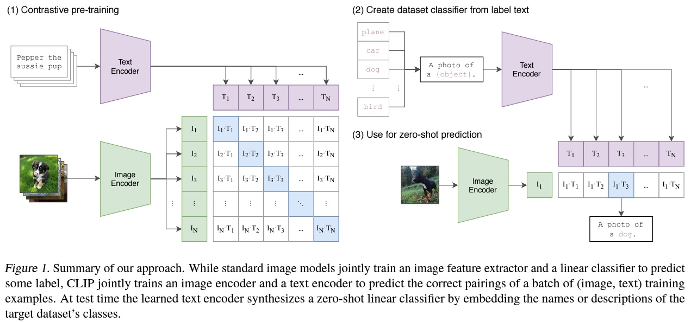
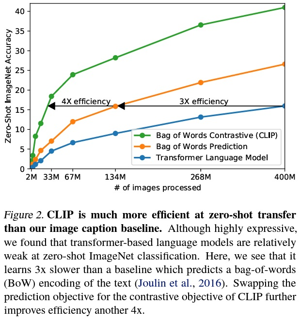
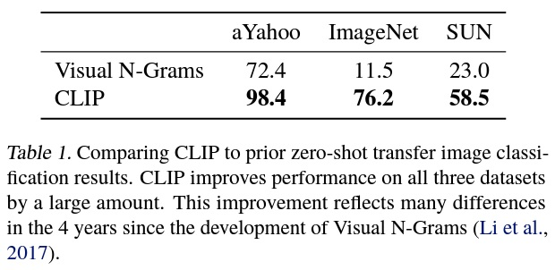
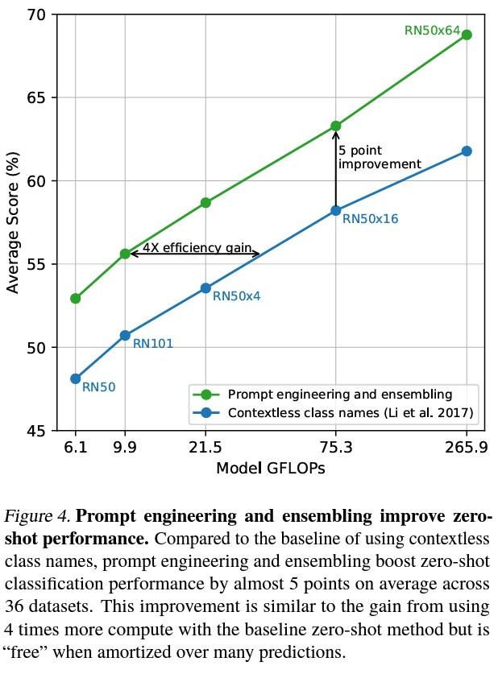
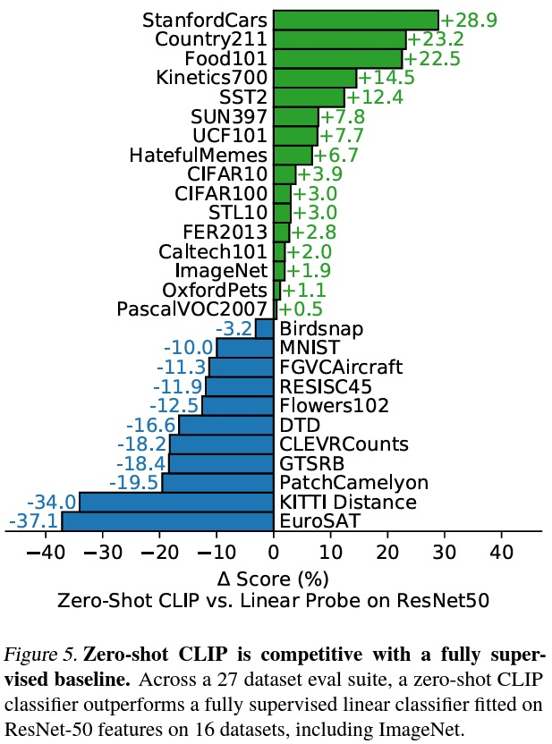
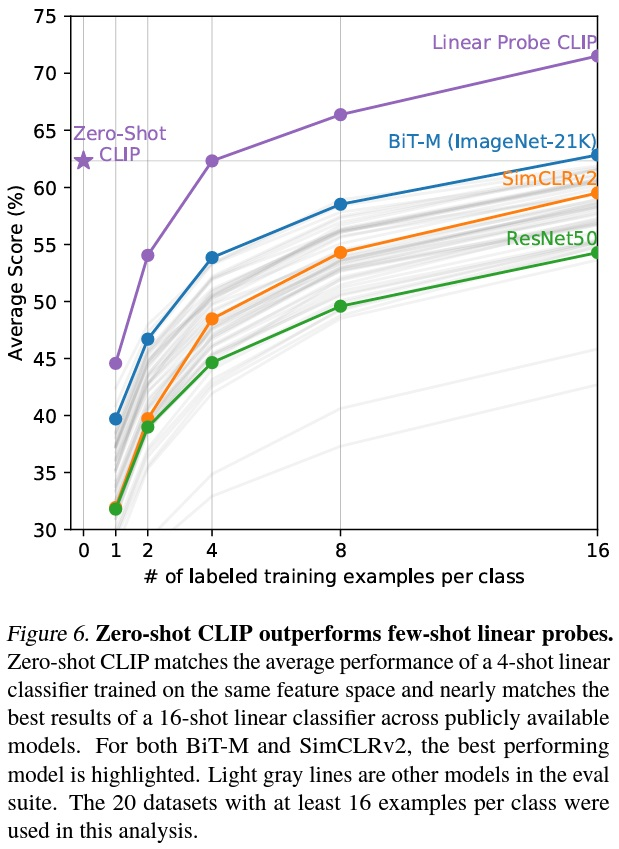
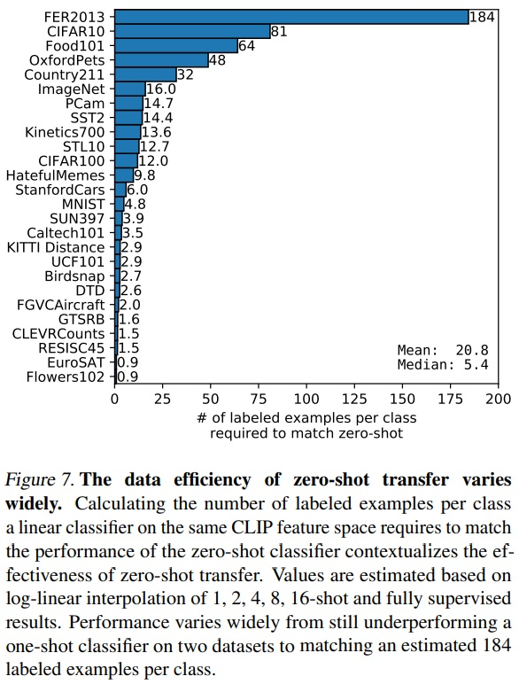
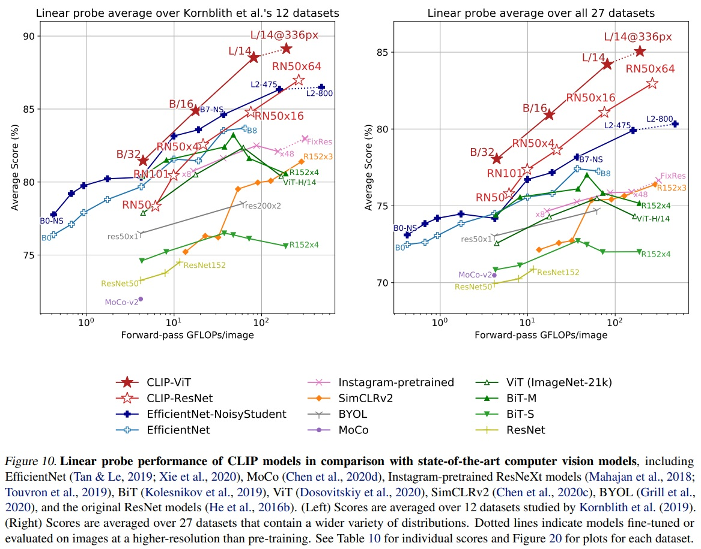
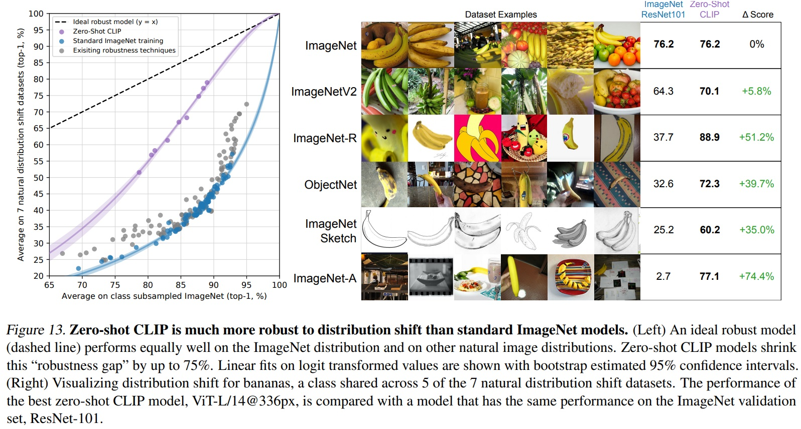
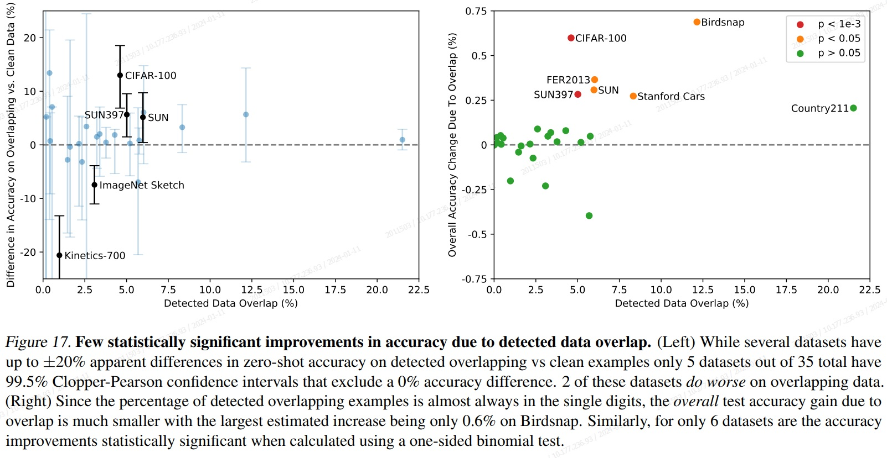

*State-of-the-art 컴퓨터 비전 시스템은 사전에 정해진 객체 카테고리를 예측하도록 학습된다. 이 제한된 형태의 지도는 일반성과 사용성을 제한한다. 왜냐하면 다른 시각적 개념을 명시하기 위해 추가적인 레이블이 필요하기 때문이다. 이미지에 대한 원시 텍스트로부터 직접 학습하는 것은 훨씬 넓은 범위의 지도를 활용하는 유망한 대안이다. 인터넷에서 수집한 4억 개의 (이미지, 텍스트) 쌍 데이터셋에서 처음부터 SOTA 이미지 표현을 학습하는 방법으로, 어떤 캡션과 어떤 이미지가 매치되는지 예측하는 단순한 사전 학습 작업이 효율적이고 확장 가능하다는 것을 보여준다. 사전 학습 후, 자연어는 학습된 시각적 개념을 참조하거나 새로운 것을 설명하는 데 사용되어 다운스트림 작업에 대한 모델의 제로샷 전이를 가능하게 한다. OCR, 비디오 내 동작 인식, 지리적 위치 파악, 그리고 다양한 종류의 세부적인 객체 분류 등과 같은 30개 이상의 다양한 기존 컴퓨터 비전 데이터셋에서 이 접근 방식의 성능을 연구한다. 이 모델은 대부분의 작업에 비일상적으로 전이되며, 데이터셋 특정 학습 없이도 종종 완전히 지도된 기준과 경쟁한다. 예를 들어, 우리는 ImageNet에서 원래 ResNet-50의 정확도와 일치하는데, 이는 128만 개의 학습 예제 없이 제로샷으로 이루어진다. 우리는 코드와 사전 학습된 모델 가중치를 [https://github.com/OpenAI/CLIP](https://github.com/OpenAI/CLIP){:target="_blank"} 에서 공개한다.*

## 📋 Table of Contents

- [1. Introduction and Motivating Work](#1-introduction-and-motivating-work)
- [2. Approach](#2-approach)
- [3. Experiments](#3-experiments)
- [4. Comparison to Human Performance](#4-comparison-to-human-performance)
- [5. Data Overlap Analysis](#5-data-overlap-analysis)
- [6. Limitation](#6-limitation)
- [7. Broader Impacts](#7-broader-impacts)
- [8. Related Work](#8-related-work)
- [9. Conclusion](#9-conclusion)

## 1. Introduction and Motivating Work
 - NLP 분야는 autoregressive와 masked language modeling과 같은 방법으로 계산, 모델 용량 및 데이터 측면에서 확장되며 task-agnostic 목표를 달성하였다.
 - Task-agnostic 아키텍처는 특화된 output heads나 데이터셋 커스텀마이징 없이 downstream dataset으로 제로샷 트랜스퍼가 가능해졌다.
 - NLP 분야는 컴퓨터 비전 분야와 다르게 적은 양의 레이블링된 고품질 데이터셋보다 웹 상에서 수집된 많은 양의 레이블링 없는 데이터셋이 학습에 더 용이하다.
 - 웹 텍스트에서 직접 학습하는 확장 가능한 사전 학습 방법이 컴퓨터 비전에서 유사한 돌파구를 가져올 수 있다.
 - weakly supervised model이 효과적일 수 있다는 연구결과가 있었다.
 - 4억개의 이미지-텍스트 쌍으로 구성된 데이터셋을 생성했고, ConVIRT로부터 영향을 받은 CLIP(Contrastive Language-Image Pre-training)이라는 모델을 제안한다.
 - CLIP는 OCR, 지리적 위치 추정, 행동 인식 등과 같은 다양한 작업을 사전 학습 과정을 통해 발전된다.
 - CLIP의 제로샷 트랜스퍼 성능은 기존의 작업별 감독 모델과 경쟁력이 있다.

## 2. Approach
### 2.1. Natural Language Supervision
 - 이 접근법의 핵심은 자연어에서 포함된 감독을 통해 인식을 학습하는 아이디어이다.
 - Zhang et al. (2020), Gomez et al. (2017), Joulin et al. (2016), Desai & Johnson (2020)은 이미지에 텍스트를 짝지어 시각적 표현을 학습하지만, 각기 다른 용어(비지도, 자기지도, 약한 감독, 감독)를 사용했다.
 - 과거 n-gram 등과 비해 deep contextual representation learning을 통해 효과적으로 자연어의 representation을 추출할 수 있게 되었다.
 - 자연어 지도는 클래식한 레이블링 방식에 비해 데이터 확장성이 좋다.
 - 비지도나 자기지도 학습 방식보다 더 유연하고 전이 가능하므로 다른 종류의 task로 zero-shot trasfer가 가능하다.

### 2.2. Creating a Sufficiently Large Dataset
 - 기존 연구는 주로 MS-COCO (Lin et al., 2014), Visual Genome (Krishna et al., 2017), 그리고 YFCC100M (Thomee et al., 2016)과 같은 세 데이터셋을 주로 사용했다.
 - MS-COCO와 Visual Genome은 고품질이지만 규모가 작다. (약 10만 개)
 - YFCC100M은 1억 개의 사진을 가지고 있지만, 메타데이터가 부족하고 품질이 다양다. 필터링하면 1500만 개로 줄어든다.(ImageNet과 크기가 비슷)
 - 많은 이미지들이 자동 생성된 파일명(예: 20160716 113957.JPG)을 "제목"으로 사용하거나 카메라 노출 설정의 "설명"을 포함한다.
 - 인터넷에서 공개적으로 사용 가능한 다양한 소스에서 4억 개의 (이미지, 텍스트) 쌍으고 구성된 새로운 데이터셋(WebImageText(WIT))을 구축했다.
 - 500,000개의 쿼리를 포함하는 (이미지, 텍스트) 쌍의 검색했다.
 - 쿼리당 최대 20,000개의 (이미지, 텍스트) 쌍 포함하여 클래스 균형을 맞췄다.
 - 결과적으로 생성된 데이터셋은 GPT-2의 WebText 데이터셋과 유사한 총 단어 수를 가진다.

### 2.3. Selecting an Efficient Pre-Training Method
 - 1000개 클래스 분류 예측을 위해 매우 많은 GPU가 필요하다.
 - 초기 VirTex와 유사하게 이미지는 CNN, 텍스트는 Transformer로 공동 학습하여 이미지 캡션을 예측하였다. 그러나 이 방법을 효율적으로 확장하는 데 어려움을 겪었다.
 - Fig 2에 따르면 63백만 파라미터를 가진 transformer language model이 ResNet-50 image encoder 보다 2배 연산량을 사용하여 학습였지만, bag-of-words(BoW) 인코딩 방식보다 ImageNet 클래스를 인식하는 데 세 배 느린 속도로 학습 하였다.
 - Bag of Words란 단어들의 순서는 전혀 고려하지 않고, 단어들의 출현 빈도(frequency)에만 집중하는 텍스트 데이터의 수치화 표현 방법이다.
 - 이미지와 함께 등장하는 다양한 설명, 코멘트 및 관련 텍스트로 인해 어려운 작업이다.
 - contrastive representation learning을 통해 이미지와 연관된 전체 텍스트를 예측하는 대신, 어떤 텍스트가 어떤 이미지와 짝을 이루는지 예측하는 대조적 목표로 전환하였고, ImageNet으로의 zero-shot transfer에서 효율성이 4배 향상되었다.
 - CLIP은 N개의 (이미지, 텍스트) 쌍에 대해 실제로 일어난 N x N 쌍을 예측하도록 학습한다.
 - N개의 텍스트와 이미지는 각각 텍스트 인코더와 이미지 인코더를 통해 N 개의 text representation과 image representation이 만들어진다.
 - 이미지/텍스트 representation은 동일한 차원을 가지며 두 벡터 간의 consine similarity(N x N개)를 구한다.
 - N개의 positive pair의 consine similarity를 최대화하고 N^2 - N개의 negative pair의 consine similarity를 최소화한다.
 - 유사도 점수에 대해 symmetric cross entropy loss를 최적화한다.

  

### 2.4. Choosing and Scaling a Model
 - 이미지 인코더에 대해 ResNet-50과 Vision Transformer(ViT) 두 가지 아키텍처를 고려한다.
 - 텍스트 인코더는 Transformer(63M)를 사용했다.
 - CLIP 모델의 성능이 텍스트 인코더의 용량(모델의 크기나 복잡성)에 덜 민감하다.
 - 텍스트 인코더를 더 깊게 만드는 것보다 넓게 만드는 것이 CLIP의 전반적인 성능에 더 효과적이라고 판단된다.
 - CLIP의 텍스트 인코더를 설계할 때 모델의 깊이(즉, 층(layer)의 수)를 늘리지 않고, 너비(즉, 각 층의 뉴런(neuron) 수나 차원)만을 증가시킨다

### 2.5. Training
 - 총 5개의 ResNet 모델과 3개의 Vision Transformer 모델을 학습한다.
   - RN-① ResNet-50
   - RN-② ResNet-101
   - RN-③ ResNet50x4 (EfficientNet-style model)
   - RN-④ ResNet50x16 (EfficientNet-style model)
   - RN-⑤ ResNet50x64 (EfficientNet-style model)
   - ViT-① ViT-B/32
   - ViT-② ViT-B/16
   - ViT-③ ViT-B/14
 - 모든 모델은 32 epoch 동안 학습했다.
 - Adam optimizer 알고리즘(Kingma & Ba, 2014)을 사용하며, 모든 가중치에 분리된 weight decay regularization(Loshchilov & Hutter, 2017)를 적용한다.
 - 학습률 스케줄링을 위해 코사인 스케줄(Loshchilov & Hutter, 2016)을 사용하여 학습률을 감소시켰다.
 - 초기 하이퍼파라미터는 그리드 검색, 무작위 검색, 수동 튜닝의 조합을 통해 설정했다.
 - 학습 가능한 온도 파라미터(learnable temperature parameter, τ)는 0.07로 초기화하고, 로짓(logits)을 100배 이상 스케일링하지 않기 위해 클리핑하여 학습 불안정 방지했다.
 - 매우 큰 미니배치 크기인 32,768을 사용했다.
 - 학습 가속화 및 메모리 절감을 위한 mixed precision 사용했다.
 - 가장 큰 ResNet 모델(RN50x64)는 592개의 v100 gpu에서 18일동안 학습했다.
 - 가장 큰 ViT 모델(ViT-L/14)는 256개의 v100 gpu에서 12일동안 학습했다.

## 3. Experiments
### 3.1. Zero-Shot Transfer
#### 3.1.1. MOTIVATION
 - 일반적으로 컴퓨터 비전분야에서 zero-shot transfer는 이미지 분류에서 보지 못한 객체 카테고리로의 일반화하는 연구를 의미한다.
 - 본 연구에서는 더 넓은 의미로 보지 못한 데이터셋에 대한 일반화 연구를 의미한다.
 - Zero-shot learning을 통해 본질적으로 '미분류된 태스크' 수행 능력을 평가한다.
 - CIFAR-10 또는 SVHN 데이터셋처럼 벤치마크 데이터셋이 "실제" task를 측정하는지 명확하지 않다.(특정 태스크에 대한 성능을 평가하기 위해 데이터셋을 사용함)
 - 특정 데이터셋에 대한 성능을 평가하기 위해 CLIP의 zero-shot trasnfer를 사용한다.

#### 3.1.2. USING CLIP FOR ZERO-SHOT TRANSFER
 - 제로샷 분류를 수행하기 위해 CLIP은 사전 학습 과정에서 이미지와 텍스트가 데이터셋 내에서 짝을 이루는지 예측하는 능력을 학습한다.
 - 이미지의 특징 임베딩과 가능한 텍스트 세트의 특징 임베딩을 각각의 인코더를 통해 계산한다.
 - 임베딩 간 코사인 유사도를 계산하고, 온도 매개변수 τ로 조정한 후 소프트맥스를 통해 확률 분포로 정규화한다.
 - 이미지 인코더는 이미지에 대한 특징 표현(feature representation)(예: 색상, 형태, 질감 등)을 계산하는 역할을 하고, 텍스트 인코더는 클래스가 나타내는 시각적 개념(예: "고양이", "자동차")을 기반으로 선형 분류기(linear classifier)의 가중치를 생성하는 하이퍼네트워크(하나의 신경망이 다른 신경망의 가중치를 생성하는 방식)로 작동한다.
 - CLIP의 사전 학습 과정을 매 epoch마다 컴퓨터 비전 데이터셋에 대한 무작위로 생성된 프록시(proxy)1의 성능을 최적화하는 것으로 볼 수 있다.
 - 이 데이터셋은 각 클래스당 하나의 예시를 가지며, 총 32,768개의 클래스로 구성되어있다.
 - 방대한 양의 시각적 개념과 그에 해당하는 자연어 설명을 학습하며, 이미지와 텍스트 간의 관계를 이해하도록 학습된다.
 - Zero-shot evaluation에서는 텍스트 인코더에 의해 계산된 zero-shot classifier를 캐시하고, 이 classifier가 텍스트 인코더에 의해 한 번 계산되면 후속 예측에 대해 모두 재사용되어 효율적이다.(비용 분산)

*프록시(proxy)1: '무작위로 생성된 프록시'는 실제로 존재하는 특정 컴퓨터 비전 데이터셋을 직접 사용하는 대신, CLIP의 학습 과정에서 임의로 선택된 이미지와 텍스트 쌍을 의미한다. 학습 과정에서 매 epoch(전체 데이터셋에 대한 한 번의 학습 사이클)마다, 이 프록시 데이터셋은 재구성한다.

#### 3.1.3. INITIAL COMPARISON TO VISUAL N-GRAMS
 - Table 1에 따르면 Visual N-grams에 비해 CLIP이 aYahoo, ImageNet, SUN 3개의 데이터셋 모두에서 더 향상된 성능을 보였다.
 - 가장 좋은 CLIP 모델은 ImageNet의 정확도를 개념 증명 수준의 11.5%에서 76.2%로 향상시키며, 이 데이터셋에 대해 사용 가능한 128만 개의 크라우드 레이블링 학습 예제를 전혀 사용하지 않고도 원래 ResNet-50의 성능과 일치한다.
 - CLIP 모델의 상위 5개 정확도는 상위 1개 정확도보다 눈에 띄게 높으며, 이 모델은 95%의 상위 5개 정확도로 Inception-V4 (Szegedy et al., 2016)와 일치한다.
 - CLIP은 zero-shot 설정에서 기준 지도 모델의 성능과 일치했다.

#### 3.1.4. PROMPT ENGINEERING AND ENSEMBLING
 - 대부분의 이미지 분류 데이터셋이 클래스의 이름이나 설명을 부차적으로 다룰 뿐 자연어 기반의 zero-shot transfer에 필요한 정보를 제공하지 못한다.
 - 일반적으로 라벨을 숫자 ID로 주석을 달고, 이를 영어 이름으로 매핑한다.
 - CLIP의 텍스트 인코더는 문맥 부족으로 다의어 문제(Polysemy)가 야기된다.
 - CLIP의 사전 학습 데이터셋에서 대부분의 텍스트는 단일 단어보다 완전한 문장으로 이루어져 있다.
 - 위 두 문제를 해결하기 위해 "A photo of a {label}"과 같은 프롬프트 엔지니어링을 사용하면 성능이 향상될 수 있다.
 - 데이터셋과 태스크에 따라 맞춤화된 프롬프트 엔지니어링을 적용하여 zero-shot 성능을 크게 향상시킬 수 있다. 즉 카테고리를 명시하는 문구를 사용하는 것이 문맥을 제공하는 데 효과적이다. (ex, A poth of a {label}, a type of pet.")
 - 여러 가지 다른 컨텍스트 프롬프트를 사용하여 여러 zero-shot classifiers를 ensembling하여 성능을 향상시킬 수 있다.
 - 다양한 프롬프트 예시
   - 다양한 크기에 대한 프롬프트: "A photo of a big {label}"과 "A photo of a small {label}"는 물체의 크기에 따라 다른 해석을 할 수 있다.
   - 특정 카테고리에 대한 프롬프트: Oxford-IIIT Pets에 대해서 "A photo of a {label}, a type of pet" // Food101에 대해서 "A type of food" // FGV Aircraft에 대해서는 "A type of aircraft".
   - OCR(광학 문자 인식) 데이터셋: 인식해야 하는 텍스트나 숫자 주변에 따옴표를 사용한다. "{label}"
 - ImageNet 데이터셋에서 80가지 다른 컨텍스트 프롬프트를 앙상블하여 성능을 기본 프롬프트보다 추가적으로 3.5% 향상시켰다.
 - Fig 4에 따르면 프롬프트 엔지니어링과 앙상블을 함께 고려할 때, ImageNet 정확도는 거의 5% 향상된다​​​​.

#### 3.1.5. ANALYSIS OF ZERO-SHOT CLIP PERFORMANCE
 - CLIP의 제로샷 분류기의 성능을 평가하기 위해 기본 ResNet-50의 특징에 기반한 완전 지도, 규제된 로지스틱 회귀 분류기의 성능과 비교한다.
 - Fig 5에 따르면 ImageNet, CIFAR10/100, STL10 및 PascalVOC2007과 같은 '일반' 객체 분류 데이터 세트에서는 성능이 비슷하며 모든 경우에서 제로샷 CLIP이 우수하다.
 - Zero-shot CLIP은 위성 이미지 분류(EuroSAT 및 RESISC45), 림프절 종양 감지(PatchCamelyon) 등과 같은 복잡하고 추상적인 태스크에서는 상대적으로 약했다. 이는 경험이 없는 어려운 작업을 제로샷 트랜스퍼로 측정하는 것이 어렵기 때문이다.
 - Fig 6에서는 zero-shot CLIP이 ImageNet 모델, 자기 지도 학습 방법 및 CLIP 자체를 포함한 여러 이미지 모델의 특징에 대한  few-shot 로지스틱 회귀와 어떻게 비교되는지 시각화한다.
 - 16-shot SimCLR이 Zero-shot CLIP과 비슷한 성능을 확인할 수 있다.
 - Fig 7은 zero-shot CLIP의 성능과 일치하기 위해 로지스틱 회귀 분류기가 필요로 하는 클래스당 레이블링된 데이터 수의 추정치를 보여준다.

  

### 3.2. Representation Learning
 - Representation Learning의 품질을 평가하기 위해서 모델에서 추출한 representation을 사용하여 각 데이터셋에 대한 linear classifier를 학습시키고 성능을 측정해야 한다.
 - 66개의 다양한 모델과 각각 12개, 27개의 서로 다른 데이터셋을 평가했다.
 - 작은 CLIP 모델(예: ResNet-50, ResNet-101)은 ImageNet-1K에서 학습된 다른 ResNets를 능가하지만, ImageNet-21K에서 학습된 ResNets(BiTM)에는 미치지 못했다.
 - 가장 큰 CLIP 모델(ResNet-50x64)은 전체 점수와 계산 효율성에서 가장 성능이 좋은 기존 모델(Noisy Student EfficientNet-L2)을 약간 능가한다.
 - CLIP Vision Transformer는 CLIP ResNets보다 약 3배 더 계산 효율적이다.
 - CLIP은 27개 데이터셋 중 21개 데이터셋(OCR, geo-localization, scene recognition, activity recognition in videos 포함)에서 Noisy Student EfficientNet-L2보다 우수했다.
 - ImageNet과 CIFAR10 및 CIFAR100과 같은 저해상도 데이터셋에 대해 상대적으로 떨어지는데 이는 데이터 증강이 부족한 것과 관련이 있을 수 있다.

### 3.3. Robustness to Natural Distribution Shift
 - 모델들이 ImageNet과 같은 벤치마크 데이터를 다 외웠기 때문에 over-fitting이 발생하였고, 이로 인해 간단한 태스크라도 실수를 범하며, 새로운 벤치마크에서 인간보다 정확도가 훨씬 낮다.
 - Fig 13에서는 Zero-shot CLIP의 성능을 기존 ImageNet 모델들과 자연 분포 이동에서 비교한다.
 - 모든 Zero-shot CLIP 모델은 효과적 강건성을 크게 향상시키고 ImageNet 정확도와 분포 이동 하에서의 정확도 간의 격차를 최대 75%까지 줄인다.

 

## 4. Comparison to Human Performance
  - Oxford IIT Pets 데이터셋에 대해 인간은 zero-shot일 때 53.7% 정확도를 보였고, one-shot일 때는 75.7%로 향상되었으며, two-shot일 때는 미미하게 향상되었다.
 - 인간은 새로운 정보를 빠르게 학습하고 개선할수 있음을 나타낸다.
 - CLIP 모델은 zero-shot일 때 93.5% 정확도로 뛰어난 성능을 보였다. 하지만 few-shot에서 인간만큼의 학습 효과를 보지 못했다.
 - 딥러닝 모델이 인간의 학습 효율성에 도달하기 위해 여전히 개선해야할 여지가 있다.
 - CLIP에게 어려운 문제들이 인간에게도 어려운 것은 오류 일관성이 있다.
 - 오류의 일관성은 데이터 세트의 잡음과 분포 밖 이미지의 어려움이 요인일 수 있다.

## 5. Data Overlap Analysis
 - 대규모 인터넷 데이터 세트에서 사전 학습 시 downstream task에 대한 평가에서 의도치 않은 중복이 발생한다.
 - 가장 가까운 이웃들을 수동으로 검사하여 임계값 설정하고 분석한다.
 - 35개 데이터 세트 중 9개 데이터 세트는 중복이 감지되지 않고, 중복의 중간값은 2.2%, 평균 중복은 3.2%이다.
 - Fig 17에 따르면 중복이 적은 경우 전반적인 정확도에 영향을 미치지 않지만, 일부의 경우에서 data overlap으로 인해 정확도가 과장된다.

## 6. Limitation
 - Zero-shot CLIP은 간단한 지도학습 모델보다 뛰어날 수 있지만, SOTA 모델보다 성능이 낮다.
 - SOTA모델 성능에 도달하기 위해서는 약 1000배의 컴퓨팅 증가가 필요하지만, 현실적으로 어려우므로 컴퓨팅을 줄이는 연구가 이루어져야 한다.
 - CLIP은 복잡한 시스템과 차 모델, 꽃 종류 등 세부적인 분류 작업에서 약한 성능을 보인다.
 - CLIP은 학습 데이터셋과 실제로 다른 분포의 데이터에 대해 여전히 취약하다.
 - CLIP은 이미지 캡셔닝과 같은 다양한 작업을 수행할 수 있지만, 모든 개념을 텍스트로 명확하게 표현하는 데는 한계가 있다.
 - 4억 개의 이미지를 1초에 하나씩 32 epoch을 수행하면 405년이나 걸리므로 데이터 효율성의 부족 한계가 있다.
 - 인터넷에서 무작위로 수집한 이미지-텍스트 쌍을 학습 데이터로 사용함으로써, 다양한 사회적 편견을 학습할 수 있다.(7.1. Bias)
 - 여전히 다양한 예시가 필요하다.
 - 복잡한 시각적 개념을 텍스트로만 정의하는 데는 한계가 있다.

## 7. Broader Impacts
### 7.1. Bias
 - 알고리즘 결정, 학습 데이터, 클래스 디자인이 AI 시스템 사용으로 인한 사회적 편향과 불평등을 증폭시킬 수 있다.
 - FairFace 데이터 세트에서 CLIP의 성능을 분석하여 초기 편향 조사했다.
 - 제로샷 CLIP 모델("ZS CLIP")과 CLIP의 특징에 기반한 로지스틱 회귀 분류기("LR CLIP") 성능을 비교했다.
 - Table 3과 Table 4에 따르면 LR CLIP은 대부분 뛰어났으며, ZS CLIP은 카테고리별로 성능이 다르다.
 - 인종과 성별에 따른 성능 차이 발견된다.
 - 클래스 디자인이 모델 성능과 원치 않는 편향 또는 행동을 결정하는 중요한 요인이다.
 - 클래스 추가가 모델의 행동과 연령별 비하 피해 분포를 변화시킬 수 있다.
 - 클래스 디자인, 임계값 설정 등 모델 구축의 각 단계에서의 설계 결정이 편향을 어떻게 나타나게 하는지에 큰 영향을 준다.

### 7.2. Surveillance
 - CLIP은 감시 카메라에서 캡처한 저해상도 이미지와 유명인 식별 작업에서 테스트했다.
 - CLIP의 성능은 제한적이였다.
 - 특정 클래스(예: 범죄 관련, 비인간 동물)를 사용한 실험을 통해 모델의 성향이 특정 인구 집단에 대한 편향을 나타낼 수 있다.
 - 모델의 성능과 편향이 특정 맥락과 도메인에서 어떻게 나타나는지 면밀히 연구할 필요가 있다.

### 7.3. Future Work
 - 연구 과정 초기에 모델의 잠재적으로 유익한 downstream task 사용을 식별하여 다른 연구자들이 응용 분야에 대해 생각할 수 있도록 한다.
- 상당한 민감성과 큰 사회적 이해 관계자 세트를 가진 과제를 드러내어 정책 입안자들의 개입이 필요할 수 있음을 나타낸다.
- 모델의 편향을 더 잘 특성화하여 다른 연구자들에게 우려의 영역과 개입 분야를 알린다.
- CLIP과 같은 시스템을 평가하기 위한 테스트 스위트를 만들어 개발 주기 초기에 모델 능력을 더 잘 특성화할 수 있도록 한다.
- 잠재적 실패 모드와 추가 작업을 위한 영역을 식별한다.

## 8. Related Work
 - 자연어를 학습으로 사용하는 모델들은 분포 의미론, 주제 모델, 벡터 모델, 언어 모델 등 많은 NLP 분야를 포함한다.
 - 대화 기반 학습, 의미 파싱, 피처 표현을 통한 자연어 설명 활용과 같은 다양한 접근 방법들이 탐구되었다.
 -Ramanathan et al. (2013)의 연구로부터 시작하여 이미지 검색 및 객체 분류에 자연어 설명에 활용한다.
 - 의미론적 분할, 새의 세밀한 시각 분류, ShapeWorld 데이터 세트에 대한 연구 등이 있다.
 - 이미지-텍스트 검색에 대한 초기 연구부터 다양한 멀티모달 임베딩 기술과 순위 결정 목표가 개발되었다.
 - 비디오와 서술적 텍스트, 밀집된 구어체 자연어 감독을 사용한 연구가 있다.
 - 최근은 시각적 질문 응답, 시각적 상식 추론, 다중모달 함축 등을 해결하기 위해 비전과 언어를 연결하는 연구가 있다.

## 9. Conclusion
 - CLIP 모델은 학습 목표를 최적화하기 위해 사전 학습 중 다양한 작업을 수행하도록 학습한다.
 - 자연어 프롬프트를 통해 많은 기존 데이터 세트에 대한 제로샷 전송을 가능하게 하는 데 활용될 수 있다.