*사전 학습된 표현은 많은 NLP 및 인지 작업에 있어 중요해지고 있다. NLP에서의 표현 학습은 인간의 주석 없이 원시 텍스트에서 학습으로 전환되었지만, 시각 및 시각-언어 표현은 여전히 비용이 많이 들거나 전문 지식을 요구하는 큐레이팅된 학습 데이터 세트에 크게 의존한다. 시각 응용 분야에서는 ImageNet 또는 OpenImages와 같은 명시적인 클래스 라벨을 가진 데이터 세트를 사용하여 대부분의 표현을 학습한다. 시각-언어 분야에서는 Conceptual Captions, MSCOCO 또는 CLIP과 같은 인기 있는 데이터 세트가 모두 중요한 데이터 수집(및 정제) 과정을 포함한다. 이 비용이 많이 드는 큐레이션 과정은 데이터 세트의 크기를 제한하고, 따라서 학습된 모델의 확장을 방해한다. 본 논문에서는 Conceptual Captions 데이터 세트에서 비싼 필터링 또는 후처리 단계 없이 얻은 10억 개 이상의 이미지 alt-text 쌍의 잡음이 많은 데이터 세트를 활용한다. 간단한 듀얼-인코더 아키텍처는 대조적 손실을 사용하여 이미지와 텍스트 쌍의 시각적 및 언어적 표현을 정렬하는 방법을 학습한다. 우리는 우리의 말뭉치의 규모가 그 잡음을 만회할 수 있으며, 이러한 간단한 학습 체계로도 최신 상태의 표현을 달성할 수 있음을 보여준다. 우리의 시각적 표현은 ImageNet 및 VTAB과 같은 분류 작업으로 전환될 때 강력한 성능을 달성한다. 정렬된 시각적 및 언어적 표현은 제로샷 이미지 분류를 가능하게 하며, 더 복잡한 교차 주의 모델과 비교하여도 Flickr30K 및 MSCOCO 이미지-텍스트 검색 벤치마크에서 새로운 최신 상태의 결과를 설정한다. 표현들은 또한 복잡한 텍스트 및 텍스트 + 이미지 쿼리를 사용한 교차 모달 검색을 가능하게 한다.*

## 📋 Table of Contents

- [1. Introduction](#1-introduction)
- [2. Related Work](#2-related-work)
- [3. A Large-Scale Noisy Image-Text Dataset](#3-a-large-scale-noisy-image-text-dataset)
- [4. Pre-training and Task Transfer](#4-pre-training-and-task-transfer)
- [5. Experiments and Results](#5-experiments-and-results)
- [6. Ablation Study](#6-ablation-study)
- [7. Analysis of Learned Embeddings](#7-analysis-of-learned-embeddings)
- [8. Multilingual ALIGN Model](#8-multilingual-align-model)
- [9. Conclusion](#9-conclusion)

## 1. Introduction
  - 시각 및 시각-언어 표현 학습(visual and vision-language representation learning)은 서로 다른 학습 데이터 소스를 사용하여 대부분 별도로 연구되었다.
 - 시각 분야에서는 ImageNet, OpenImages, JFT-300M과 같은 대규모 감독 데이터에 대한 사전 학습하는 것이 전이학습을 통해 downstream task의 성능을 향상시키는 데 중요하다.
 - 이러한 사전 학습 데이터셋의 큐레이션은 데이터 수집, 샘플링, 인간 주석이 필요하며, 확장하기 어렵다.
 - Conceptual Captions, Visual Genome Dense Captions, ImageBERT와 같은 시각-언어 사전 학습 데이터셋은 여전히 인간 주석, 시맨틱 파싱, 정제, 밸런싱 등 어려운 작업이다.
 - 이러한 데이터셋의 규모는 약 천 만개에 불과하며, 시각 분야의 counterparts보다 작고, NLP 사전 학습을 위한 인터넷의 대규모 텍스트 코퍼스보다도 작다.
 - 본 연구에서는 10억 개 이상의 잡음이 많은 이미지 대체 텍스트 쌍(image alt-text pair) 데이터셋을 활용하여 시각 및 시각-언어 표현 학습을 확장한다.
 - Conceptual Captions 데이터셋(Sharma et al., 2018)에 설명된 절차를 따라 크고 잡음이 많은 데이터셋을 구축한다.
 - 복잡한 필터링 및 후처리 단계를 적용하지 않고 간단한 빈도 기반 필터링(Sharma et al., 2018)만 적용한다.
 - 결과적으로 생성된 데이터셋은 잡음이 많지만 Conceptual Captions 데이터셋보다 훨씬 크다.
 - ALIGN 모델은 듀얼 인코더 구조(dual-encoder architecture)를 사용하여 시각 및 언어 표현을 공유 잠재 임베딩 공간(shared latent embedding space)에 정렬한다.
 - Image and text 인코더는 이미지-텍스트 쌍의 매칭 여부로 분리하는 정규화된 소프트맥스로 contrastive loss를 통해 학습된다.
 - Fig 1와 같이 본 연구의 image-to-text contrastive loss는 기존 레이블 기반 분류 목표와 유사하지만, 텍스트 인코더가 "label" 가중치를 생성한다는 차이점이 있다.
 - 정렬된 이미지 및 텍스트 표현은 cross-modality matching/retrieval 작업에 적합하며 SOTA 결과를 달성한다.
 - 제로샷 이미지 분류를 가능하게 하며, 학습 샘플 없이 ImageNet에서 76.4%의 최고 1위 정확도를 달성한다.
 - image representation 자체는 다양한 downstream visual 작업에서 우수한 성능을 달성한다. 예를 들어, ImageNet에서 88.64%의 최고 1위 정확도를 달성한다.

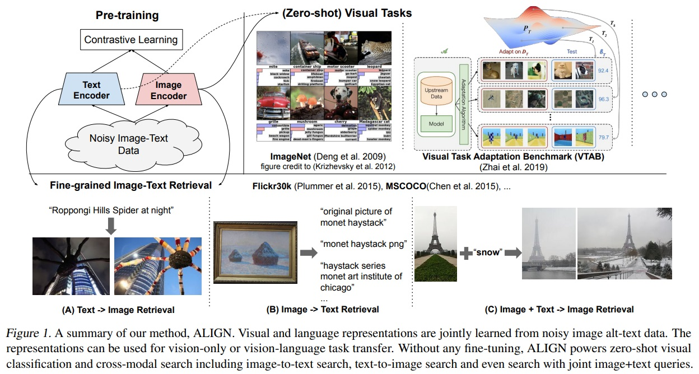

## 2. Related Work
 - 분류나 검색을 위해 대규모 레이블링 데이터셋으로 사전 학습한다.
 - 자기 지도 학습과 준지도 학습이 대안적 패러다임으로 연구되었다. 하지만 이러한 학습 방법은 downstream task로의 trasferability에 제한적이다.
 - 이미지와 자연어 캡션을 활용하는 것은 시각 표현 학습의 또 다른 방향이다(Joulin et al. (2015); Li et al. (2017); Desai & Johnson (2020); Sariyildiz et al. (2020); Zhang et al. (2020)). 이 방향은 이미지에서 캡션을 예측하여 좋은 시각 표현을 학습할 수 있다.
 - 하지만 이러한 연구는 작은 데이터셋에 한정되어 cross-modal retrieval에 필요한 시각-언어 표현을 산출하지 못 한다.
 - 시각-언어 표현 학습 분야에서는 시각-의미 임베딩(VSE)과 개선 버전이 제안되었다.
 - 본 모델은 가장 단순한 VSE 형태를 계승하면서 이미지-텍스트 매칭 벤치마크에서 모든 이전 모델을 능가한다.
 - ALIGN과 CLIP 은 학습 데이터에 차이가 있다. ALIGN은 원시 대체 텍스트 데이터에서 이미지-텍스트 쌍의 자연 분포를 따르고, CLIP은 영어 위키피디아에서 고빈도 시각 개념의 허용 리스트를 구축하여 데이터셋을 수집한다.
 - ALIGN은 전문 지식을 필요로 하지 않는 데이터셋을 사용하여 강력한 시각 및 시각-언어 표현을 학습할 수 있다.

## 3. A Large-Scale Noisy Image-Text Dataset
 - 연구 초점은 시각 및 시각-언어 표현 학습을 확장하는 것이다.
 - 기존 데이터셋보다 훨씬 큰 데이터셋을 활용하였으며, Conceptual Captions 데이터셋(Sharma et al., 2018) 구축 방법론 따라 image and alt-text pairs를 얻었다.
 - Conceptual Captions 데이터셋은 철저한 필터링과 후처리로 정제했다.
 - 본 연구에서 확장을 위해 원래 작업의 대부분의 정제 단계를 완화하여 품질과 규모 사이에서 타협한다.
 - 필터링 방식은 최소한의 빈도 기반 필터링(minimal frequency-based filtering)을 적용했다.
 - 결과적으로 Fig 2와 같이 기존 보다 훨씬 더 큰 18억 이미지-텍스트 쌍으로 구성된 더 크고 잡음이 많은 데이터셋을 생성했다.
 - **Image-based filtering.**
     - pornographic 이미지 제거하고 짧은 측면이 200픽셀 이상, 종횡비가 3보다 작은 이미지만 유지한다.
     - 1000개 이상의 대체 텍스트(alt-text)가 연관된 이미지는 제거한다.
     - 테스트 이미지로 학습하지 않기 위해 모든 downstream 평가 데이터셋(ILSVRC-2012, Flickr30K, MSCOCO 등)에서 중복이나 거의 중복인 테스트 이미지도 제거한다.
 - **Text-based filtering.**
     - 10개 이상의 이미지와 공유되는 대체 텍스트는 제외한다. 그 이유는 이러한 대체 텍스트는 종종 이미지의 내용과 관련이 없기 때문이다(예: “1920x1080”, “alt img”, “cristina”).
     - 희귀 토큰(“XYZ1234ABCD”, “qwertyuiopasdfgh”, “#%&*@!”) 포함되거나 3글자 이하(<3 unigrams)의 너무 짧거나("Hi", "OK", "No") 20단어(>20 unigrams)가 초과되는 긴 대체 텍스트는 제거한다.
     - “image tid 25&id mggqpuweqdpd&cache 0&lan code 0”와 같은 잡음이 많은 텍스트나 너무 일반적이어서 유용하지 않은 텍스트를 제거한다.

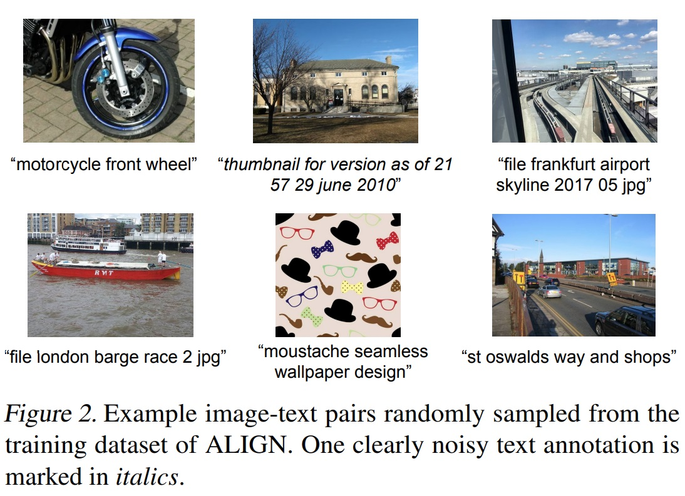

## 4. Pre-training and Task Transfer
### 4.1. Pre-training on Noisy Image-Text Pairs
 - ALIGN은 미지와 텍스트 인코더 쌍으로 구성된 듀얼 인코더 구조를 사용하여 사전 학습된다.
 - 이 구조는 코사인 유사도 결합 기능이 모델 상단에 위치한다.
 - 이미지 인코더로는 global pooling이 있는 EfficientNet을 사용한다.
 - 텍스트 임베딩 인코더로는 [CLS] 토큰 임베딩이 있는 BERT를 사용한다(학습 데이터셋에서 100k 단어 조각 어휘를 생성).
 - BERT 인코더 상단과 이미지 타워의 차원이 일치할 수 있도록 linear activation이 있는 fully-connected layer가 추가된다.
 - 이미지 및 텍스트 인코더는 초기 학습한다.
 - 정규화된 소프트맥스 손실을 통해 이미지와 텍스트 인코더가 최적화된다.
 - 학습 중 일치하는 이미지-텍스트 쌍을 긍정적(positive)으로 처리한다.
 - 학습 배치에서 형성될 수 있는 모든 기타 무작위 이미지-텍스트 쌍은 부정적(negative)으로 처리한다.
 - 로짓을 조정하는 온도(σ)가 중요한 변수이며, 이는 이미지와 텍스트 임베딩 모두 L2-정규화된다.
 - 부정적인 예시들(negative samples, 즉 잘못 매치된 이미지-텍스트 쌍들)이 모델 학습에 더 큰 영향을 미치도록 만들고, 학습에 사용된 여러 컴퓨팅 코어에서 생성된 데이터 임베딩을 하나의 큰 데이터셋으로 합쳐 데이터의 양(배치 크기)을 늘린다.
 - negative samples을 학습 과정에 사용하는 이유는 대조 학습(contrastive learning)을 강화시키고, 일반화 능력 향상 및 과적합 방지, 샘플 균형을 할 수 있다.

### 4.2. Transferring to Image-Text Matching & Retrieval
 - ALIGN 모델은 이미지-텍스트 및 텍스트-이미지 검색 작업에서 미세 조정 여부에 따라 평가한다.
 - 벤치마크 데이터셋은 Flickr30K (Plummer et al., 2015) 및 MSCOCO (Chen et al., 2015) 사용한다.
 - Crisscrossed Captions (CxC) 평가: MSCOCO 확장 버전으로 추가 인간 의미론적 유사성 판단 포함
 - 추가적인 인간 의미론적 유사성 판단이 있는 캡션-캡션, 이미지-이미지, 이미지-캡션 쌍으로 MSCOCO를 확장한 Crisscrossed Captions (CxC) (Parekh et al., 2021)에서도 ALIGN을 평가한다.
 - CxC는 이미지-텍스트, 텍스트-이미지, 텍스트-텍스트, 이미지-이미지 검색 작업을 포함한 네 가지 검색 작업을 한다.
 - CxC는 의미론적 텍스트 유사성(STS; Smantic Textual Similarity), 의미론적 이미지 유사성(SIS; Semantic Image Similarity), 의미론적 이미지-텍스트 유사성(SITS; Semantic Image-Text Similarity) 포함한 세 가지 의미론적 유사성 작업을 한다.

### 4.3. Transferring to Visual Classification
 - ALIGN 모델을 ImageNet ILSVRC-2012 벤치마크와 그 변형 데이터셋에 적용하는 제로샷 전환을 시행한다.
 - ImageNet 변형1에는 ImageNet-R(endition), ImageNet-A(dversarial), ImageNet-V2가 포함된다.
 - 이 변형들은 ImageNet 클래스의 동일한 세트 또는 하위 세트를 따르지만, ImageNet-R과 ImageNet-A의 이미지는 ImageNet과 다른 분포에서 샘플링된다.
 - 이미지 인코더는 downstream 시각 분류 작업에 transfer된다.
 - 사용된 데이터셋은 ImageNet, Oxford Flowers-102, Oxford-IIIT Pets, Stanford Cars, Food101이다.
 - ImageNet의 경우 상위 분류 계층만 학습하는 설정과 완전히 미세 조정된 설정이 보고된다2.
 - 세분화 분류 벤치마크의 경우 완전히 미세 조정된 설정만 보고된다.
 - Visual Task Adaptation Benchmark ([VTAB](https://google-research.github.io/task_adaptation/))에서 모델의 강건성 평가가 수행된다.
 - VTAB는 자연, 전문화, 구조화된 이미지 분류 작업의 하위 그룹을 포함하는 19가지 다양한 시각 분류 작업으로 구성된다.
 - VTAB의 각 작업은 1000개의 학습 샘플을 가진다.

*ImageNet 데이터셋의 변형 및 확장 버전1 
 ① ImageNet-R(endition): 비자연적인 이미지, 예술 작품, 만화, 스케치 등 다양한 스타일과 맥락에서 ImageNet 클래스의 이미지를 포함한다. 
 ② ImageNet-A(dversarial): ImageNet 데이터셋의 이미지들 중에서 일반적인 딥 러닝 모델이 잘못 분류하기 쉬운 예제들을 수집하여 구성되어 있다. 이를 통해 모델이 어려운 또는 오해하기 쉬운 이미지에 대해 얼마나 잘 대처하는지 평가할 수 있다. 
③ ImageNet-V2: ImageNet-V2는 원래 ImageNet 데이터셋의 테스트 세트와 유사하지만, 새롭게 수집된 이미지로 구성된 데이터셋이다. 이 데이터셋은 ImageNet 모델의 성능이 시간이 지나면서 얼마나 변하는지, 즉 "데이터셋 시프트" 현상을 조사하는 데 사용된다.

*ImageNet의 두 가지 설정에 대한 결과 보고2 
 ① 상위 분류 계층만 학습하는 설정: 이 설정에서는 ALIGN 이미지 인코더가 고정되어 있으며(즉, 이미지 인코더의 가중치는 학습 과정에서 변경되지 않음), 분류를 위한 최상위 계층만 학습된다. 이 접근법은 기존에 학습된 이미지 특징을 유지하면서 새로운 작업에 적응하기 위해 분류 계층을 조정한다. 
 ② 완전히 미세 조정된 설정: 이 경우에는 이미지 인코더와 분류 계층 모두 학습한다. 이는 전체 모델이 새로운 작업에 맞게 조정되어, 보다 세밀한 특징 학습이 가능하게 한다.

## 5. Experiments and Results
 - ALIGN 모델은 이미지 인코더로는 EfficientNet을, 텍스트 인코더로는 BERT를 사용하여 초기 학습한다.
 - 이미지 인코더는 사용하는 EfficientNet 변형에 관계없이 289 × 289 픽셀 해상도에서 학습된다.
 - 입력 이미지는 346 × 346 해상도로 조정된 후 학습에서는 무작위 크롭 및 수평 뒤집기가 수행되고, 평가에서는 중앙 크롭이 사용된다.
 - BERT에는 최대 64 토큰의 단어 조각 시퀀스가 사용된다.
 - 소프트맥스 온도 변수3는 1.0으로 초기화되며(이 온도 변수는 이미지-텍스트 손실과 텍스트-이미지 손실 간에 공유됨), 소프트맥스 손실에서 라벨 평활4 매개변수로 0.1을 사용한다.
 - LAMB 최적화 알고리즘(You et al., 2020)을 사용하며, 가중치 감소 비율은 1e-5이다.
 - 학습률5은 선형적으로 0에서 1e-3으로 상승하고, 1.2M 단계(약 12 에폭)에서 0으로 감소한다.
 - 모델은 1024개의 Cloud TPUv3 코어에서 각 코어당 16개의 긍정 쌍을 사용하여 학습된다.
 - 총 효과적인 배치 크기는 16,384이다.

*소프트맥스 온도 변수3는 모델이 예측한 로짓(모델 출력)의 '온도'를 조절하여 확률 분포를 부드럽게 만드는데 사용된다.
* 라벨 평활(label smoothing)4은 모델의 confidence 예측을 방지하기 위함으로 다른 라벨에 대한 확률을 증가시켜 모델의 일반화 능력을 향상시킨다.
* 학습률5이 0에서 0.001까지 선형적으로 증가하고, 이후 약 12에폭을 걸쳐 다시 0으로 감소한다. 이는 학습률을 조절하여 초기에는 빠르게 학습하고 점차 학습 속도를 줄여 최적의 솔루션에 안정적으로 도달하도록 한다.

### 5.1. Image-Text Matching & Retrieval
 - ALIGN 평가는 Flickr30K와 MSCOCO 크로스모달 검색 벤치마크에서 제로샷 및 완전히 미세 조정된 설정에서 평가된다.
 - Table 1와 같이 Flickr30K에서는 표준 1K 테스트 세트에서 평가하고 30k 학습 세트에서 미세 조정한다.
 - Table 1와 같이 MSCOCO에서는 5K 테스트 세트에서 평가하고, 82K 학습 및 추가 30K 검증 이미지세트에서 미세 조정한다. 여기서 30k는 5k에 속하지 않는다.
 - 미세 조정 중 동일한 손실 함수가 사용된다.
 - 배치 크기가 학습 샘플 수와 비슷할 경우 거짓 부정적 결과가 발생할 수 있다.
 - 전체 배치 크기는 16384에서 2048로 감소한다.
 - Flickr30K와 MSCOCO에서 각각 3K 및 6K 단계 동안 초기 학습률 1e-5로 학습한다.
 - 다른 모든 하이퍼파라미터는 사전 학습과 동일하게 유지된다.
 - Table 1에 따르면 ALIGN은 Flickr30K와 MSCOCO 벤치마크의 모든 지표에서 최고의 결과를 달성한다.
 - 제로샷 설정에서는 이전 최고 모델인 CLIP보다 이미지 검색 작업에서 7% 이상 향상되었다.
 - 미세 조정을 통해, ALIGN은 모든 기존 방법들을 크게 능가한다.
 - Table 2에 따르면 ALIGN은 Crisscrossed Captions(CxC) 검색 작업에서도 모든 지표에서 최고의 결과를 달성한다.
 - 특히 이미지-텍스트(+22.2% R@1) 및 텍스트-이미지(20.1% R@1) 작업에서 큰 폭으로 성능이 향상된다.
 - Table 3에 따르면 ALIGN은 SITS 작업에서도 이전 최고 기록을 5.7% 개선한다.
 - 이미지와 텍스트를 매칭하는 작업(예: 이미지를 주고 관련 텍스트를 찾거나, 텍스트를 주고 관련 이미지를 찾는 작업)에서 뛰어난 성능 향상을 보여주지만, 동일한 매체 내에서의 검색 작업, 즉 텍스트만을 사용해 다른 텍스트를 찾는 작업(텍스트-텍스트) 또는 이미지만을 사용해 다른 이미지를 찾는 작업(이미지-이미지)에서의 성능 개선은 상대적으로 덜 인상적이었다.
 - STS 및 SIS 작업에서의 성능도 VSE++ 및 DEI2T보다 약간 낮다.
 - 결론적으로 cross-modal (image-text) matching 작업에서 뛰어난 성능에도 불구하고, intra-modal matching 작업에서는 그다지 인상적이지 않다.

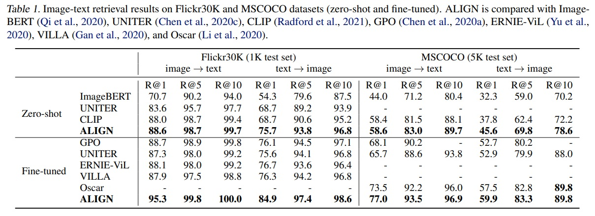
  
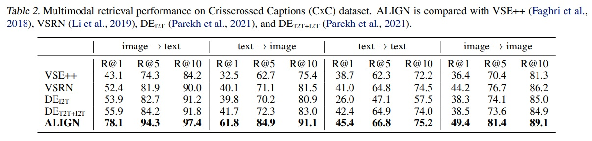
  
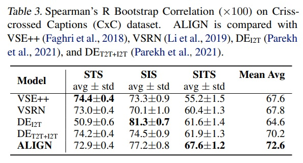

### 5.2. Zero-shot Visual Classification
 - 클래스명의 텍스트를 텍스트 인코더에 직접 입력하면 ALIGN은 이미지-텍스트 검색을 통해 이미지를 후보 클래스로 분류할 수 있다.
 - Table 4와 같이 ALIGN과 CLIP은 ImageNet 및 그 변형에서 비교한다.
 - ALIGN은 다양한 이미지 분포를 가진 분류 작업에서 뛰어난 강건성을 보인다.
 - 공정한 비교를 위해, CLIP과 동일한 프롬프트 앙상블 방법이 사용한다.
 - 각 클래스명은 CLIP에서 정의한 프롬프트 템플릿 세트를 사용하여 확장된다.(ex. "A photo of a {classname}")
 - 클래스 임베딩은 모든 템플릿의 임베딩을 평균하여 계산한 후 L2-정규화를 거친다.
 - 이 앙상블 방식은 ImageNet의 top-1 정확도에서 2.9% 개선했다.

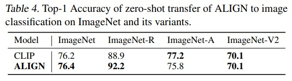

### 5.3. Visual Classification w/ Image Encoder Only
 - ImageNet 벤치마크에서 ALIGN은 학습된 시각적 특징을 고정시키고 분류 헤드만 학습한다.
 - ALIGN은 모든 레이어를 미세 조정한다.
 - 데이터 증강 방법에는 무작위 크롭과 수평 뒤집기가 포함된다.
 - 평가에서는 중앙 크롭을 적용한다.
 - 학습과 평가 간에 0.8 스케일 비율을 사용한다.
 - 시각적 특징이 고정된 경우 학습/평가 해상도는 289/360이다.
 - 모든 변수를 미세 조정할 때 해상도는 475/600이다.
 - 글로벌 배치 크기는 1024, SGD 최적화기(모멘텀 0.9)를 사용한다.
 - 30 에폭마다 학습률이 0.2 비율로 감소한다.
 - 가중치 감소는 0으로 설정된다.
 - 시각적 특징이 고정된 경우 초기 학습률은 0.1이다.
 - 모든 레이어를 미세 조정할 때 초기 학습률은 0.01이다.
 - Table 5에서 ALIGN은 ImageNet 벤치마크에서 이전 방법들과 비교된다.
 - 고정된 특징으로 ALIGN은 CLIP을 약간 앞서고 85.5% top-1 정확도를 달성한다.
 - 미세 조정 후 ALIGN은 BiT 및 ViT 모델보다 높은 정확도를 달성한다.
 - ALIGN은 VTAB 평가에서 하이퍼파라미터 스윕(hyper-parameter sweep)6을 따른다.
 - 각 작업은 800개의 이미지로 학습되고 200개의 검증 이미지 세트를 사용하여 하이퍼파라미터가 선택된다.
 - 스윕 후, 선택된 하이퍼파라미터를 사용하여 각 작업에 대해 학습 및 검증 분할을 합친 1000개의 이미지로 학습한다.
 - Table 6에서 ALIGN은 BiT-L을 능가한다.
 - 더 작은 세분화 분류 벤치마크에서 평가하기 위해 ALIGN은 간단한 미세 조정 전략을 채택한다.
 - ImageNet 미세 조정과 동일한 데이터 증강 및 최적화기를 사용한다.
 - Table 7에서 ALIGN은 BiT-L 및 SAM과 비교된다.
 - 이러한 작은 작업에서는 미세 조정의 세부 사항이 중요하다.

하이퍼파라미터 스윕(hyper-parameter sweep)6이란 기계 학습 모델의 성능을 최적화하기 위해 다양한 하이퍼파라미터 설정을 실험적으로 테스트하는 과정이다. 이 과정에서 학습률, 배치 크기, 네트워크 깊이와 같은 여러 하이퍼파라미터의 다른 조합들이 시도되어, 가장 좋은 결과를 낼 수 있는 최적의 하이퍼파라미터 조합을 찾아낸다.

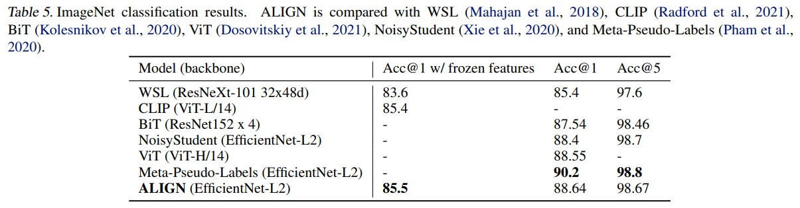
  
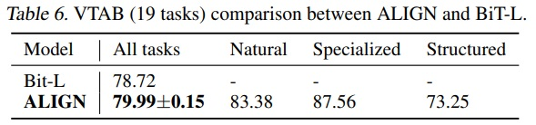
  
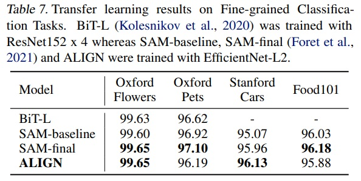

## 6. Ablation Study
### 6.1. Model Architectures
 - ALIGN 모델의 성능 연구는 다양한 이미지 및 텍스트 백본을 사용한다.
 - 이미지 인코더로 EfficientNet B1부터 L2까지, 텍스트 인코더로는 BERT-Mini부터 BERT-Large까지 학습한다.
 - B1, B3, B5, L2의 전역 풀링된 특징 위에 추가적인 전체 연결 계층을 추가하여 B7의 출력 차원(670)과 일치시킨다.
 - 모든 텍스트 인코더에도 유사한 선형 계층이 추가된다.
 - ablation study에서는 학습 단계를 줄여 런타임을 절약한다.
 - Fig 3에서는 MSCOCO 제로샷 검색 및 이미지넷 KNN 결과를 다양한 이미지 및 텍스트 백본 조합으로 보여준다.
 - 이미지 인코더 용량을 확장하는 것은 시각 작업에 더 중요하다.
 - 이미지-텍스트 검색 작업에서는 이미지 및 텍스트 인코더 용량이 모두 중요하다.
 - EfficientNet-L2 + BERT-Large 모델만 미세 조정하며 임베딩 차원, 배치 내 무작위 부정적 개수, 소프트맥스 온도를 포함한 주요 아키텍처 하이퍼파라미터를 연구한다.
 - Table 8을 미루어보았을 때, 임베딩 차원이 높아질수록 모델 성능이 향상되고, 소프트맥스 손실에서 배치 내 부정적이 적을 경우(50%, 25%) 성능이 저하된다.
 - 온도 매개변수는 학습 가능한 온도(learnable temperature)를 사용한다.

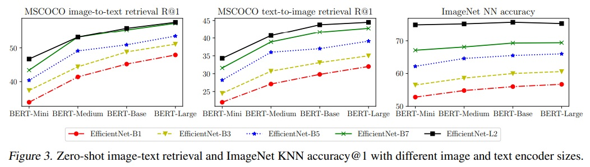
  
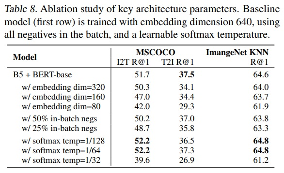

### 6.2. Pre-training Datasets
 - EfficientNet-B7 + BERT-Base와 EfficientNet-B3 + BERT-Mini 두 모델을 세 가지 다른 데이터셋(전체 ALIGN 학습 데이터셋, 무작위 10% 샘플링된 ALIGN 학습 데이터셋, CC-3M(약 300만 이미지))에서 학습한다.
 - CC-3M은 크기가 작아 기본 step 수의 10분의 1로 학습한다.
 - 모든 모델은 초기부터 학습한다.
 - Table 9에서는 규모가 큰 ALIGN 데이터로 학습된 모델은 작은 규모의 CC-3M 데이터로 학습된 모델보다 우수한 성능을 보인다.
 - CC-3M에서 B7+BERT-Base는 과적합 문제가 발생하고 B3+BERT-Mini보다 나쁜 성능을 보인다.
 - ALIGN 데이터셋처럼 큰 규모의 데이터셋을 활용하기 위해서는 B3+BERT-Mini보다는 B7+BERT-Base와 같이 큰 모델이 필요하다.
 - Table 10에 따르면, ALIGN 데이터는 3M일 때 CC데이터보다 나쁜 성능을 보이지만, 6M 및 12M 데이터 크기일 때는 모델의 성능이 더 우수하다.

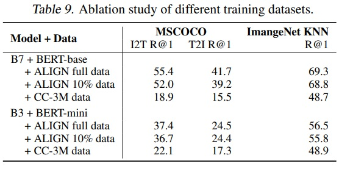
  
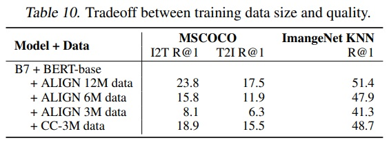

## 7. Analysis of Learned Embeddings
 - ALIGN으로 학습된 임베딩의 행동을 분석하기 위해 간단한 이미지 검색 시스템(image retrieval system)을 구축한다.
 - 시연을 위해 학습 세트와 별개인 1억 6천만 개의 CC-BY 라이선스 이미지로 구성된 인덱스를 사용한다.
 - Fig 4는 학습 데이터에 없는 텍스트 쿼리에 대한 텍스트-이미지 Top-1 검색 결과를 보여준다.
 - ALIGN은 장면의 자세한 설명, 세밀한 개념 또는 랜드마크 및 예술 작품과 같은 인스턴스 수준 개념에 대해 정확한 이미지를 검색한다.
 - 이 예시들은 ALIGN 모델이 유사한 의미를 가진 이미지와 텍스트를 정렬할 수 있음을 보여주고, 새롭고 복잡한 개념으로 일반화할 수 있다.
 - word2vec은 문장과 단락에서 인접한 단어를 예측하도록 학습된 단어 벡터 간의 선형 관계를 보여준다.
 - ALIGN에서도 이미지와 텍스트 임베딩 간의 선형 관계가 나타난다.
 - Fig 5와 같이 이미지+텍스트 쿼리를 사용하여 이미지 검색을 수행한다.
 - 시각 및 언어 영역에서 ALIGN의 구성 요소 들이 서로 결합하여 새로운 의미나 기능을 생성하는 뛰어난 능력인 compositionality of ALIGN embeddings을 보여준다.
 - "다중 모드 쿼리로 검색"이라는 새로운 패러다임의 가능성을 보여준다. 예를 들어, "호주" 또는 "마다가스카르"에 해당하는 판다를 찾거나 검은 신발을 "베이지" 색상의 신발로 바꿀 수 있다.
 - 임베딩 공간에서 빼기를 수행하여 장면에서 객체나 속성을 제거하는 것이 가능하다.

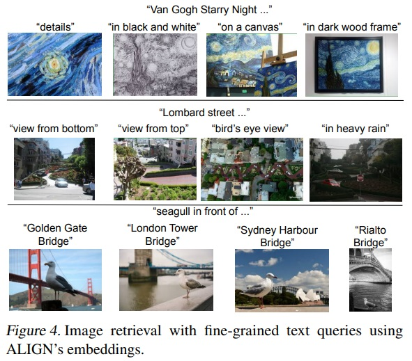
  
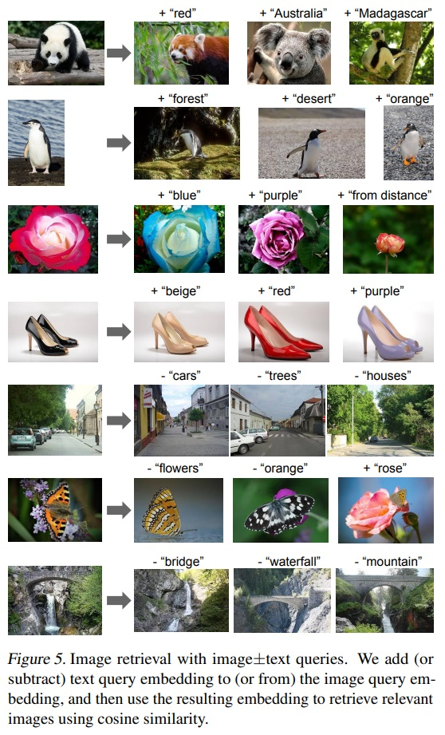

## 8. Multilingual ALIGN Model
 - ALIGN의 장점 중 하나는 언어에 특정되지 않은 간단한 필터를 사용하여 노이즈가 많은 웹 이미지 텍스트 데이터로 학습한다.
 - 데이터셋을 다국어(100개 이상의 언어를 포함)로 확장하고 그 크기를 영어 데이터셋(18억 이미지-텍스트 쌍)과 일치시켰다.
 - 다국어 모델 ALIGNmling은 이 데이터를 사용하여 학습했다.
 - 25만 개의 다국어 워드피스 어휘를 새로 생성하여 모든 언어를 포함했다.
 - 모델 학습은 영어 버전과 동일한 설정을 따른다.
 - 다국어 모델은 Multi30k, 즉 Flickr30K(Plummer et al., 2015)를 독일어(de)(Elliott et al., 2016), 프랑스어(fr)(Elliott et al., 2017) 및 체코어(cs)(Barrault et al., 2018)로 확장한 다국어 이미지 텍스트 검색 데이터셋에서 테스트한다.
 - 데이터셋은 31,783개의 이미지와 영어 및 독일어로 이미지 당 5개의 캡션, 프랑스어와 체코어로는 이미지 당 1개의 캡션을 포함한다.
 - train/dev/test 분할은 Young et al. (2014)에 의해 정의된다.
 - 제로샷 모델 성능은 평균 리콜(mR)을 사용하여 평가되며, 이미지-텍스트 및 텍스트-이미지 검색 작업에서 Recall@1, Recall@5, Recall@10의 평균 점수를 계산한다.
 - Table 11에 따르면 ALIGNmling의 제로샷 성능은 모든 언어에서 $M^3P$(Multimodal Multilingual Multitask Pre-training)를 큰 폭으로 능가하며, 프랑스어에서 가장 큰 개선을 보인다.
 - 제로샷 성능은 체코어를 제외한 모든 언어에서 미세 조정된 $M^3P$ 및 UC2(Universal Cross-lingual Cross-modal Vision-and-Language Pre-training)와 비슷하다.
 - 영어에서 ALIGNmling은 영어만을 대상으로 한 ALIGNEN보다 약간 낮은 성능을 보인다.

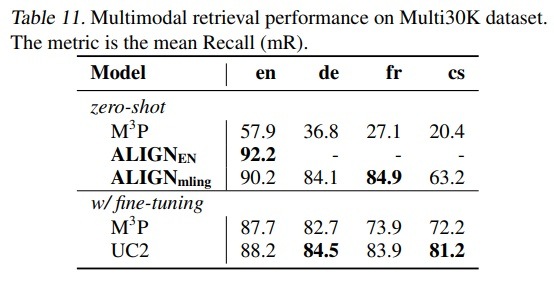

## 9. Conclusion
 - 대규모 노이즈가 있는 이미지-텍스트 데이터를 활용하는 간단한 방법을 제시한다.
 - 데이터 큐레이션과 주석 작업을 피하고 최소한의 빈도 기반 정리만 필요로 한다.
 - 대조 손실을 사용하는 간단한 듀얼-인코더 모델을 학습한다.
 - ALIGN은 크로스-모달 검색이 가능하며, 기존 SOTA VSE 및 cross-attention vision-language models들을 크게 능가한다.
 - 시각 전용 downstream task에서 ALIGN은 대규모 레이블이 붙은 데이터로 학습된 SOTA 모델들과 비슷하거나 이들을 능가한다.