*대규모 언어 모델(LLMs)의 기하급수적 성장은 멀티모달 AGI 시스템에 대한 수많은 가능성을 열어주었다. 그러나 비전 및 비전-언어 기반 모델의 발전, 멀티모달 AGI의 중요한 요소로서, LLMs의 발전 속도를 따라가지 못하고 있다. 이 연구에서는 대규모 비전-언어 기반 모델(InternVL)을 설계하였다. 이는 비전 기반 모델을 60억 매개변수로 확장하고 다양한 출처의 웹 규모 이미지-텍스트 데이터를 사용하여 점진적으로 LLM과 조화시킨다. 이 모델은 이미지 수준 또는 픽셀 수준 인식과 같은 시각 인식 작업, 제로샷 이미지/비디오 분류, 제로샷 이미지/비디오-텍스트 검색과 같은 비전-언어 작업에 널리 적용되어 최첨단 성능을 달성할 수 있으며, LLM과 연결하여 멀티모달 대화 시스템을 생성할 수 있다. 이 모델은 강력한 시각 능력을 가지고 있으며, ViT-22B의 좋은 대안이 될 수 있다.*

## 📋 Table of Contents

- [1. Introduction](#1-introduction)
- [2. Related Work](#2-related-work)
- [3. Proposed Method](#3-proposed-method)
- [4. Experiments](#4-experiments)
- [5. Conclusion](#5-conclusion)
- [Supplementary Materials](#supplementary-materials)

## 1. Introduction
 - 대규모 언어 모델(LLMs)은 개방형 언어 작업에서 인상적인 능력을 발휘하며, 인공 일반 지능(AGI) 시스템의 발전을 크게 촉진하고 있다. 
 - LLMs를 활용한 VLLMs는 복잡한 시각-언어 대화와 상호작용을 가능하게 하지만 LLMs의 빠른 성장에 비해 뒤처진다.
 - 기존 VLLMs는 QFormer나  linear projection과 같은 lightweight “glue” layers1을 사용하여 시각과 언어 모델의 특징을 조정했다.
 - 하지만 이러한 조정에는 몇 가지 한계가 있다.
   - **(1) Disparity in parameter scales.:** 대규모 LLMs는 최대 1000조 파라미터에 달하지만, VLLMs에서 널리 사용되는 비전 인코더는 여전히 약 10억 파라미터에 불과하다.
   - **(2) Inconsistent representation.:** 순수 비전 데이터나 BERT 시리즈와 맞춰진 비전 모델은 LLMs와의 표현 불일치가 발생한다.
   - **(3) Inefficient connection.:** "접착" 계층은 일반적으로 가볍고 무작위로 초기화되며, 여러 멀티모달 작업에서 필요한 복잡하고 상호 의존적인 데이터 간의 관계를 완전히 포착하고 이해하는 데 있어 부족할 수 있다.
 - 이러한 한계를 극복하기 위해 비전 인코더를 LLM의 파라미터 규모에 맞추어 조정하고 이들의 표현을 조화시켜야한다.
 - 대규모 모델의 학습은 인터넷에서 얻은 대량의 이미지-텍스트 데이터가 필요하다.
 - 학습 효율성을 향상하는 전략으로 대조 학습(contrastive learning)에 보완적인 접근법으로 생성적 지도를 고려한다.
 - 그러나 저품질 데이터가 생성적 학습에 적합한지 여부는 우려된다.
 - ***InternVL**은 대규모 비전-언어 기반 모델로, 확장된 비전 인코더의 표현을 LLM과 조화시키며 다양한 비전 및 비전-언어 작업에서 최첨단 성능을 달성한다.*
  

  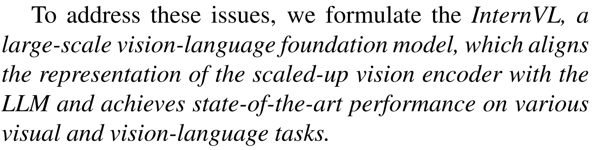
  

  
 - Fig 1 (c)과 같이 InternVL은 세 가지 주요 설계를 가진다.
   - **(1) Parameter-balanced vision and language components:** 6억 개의 파라미터를 가진 비전 인코더와 8억 개의 파라미터를 가진 LLM 미들웨어를 포함하다. 여기서 미들웨어는 prior vision-only (Fig 1 (a)) or dual-tower (Fig 1 (b)) 구조와 달리 대조 및 생성 작업에 유연한 조합을 제공한다.
   - **(2) Consistent representations:** 비전 인코더와 LLM 사이의 표현 일관성을 유지하기 위해 사전 학습된 다국어 LLaMA를 사용하여 미들웨어를 초기화하고 비전 인코더를 맞춘다.
   - **(3) Progressive image-text alignment:** 다양한 출처에서 이미지-텍스트 데이터를 활용하고, 점진적 정렬 전략을 통해 학습 안정성을 확보한다. 구체적으로 대규모 잡음이 많은 이미지-텍스트 데이터에서 대조 학습을 시작하고, 세밀한 데이터에서 생성적 학습으로 전환한다. 
 - 모델의 장점
   - **(1) Versatile.:** standalone 비전 인코더로서 인식 작업에 사용되거나 언어 미들웨어와 함께 시각-언어 작업 및 다중 모달 대화 시스템에 적용될 수 있다.
   - **(2) Strong.:** 학습 전략, 대규모 파라미터, 웹 규모 데이터를 활용하여 다양한 시각 및 시각-언어 작업에서 최고의 결과를 달성한다(Fig 2 참조).
   - **(3) LLM-friendly.:** LLMs와의 일치된 특징 공간으로 인해 기존 LLMs(LLaMA 시리즈, Vicuna, InternLM 등)와 원활하게 통합될 수 있다.
 - 모델 기여점
   - 대규모 시각-언어 기반 모델 제시: 시각 인식 작업, 시각-언어 작업, 다중 모달 대화 등 다양한 시각-언어 작업에서 우수한 성능을 보인다.
   - 점진적 이미지-텍스트 정렬 전략 도입: 웹 규모의 잡음이 많은 이미지-텍스트 데이터를 대조 학습에 최대한 활용하고, 세밀하고 고품질의 데이터를 생성적 학습에 사용하는 대규모 시각-언어 기반 모델의 효율적인 학습을 위한 전략을 제시한다.
   - 현재 SOTA 모델과 비교: InternVL이 이미지 분류(ImageNet), 의미론적 분할(ADE20K), 비디오 분류(Kinetics), 이미지-텍스트 검색(Flickr30K & COCO), 비디오-텍스트 검색(MSR-VTT), 이미지 캡셔닝(COCO & Flickr30K & NoCaps), 멀티모달 대화(MME & POPE & Tiny LVLM)을 포함한 다양한 일반적인 시각-언어 작업에서 선도적인 성능을 달성한다

**lightweight “glue” layers1는 대규모 언어 모델(Large Language Models, LLMs)과 비전 모델을 연결하는 데 사용되는 상대적으로 간단하고 경량화된 네트워크 레이어를 의미한다. 이러한 레이어는 비전 데이터와 언어 데이터 간의 특징을 조화시키고, 서로 다른 두 모델 간의 정보를 효과적으로 전달하도록 설계되었다.*

  

  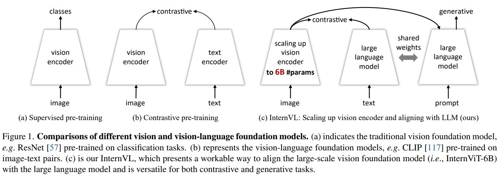
   
  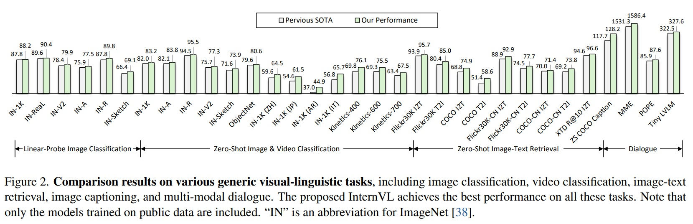
  

## 2. Related Work
### 2.1. Vision Foundation Models
 - AlexNet을 시작으로 지난 10년 동안 다양한 컨볼루션 신경망(CNNs)이 등장하여 ImageNet 벤치마크를 지속적으로 갱신했다.
 - residual connections은 gradients vanishing 문제를 해결하여 규모와 깊이가 큰 모델이 더 나은 성능을 낼 수 있다는 것을 시사했다.
 - 최근 ViT가 컴퓨터 비전 분야에서 새로운 네트워크 구조의 가능성을 보이며, 그 변형들은 용량을 크게 증가시키고 다양한 중요한 시각 작업에서 뛰어난 성능을 보였다.
 - 비전 기반 모델은 LLM과 lightweight “glue” layers을 통해 연결되지만, ImageNet이나 JFT와 같은 순수 시각 데이터셋에서 유래하거나, BERT 시리즈와의 이미지-텍스트 쌍을 통해 정렬되어 LLM과의 직접적인 정렬이 부족하다.

### 2.2. Large Language Models
 - 대규모 언어 모델(LLMs)은 자연어 처리 작업을 가능하게 하여 인공 지능 분야에 혁명을 가져왔으며, 특히 GPT-3의 등장은 few-shot 및 zero-shot 학습에서 큰 도약을 가져왔다.
 - ChatGPT, GPT-4를 포함한 다양한 오픈소스 LLMs가 등장했으며, 이러한 모델들은 자연어에 국한되지 않은 상호작용을 위한 새로운 가능성을 열고 있다.

### 2.3. Vision Large Language Models
 - 비전 대규모 언어 모델(VLLMs)은 언어 모델에 시각 정보 처리 및 해석 능력을 추가하려는 목표를 갖는다.
 - Flamingo, GPT-4, LLaVA 시리즈 등은 시각적 질문 답변에서 뛰어난 few-shot 성능을 보였으며 VisionLLM, KOSMOS-2, Qwen-VL 등은 지역 설명 및 위치 확인과 같은 비주얼 그라운딩 능력 즉, 시각적 근거 능력을 향상시켰다.
 - PaLM-E, EmbodiedGPT와 같은 모델은 실제 응용에서 VLLMs를 활용하는 데 중요한 진전을 이뤘다.
 - 시각 및 시각-언어 기반 모델의 발전은 VLLMs에 필수적이지만, 아직 그 발전 속도가 따라가지 못하고 있다.

## 3. Proposed Method
### 3.1. Overall Architecture
 - Fig 3과 같이 전통적인 비전 전용 백본과 듀얼 인코더 모델과 달리, InternVL은 6억 개 파라미터를 가진 비전 트랜스포머 InternViT-6B와 8억 개 파라미터를 가진 언어 미들웨어 QLLaMA로 설계되었다.
훈련 전략: 두 대규모 구성 요소를 정렬하기 위해 점진적 정렬 훈련 전략을 도입함. 대규모 잡음 데이터에서 대비 학습을 시작하여 고품질 데이터로 생성 학습으로 점차 이동함.
  

  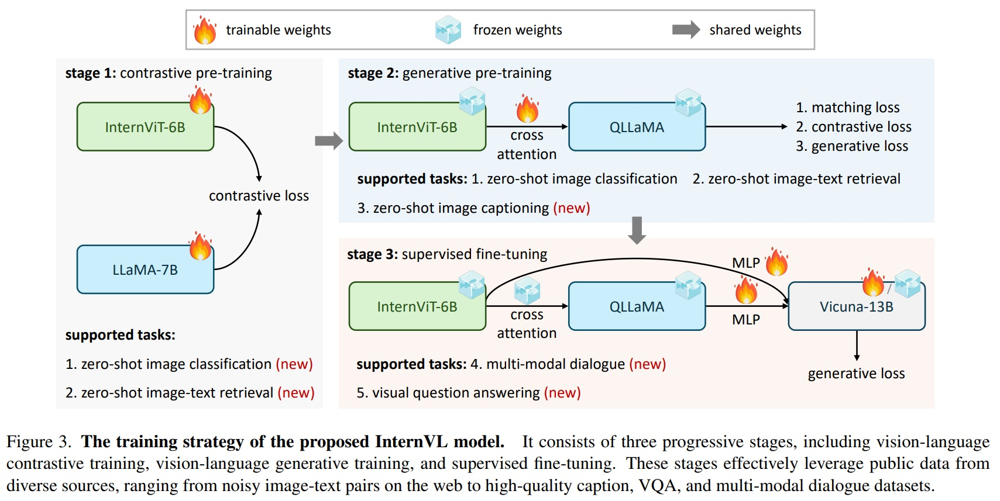  
  

### 3.2. Model Design
 - **Large-Scale Vision Encoder: InternViT-6B.**
   - InternVL의 비전 인코더는 바닐라 ViT로 구현된다.
   - InternVL의 비전 인코더는 6억 개 파라미터를 가진 ViT로 구현된다.
   - Table 1과 같이 정확도, 속도, 안정성을 위해 하이퍼파라미터 탐색을 수행하여 모델 깊이, 헤드 차워, MLP 비율을 조정한다.
 - **Language Middleware: QLLaMA.**
   - 언어 미들웨어 QLLaMA는 시각 및 언어적 특징을 조화시키기 위해 제안된다. 
   - Fig 3과 같이 다국어 LLaMA를 기반으로 하며, 새로운 학습 가능한 96개의 쿼리와 크로스 어텐션 레이어(10억 파라미터)를 추가하여 무작위로 초기화한다.
   - QLLaMA의 장점
     - (1) 사전 학습된 가중치로 초기화하여 InternViT-6B에서 생성된 이미지 토큰을 LLM과 일치하는 표현으로 변환한다.
     - (2) QLLaMA는 비전-언어 정렬을 위해 80억 매개변수를 가지며, 이는 QFormer보다 42배 크다. 즉, 멀티모달 대화 작업에서 뛰어난 성능을 달성할 수 있다.
     - (3) 대조 학습에도 적용될 수 있으며, 이미지-텍스트 정렬 작업에 강력한 텍스트 표현을 제공한다.
 - **“Swiss Army Knife” Model: InternVL.**
   - 비전 인코더와 언어 미들웨어의 유연한 조합을 통해 다양한 시각-언어 작업을 지원한다.
   - (1) *For visual perception tasks*, InternViT-6B를 비전 작업의 백본으로 사용할 수 있다.
   - (2) *For contrastive tasks2*, Fig 4(a)(b)와 같이 InternVL-C와 InternVL-G 두가지 추론 모드를 제안한다. 이는 비전 인코더 또는 InternViT와 QLLaMA의 결합을 사용하여 시각적 특징을 인코딩한다.
   - (3) *For generative tasks*, QFormer와 달리 QLLaMA는 이미지 토큰을 언어 모델과 호환되는 텍스트 형식으로 변환하여 이미지 캡셔닝 능력을 가능하게 한다. 또한 QLLaMA의 쿼리는 이 변환을 수행하고 언어 모델 처리를 위한 접두사 텍스트로도 기능하여 순차적으로 생성된 텍스트 토큰을 시각적 요소와 언어적 요소가 혼합된 일관된 출력을 생성한다.
   - (4) *For multi-modal dialogue*, InternVL을 LLM과 연결하는 시각 구성요소로 활용하는 InternVLChat을 제안한다. 이는 Fig 4(c)와 같이 InternViT-6B를 독립적으로 사용하거나 Fig 4(d)와 같이 전체 InternVL 모델을 동시에 사용한다.

  **For contrastive tasks2의 구체적인 방식은 nternViT의 시각적 특징 또는 QLLaMA의 쿼리 특징에 대한 attention pooling을 적용하여 글로벌 시각적 특징 If를 계산을 하고, QLLaMA의 [EOS] 토큰에서 특징을 추출하여 텍스트를 Tf로 인코딩한다. 그 다음 If와 Tf 사이의 유사성 점수를 계산함으로써 이미지-텍스트 검색과 같은 다양한 대조적 작업을 수행한다.

  

  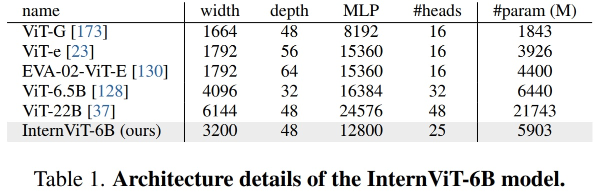
  
 
  

  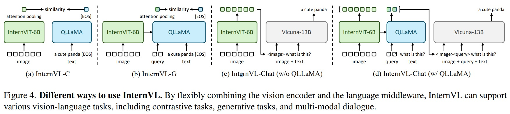  
  

### 3.3. Alignment Strategy
 -  InternVL의 학습은 *시각-언어 대조 학습*, *시각-언어 생성 학습*, *감독된 미세 조정*의 세 단계로 구성된다.
 - **시각-언어 대조 학습**
   - 첫 단계에서는 대규모 잡음 이미지-텍스트 쌍 데이터에서 InternViT-6B와 다국어 LLaMA-7B에 대한 대조 학습을 수행한다.
   - CLIP의 목적 함수를 따라, 배치 내 이미지-텍스트 쌍의 유사도 점수에 대해 대칭적 교차 엔트로피 손실을 최소화한다. 
 - **시각-언어 생성 학습**
   - 두 번째 단계에서는 InternViT-6B를 QLLaMA와 연결하고 생성 학습 전략을 채택한다. 
   - 구체적으로 QLLaMA는 첫 번째 단계에서 LLaMA-7B의 가중치를 상속한다.
   - Table 2와 같이 고품질 데이터에 대한 추가적인 필터링을 수행한다(4.98억 개 -> 1.03억 개).
   - BLIP-2의 손실 함수에 따라 이미지-텍스트 대조(ITC) 손실, 이미지-텍스트 매칭(ITM) 손실, 이미지 기반 텍스트 생성(ITG) 손실의 세 부분의 합으로 계산된다. 
 - **감독된 미세 조정**
   - 다중 모달 대화 시스템을 만드는 데 InternVL의 이점을 보여주기 위해, 외부 LLM 디코더(e.g., Vicuna, InternLM)와 MLP 계층을 통해 연결하고 감독된 미세 조정(SFT)을 수행한다.
   - Table 3과 같이 약 400만 개의 고품질 instruction dataset을 수집한다.
   - LLM 디코더를 고정 상태로 유지하고, MLP 레이어 또는 MLP 레이어와 QLLaMA를 학습시키는 것만으로도 견고한 성능을 달성할 수 있다.

  

  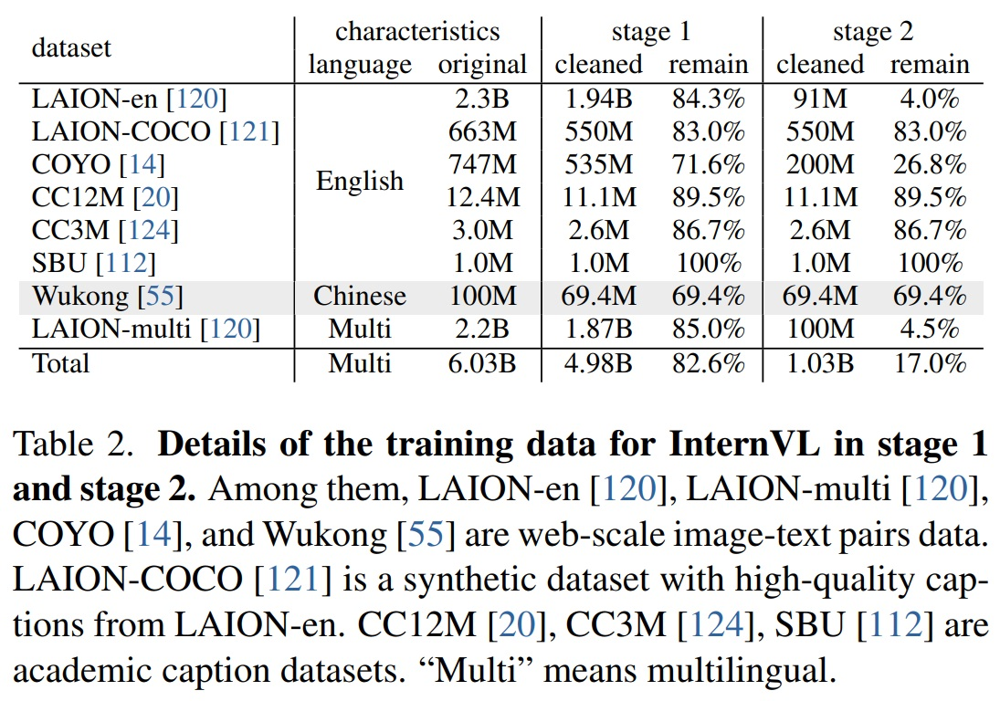  
  
 
  

  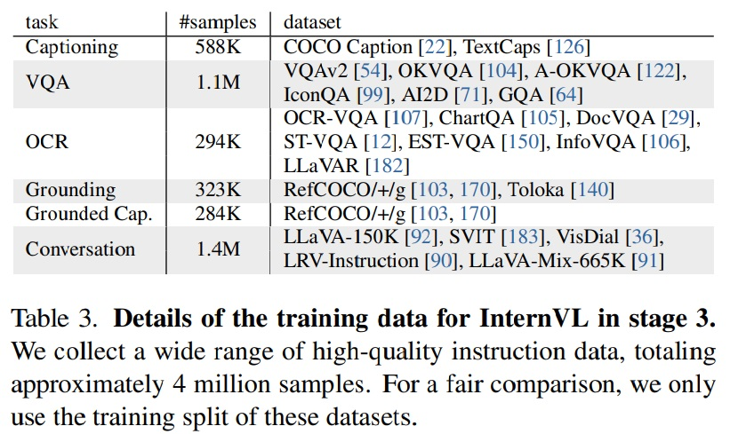  
  

## 4. Experiments
### 4.1. Implementation Details
 - **Stage 1.** InternViT-6B는 임의로 초기화되고, LLaMA-7B는 사전 학습된 가중치로 초기화된다. 모든 파라미터는 완전히 학습 가능하다.
 - **Stage 2.** InternViT-6B와 QLLaMA는 첫 번째 단계에서 가중치를 상속받고, QLLaMA의 새로운 학습 가능한 쿼리와 크로스-어텐션 레이어는 임의로 초기화된다.
 - **Stage 3.** 두 가지 다른 구성이 사용된다. 하나는 InternViT-6B를 별도로 사용하고(Fig 4(c)), 다른 하나는 전체 InternVL 모델을 동시에 사용한다(Fig 4(d)).

### 4.2. Visual Perception Benchmarks
 - **Transfer to Image Classification.**
   - ImageNet-1K 데이터셋을 사용하여 InternViT-6B의 시각적 표현 품질을 평가한다.
   - 백본을 고정 상태로 선형 분류기를 학습하는 linear probing 평가한다.
   - Table 4와 같이 linear probing에서 이전 SOTA보다 더 크게 향상했다.

  

  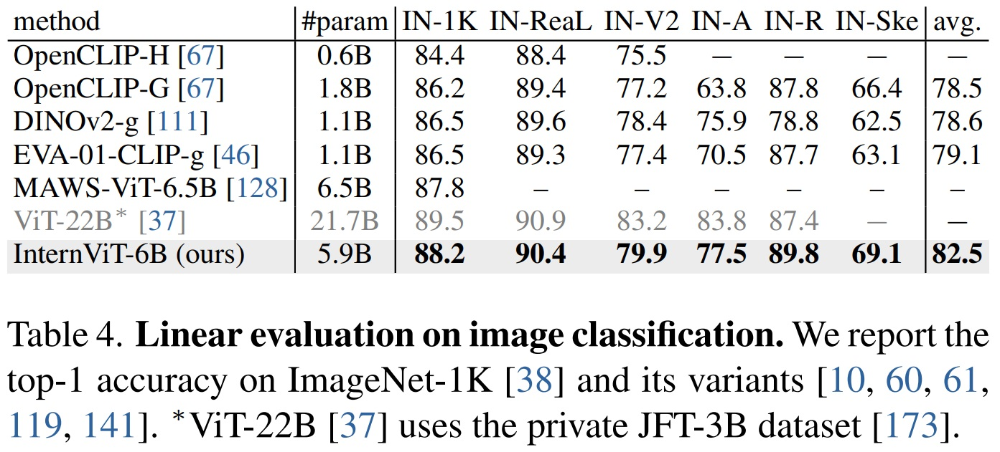  
  

 - **Transfer to Semantic Segmentation.**
   - ADE20K 데이터셋에서 InternViT-6B의 픽셀 수준 인식 능력을 평가한다.
   - Table 5a와 같이 InternViT-6B는 다섯 가지 실험에서 ViT-22B을 능가했다.
   - Table 5b와 같이 linear probing, 헤드 튜닝, 전체 매개변수 튜닝을 포함한 세 가지 다른 설정에서 추가 검증을 진행했다.

  

  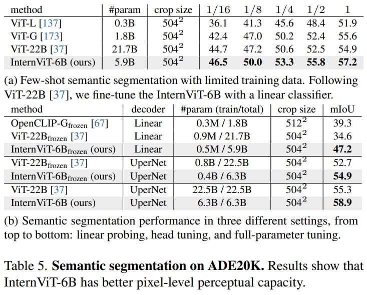  
  

### 4.3. Vision-Language Benchmarks
 - **Zero-Shot Image Classification.**
   -  Table 6a와 같이 InternVL-C는 다양한 ImageNet 변형 및 ObjectNet에서 선도적인 성능을 보인다.
   - Table 6b와 같이 다국어 ImageNet-1K 벤치마크에서 뛰어난 성능을 보인다.

  

  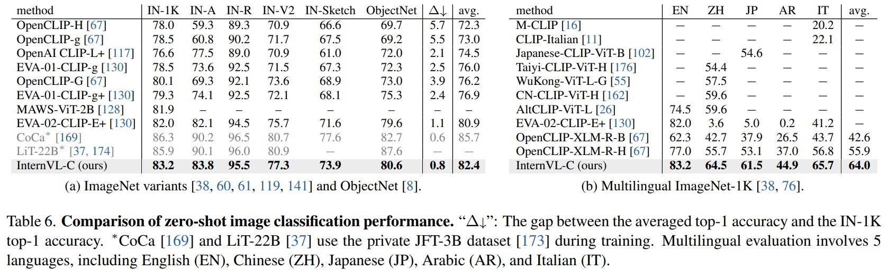  
  

 - **Zero-Shot Video Classification.**
   - Table 8과 같이 Kinetics-400/600/700 데이터셋에서 top-1 정확도 및 top-1과 top-5의 평균 정확도를 보고한다.
   - 웹 큐모의 비디오 데이터로 학습한 ViCLIP보다 뛰어난 성능을 보인다.

  

  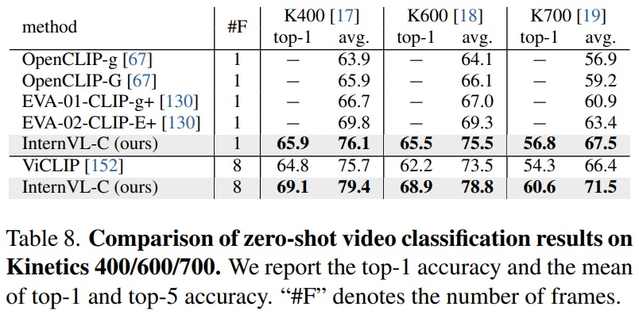  
  

 - **Zero-Shot Image-Text Retrieval.**
   - InternVL은 뛰어난 다국어 이미지-텍스트 retrieval 성능을 보인다.
   - Table 7과 같이 영어로 Flickr30K와 COCO데이터셋을, 중국어로 Flickr30K-CN과 COCO-CN를 사용하여 이 능력을 평가한다.
   - Retreival 작업에서의 개선은 시각적 및 언어적 특징 사이의 효과적인 정렬을 통해 얻어지고, 언어 미들웨어–QLLaMA를 사용하여 추가 이미지 인코딩을 통해 이루어진다.
   
  

  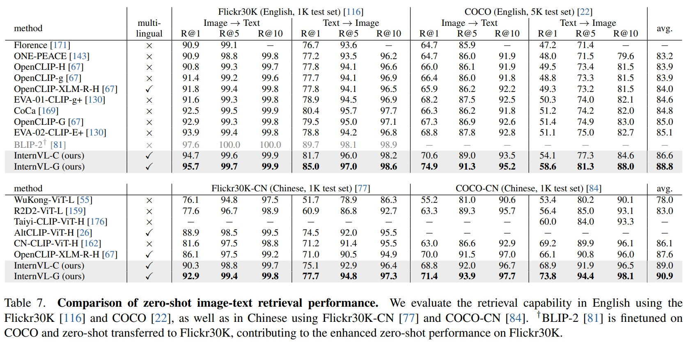  
  

 - **Zero-Shot Image Captioning.**
   - Table 10과 같이 QLLaMA는 COCO Karpathy 테스트 세트에서 다른 모델을 능가하는 제로샷 성능을 보인다.
   - Table 9와 같이 InternVL이 LLM(ex. Vicuna-7B/13B)과 연결되어 SFT에 적용될 때, Flickr30K와 NoCaps 모두에서 제로샷 성능이 향상된다.

  

  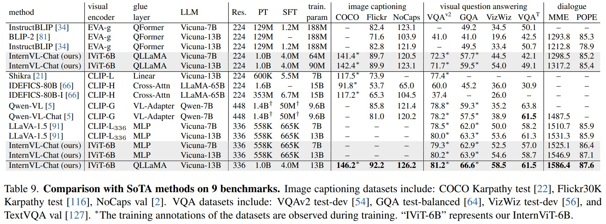  
  
 
  

  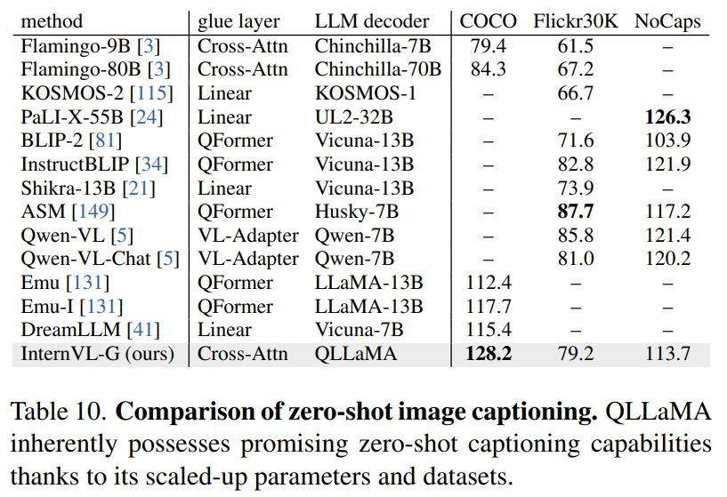  
  

### 4.4. Multi-Modal Dialogue Benchmarks
 - InternVL-Chat 모델은 MME 및 POPE 같은 두 가지 주요 다중 모달 대화 벤치마크에서 우수한 성능을 보인다.
 - MME(**M**LL**M** **E**valuationbenchmark)는 모델의 인식 및 인지 능력에 초점을 맞춘 14개의 하위 과제를 포함하는 포괄적인 벤치마크이다.
 -  POPE(Polling-based Object Probing Evaluation)는 객체 환각을 평가하는 데 사용되는 인기 있는 데이터셋이다.

### 4.5. Ablation Study
 - **Hyperparameters of InternViT-6B.**
   - Model depth {32, 48,64, 80}, head dimension {64, 128}, and MLP ratio {4,8}에 따라 16개 모델을 생성했다.
   - 정확도, 추론 속도 및 학습 안정성을 위해 최종 InternViT-6B를 선정했다. 
 - **Consistency of Feature Representation.**
   - InternVL과 기존 LLM 간의 특징 표현 일관성을 검증한다.
   - Table 12와 같이 QLLaMA를 “glue layer”로 사용할 때 모든 세 가지 작업(dialogue, caption, visual question answering)에서 성능이 크게 향상되었다.

 

 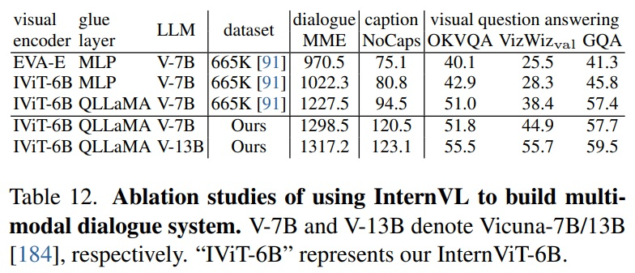  
 

## 5. Conclusion
 - 본 논문에서는 대규모 비전-언어 기반 모델인 InternVL을 제시한다.
 - 이 모델은 비전 기반 모델을 60억 매개변수로 확장하고, 일반적인 시각-언어 작업에 맞게 조정된다.
 - 대규모 비전 기반 모델 InternViT-6B를 설계하고, 이를 LLM으로 초기화된 언어 미들웨어 QLLaMA와 점진적으로 정렬한다.
 - 이 모델은 비전 기반 모델과 LLM 사이의 격차를 해소한다.
 - 이미지/비디오 분류, 이미지/비디오-텍스트 검색, 이미지 캡셔닝, 시각 질문 응답, 멀티모달 대화 등 다양한 일반적인 시각-언어 작업에서 뛰어난 성능을 보인다.

## Supplementary Materials
### A.1. More Experiments
 - **Zero-Shot Image Classification on 20 Datasets.**
   - Table 16과 같이 InternVL은 20개 벤치마크에서 평균 78.1% 성능을 보인다.
     

     
Table 16 펼치기/접기

     

     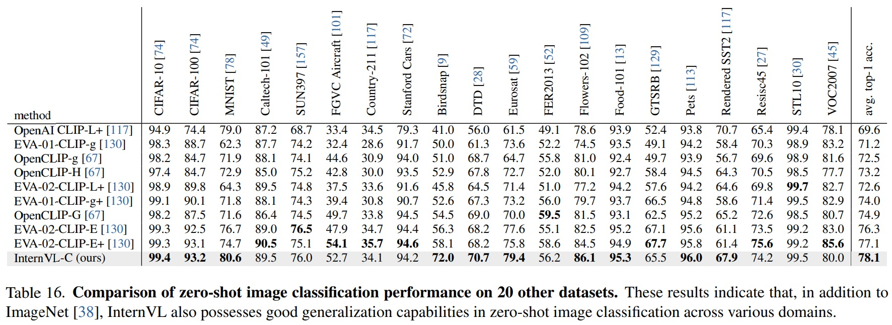 
     

     
 
 - **Zero-Shot Image-Text Retrieval on XTD.**
   - Table 13과 같이 8개 국어가 포함된 다국어 이미지-텍스트 검색 데이터셋 XTD에서 InternVL-C가 평균 recall@10 95.1%에 달하고, InternVL-G는 평균 성능 96.9% 성능을 보인다.
     

     
Table 13 펼치기/접기

     

      
     

     
 
 - **Zero-Shot Video Retrieval.**
   - Table 14와 같이 InternVL 모델은 MSR-VTT 데이터셋에서 제로-샷 비디오-텍스트 검색에서 일관된 개선을 보여준다.
   - InternVL-G는 다중 프레임 구성에서 InternVL-C보다 높은 성능을 보인다.
     

     
Table 14 펼치기/접기

     

     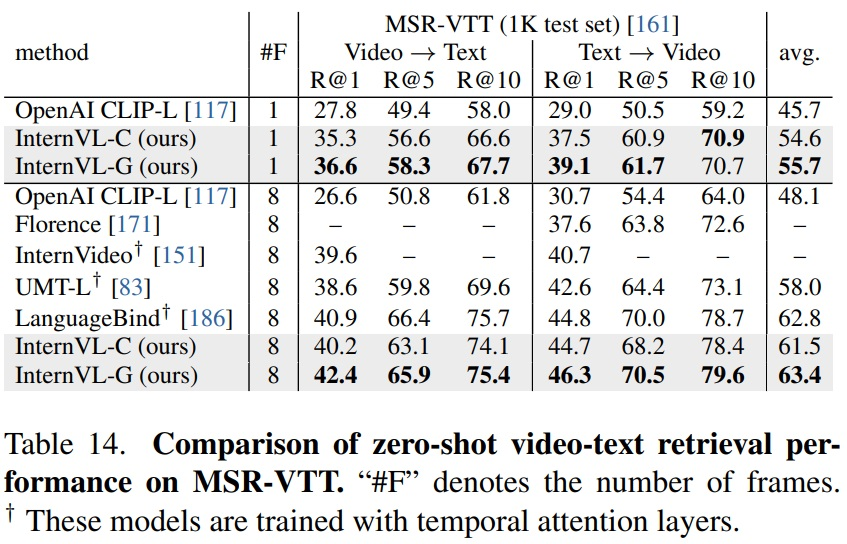 
     

     
 
 - **Fine-tuned Image-Text Retrieval.**
   - Table 15에서 InternVL은 영어 및 중국어 버전의 Flickr30K 데이터셋에서 경쟁력 있는 이미지-텍스트 검색 성능을 보여준다.
   - 미세 조정을 위한 구체적인 하이퍼파라미터는 Table 21에 나와 있다. 
   - InternVL-G-FT는 두 데이터셋 모두에서 InternVL-C-FT를 소폭 능가한다.
     

     
Table 15 펼치기/접기

     

     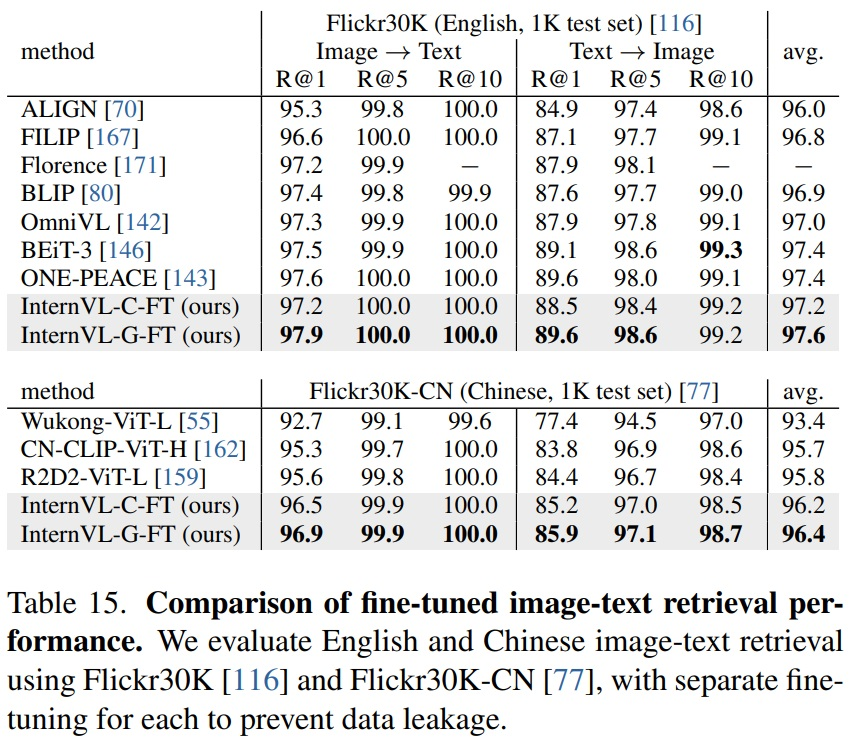 
     
 
     

     

     
Table 21 펼치기/접기

     

     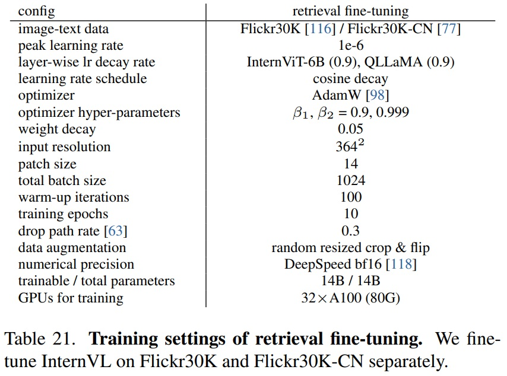 
     

     
 
 - **Tiny LVLM.**
   - Tiny LVLM은 멀티모달 대화 모델의 성능을 평가하기 위한 벤치마크이다.
   - Table 17에서 InternVL은 시각 인식, 시각 지식 획득, 시각 추론, 시각 상식, 객체 환각 등 다양한 범주에서 우수한 성능을 보여준다.
     

     
Table 17 펼치기/접기

     

     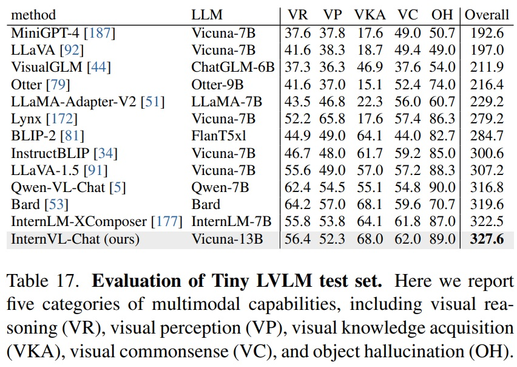 
     

     

### A.2. More Ablation Studies
 - **Compatibility with Other LLM.**
   - InternVL은 Vicuna 외의 다른 LLM과 호환성을 테스트한다.
   - Table 18과 같이 InternLM-7B는 Vicuna-7B 보다 약간 더 나은 성능을 달성한다.
   - InternVL이 다양한 LLM과 유망한 호환성을 보유한다는 것을 뜻한다.
     

     
Table 18 펼치기/접기

     

     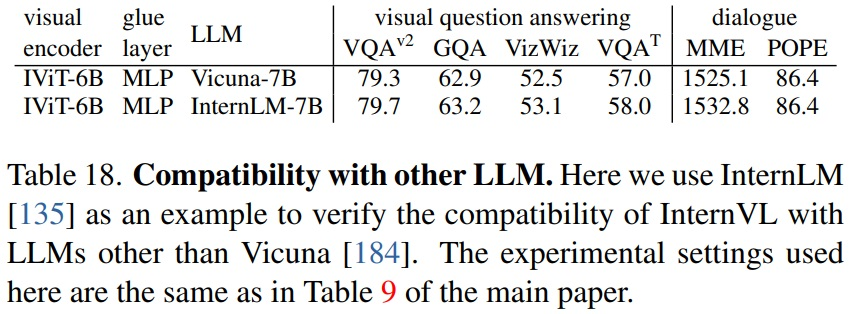 
     

     

 - **Efficiency Analysis.**
   - 이미지-텍스트 쌍의 인코딩에 대한 InternVL의 계산 효율성을 분석한다.
   - 인코딩 과정은 이미지 인코딩과 텍스트 인코딩 두 부분으로 구성된다.
   - Table 19의 결과를 토대로 InternVL-C와 InternVL-G는 세 가지 다른 이미지 크기(224, 336, 448)에서 성능을 분석한다.
   - 분석 결과(1): 이미지 크기가 증가함에 따라 인코딩 시간도 증가하고 프레임 속도가 감소한다.
   - 분석 결과(2): InternVL-G는 QLLaMA 도입으로 인코딩 시간이 약간 증가하지만, 모든 이미지 크기에서 합리적인 프레임 속도를 유지한다.
   - 분석 결과(3): 텍스트 인코더를 확장하더라도 텍스트 인코딩의 추가 비용은 크지 않다.
   - 모델 양자화 및 TensorRT 사용과 같은 추가 최적화가 가능하다.
     

     
Table 19 펼치기/접기

     

     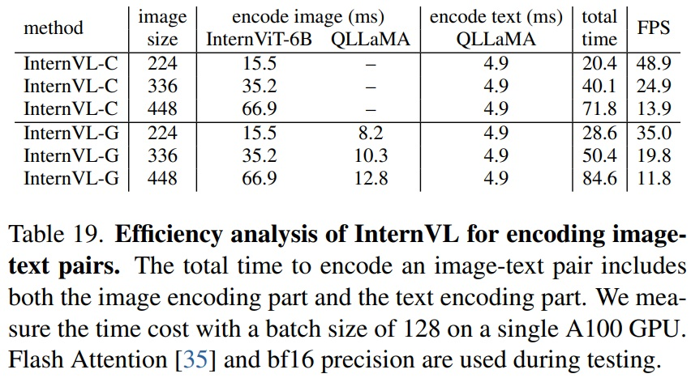 
     

     

### A.3. Detailed Training Settings
 - **Settings of Stage 1.**
   - Table 20과 같이 이미지 인코더 InternViT-6B는 BEiT의 초기화 방법을 사용하여 무작위로 초기화된다.
   - 텍스트 인코더 LLaMA-7B는 사전 학습된 가중치로 초기화된다.
   - AdamW 최적화기를 사용하며, β1 = 0.9, β2 = 0.95, weight decay는 0.1이다.
   - 코사인 학습률 일정을 적용하며, 이미지 및 텍스트 인코더의 시작 학습률은 각각 1e-3 및 1e-4이다.
   - 0.2의 drop path rate을 적용하며, 640개의 A100 GPU에서 총 164K의 배치 크기로 175K 반복을 진행한다.
   - 196×196 해상도로 시작하여 이미지 토큰의 50%를 마스킹하며 나중에 최종 5억 개 샘플에 대해 마스킹 없이 224×224 해상도로 전환한다.
     

     
Table 20 펼치기/접기

     

     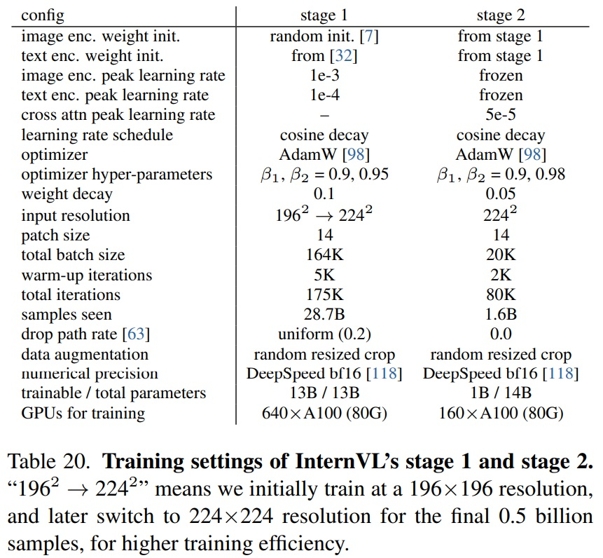 
     

     

 - **Settings of Stage 2.**
   - InternViT-6B와 QLLaMA는 첫 번째 단계에서의 가중치를 상속받는다.
   - QLLaMA 내 학습 가능한 쿼리와 cross-attention layers은 무작위로 초기화된다.
   - 이미지 입력은 224×224 해상도로 처리된다.
   - AdamW 최적화기를 사용하며, β1 = 0.9, β2 = 0.98, weight decay는 0.05이다.
   - 160개의 A100 GPU에서 총 20K의 배치 크기로 80K 단계를 진행한다.
   - 학습은 2K의 워밍업 단계를 포함하며, 5e-5의 피크 학습률로 코사인 학습률 일정에 따라 관리된다.
 - **Settings of Stage 3.**
   - InternViT-6B를 별도로 사용하거나 전체 InternVL 모델을 동시에 사용하는 두 가지 구성이 있다.
      - **(1) InternVL-Chat (w/o QLLaMA):** LLaVA-1.5의 학습 레시피를 따르며, LGS-558K 데이터셋으로 MLP 레이어를 학습 후 LLaVA-Mix-665K 데이터셋으로 LLM을 한 에폭 동안 학습한다.
     - **(2) InternVL-Chat (w/ QLLaMA):** 사용자 정의 SFT 데이터셋으로 MLP 레이어를 학습하고 LLM을 미세 조정한다. 데이터셋 확장으로 인해 배치 크기를 512로 증가시켰다.
 - **Settings of Retrieval Fine-tuning.**
   - 상세 학습 설정은 Table 21과 같다.
   - InternVL의 모든 매개변수는 학습 가능하다.
   - Flickr30K 및 Flickr30K-CN에서 별도로 미세 조정을 수행한다.
   - 364×364 해상도로 미세 조정하며, 과적합을 피하기 위해 계층별 learning rate decay 와 drop path rate을 적용한다.
   - AdamW 최적화기를 사용하여 총 1024의 배치 크기로 10 에폭 동안 미세 조정한다.
     

     
Table 21 펼치기/접기

     

      
     

     

 - **Settings of ImageNet Linear Probing.**
   - 학습 세부 사항은 Table 22과 같다.
   - linear probing을 위해 추가적인 BatchNorm을 사용하여 사전 학습된 백본 특징을 정규화한다.
   - averagepooled patch token 특징과 클래스 토큰을 연결한다.
   - 선형 헤드는 SGD 최적화기를 사용하여 ImageNet-1K에서 10 에폭 동안 학습한다.
   - 총 배치 크기는 1024, 피크 학습률은 0.2, 1 에폭 워밍업, weight decay 없이 진행된다.
   - 데이터 증강은 무작위 크기 조정-자르기 및 뒤집기를 포함한다.
     

     
Table 22 펼치기/접기

     

      
     

     

 - **Settings of ADE20K Semantic Segmentation.**
   - Table 23에서는 linear probing, head tuning, full-parameter tuning을 포함한 세 가지 다른 구성의 하이퍼파라미터를 나열한다.
     

     
Table 23 펼치기/접기

     

     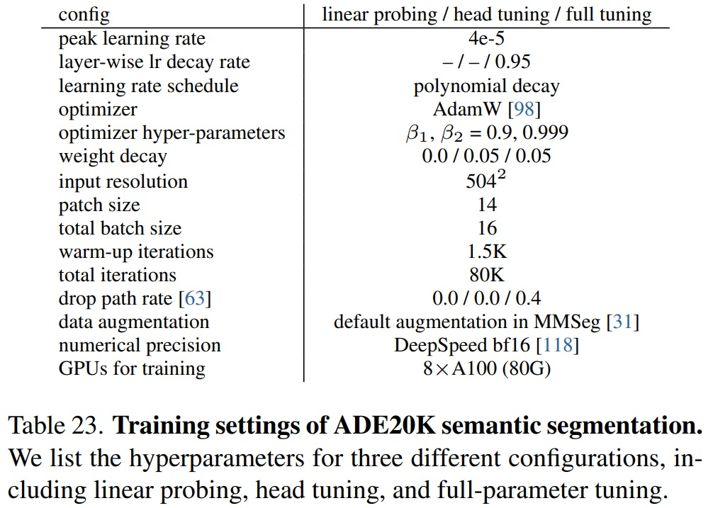 
     

     

### A.4. Data Preparation for Pre-training
 - **Training Data for Stage 1 & Stage 2.**
   - Stage 1과 Stage 2에서는 LAION-en [120], LAION-multi [120], LAION-COCO [121], COYO [14], Wukong [55] 등 대규모 이미지-텍스트 쌍 데이터를 사용한다(Fig 5 (a)).
 - **Training Data Cleaning for Stage 1 & Stage 2.**
   - 웹 규모의 이미지-텍스트 데이터를 최대한 활용하기 위해 Stage 1과 Stage 2에서 다른 데이터 필터링 전략을 채택한다.
   - (1) Stage 1
     - Minor data filtering만 적용하여 대부분의 데이터를 유지했다.
     - CLIP 유사성, 워터마크 확률, 안전하지 않은 확률, aesthetic 점수, 이미지 해상도, 캡션 길이 등 여섯 가지 요인을 고려하여 극단적인 데이터 포인트를 제거하고 학습 안정성을 방해하지 않도록 했다.
     - 제로샷 평가의 신뢰성을 보장하기 위해 ImageNet-1K/22K, Flickr30K, COCO와 중복되는 데이터를 제거했다. 
     - Stage 1에서 유지된 데이터 총량은 4.98억 개였다.
   - (2) Stage 2
     - stringent data filtering 전략을 구현하여 저품질 데이터의 대부분을 삭제한다.
     - 길이, 완성도, 가독성을 주로 고려했고, 의미 없는 텍스트, 공격적 언어, 플레이스홀더 텍스트 또는 소스 코드가 포함되어 있는지 여부를 검토했다. 
     - 최종적으로 Stage 2에서는 1.03억 개 데이터만 유지했다.
 - **Testing Datasets for Image Classification.**
   - 이미지 분류 작업에 대한 광범위한 검증을 수행한다(Fig 5 (b)).
 - **Testing Datasets for Video Classification.**
   - 비디오 분류 능력을 평가하기 위해 Kinetics 400, Kinetics 600, Kinetics 700 데이터셋을 사용한다(Fig 5 (c)).
 - **Testing Datasets for Image-Text Retrieval.**
   - 다섯 개의 데이터셋을 사용(Fig 5 (d))하여 InternVL의 제로샷, 다국어 이미지-텍스트 검색 능력을 평가한다.
 - **Testing Dataset for Video-Text Retrieval.**
   - MSR-VTT 데이터셋을 사용(Fig 5 (e))하여 InternVL의 제로샷 비디오-텍스트 검색 능력을 평가한다.
 - **Testing Dataset for Image Captioning.**
   - 세 개의 이미지 캡셔닝 데이터셋을 사용(Fig 5 (f))하여 InternVL 모델을 테스트한다.
 - **Testing Dataset for Semantic Segmentation.**
   - ADE20K 데이터셋을 사용(Fig 5 (g))하여 InternViT-6B의 픽셀 수준 인식 능력을 연구한다.
  

  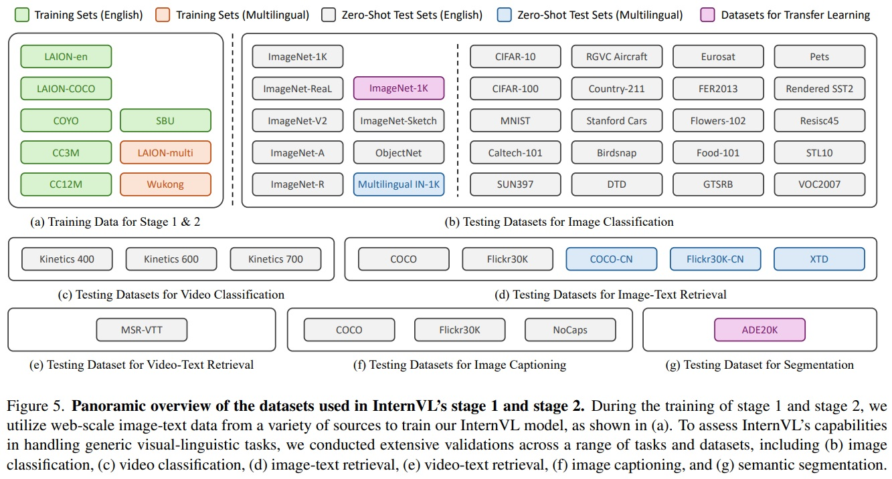 
  

### A.5. Data Preparation for SFT
 - **Training Data for SFT.**
   - 다양한 고품질 지시 데이터를 수집한다.
   - 비대화 데이터셋의 경우, 변환을 위해 [Haotian Liu et al.](https://arxiv.org/abs/2310.03744)에 설명된 방법을 따른다.
 - **Testing Datasets for SFT.**
   - 이미지 캡셔닝, 시각 질문 응답, 멀티모달 대화를 포함한 세 가지 작업에서 감독된 미세 조정된 InternVL-Chat 모델의 효과성을 검증한다.
   - 대부분의 데이터셋에서 LLaVA-1.5에 사용된 것과 동일한 응답 형식 프롬프트를 사용한다.