*비전 언어 사전 학습은 대량의 데이터로부터 비전과 언어 간의 정렬을 학습하는 것을 목표로 한다. 기존의 대부분의 방법들은 이미지-텍스트 정렬만을 학습하지만, 일부 다른 방법들은 사전 학습된 객체 감지기를 활용하여 객체 수준에서 비전 언어 정렬을 활용한다. 본 논문에서는 다중 정밀도 비전 언어 정렬을 통합 사전 학습 프레임워크를 통해 동시에 다중 정밀도 정렬 및 다중 정밀도 위치 결정을 학습하는 것을 제안한다. 이를 바탕으로 이미지-텍스트 사전 학습과 비디오-텍스트 사전 학습을 하나의 모델에서 통합하는 유연한 모듈식 아키텍처를 가진 X2-VLM이라는 모든 것을 포함하는 모델을 제시한다. X2-VLM은 다양한 텍스트 설명과 연관된 무한한 시각적 개념을 학습할 수 있다. 실험 결과에 따르면 X2-VLM은 이미지-텍스트 및 비디오-텍스트 작업 모두에서 기본 및 대규모 규모에서 최고의 성능을 보여주며, 성능과 모델 규모 사이에서 좋은 절충을 이룬다. 또한, X2-VLM의 모듈식 설계는 어떤 언어나 도메인에서도 활용될 수 있도록 높은 전이성을 제공한다. 예를 들어 텍스트 인코더를 XLM-R로 간단히 교체함으로써, X2-VLM은 어떠한 다국어 사전 학습 없이도 최신의 다국어 다중 모달 사전 학습 모델들을 능가한다. 코드와 사전 학습된 모델은 [github.com/zengyan-97/X2-VLM](https://github.com/zengyan-97/X2-VLM){:target="_blank"}에서 이용 가능하다.*

## 📋 Table of Contents

- [1. Introduction](#1-introduction)
- [2. Related Work](#2-related-work)
- [3. Method](#3-method)
- [4. Experiment](#4-experiment)
- [5. Conclusion and Discussion](#5-conclusion-and-discussion)
- [A Appendix](#a-appendix)

## 1. Introduction
 - 비전 언어 사전 학습(Vision language pre-training)은 다수의 이미지-텍스트 또는 비디오-텍스트 쌍에서 비전 언어 정렬을 학습하는 것을 목표로 한다.
 - 기존 연구의 접근법은 크게 Coarse-grained와 Fine-grained로 구분된다.
 - Coarse-grained 접근법은 전체 이미지 특징을 인코딩하는 데 사용되지만, 세부적인 시각-언어 정렬 학습에 어려움이 있다.
 - Fine-grained 접근법은 이미지 인코더로 사전 학습된 객체 탐지기를 사용하여 미세한 정렬을 학습하지만, 다수의 객체 간 관계를 인코딩할 수 없고 제한된 수의 객체 클래스만 인식할 수 있다.
 - multi-grained alignments 학습의 챌린지
   - 1) multi-grained 정렬을 학습할 데이터 유형
   - 2) 다양한 데이터 유형을 통합적으로 집계하는 방법
   - 3) multi-grained 시각적 개념을 단일 비전 인코더로 표현하는 방법
   - 4) 데이터에서 효율적으로 multi-grained 비전 언어 정렬을 학습하는 방법
 - 본 논문에서는 모든 비전 언어 작업에 대해 동시에 multi-grained 정렬을 학습할 수 있는 통합 프레임워크로 사전 학습된 all-in-one VLM. 즉, X2-VLM을 제안한다.
 - 이를 위해 이미지에 대한 객체 레이블(ex. “남자” 또는 “배낭”), 이미지에 대한 영역 레이블(ex. “배낭을 메고 있는 소년”), 이미지에 대한 텍스트 설명(ex. “학교 첫날은 학생과 부모 모두에게 복합적인 감정을 준다”) 등 세 가지 유형의 데이터를 사용한다.
 - 모델은 시각적 개념을 클래스 라벨 대신 다양한 텍스트로 설명된 무한한 시각적 개념을 통합된 방식으로 학습할 수 있다.
 - X2-VLM의 모듈러 구조는 비전, 텍스트, 융합의 세 가지 모듈로 구성되며, 모두 트랜스포머 기반으로 되어 있다.
 - 비전 트랜스포머를 사용하여 이미지를 인코딩하고, 패치 기능을 사용하여 이미지 내의 multi-grained 시각적 개념을 표현한다.
 - 비디오-텍스트 사전 학습 확장 가능성이 있다.
 - 비디오 프레임 샘플링 및 비전 트랜스포머로 각 프레임을 인코딩하여 모델이 시간적 차원에서의 시각적 개념 이해 및 다양한 VLM 학습을 지원한다.
 - 영어 데이터에 대한 비전 언어 사전 학습 후 다른 언어/도메인 특정 텍스트 모듈(XLM-R)로 교체 가능한 모듈식 구조 유연성을 갖는다.
 - 다국어 비전-언어 작업에서 최고 성능 방법을 능가한다.
 - X2-VLM의 효과성 검증을 위한 실험 수행했고, 이미지 캡션 생성, 교차 모달 이해 작업에서 우수한 성능을 갖는다.
 - Fig 1 (a)와 같이 X2-VLM은 성능과 모델 크기 사이에서 좋은 절충을 이루고 있다.
 - Fig 2 (b)와 같이 비디오-텍스트 검색과 비디오 VQA 두 유형의 작업에서 최신 성능을 달성한다.
 - 논문의 주요 기여도
   - multi-grained 비전 언어 정렬을 동시에 학습하고 위치시키는 통합 사전 학습 프레임워크 제안한다.
   - 이미지-텍스트 및 비디오-텍스트 작업 처리 가능한 전체 사전 학습된 VLM인 X2-VLM 제시한다.
   - 대규모 데이터 및 큰 모델 크기로 확장 가능한 프레임워크로 확인되었다.
   - 다양한 언어와 도메인에서 사용 가능한 X2-VLM의 모듈식 디자인 잠재력 드러냈다.

 

 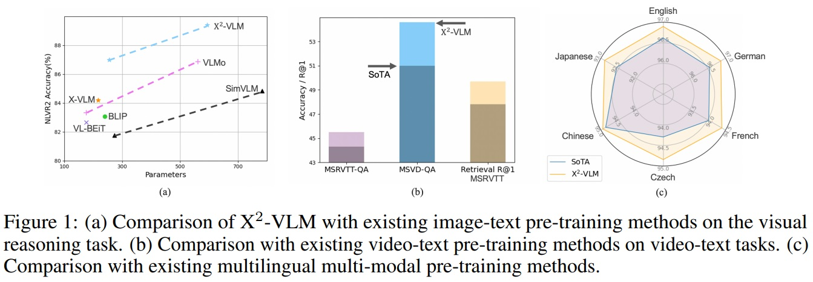
 

## 2. Related Work
### 2.1 Image-Text Pre-training
 - Fine-grained 접근 방식은 객체에 대한 레이블을 기반으로 사전 학습된 객체 탐지기를 이미지 인코더로 사용한다.
 - 객체 탐지기는 객체가 포함된 것으로 보이는 모든 영역을 식별한 후 각 영역에 대해 객체 분류를 수행한다.
 - 이미지는 식별된 영역의 수십 개의 객체 중심 특성으로 표현되며, 다양한 영역의 여러 객체 간 관계를 표현할 수 없다.
 - 객체 탐지기는 일반적인 객체만 감지할 수 있어, 실제 응용에서 다양한 시각적 개념을 인코딩하는 데 제한적이다.(ex. Pepsi와 Coca Cola 또는 Audi와 BMW 구별하기 힘듦)
 - Coarse-grained 접근 방식은 컨볼루션 네트워크나 비전 트랜스포머를 사용하여 전체 이미지 특성을 추출하고 인코딩한다.
 - 최신 비전 트랜스포머(e.g., Swin-Transformer, BEiT-2)를 사용하는 METER 및 VL-BEiT와 같은 최근 방법은 가장 강력한 fine-grained을 능가할 수 있다.
 - 일부 방법들은 객체 수준과 이미지 수준의 정렬을 모두 학습하려고 시도한다.
 - 그러나 이러한 접근 방식은 여전히 객체 탐지기에 의존하므로 앞서 언급한 문제에 직면한다.
 - 본 연구의 multi-grained 비전 언어 사전 학습 프레임워크는 객체 탐지에 의존하지 않고 객체 수준이나 이미지 수준에 제한되지 않는 통합된 방식으로 비전 언어 정렬을 학습한다.

### 2.2 Video-Text Pre-training
 - 대부분의 기존 VLM은 이미지-텍스트 작업만 다루고, 소수의 VLM만 비디오-텍스트 사전 학습을 수행한다.
 - 비디오-텍스트 모델은 여러 이미지로 구성된 비디오의 특성상 이미지-텍스트 모델과 많은 유사점을 공유한다.
 - 비디오-텍스트 사전 학습은 이미지-텍스트 사전 학습과 유사점을 공유하지만, 기존 방법은 두 유형의 작업 모두에서 최신 성능을 달성하지 못했다.
 - 대표적인 비디오-텍스트 사전 학습 작업으로는 ClipBERT, Frozen, ALPRO, VIOLET, All-in-one 등이 있다.
 - 최근에는 OmniVL이 제안되어 이미지-텍스트 작업과 비디오-텍스트 작업 모두를 지원한다.
 - OmniVL은 비디오에 대해 3D 패치 임베딩을 사용하고 이미지에 대해서는 2D 패치 임베딩을 사용하며, 비전 인코딩에 TimeSformer를 채택한다.

### 2.3 Multilingual Multi-modal Pre-training
 - 다국어 다중 모달 사전 학습(Multilingual multi-modal pre-training)은 다중 모달 모델을 비영어 텍스트에 적용할 수 있게 하려는 목표를 가진다.
 - 다국어 사전 학습(multilingual pre-training)과 다중 모달 사전 학습(multi-modal pre-training)에서 사용할 수 있는 상대적으로 많은 병렬 데이터와 달리, 다국어 다중 모달 코퍼스는 소수이며 제한된 언어 범위를 갖는다.
 - $M^3P$, $UC^2$, MURAL, CCLM 등과 같은 방법들은 추가 데이터를 필요로 한다.
 - 대조적으로 X2-VLM은 모듈식 구조의 잠재력을 활용하여 다국어 다중 모달 사전 학습 과정 없이도 다국어 V+L 작업에 적응할 수 있다.

## 3. Method
### 3.1 Overview
 - **Architecture**
   - X2-VLM은 비전, 텍스트, 다중 모달 융합 모듈(multi-modal fusion modules)로 구성된다.
   - 모든 모듈은 Transformer 기반으로 되어 있다.
   - 융합 모듈은 텍스트 특성을 입력으로 받아 각 층에서 cross-attention를 통해 비전 특성과 텍스트 특성을 융합한다.
   - 사전 학습에서 이 세 모듈은 인코더로 작동하며, 이미지 캡션 생성을 위한 실험에서 보여진 것처럼 텍스트 및 융합 모듈은 left-to-right self-attention를 적용하여 생성 작업에도 적용될 수 있다.
   - Fig 3은 X2-VLM의 구조와 multi-grained 정렬 및 위치 지정 방법을 보여준다.
   

   
Figure 3 펼치기/접기

   

   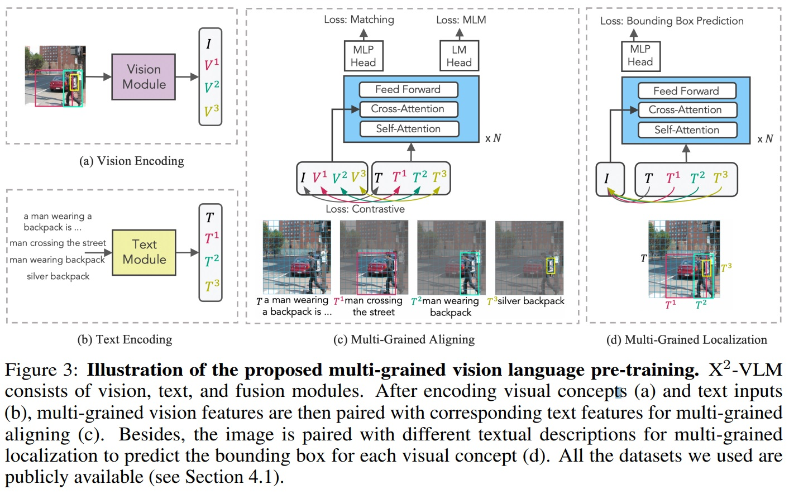 
   

   

 - **Data**
   - X2-VLM은 이미지-텍스트 쌍, 비디오-텍스트 쌍, 객체 및 영역의 이미지 주석을 포함한 모든 시각적 개념을 텍스트 설명과 연결하는 통합 접근 방식입니다.
   - 하나의 이미지는 여러 시각적 개념(visual concept)을 포함할 수 있으며, 각각은 텍스트 설명(text description)과 연관된다.
   - 시각적 개념은 객체 또는 영역의 좌표로 표현된다.
   - 텍스트 설명은 객체의 속성(ex. color)을 객체 레이블과 연결하여 만든다.
   - Table 1과 같이 일부 이미지는 관련 텍스트가 없고(T=NaN), 일부 이미지는 레이블이 없다(N=0).
   - 그럼에도 불구하고, **본 논문에서는 모든 유형의 데이터를 학습 배치에 혼합하고, 따라서 각 학습 반복에서 multi-grained 정렬 및 위치 지정을 동시에 최적화하여 모델을 최적화한다**.
   

   
Table 1 펼치기/접기

   

   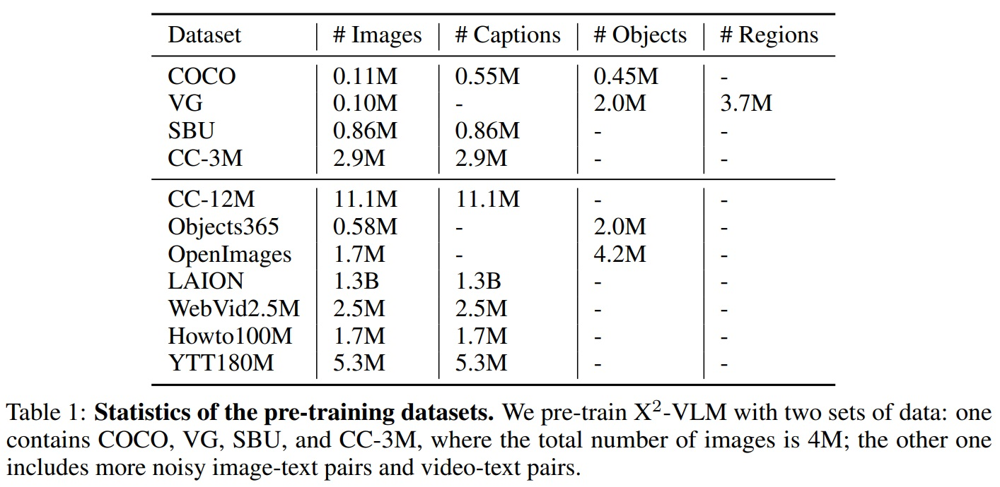 
   

   

### 3.2 Unified Vision Encoding
 - Fig 2와 같이 X2-VLM은 이미지와 비디오 인코딩을 통합한다.
 - 입력에 관계없이 비전 모듈은 비전 트랜스포머의 잠재 특성 공간에서 hidden state를 생성하여 이미지-텍스트 사전 학습과 세부적 사전 학습이 상호 강화한다.
 - **Visual Concept Representation**
   - X2-VLM은 비전 트랜스포머를 one forward pass하여 이미지 내 모든 multi-grained 시각적 개념을 효율적으로 얻는 방법을 제안한다.
   - 이미지를 패치 특성으로 처리한 후, 경계 박스에 해당하는 패치 집합을 집계하여 객체나 영역을 표현한다.
 - **Video Representation**
   - 비디오는 여러 이미지로 구성되므로, 비디오 인코딩과 이미지 인코딩을 단순하고 효율적인 방식으로 통합한다.
   - 초당 비디오 프레임을 샘플링하고 각 프레임을 패치 특성으로 인코딩한다. 그런 다음, 각 프레임의 패치 특성에 시간 정보를 추가하고 시간 차원에서 평균을 계산하여 비디오를 표현한다.
   - 비디오-텍스트 쌍과 객체/영역/이미지-텍스트 쌍 모두에 통합 사전 학습 프레임워크를 적용할 수 있다.

 

 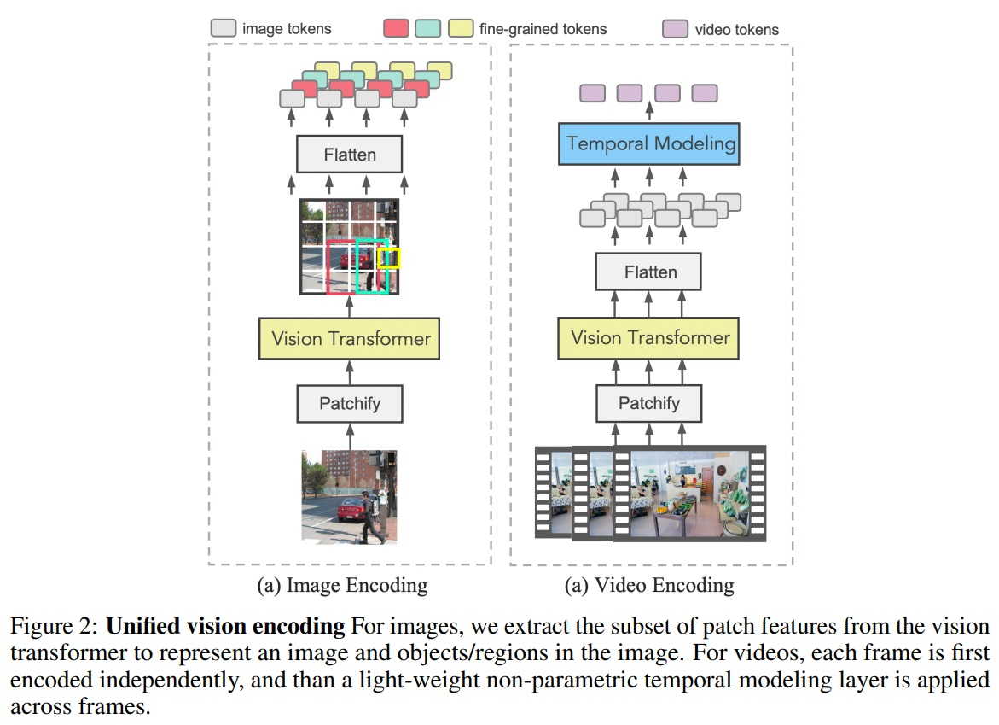
 

### 3.3 Multi-Grained Vision Language Pre-training
 - Fig 3과 같이 X2-VLM을 두가지 목표로 동시에 최적화한다.
 - 1) 시각적 개념과 텍스트 간 multi-grained 정렬 학습
 - 2) 다양한 텍스트 설명이 주어진 이미지 내에서 multi-grained 시각적 개념 위치 지정
#### 3.3.1 Multi-Grained Aligning
 - 시각적 개념(객체, 지역, 이미지, 비디오 등)과 텍스트 설명을 정렬한다.
 - 최적화를 위해 대조 손실(Contrastive Loss), 매칭 손실(Matching Loss), MLM 손실(Masked Language Modeling Loss)를 활용한다.
 - **대조 손실(Contrastive Loss)**
   - 각 미니 배치 내에서 (시각적 개념, 텍스트) 쌍을 예측한다.
   - 긍정적 예시(T)는 V에 대한 것이며, 나머지 (N-1) 텍스트들은 부정적 예시로 처리한다.
   - 시각 인코더와 텍스트 인코더의 [CLS] 임베딩 출력을 사용하여 유사도(s(V, T)) 정의한다. $s(V, T) = g_v(v_(cls))^⊤g_w(w_cls)$ (1)
   - vision-to-text 유사도와  text-to-vision 유사도를 각각 계산한다.
   - 학습 가능한 온도 매개변수(τ) 사용한다.
   - 교차 엔트로피를 사용하여 실제 유사도와 예측 유사도 간의 손실 계산한다.
   - $L_{cl} =\frac{1}{2}\mathbb{E}_{V,T∼D}[H(y^{v2t}(V),p^{v2t}(V))+H(y^{t2v}(T),p^{t2v}(T))]$
 - **매칭 손실 (Matching Loss)**
   - 시각적 개념과 텍스트 쌍이 일치하는지 판단한다.
   - 미니 배치 내에서 가장 어려운 부정적 텍스트를 샘플링한다.
   - 각 텍스트에 대해 어려운 부정적인 시각적 개념을 샘플링한다.
   - 퓨전 모듈을 통해 입력된 쌍으로부터 매칭 확률($p^match$)을 예측한다.
   - 실제 레이블과 예측된 매칭 확률 간의 손실을 계산한다.
   - $L_{match} = \mathbb{E}_{V,T∼D}H(y^{match},p^{match}(V, T))$
 - **마스크드 언어 모델링 손실 (MLM Loss)**
   - 텍스트 내 마스크된 단어를 시각적 개념에 기반하여 예측한다.
   - 텍스트의 40%를 임의로 마스킹하고, 10%는 무작위 토큰, 10%는 변경하지 않고, 80%는 [MASK]로 대체.
   - 퓨전 인코더의 출력과 선형 층을 사용하여 마스크된 토큰의 확률을 예측한다.
   - 실제 단어와 예측된 단어 간의 교차 엔트로피 손실을 최소화한다.
   - $L_{mlm} = \mathbb{E}_{tj∼T;(V,T)∼D}H(y^j,p^j(V, \widehat{T}))$

#### 3.3.2 Multi-Grained Localization
 - 다양한 multi-grained에서 시각적 개념과 텍스트를 정렬했다.
 - X2-VLM을 최적화하기 위해 이미지 내 다양한 시각적 개념을 찾도록(바운딩 박스 예측 작업) 학습했다.
 - ℓ1 손실이 가장 일반적으로 사용되지만, 박스 크기에 따라 다른 스케일을 갖는다.
 - 상대적 오류가 유사해도 작고 큰 박스의 스케일 차이를 완화하기 위해 ℓ1 손실과 일반화된 IoU(Intersection over Union) 손실의 선형 조합을 사용한다.
 - $L_{bbox} = \mathbb{E}_{(V^i,T^i)∼I;I∼D}[L_{iou}(b^i, \widehat{b}ˆi) + \vert \vert b^i − \widehat{b}ˆi \vert \vert _1]$
 - X2-VLM의 사전 학습 목표는 $L = L_{bbox} + L_{cl} + L_{match} + L_{mlm}$ 이다.

## 4. Experiment
### 4.1 Pre-training Datasets
 - X2-VLM의 사전 학습은 두 세트의 데이터로 수행된다.
 - 4M 사전 학습 데이터셋은 두 개의 도메인 내 데이터셋, COCO와 Visual Genome (VG), 그리고 두 개의 도메인 외 데이터셋, SBU Captions 및 Conceptual Captions (CC)로 구성된다.
 - COCO와 VG 이미지에 대한 주석도 포함된다.
 - 도메인 외 및 노이즈가 많은 이미지-텍스트 쌍을 포함하여 사전 학습 데이터셋을 확장한다.
 - Conceptual 12M 데이터셋 (CC-12M)과 LAION, 그리고 Objects365와 OpenImages의 객체 주석이 포함된다.
 - 비디오-텍스트 downstream task를 위해 WebVid2.5M, Howto100M, YT-Temporal 180M의 비디오-텍스트 쌍도 사전 학습에 포함된다.

### 4.2 Implementation Details
 - Table 2에는 X2-VLM의 매개변수가 나열되어 있다.
 - X2-VLMlarge는 성능과 모델 크기 사이의 절충을 고려하여 12L 텍스트 인코더를 사용한다.
 - 비전 인코더는 BEiT-2로 초기화되며, 텍스트 인코더는 BERT로 초기화된다.
 - X2-VLM은 224 × 224 이미지 해상도와 16 × 16 패치 크기에서 사전 학습된다.
 - X2-VLMbase를 500K 단계에 걸쳐 1024의 배치 크기로 8개의 A100에서 사전 학습했다.
 - 4M 데이터 학습 시간
   - X2-VLMlarge를 250K 단계에 걸쳐 16개의 A100에서 사전 학습하며, 이는 약 1주일이 소요된다. 
   - X2-VLM_base의 학습률은 처음 2500단계에서 1e−4로 워밍업되고 선형 일정을 따라 감소한다. X2-VLM_large의 학습률은 5e−5이다.
 - 대규모 데이터 학습 시간
   - X2-VLM은 베이스 모델의 경우 32개의 A100에서 2-3주 소요된다.
   - 대형 모델의 경우 64개의 A100이 소요된다.

 

 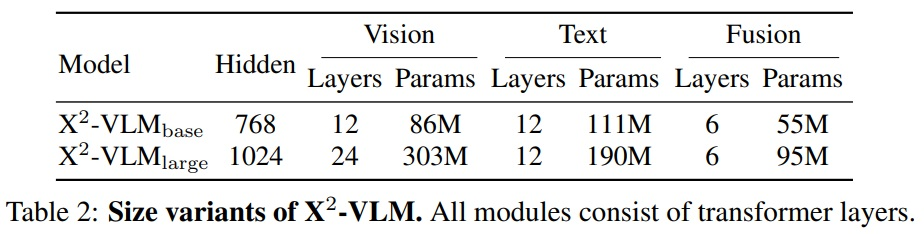 
 

### 4.3 Image-Text Downstream Tasks
#### 4.3.1 Image-Text Retrieval
 - X2-VLM은 MSCOCO 및 Flickr30K 데이터셋에서 평가되었다.
 - Karpathy 분할을 사용하며, 미세 조정을 위해 $L_cl$과 $L_match$를 최적화한다.
 - 배치 크기는 1024이며, 입력 이미지 해상도는 384x384로 설정한다.
 - 이미지와 텍스트를 별도로 인코딩하고 배치 내 text-to-image 및  imageto-text 유사성을 계산하여 top-k(MSCOCO는 80, Flickr30K는 32) 후보를 얻은 다음, fusion encoder를 사용하여 후보를 재순위한다.
 - Table 3에 따르면, X2-VLM은 이미지-텍스트 검색 작업에서 특히 Flickr30K 벤치마크에서 SoTA 결과를 달성한다.
 - Table 4에 따르면, X2-VLM_large는 BEiT-3과 비교하여 훨씬 작지만 비슷하거나 더 나은 성능을 보인다.
 - Multi-grained vision language pre-training을 위한 제안된 프레임워크는 더 큰 모델 크기와 대규모 도메인 외 이미지-텍스트 쌍에서 이점을 얻을 수 있는 좋은 확장성을 가지고 있음을 볼 수 있다.

 

 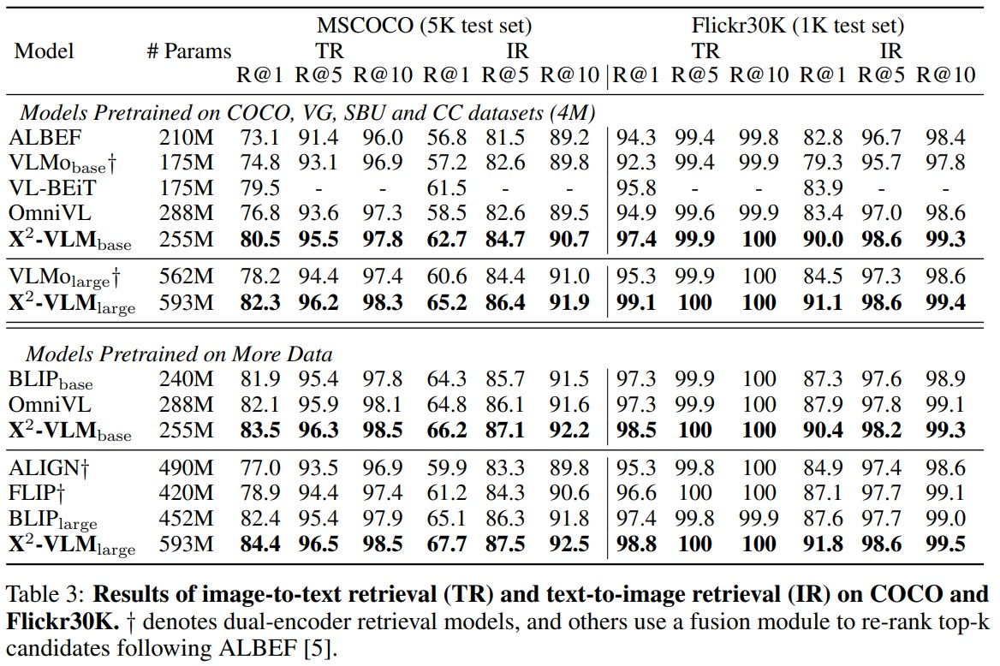  
    
 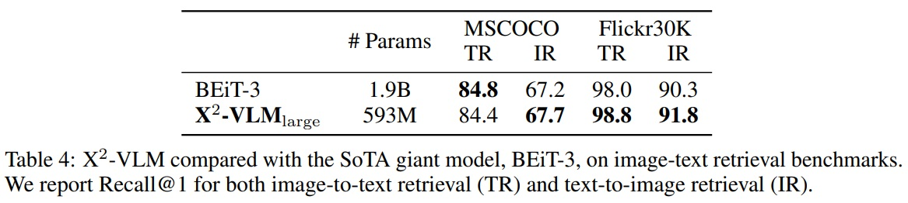  
 

#### 4.3.2 Visual Question Answering
 - 이 작업은 모델이 이미지와 질문이 주어졌을 때 답변을 예측해야 한다.
 - VQA v2.0 데이터셋에서 모델을 평가하며, Visual Genome의 추가 질문-답변 쌍을 포함한다.
 - fusion module의 출력을 기반으로 하는 six-layer 트랜스포머 디코더를 사용한다.
 - Auto-regressive 손실을 최적화하여 미세 조정하고, NULL 답변 제외하여 후보 답변을 3,128개만 생성하도록 제안하며, 입력 이미지의 해상도는 768*768로 설정한다.
 - Table 5에 따르면, X2-VLM_base와 X2-VLM_large는 유사한 규모의 다른 접근법을 능가한다.
 - X2-VLM_base는 ALBEF, VLMo, METER, VL-BEiT, BLIP, OmniVL을 능가한다.
 - X2-VLM은 base 및 large 규모에서 SimVLM과 OFA를 상당히 능가한다.

 

 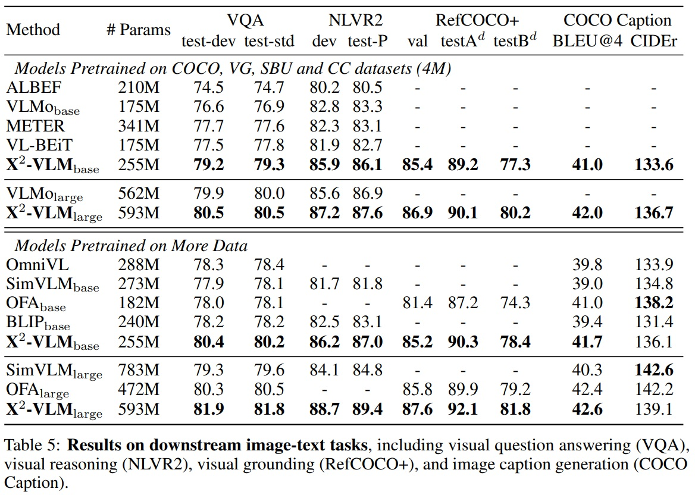  
 

#### 4.3.3 Visual Reasoning
 - 이 작업은 모델이 두 이미지 간 관계를 설명하는 텍스트가 있는지 판단해야 한다.
 - NLVR2 벤치마크에서 모델을 평가한다.
 - 두 이미지-텍스트 쌍으로 구성하여 두 쌍의 fusion module의 최종 출력 [CLS] 특성을 연결하여 레이블을 예측한다.
 - 입력 이미지의 해상도는 384x384로 설정한다.
 - Table 5에 따르면, 시각적 추론 작업은 모델 크기에서 더 큰 이점을 얻는다.
 - X2-VLM_base는 ALBEF, VLMo, VL-BEiT, SimVLM, BLIP 등 다른 베이스 규모 모델보다 더 나은 성능을 보인다.
 - X2-VLM_large는 VLMo_large와 SimVLM_large 모델들을 능가한다.

#### 4.3.4 Visual Grounding
 - 이 작업은 이미지를 입력으로, 텍스트 설명을 쿼리로 사용하여 시각적 개념의 바운딩 박스를 예측해야 한다.
 - RefCOCO+에서 모델을 평가한다.
 - 입력 이미지의 해상도는 384x384로 설정한다.
 - Table 5에 따르면, X2-VLM은 OFAdhk MDETR를 능가한다.

#### 4.3.5 Image Captioning
 - 이 작업은 모델이 입력 이미지의 텍스트 설명을 생성해야 한다.
 - COCO Captioning 데이터셋에서 평가되며, 왼쪽에서 오른쪽으로 MLM 생성을 사용한다.
 - 텍스트 모듈과 Fusion 모듈을 left-to-right self-attention를 가진 디코더로 사용한다.
 - 입력 이미지의 해상도는 480x480으로 설정한다.
 - Karparth 테스트 분할에서 BLEU-4와 CIDEr 점수를 이용한다.
 - Table 5에 따르면, X2-VLM_base는 BLIP, SimVLM, OFA을 능가한다.

#### 4.3.6 Winoground
 - 이 작업은 두 이미지와 두 캡션을 올바르게 매칭해야 한다.
 - 세 가지 지표(텍스트, 이미지, 그룹)를 사용하여 성능을 평가한다.
 - Table 6에 따르면, X2-VLM은 4M 데이터로 학습될 때 UNITER_large, ViT, BLIP-2 보다 뛰어났다.

 

 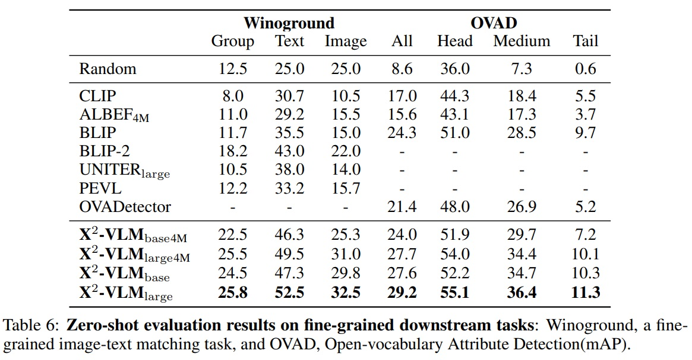  
 

#### 4.3.7 Open-vocabulary Attribute Detection(OVAD)
 - 이 작업은 이미지에서 오픈 세트의 객체와 각 객체의 속성을 인식해야 한다.
 - 벤치마크를 따라 박스 오라클 설정에서 비전 언어 모델의 제로샷 성능을 속성에 대해 평가한다.
 - Table 6에 따르면, X2-VLM_base는 4M 데이터셋으로 사전 학습되었음에도 BLIP와 비슷한 성능을 보인다.
 - X2-VLM_base는 OVADetector(CLIP+Faster-RCNN)를 능가한다.

### 4.4 Video-Text Downstream Tasks
 - X2-VLM은 이미지-텍스트 및 비디오-텍스트 사전 학습을 통합한다.
 - X2-VLM은 비디오-텍스트 검색(MSRVTT)과 비디오 질문 응답(MSRVTT-QA 및 MSVD-QA)을 포함한 세 가지 널리 사용되는 비디오-텍스트 작업에서 평가된다.
 - 텍스트-비디오 검색 모델은 k를 32로 설정하여 top-k 후보를 먼저 계산한 다음 fusion module을 사용하여 후보를 재정렬한다.
 - 학습 및 추론 중에는 비디오당 다섯 프레임 샘플링하고, 이미지 해상도는 384로 설정한다.
 - 비디오 질문 응답은 비디오와 질문이 주어진 상태에서 답변을 생성해야 한다
 - 학습 및 추론 중에는 MSRVTT 데이터셋의 각 비디오에 대해 다섯 프레임, MSVD 데이터셋의 경우 여덟 프레임을 샘플링하고, MSRVTT의 이미지 해상도는 320, MSVD는 224로 설정된다.
 - Table 7에 따르면, 2-VLM_base가 이전 비디오-언어 기반 모델들을 비디오 질문 응답과 텍스트-비디오 검색 모두에서 능가하며, X2-VLM_large는 성능을 더욱 향상시켜 비디오-텍스트 사전 학습의 새로운 최고 기록을 달성한다.

 

 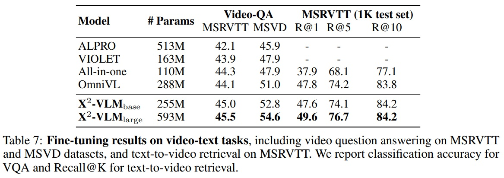  
 

### 4.5 Multilingual Multi-modal Tasks
 - X2-VLM 아키텍처는 텍스트 인코딩, 비전 인코딩, 융합이 분리되어 있다. 
 - 따라서 텍스트 인코더를 교체하더라도 비전 인코딩 및 융합 능력은 유지되며, 새로운 텍스트 인코더의 효율적인 적응이 가능하다.
 -  영어 데이터로 사전 학습한 후, 특정 언어 또는 도메인에 맞는 텍스트 인코더로 교체하여 다양한 언어나 도메인에서의 응용을 지원한다(OFA나 BEiT-3에서는 불가).
 - X2-VLM의 영어 텍스트 인코더를 다국어 텍스트 인코더 XLM-R로 교체를 시도한다. 
 - 텍스트 인코더 교체 후 다국어 다중 모달 사전 학습 단계 없이 다국어 다중 모달 downstream task에서 X2-VLM을 단순히 미세 조정한다.
 - Multi30K와 다국어 MSCOCO를 평가에 사용한다
 - 평가 방법은 이미지-텍스트 검색과 텍스트-이미지 검색에서 평균 Recall@K를 K = 1, 5, 10으로 계산한다.
 - X2-VLM은 수집이 어려운 데이터에 의존하는 M3P, UC2, MURAL, CCLM과 같은 최신 다국어 다중 모달 사전 학습 방법을 개선한다.
 - Table 8과 같이 X2-VLM은 여섯개 언어에서 기존 방법들을 능가한다. 이 결과는 X2-VLM이 추가 사전 학습 없이 다른 텍스트 인코더를 사용하여 다른 도메인 또는 언어에 적용 가능한 잠재력을 나타낸다.

 

 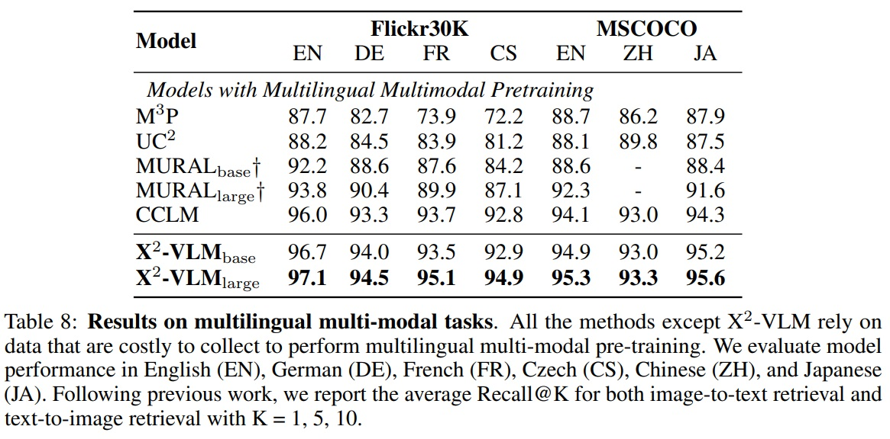  
 

### 4.6 Ablation Study
 - Table 9는 심층적인 소거 연구를 수행하고 결과를 보여준다.
 - X2-VLM에서 다양한 구성 요소의 역할을 조사한다.
   - multi-grained 정렬과 박스 예측 손실을 각각 소거한 변형을 조사한다.
   - 두 변형에서 객체와 영역 데이터 모두 사용된다.
   - 실험 결과는 모든 작업에서 박스 예측 손실보다 multi-grained 정렬이 모델 성능에 더 중요하다는 것을 보여준다.
   - 시각적 기반화 작업에서는 박스 예측 손실이 성능에 중요하다.
   - 박스 예측을 multi-grained 정렬과 결합하면 모델 성능이 더 향상된다(Ours vs. w/o bbox loss).
 - X2-VLM에서 사용된 다양한 유형의 주석 데이터의 영향 조사한다.
   - 객체 데이터와 영역 데이터를 각각 소거한 변형을 조사한다.
   - 이 두 변형 모두 multi-grained 정렬과 박스 예측 손실을 적용한다.
   - 결과는 두 유형의 주석 모두 성능에 중요함을 나타낸다.
   - 객체 데이터는 이미지-텍스트 검색을 향상시킨다.
   - 영역 데이터는 시각적 기반화 및 개방 어휘 속성 탐지에 중요하다.
   - 객체와 영역 데이터를 결합하면 최상의 성능을 달성한다(Ours vs. w/o object and w/o region).
   - multi-grained 정렬 및 박스 예측 손실, 또는 객체 및 영역 데이터를 모두 소거한 w/o X2-VLM 변형은 모든 작업에서 최악의 성능을 보인다.

 

 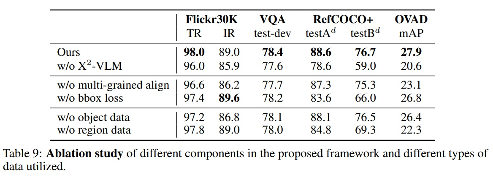  
 

### 4.7 Qualitative Study of Multi-Grained Alignments
 - X2-VLM이 어떤 비전 언어 정렬을 학습했는지 질적으로 연구한다.
 - X2-VLM에게 이미지 캡션 생성을 요청하여 이미지를 적절하게 설명할 수 있는지 확인한다.
 - X2-VLM에게 수동으로 입력된 설명에 따라 이미지 내 시각적 개념을 찾도록 요청하여 세부적인 객체나 영역을 이해할 수 있는지 확인한다.
 - 평가를 위해 COCO Caption 및 RefCOCO+ 데이터셋으로 미세 조정된 X2-VLM_large를 사용한다.
 - Fig 4와 같이 과학 포스터, 비디오 게임, 만화 등의 도메인 외 이미지를 선택하여 결과를 시각화한다.
 - 시각화 예시는 X2-VLM이 이러한 이미지를 주요 인물이나 객체 및 그들의 관계에 대한 정확한 이해와 함께 적절하게 설명할 수 있음을 보여준다.
 - 제공된 설명에 따라 이미지 내 시각적 개념을 찾으라고 할 때, X2-VLM은 배경의 작은 객체나 부분적으로 가려진 객체를 포착할 수 있다.
 - 일반적인 객체(남자 등)에 대한 레이블로 사전 학습했지만, 대규모 잡음이 많은 이미지-텍스트 쌍에서 다양한 세부적인 시각적 개념(아인슈타인, 에디슨 등)을 위치시키는 방법을 학습했다.

 

 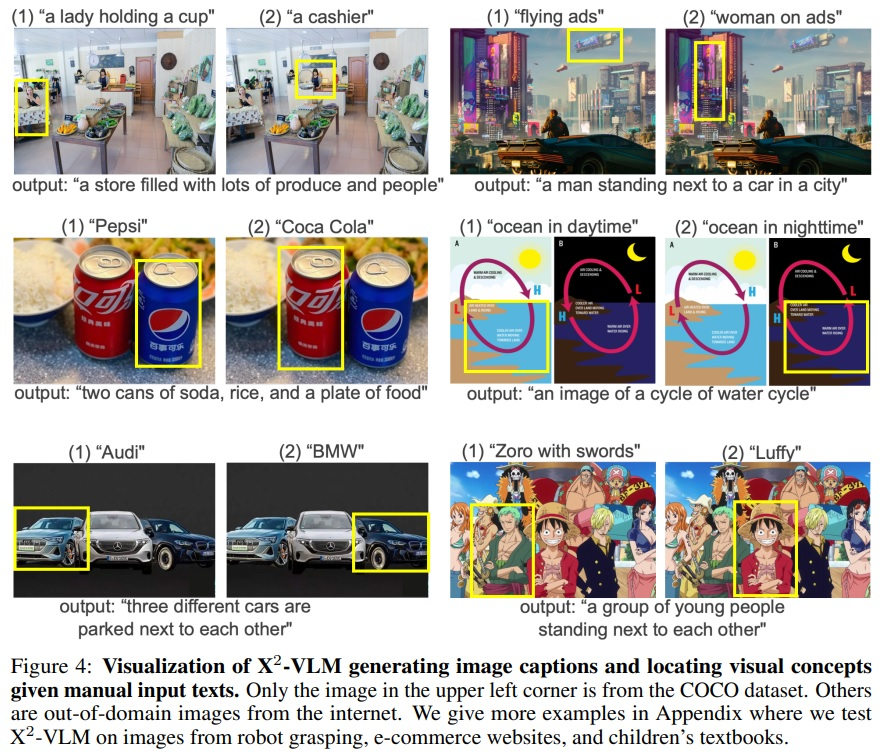
 

## 5. Conclusion and Discussion
 - 본 논문에서는 사전 학습에서 비전과 언어 간 multi-grained 정렬을 학습하도록 제안했다.
 - multi-grained 비전 언어 사전 학습을 위한 통합 프레임워크를 개발했다.
 - 이 프레임워크는 multi-grained 비전 특성을 쌍을 이루는 텍스트 특성과 직접 정렬하고, 동시에 다양한 텍스트 설명이 주어진 동일한 이미지 내에서 multi-grained 시각적 개념을 위치시킨다.
 - X2-VLM은 이미지 인코딩과 비디오 인코딩을 통합하여 이미지-텍스트 작업과 비디오-텍스트 작업 모두를 처리할 수 있다.
 - X2-VLM의 효과성을 검증하기 위해 광범위한 실험을 수행했다. 
 - 실험 결과는 X2-VLM이 다수의 downstream 이미지-텍스트 task에서 base 및 large에서 최신 이미지-텍스트 사전 학습 방법들을 상당히 능가함을 보여준다.
 - X2-VLM은 비디오-텍스트 검색 및 비디오 VQA를 포함한 비디오-텍스트 작업에서 새로운 최신 사전 학습 모델이다.
 - 제안된 multi-grained 비전 언어 사전 학습 프레임워크는 대규모 데이터와 더 큰 모델 크기로 확장 가능하다.
 - X2-VLM은 다른 언어나 도메인에서 사용될 수 있다.
 - 영어 데이터에 대한 사전 학습 후에 텍스트 인코더를 XLM-R로 교체함으로써, X2-VLM은 다국어 다중 모달 작업에서 최신 방법들을 능가한다.
 - 제안된 프레임워크의 다양한 구성 요소의 역할을 조사하기 위해 심층적인 소거 연구를 제공했다. 
 - 실험 결과는 multi-grained 위치 지정과 multi-grained 정렬이 제안된 방법의 중요한 구성 요소임을 보여준다.
 - X2-VLM에 의해 학습된 비전 언어 정렬에 대한 정성적(질적) 연구 수행한다.

## A Appendix
### A.1 Pre-training Datasets
 - LAION과 비디오-텍스트 데이터셋은 매우 크므로, 우리는 사전 학습을 가속화하기 위해 데이터셋을 필터링한다.
 - 짧은 모서리가 224 픽셀보다 작은 이미지는 제거한다.
 - 높이/너비 또는 너비/높이 비율이 3보다 큰 이미지도 제거한다.
 - 비디오 클립-텍스트 쌍의 경우, 단어 수가 2개 미만이면 쌍을 제거한다.
 - CLIP 점수(0.25 미만)를 사용하여 비디오 클립-텍스트 쌍을 필터링한다.
 - 객체 및 영역 이미지 주석 필터링한다.
   - 1) 유효하지 않은 주석(예: 바운딩 박스의 음수 값이나 이미지 밖의 박스).
   - 2) 박스가 너무 작음(패치보다 작음).
   - 3) 영역의 텍스트 설명이 과도하게 중복됨(> 75%).
 - 객체 주석에 객체 속성이 포함된 경우(예: 색상), 속성을 객체 주석과 연결하여 텍스트 설명으로 생성한다.
 - OpenImages 데이터셋의 일부 이미지에는 특정 관계의 객체 쌍(예: "기타를 연주하는 여자", "테이블 위의 맥주"), 객체 속성(예: "나무로 된 테이블"), 인간 행동(예: "뛰는 여자")을 나타내는 관계 주석도 활용한다.

### A.2 Implementation Details
 - X2-VLM은 224 × 224 이미지 해상도와 학습 가속화를 위해 16 × 16 패치 크기로 사전 학습된다.
 - 학습에 혼합 정밀도(mixed precision)1를 적용한다.
 - 텍스트 입력의 경우, 최대 토큰 수를 30으로 설정한다.
 - 대규모 데이터로 사전 학습을 가속화하기 위해 학습 과정을 두 단계로 나눈다.
   - 첫째, 대규모 이미지-텍스트 쌍으로 X2-VLM을 학습한다.
   - 둘째, 비디오-텍스트 쌍과 4M 데이터셋으로 X2-VLM을 추가로 학습한다. 이유는 비디오 데이터로 학습하는 것이 느리므로 사전 학습에서 비디오 클립당 무작위로 세프레임을 샘플링한다.
 - 4M 데이터로, X2-VLM_base를 500K 스텝 동안 1024의 배치 크기로 8개의 A100에서, X2-VLMlarge를 250K 단계에 걸쳐 16개의 A100에서 사전 학습하는데 약 1주일이 소요된다.
 - X2-VLMbase의 학습률은 처음 2500 스텝에서 1e-4로 예열되고 선형 일정에 따라 감소하고, X2-VLMlarge의 학습률은 5e-5이다.
 - 대규모 데이터로 X2-VLM을 훈련하는 데는 기본 모델의 경우 32개의 A100에서 2-3주, 대형 모델의 경우 64개의 A100에서 소요된다.

*혼합 정밀도(mixed precision)1은 크고 복잡한 딥러닝 모델을 학습 할 때 계산 속도를 높이고 메모리 사용량을 줄이는 방법으로 다른 데이터 타입을 사용하여 계산의 정확도와 속도 사이의 균형을 맞추는 것을 의미한다. FP32 대신 FP16을 사용하므로써 정확도가 많이 필요하지 않은 계산에서 시간을 절약할 수 있다.

### A.3 Ablation Study
 - 비교 모델 변형들은 모두 공정한 비교를 위해 4M 이미지에서 100K 스텝 동안 학습한다.
 - 다양한 소거 변형들을 더 효율적으로 비교하기 위해 훈련 스텝을 단축한다.
 - 모델 성능은 이미지-텍스트 검색(Recall@1), 시각적 질문 응답, 시각적 기반화, 제로샷 개방 어휘 속성 탐지에서 평가한다.
 - VQA는 큰 훈련 및 테스트 세트를 가지고 있으며, 상대적으로 작은 성능 차이도 고려할 가치가 있다.
 - Table 10과 같이 더 나은 시간적 모델링이 좋은 이미지 이해 능력을 유지하면서 비디오 이해 능력을 향상시킬 수 있는지 조사한다.
 - ViT에 temporal attention를 추가하는 확립된 방법을 사용한다.
 - 이미지/비디오 텍스트 검색 및 이미지/비디오 VQA에 대한 실험 결과는 각 프레임의 특성을 단순히 평균화하는 것이 모든 작업에서 더 나은 성능을 달성한다는 것을 보여준다.
 - 접근 방식은 이미지와 비디오 특성 모델링을 더 통합된 방식으로 처리하므로, 강력한 이미지 이해 능력이 비디오 이해로 더 잘 전달된다고 추측한다.

 

 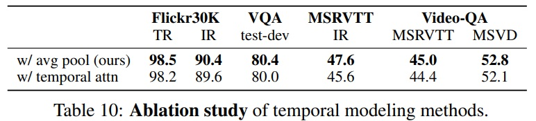  
 

### A.4 Qualitative Study of Multi-Grained Alignments
 - X2-VLM의 이미지 캡션 생성 또는 시각적 개념 위치 지정을 평가한다.
 - X2-VLM은 배경의 작은 객체나 부분적으로 가려진 객체를 포착할 수 있다.
 - Fig 5와 Fig 9에서 X2-VLM은 다양한 도메인에서 많은 시각적 개념을 인식할 수 있다.

 

 
Figure 5 펼치기/접기

 

 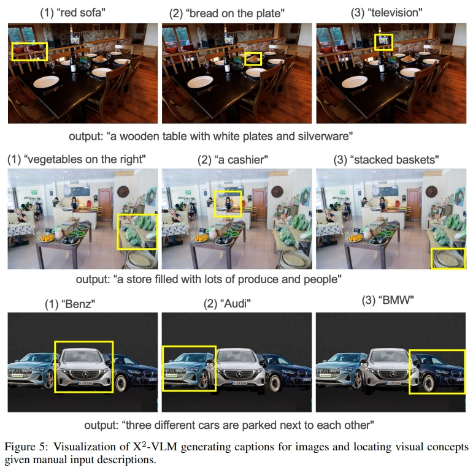 
 

 

 

 
Figure 9 펼치기/접기

 

 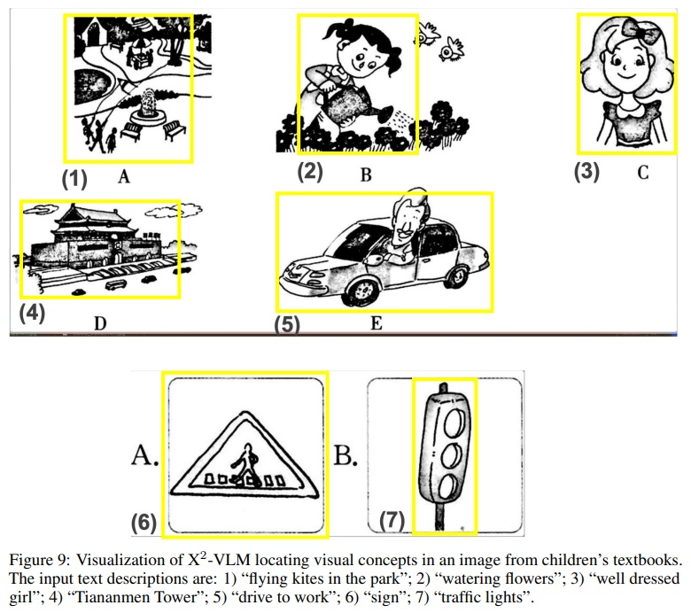 
 

 
