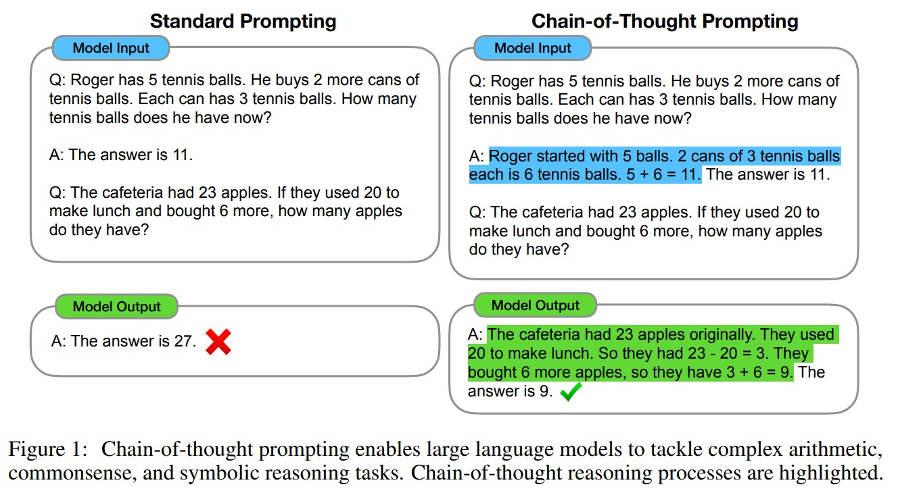
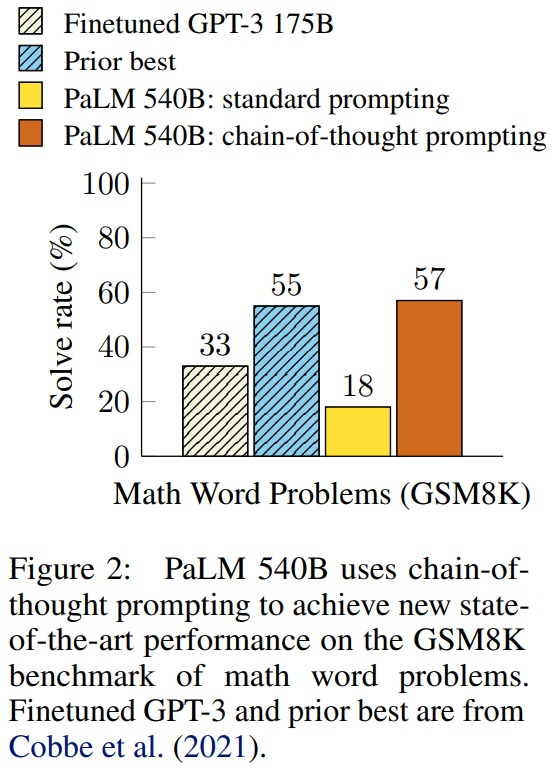
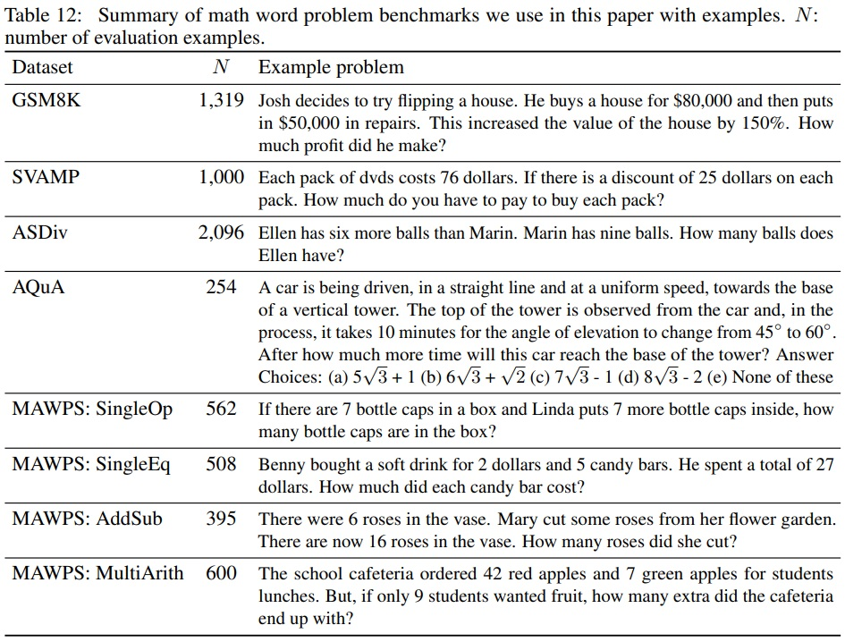
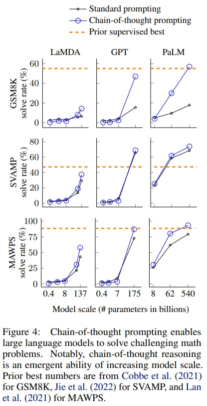
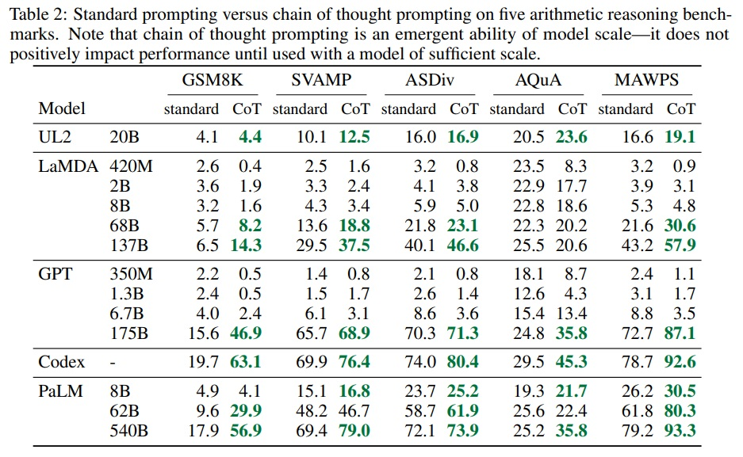
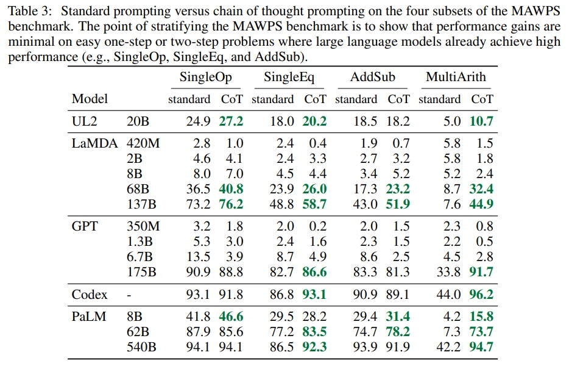
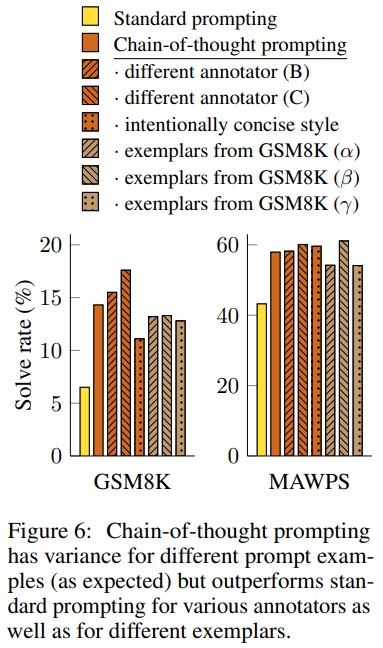
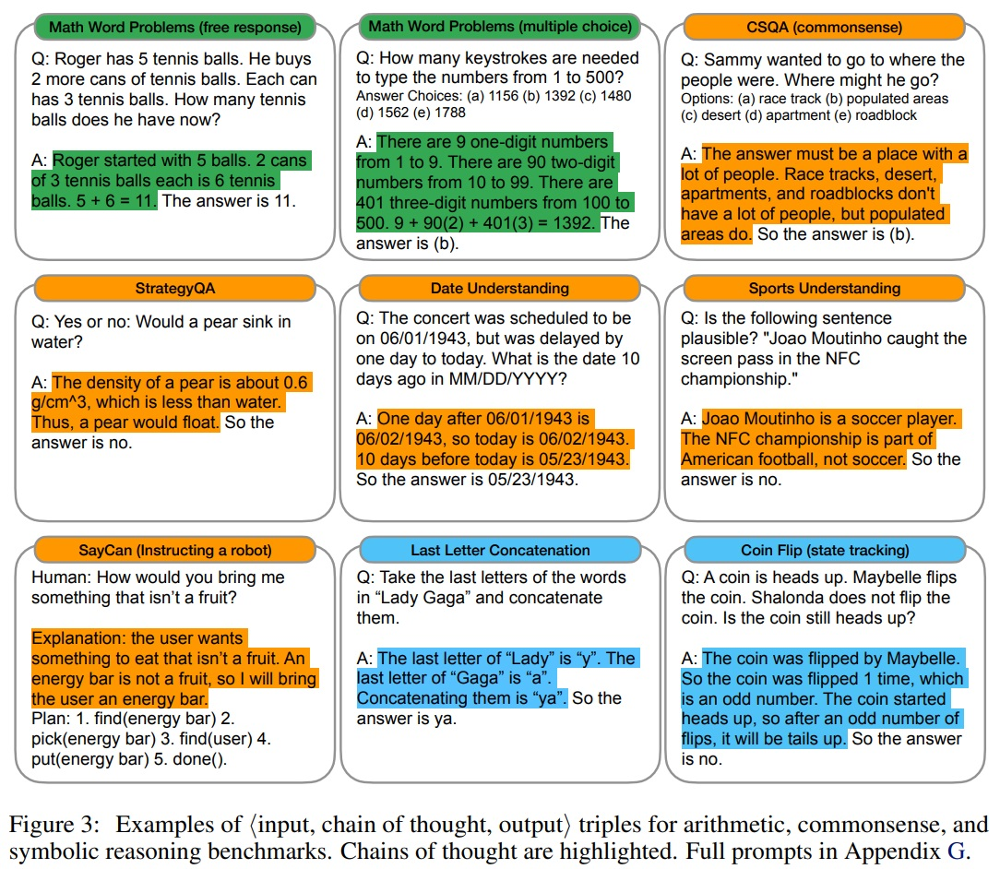
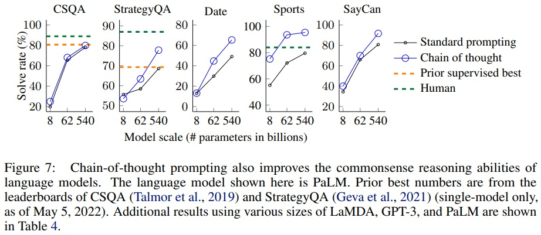
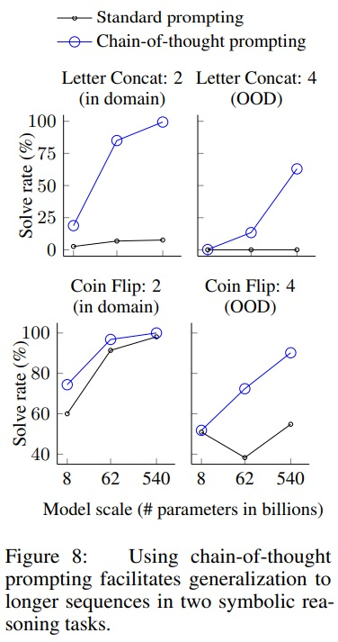

*생각의 연쇄(chain of thought)-중간 추론 단계들의 일련의 시리즈—를 생성하는 방법이 대규모 언어 모델이 복잡한 추론을 수행하는 능력을 크게 향상시키는 방법을 탐구한다. 특히, 본 논문은 충분히 큰 언어 모델에서 이러한 추론 능력이 생각의 연쇄 유도(chain-of-thought prompting)라는 간단한 방법을 통해 자연스럽게 나타남을 보여준다. 여기서는 유도 과정에서 몇 가지 생각의 연쇄 예시를 제공한다.
세 가지 대규모 언어 모델에 대한 실험에서는 생각의 연쇄 유도가 산술, 상식, 기호적 추론 작업의 범위에서 성능을 향상시키는 것을 보여준다. 경험적인 이득은 놀라울 수 있다. 예를 들어, PaLM 540B에 단지 여덟 개의 생각의 연쇄 예시를 유도하는 것만으로도 수학 단어 문제의 GSM8K 벤치마크에서 최고 수준의 정확도를 달성하여, 검증기가 있는 특수 학습된 GPT-3마저 능가한다.*

## 📋 Table of Contents

- [1 Introduction](#1-introduction)
- [2 Chain-of-Thought Prompting](#2-chain-of-thought-prompting)
- [3 Arithmetic Reasoning](#3-arithmetic-reasoning)
- [4 Commonsense Reasoning](#4-commonsense-reasoning)
- [5 Symbolic Reasoning](#5-symbolic-reasoning)
- [6 Discussion](#6-discussion)
- [7 Related Work](#7-related-work)
- [8 Conclusions](#8-conclusions)

## 1 Introduction
- 최근 NLP 분야는 언어 모델(Peters et al., 2018; Devlin et al., 2019; Brown et al., 2020 등)에 의해 혁명적인 발전을 이루었다.
 - 언어 모델의 크기 확장은 성능 향상과 샘플 효율성 개선에 기여했다(Kaplan et al., 2020; Brown et al., 2020 등).
 - 단순히 모델 크기를 확장하는 것만으로는 산수, 상식 및 상징적 추론과 같은 도전적인 작업에서 높은 성능을 달성하기에 충분하지 않다(Rae et al., 2021).
 - 본 연구는 큰 규모의 언어 모델의 추론 능력을 단순한 방법을 통해 활성화하는 방법을 탐구한다.
   -  산수 추론 기술(techniques for arithmetic reasoning)은 최종 답변으로 이어지는 자연어 논리를 생성하는 것에서 혜택을 받을 수 있다.
   - 큰 규모의 언어 모델은 '컨텍스트 내 소수샷 학습'(in-context few-shot learning)을 통해 각각의 새로운 작업에 별도의 언어 모델 체크포인트를 미세 조정하지 않고도 몇 가지 입력-출력 예시로 '프롬프트'를 수행할 수 있는 가능성을 제공한다(Brown et al., 2020).
 - 논리-증강 학습(rationale-augmented training) 및 미세 조정 방법의 경우, 복잡하고 비용이 많이 드는 한계가 있다.
 - Brown et al. (2020)에서 사용된 전통적인 few-shot prompting 방법은 추론 능력을 요구하는 작업에서 잘 작동하지 않으며, 언어 모델 규모가 증가해도 크게 개선되지 않는다(Rae et al., 2021)는 한계가 있다.
 - 본 논문은 위 두 아이디어의 장점을 결합하고 한계를 피하는 방법을 연구한다.
 - 몇 가지 사례의 입력, 사고의 연쇄(chain of thought), 출력으로 구성된 프롬프트를 사용하여 언어 모델이 추론 작업을 수행할 수 있는 능력을 탐구한다.
 - 사고의 연쇄(chain of thought)는 최종 출력으로 이어지는 일련의 중간 자연어 추론 단계를 의미하며, 이 접근 방식을 '사고의 연쇄 프롬프팅(chain-of-thought prompting)"이라고 부른다. (Fig 1)
 - 산수, 상식, 상징적 추론 벤치마크에서 사고의 연쇄 프롬프팅이 표준 프롬프팅보다 우수한 성능을 보인다.(Fig 2)
 - 특히, GSM8K(Cobbe et al., 2021) 수학 단어 문제 벤치마크에서 PaLM 540B 모델을 사용한 사고의 연쇄 프롬프팅이 새로운 최고 기록을 달성했다.
 - 프롬프팅만 사용하는 접근 방식은 큰 학습 데이터 세트가 필요 없고, 하나의 모델 체크포인트가 일반성을 잃지 않고 많은 작업을 수행할 수 있기 때문에 중요하다.

 

  
 
 
 

 
Fig 2 펼치기/접기

 

  
 

 

## 2 Chain-of-Thought Prompting
 - 사고의 연쇄 프롬프팅(Chain-of-Thought Prompting)은 문제를 중간 단계로 분해하여 최종 답변으로 이어지는 일련의 추론 단계를 생성하는 것이다.
 - 언어 모델이 충분히 크다면, few-shot prompting을 위한 예시에 사고의 연쇄 추론을 제시할 때 사고의 연쇄를 생성할 수 있다.
 - 해결책/설명은 일반적으로 최종 답변 이후에 제공된다(Narang et al., 2020; Wiegreffe et al., 2022; Lampinen et al., 2022 등).
 - 사고의 연쇄 프롬프팅의 특성
   - 사고의 연쇄는 모델이 다단계 문제를 중간 단계로 분해하게 해주며, 이는 더 많은 추론 단계가 필요한 문제에 추가적인 계산을 할당할 수 있게 한다.
   - 모델의 행동을 해석할 수 있는 창(interpretable window)을 제공하며, 특정 답변에 어떻게 도달했는지를 제안하고 추론 경로를 디버깅할 기회를 제공한다.
   - 수학 단어 문제, 상식 추론, 상징적 조작과 같은 작업에 사용될 수 있으며, 원칙적으로 언어를 통해 해결할 수 있는 모든 작업에 적용 가능하다.
   - 충분히 큰 언어 모델에서는 사고의 연쇄 시퀀스 예시를 few-shot prompting의 예시에 포함시킴으로써 쉽게 사고의 연쇄 추론을 유도할 수 있다.
 - 산수 추론(3장), 상식 추론(4장), 상징적 추론(5장)에 대한 사고의 연쇄 프롬프팅의 유용성을 관찰할 것이다.

## 3 Arithmetic Reasoning
### 3.1 Experimental Setup
 - **Benchmarks.**
   - 벤치마크 설정(Table 12)
     - GSM8K: 수학 단어 문제 벤치마크 (Cobbe et al., 2021).
     - SVAMP: 다양한 구조의 수학 단어 문제 데이터셋 (Patel et al., 2021).
     - ASDiv: 다양한 수학 단어 문제 데이터셋 (Miao et al., 2020).
     - AQuA: 대수학 단어 문제 데이터셋.
     - MAWPS: 수학 단어 문제 벤치마크 (Koncel-Kedziorski et al., 2016).
   - 각 벤치마크는 수학 단어 문제의 다양한 구조와 유형을 포함한다.

   

   
Table 12 펼치기/접기

   

    
   

   

 - **Standard prompting.**
   - 표준 few-shot prompting을 기준선으로 사용한다.
   - 언어 모델에게 테스트 시간 예제에 대한 예측을 출력하기 전에 컨텍스트 내 입력-출력 쌍 예시를 제공한다.
   - 언어 모델은 질문과 답변 형태의 컨텍스트 내 예시를 제공받은 후 테스트 예제에 대한 예측을 출력한다.
 - **Chain-of-thought prompting.**
   - 소수샷 프롬프팅의 각 예시를 관련 답변에 대한 사고의 연쇄로 보강한다.
   - 대부분의 데이터셋에 대해 8개의 사고의 연쇄 예시 세트를 수동으로 구성하여 사용한다.
   - AQuA 벤치마크를 제외한 4개의 벤치마크에 대해 동일한 사고의 연쇄 예시 세트 사용한다.
 - **Language models.**
   - 언어 모델 평가
     - GPT-3(Brown et al., 2020): 350M, 1.3B, 6.7B, 175B 파라미터 모델.
     - LaMDA(Thoppilan et al., 2022): 422M, 2B, 8B, 68B, 137B 파라미터 모델.
     - PaLM: 8B, 62B, 540B 파라미터 모델.
     - UL2 20B(Tay et al., 2022).
     - Codex(Chen et al., 2021, OpenAI API 내 code-davinci-002).
   - 각 모델은 다양한 파라미터 크기를 가지고 있으며, 탐욕적 디코딩을 통해 샘플링한다.
   - LaMDA의 경우, 다른 시드들 사이의 큰 변동성이 없으므로 단일 예시 순서 결과를 보고한다.

### 3.2 Results
 - 사고의 연쇄 프롬프팅은 모델 규모의 출현 능력이다.(Fig 4)
 - 작은 모델에서는 긍정적인 영향을 미치지 않으며, 약 100B 파라미터의 모델에서만 성능 향상을 보인다.
 - 작은 규모의 모델은 유창하나 비논리적인 사고의 연쇄를 생성하여 표준 프롬프팅보다 낮은 성능을 보인다.
 - 사고의 연쇄 프롬프팅은 복잡한 문제에서 더 큰 성능 향상을 보인다.
 - GSM8K와 같이 기준 성능이 낮은 데이터셋에서 큰 GPT와 PaLM 모델의 성능이 두 배 이상 향상되었다.
 - 단일 단계 해결이 필요한 MAWPS의 가장 쉬운 부분인 SingleOp에서는 성능 향상이 부정적이거나 매우 작다.(Table 3)
 - GPT-3 175B와 PaLM 540B를 통한 사고의 연쇄 프롬프팅은 이전 최고 수준과 유리하게 비교된다.
 - PaLM 540B는 GSM8K, SVAMP, MAWPS에서 새로운 최고 수준을 달성한다.
 - AQuA와 ASDiv에서는 최고 수준에 2% 이내로 도달한다.(Table 2)
 - LaMDA 137B가 생성한 사고의 연쇄를 수동으로 검토하여 올바른 답변을 제공한 예시들을 분석한다.
 - 50개의 무작위 예시 중 대부분의 사고의 연쇄가 논리적이고 수학적으로 정확하다.
 - 잘못된 답변을 제공한 예시의 분석에서, 사고의 연쇄의 46%가 거의 정확하며, 나머지 54%는 의미 이해나 일관성에서 주요 오류가 있었다.(Appendix D.2)
 - PaLM 62B와 540B의 오류 분석을 통해, 모델 규모를 확장하면 한 단계 누락 및 의미 이해 오류가 상당 부분 해결됨을 확인했다.(Appendix A.1)

 

 
Fig 4 펼치기/접기

 

  
 

 

 

 
Table 2 펼치기/접기

 

  
 

 

 

 
Table 3 펼치기/접기

 

  
 

 

### 3.3 Ablation Study
 - **Equation only.**
   - 사고의 연쇄 프롬프팅이 방정식 생성을 돕는다는 가정 하에, 모델이 답변 전에 오직 수학 방정식만 출력하도록 하는 변형을 테스트한다.
   - GSM8K에서 이 방식은 큰 도움이 되지 않음을 보여주며, 이는 GSM8K의 질문 의미가 직접 방정식으로 변환하기에는 너무 도전적임을 의미한다.
   - 한 단계 또는 두 단계 문제 데이터셋에서는 방정식만 사용하는 프롬프팅이 성능을 개선한다.
 - **Variable compute only.**
   - 사고의 연쇄는 모델이 더 어려운 문제에 더 많은 계산을 할당할 수 있다.
   - 방정식에 필요한 문자 수만큼 점의 시퀀스를 출력하는 구성은 기준선과 비슷한 성능을 보인다.
   - 변동 계산만으로는 사고의 연쇄 프롬프팅의 성공 이유가 되지 않는다.
 - **Chain of thought after answer.**
   - 사고의 연쇄 프롬프팅은 모델이 사전 학습 중에 획득한 지식에 접근하는 데 도움을 줄 수 있다.
   - 최종 답변 후에만 사고의 연쇄 프롬프트를 제공하는 구성은 기준선과 비슷한 성능을 보인다.
   - 이는 사고의 연쇄에 구현된 순차적 추론이 단순히 지식을 활성화하는 것 이상으로 유용하다는 것을 시사한다.

### 3.4 Robustness of Chain of Thought
 - 소수샷 예시의 순열 변화는 GPT-3의 SST-2 정확도에 큰 영향을 미친다.
 - 정확도는 거의 우연(54.3%)에서 거의 최고 수준(93.4%)까지 범위를 보인다(Zhao et al., 2021).
 - Annotator A 외에도 Annotators B와 C가 독립적으로 사고의 연쇄를 작성한다.
 - 이들은 동일한 few-shot 예시에 대해 사고의 연쇄를 제공한다(Appendix H).
 - Annotator A는 Cobbe et al. (2021) 스타일을 따라 더 간결한 사고의 연쇄를 추가로 작성한다.
 - GSM8K와 MAWPS에서 다양한 사고의 연쇄 주석에 대한 LaMDA 137B의 결과는 Fig 6에 나타난다.
 - 다른 사고의 연쇄 주석 간에 변동성이 있지만, 모든 사고의 연쇄 프롬프트 세트가 표준 기준보다 더 우수하다.
 - GSM8K 학습 세트에서 무작위로 추출한 8개의 예시 세트 세 개로 실험을 수행한다.
 - 이 프롬프트는 수동으로 작성된 예시와 비슷한 성능을 보이며, 표준 프롬프팅보다 우수하다.
 - 산수 추론을 위한 사고의 연쇄 프롬프팅은 다양한 예시 순서와 예시 수에 강건하다(Appendix A.2).

 

  
 

## 4 Commonsense Reasoning
 - '사고의 연쇄'의 적용 범위로는 수학 단어 문제에 특히 적합하다.
 - 사고의 연쇄의 언어 기반 특성은 일반적인 배경 지식을 바탕으로 한 물리적 및 인간 상호작용에 대한 추론을 포함하는 상식 추론 문제에도 적용 가능하다.
 - 상식 추론은 세계와의 상호작용에서 핵심적이며, 현재의 자연어 이해 시스템의 범위를 넘어선다(Talmor et al., 2021).
 - **Benchmarks.**
   - CSQA(Talmor et al., 2019): 세계에 대한 상식 질문을 포함하는 인기 있는 데이터셋이다.
   - StrategyQA(Geva et al., 2021): 다단계 전략 추론이 필요한 데이터셋이다.
   - BIG-bench: 'Date Understanding'과 'Sports Understanding' 두 가지 특수 평가 세트를 포함한다.
   - SayCan(Ahn et al., 2022): 자연어 지시를 로봇 행동 순서로 매핑한다.
   - Fig 3은 모든 데이터셋의 CoT 주석 예시들을 보여준다.

   

   
Fig 3 펼치기/접기

   

    
   

   

 - **Prompts.**
   - CSQA와 StrategyQA에 대해 학습 세트에서 예시를 무작위로 선택하여 사고의 연쇄를 수동으로 구성한다.
   - BIG-bench 작업에 대해 학습 세트가 없으므로 평가 세트의 처음 열 개의 예시를 few-shot 예시로 선택하여 사용한다.
   - SayCan에 대해서는 학습 세트의 여섯 개 예시와 수동으로 구성된 사고의 연쇄를 사용한다.
 - **Results.**
   - PaLM에 대한 결과는 Fig 7에 강조되며, LaMDA, GPT-3 및 다양한 모델 규모에 대한 전체 결과는 Table 4에 제시한다.
   - 모든 작업에 대해 모델 규모를 확장하면 표준 프롬프팅의 성능이 향상된다.
   - 사고의 연쇄 프롬프팅은 PaLM 540B에서 가장 큰 향상을 보인다.
   - PaLM 540B는 사고의 연쇄 프롬프팅을 사용하여 StrategyQA에서 이전 최고 수준을 능가하고, 스포츠 이해에서 도움이 되지 않는 스포츠 애호가를 능가한다.
   - 이는 사고의 연쇄 프롬프팅이 상식 추론 능력을 요구하는 작업의 성능을 향상시킬 수 있음을 보여준다(단, CSQA에서의 이득은 최소함).

   

   
Fig 7 펼치기/접기

   

    
   

   

   

   
Table 4 펼치기/접기

   

    
   

   

## 5 Symbolic Reasoning
 - 상징적 추론은 인간에게는 단순하지만 언어 모델에게는 도전적일 수 있다.
 - 사고의 연쇄 프롬프팅은 표준 프롬프팅 설정에서 도전적인 상징적 추론 작업을 수행할 수 있게 한다.
 - 사고의 연쇄 프롬프팅은 few-shot 예시에서 본 것보다 더 긴 추론 시간 입력에 대한 길이 일반화(length generalization)를 촉진한다.
 - **Tasks.**
   - **마지막 글자 연결(Last letter concatenation)**: 이름에서 단어의 마지막 글자를 연결하도록 요청한다.
   - **동전 던지기(Coin flip)**: 사람들이 동전을 던지거나 던지지 않은 후 동전이 여전히 앞면인지 판단을 요청한다.
   - 도메인 내 테스트 세트: 학습/few-shot 예시와 같은 단계 수를 가진 예시를 고려한다.
   - 도메인 외( Out-Of-Domain, OOD) 테스트 세트: 예시보다 더 많은 단계를 가진 예시를 고려한다.
   - 마지막 글자 연결과 동전 던지기 작업에서 더 긴 예시를 수행한다.
   - 이전 두 섹션과 동일한 방법과 모델을 사용한다.
   - 각 작업에 대한 few-shot 예시에 대한 사고의 연쇄를 수동으로 구성한다.
 - **Results. (Fig 8)**
   - 사고의 연쇄 프롬프팅은 PaLM 540B에서 거의 100% 해결률을 보인다(표준 프롬프팅은 PaLM 540에서 동전 던지기를 해결하지만 LaMDA 137B에서는 그렇지 않다).
   - 표준 프롬프팅은 OOD 평가에서 실패했다.
   - 사고의 연쇄 프롬프팅은 언어 모델에 대해 상향 스케일링 곡선1(upward scaling curves)을 달성한다.
   - 이는 사고의 연쇄 프롬프팅이 충분한 규모의 언어 모델에 대해 본 적 있는 사고의 연쇄를 넘어서 길이 일반화2를 촉진함을 보여준다.

**"upward scaling curves1"는 모델의 규모가 증가함에 따라 특정 작업에 대한 성능이 현저하게 향상되는 것을 의미한다. 즉, 더 큰 모델이 더 복잡한 문제를 더 잘 해결하거나, 더 정확한 예측을 하거나, 더 높은 정확도를 달성한다는 것을 나타낸다.*

**"길이 일반화를 촉진한다2."라는 표현은 사고의 연쇄 프롬프팅이 언어 모델이 few-shot 예시에서 본 것보다 더 긴 입력에 대해 추론할 수 있도록 도와준다는 의미이다. , 모델이 학습이나 예시에서 직접 경험하지 않은, 더 긴 또는 더 복잡한 문제에 대해서도 효과적으로 처리하고 추론할 수 있는 능력을 개발하는 데 도움을 준다는 것을 나타낸다. 이는 모델이 더 다양한 상황과 문제에 유연하게 적응하고, 더 넓은 범위의 작업을 처리할 수 있게 하는 중요한 능력을 의미한다.*

  

  
Fig 8 펼치기/접기

  

   
  

  

## 6 Discussion
 - 사고의 연쇄 프롬프팅의 효과로 큰 언어 모델에서 다단계 추론 행동을 유도하는 간단한 메커니즘이다.
 - 산수 추론에서 성능을 크게 향상시키며, 다른 주석자, 예시, 언어 모델에 강건하다(section 3).
 - 상식 추론에서 언어적 본성이 일반적으로 적용될 수 있음을 강조한다(section 4).
 - 상징적 추론에서 도메인 외 일반화를 더 긴 시퀀스 길이로 촉진한다(section 5).
 - 모델 규모의 결과로서 사고의 연쇄 추론의 출현이 주요 주제이다(Wei et al., 2022b).
 - 표준 프롬프팅이 평탄한 스케일링 곡선을 가질 때, 사고의 연쇄 프롬프팅은 급격히 증가하는 스케일링 곡선을 이끈다.
 - 큰 언어 모델이 수행할 수 있는 작업 세트를 확장한다.
 - **Limitation.**
   - 사고의 연쇄가 인간 추론자의 사고 과정을 모방하지만 실제 '추론' 여부는 불분명하다.
   - 수동으로 예시를 증가시키는 비용은 few-shot 설정에서 최소이지만, fine-tuning에는 비용이 많이 들 수 있다.
   - 올바른 추론 경로에 대한 보장이 없으며, 언어 모델의 사실적 생성 개선이 필요하다.
   - 큰 모델 규모에서만 출현하는 사고의 연쇄 추론은 실제 세계 응용에서 비용이 많이 든다.

## 7 Related Work
 - 추론 문제를 해결하기 위해 중간 단계를 사용하는 것이 첫 번째 관련 방향이다.
 - Ling et al. (2017)은 자연어 이유를 사용하여 수학 단어 문제를 중간 단계를 통해 해결하는 아이디어를 제시한다.
 - 이 방법은 형식 언어를 사용하여 추론하는 기존 연구와 대조된다(Roy et al., 2015; Chiang and Chen, 2019; Amini et al., 2019; Chen et al., 2019).
 - Cobbe et al. (2021)은 Ling et al. (2017)의 작업을 확장하여 더 큰 데이터셋을 생성하고 사전 학습된 언어 모델을 미세 조정한다.
 - Nye et al. (2021)은 언어 모델을 사용하여 Python 프로그램의 최종 출력을 예측한다.
 - 이들은 단계별 예측 방법이 최종 출력을 직접 예측하는 것보다 더 나은 성능을 보인다고 보여준다.
 - 이 논문은 최근 프롬프팅 작업과 밀접한 관련이 있으며, 모델의 프롬프팅 능력을 향상시키는 여러 접근법이 개발되었다.
 - Brown et al. (2020)의 소수샷 프롬프팅 대중화 이후, 여러 접근법이 모델의 프롬프팅 능력을 향상시킨다.
 - 예를 들어, 프롬프트 자동 학습(Lester et al., 2021) 또는 모델에 작업 설명 지시 제공(Wei et al., 2022a; Sanh et al., 2022; Ouyang et al., 2022)이 있다.
 - 기존 접근법들은 프롬프트의 입력 부분을 개선하거나 확장한다.
 - 반면, 본 연구는 언어 모델의 출력을 사고의 연쇄로 확장하는 방향을 취한다.

## 8 Conclusions
 - 언어 모델에서 추론 능력을 향상시키는 간단하고 광범위하게 적용 가능한 방법으로 사고의 연쇄 프롬프팅을 연구한다.
 - 산수, 상징적, 상식적 추론에 대한 실험을 통해 사고의 연쇄 추론이 모델 규모의 출현적 특성임을 발견한다.
 - 충분히 큰 언어 모델이 평탄한 스케일링 곡선을 가진 추론 작업을 수행할 수 있게 한다.
 - 언어 모델이 수행할 수 있는 추론 작업의 범위를 확장한다.
 - 이러한 확장은 언어 기반의 추론 접근 방식에 대한 추가적인 작업에 영감을 줄 수 있다.