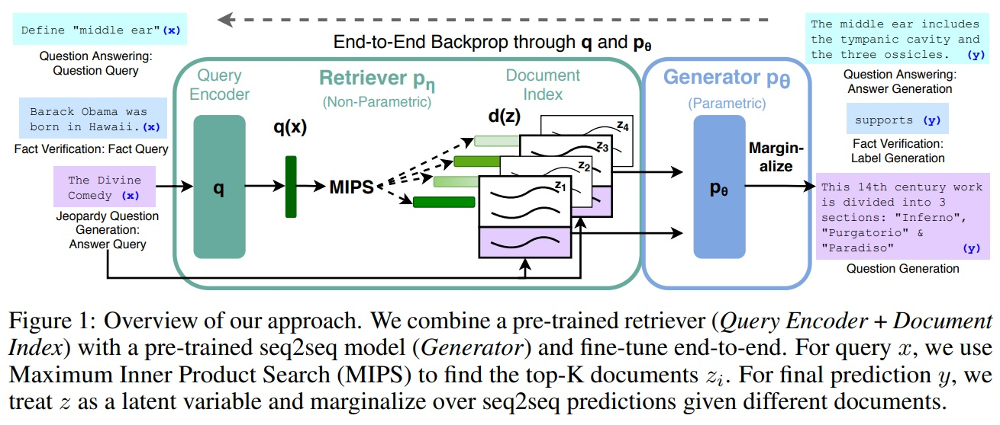
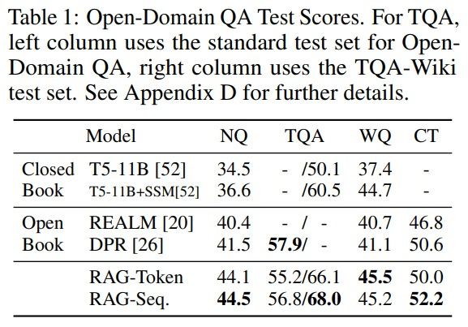
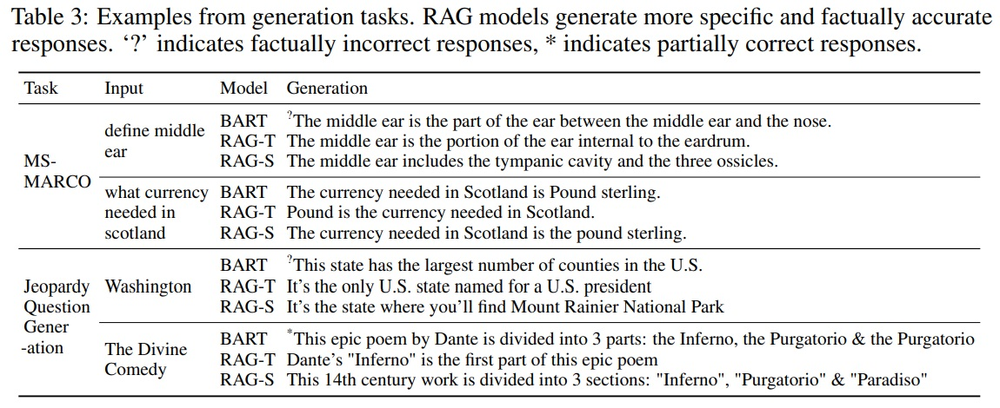
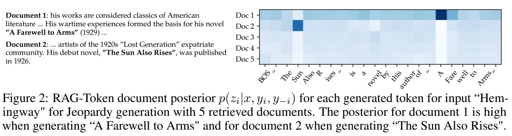
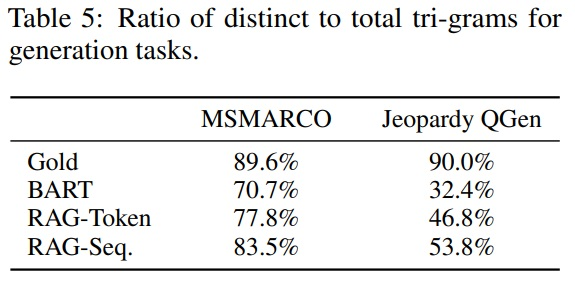
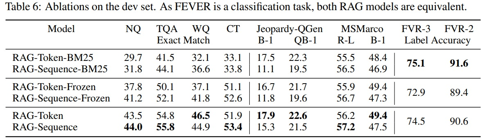
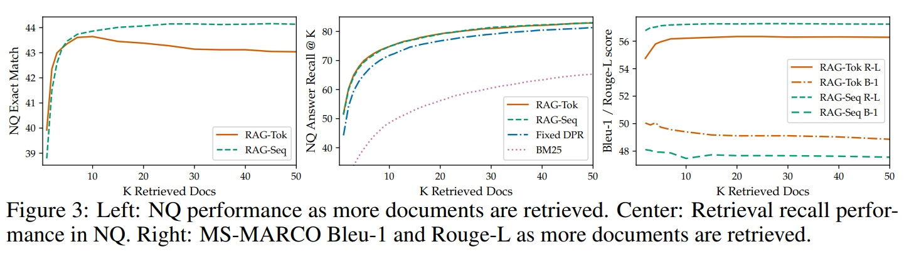

*대규모 사전 학습된 언어 모델은 그들의 매개 변수에 사실적 지식을 저장하고, 다운스트림 NLP 작업에 미세 조정될 때 최첨단 결과를 달성하는 것으로 나타난다. 그러나 지식 집약적 작업에서 정확한 지식 접근 및 조작 능력이 여전히 제한되어 있어서 이러한 작업에서의 성능은 작업 특화 아키텍처에 뒤처진다. 또한, 모델의 결정에 대한 출처 제공과 세계 지식의 업데이트는 여전히 열린 연구 문제이다. 명시적 비매개변수 메모리에 대한 차별화 가능한 접근 메커니즘을 가진 사전 학습된 모델은 지금까지 추출적 다운스트림 작업에 대해서만 조사되었다. 본 논문에서는 언어 생성을 위한 검색-증강 생성(RAG) 모델 — 사전 학습된 매개변수와 비매개변수 메모리를 결합한 모델에 대한 범용 미세 조정 레시피를 탐구한다. 본 논문에서는 매개변수 메모리가 사전 학습된 seq2seq 모델이고, 비매개변수 메모리가 사전 학습된 신경 검색기로 접근된 위키피디아의 밀집 벡터 색인인 RAG 모델을 소개한다. 본 논문에서는 생성된 전체 시퀀스에 걸쳐 같은 검색된 문서에 조건을 부과하는 RAG 설계와 토큰마다 다른 문서를 사용할 수 있는 다른 설계를 비교한다. 본 논문에서는 다양한 지식 집약적 NLP 작업에서 우리의 모델을 미세 조정하고 평가하며, 세 개의 개방 도메인 QA 작업에서 최첨단을 설정하여 매개변수 seq2seq 모델과 작업 특화 검색-추출 아키텍처를 능가한다. 언어 생성 작업의 경우, 본 논문은 RAG 모델이 최첨단 매개변수만 있는 seq2seq 기준선보다 더 구체적이고 다양하며 사실적인 언어를 생성한다는 것을 발견한다.*

## 📋 Table of Contents

- [1 Introduction](#1-introduction)
- [2 Methods](#2-methods)
- [3 Experiments](#3-experiments)
- [4 Results](#4-results)
- [5 Related Work](#5-related-work)
- [6 Discussion](#6-discussion)

## 1 Introduction
 - 사전 학습된 언어 모델들은 데이터로부터 상당한 양의 깊이 있는 지식을 학습한다.
 - 외부 메모리 접근 없이 매개변수화된 암묵적 지식 기반으로 작동한다.
 - 기존 모델들은 메모리 확장 및 수정이 어려우며, 예측에 대한 명확한 통찰을 제공하지 못하여 "환각"을 생성할 수 있다.
 - 매개변수 메모리(parametric memory)와 비매개변수(검색 기반) 메모리(non-parametric)를 결합한 하이브리드 모델의 도입한다.
 - 지식을 직접 수정하고 확장할 수 있고, 접근된 지식을 검사하고 해석이 가능하다.
 - 본 연구에서는 하이브리드 매개변수 및 비매개변수 메모리를 "workhorse of NLP", 즉 sequence-to-sequence (seq2seq) models에 도입한다.
 - RAG(Retrieval-Augmented Generation) 모델은 사전 학습된 매개변수 메모리 생성 모델에 비매개변수 메모리를 부여하는 방법이다.
 - 사전 학습된 seq2seq 변환기(매개변수 메모리)와 위키피디아의 밀집 벡터 인덱스(비매개변수 메모리)를 결합한다.
 - 구성 요소들을 확률적 모델로 결합하여 종단간(end-to-end)으로 학습한다.(Fig 1)
 - Retriever(Dense Passage Retriever, 이하 DPR)은 입력에 기반한 잠재 문서를 제공하고 seq2seq 모델(BART)는 이를 바탕으로 출력을 생성한다.
 - 우리의 결과는 지식 집약적인 작업(knowledge-intensive tasks)에 대해 매개변수와 비매개변수 메모리를 결합하는 이점을 강조한다. 
 - 개방형 자연 질문, 웹 질문, 큐레이티드 트렉에서 최고 수준의 성과를 달성한다.
 - 추출형 작업(extractive tasks)에서 제약 없는 생성이 이전 접근법보다 우수하다.
 - MS-MARCO와 위험한 질문 생성(Jeopardy question generation)에서 BART 기준보다 더 사실적이고 구체적이며 다양한 응답을 생성한다.
 - FEVER(Fact Extraction and VERification) 사실 검증에서 강력한 검색 감독을 사용하는 최신 모델과 유사한 성과를 달성한다.
 - 비매개변수 메모리 교체를 통해 모델의 지식을 업데이트할 수 있다.

 

  
 

## 2 Methods
 - RAG 모델의 기본 구조는 입력 시퀀스 x를 사용하여 텍스트 문서 z를 검색한다.
 - 검색된 문서를 대상 시퀀스 y 생성시 추가적인 컨텍스트를 사용한다.
 - RAG 모델의 두 가지 구성 요소(Fig 1)
   - (i) 검색기(Retriever) $pη(z|x)$: 쿼리 x에 대한 텍스트 패시지들의 분포를 반환한다. 이는 top-K로 자른 분포를 반환하며, 매개변수 $η$을 가진다.
   - (ii) 생성기(Generator) $pθ(yi|x, z, y1:i−1)$: 이전 $i-1$ 토큰 $y1:i−1$, 원래 입력 $x$, 검색된 패시지 $z$의 컨텍스트를 바탕으로 현재 토큰을 생성한다. 매개변수 $θ$로 파라미터화된다.
 - 검색된 문서를 잠재 변수로 취급하여 검색기와 생성기를 종단간으로 학습한다.
 - RAG 모델의 두 가지 접근 방식:
   - ① RAG-Sequence: 같은 문서를 사용하여 각 대상 토큰을 예측한다.
   - ② RAG-Token: 서로 다른 문서를 바탕으로 각 대상 토큰을 예측한다.
 -  $pη$ 및 $pθ$ 구성 요소들을 공식적으로 소개하고, 그리고 학습 및 디코딩 절차를 설명한다.
### 2.1 Models
 - **RAG-Sequence Model**
   - RAG-Sequence 모델: RAG-Sequence 모델은 검색된 동일한 문서를 사용하여 전체 시퀀스를 생성한다.
   - 검색된 문서를 단일 잠재 변수(single latent variable)로 취급하여 top-K 근사(top-K approximation)를 통해 seq2seq 확률 p(y|x)를 계산한다.
   - top-K개 문서를 검색하고, 생성기가 각 문서에 대한 출력 시퀀스 확률을 생성하여 마진화(marginalized)한다.
 - **RAG-Token Model**
   - RAG-Token 모델에서는 각 대상 토큰마다 다른 잠재 문서를 선택하고 마진화한다.
   - 생성기는 답변을 생성할 때 여러 문서의 내용을 선택할 수 있다.
   - top-K개 문서를 검색한 후, 생성기가 각 문서에 대한 다음 출력 토큰의 분포를 생성하고 반복적으로 마진화한다.
   - 마지막으로, RAG는 대상 클래스를 길이가 하나인 대상 시퀀스로 간주함으로써 시퀀스 분류 작업(특정 카테고리나 클래스를 예측하는 작업)에 사용될 수 있으며, 이 경우 RAG-Sequence와 RAG-Token은 동등하다.

**"Single latent variable"은 잠재 변수 모델에서 사용되는 용어로, 특정 데이터 또는 프로세스의 숨겨진 또는 관찰되지 않은 요소를 나타낸다. 이러한 변수는 직접 관찰하거나 측정할 수 없지만, 모델의 다른 관찰 가능한 변수들과의 관계를 통해 추론된다. RAG-Sequence 모델의 맥락에서 "single latent variable"은 검색된 단일 문서를 의미한다.*

**"marginalized"는 통계학과 확률론에서 사용되는 용어로, 복잡한 확률 분포에서 관심 있는 특정 변수들에 초점을 맞추고, 그 외의 변수들은 고려하지 않아도 되는 총합 또는 평균 확률을 계산하는 것이다. 논문 맥락으로는 특정한 결과(예: 단어나 토큰의 시퀀스)의 확률을 계산할 때 다른 변수들(예: 특정 문서나 문맥)에 대한 고려를 배제하고, 관심 있는 변수에 대한 확률 분포만을 계산하는 과정을 의미한다.*
### 2.2 Retriever: DPR
 - 검색 구성 요소 pη(z|x)는 DPR을 기반으로 한다.
 - DPR은 이중 인코더 구조를 따른다.
 - d(z)는 BERTBASE 문서 인코더에 의해 생성된 문서의 밀집 표현이다.
 - q(x)는 BERTBASE를 기반으로 한 쿼리 인코더에 의해 생성된 쿼리 표현이다.
 - 최대 우선 확률 pη(z|x)을 가진 k개 문서 z의 목록을 계산하는 것은 최대 내적 검색(Maximum Inner Product Search, MIPS) 문제이다.
 - 이는 부분 선형 시간 내에 근사적으로 해결 가능하다.
 - DPR의 사전 학습된 이중 인코더를 사용하여 검색기 초기화하고 문서 인덱스를 구축한다.
 - TriviaQA 질문과 Natural Questions에 대한 답변이 포함된 문서를 검색하기 위해 학습되었다.
 - 문서 인덱스를 비매개변수 메모리로 간주한다.
### 2.3 Generator: BART
 - 생성기 구성 요소 $pθ(yi|x, z, y1:i−1)$는 어떠한 인코더-디코더를 사용하여 모델링 가능하다.
 - BART-large, 400M 매개변수를 가진 사전 학습된 seq2seq 변환기이다.
 - BART에서 생성할 때 입력 x(질문 또는 명령 등)와 검색된 내용 z(관련 문서나 정보 등)를 결합하여 최종적인 출력 y(답변, 문장 등)을 생성한다.
 - BART는 노이징 목적과 다양한 노이징 함수를 사용하여 사전 학습된다.
 - 이는 다양한 생성 작업에서 최고 수준의 결과를 달성한다.
 - 비슷한 크기의 T5 모델보다 뛰어난 성능을 보인다.
 - BART 생성기 매개변수 θ를 매개변수 메모리로 간주된다.
### 2.4 Training
 - 어떤 문서를 검색해야 하는지에 대한 직접적인 감독 없이 검색기와 생성기 구성 요소를 함께 학습한다.
 - 입력/출력 쌍(xj, yj)의 파인튜닝 학습 데이터셋이 주어진 상태에서, 우리는 각 대상의 부정적인 마진 로그-가능도를 최소화한다.
 - Adam을 사용한 확률적 그래디언트 하강법으로 최소화한다.
 - 학습 중에는 비용이 많이 들어 문서 인코더 BERTd의 업데이트를 하지 않는다.
 - 또한, 문서 인코더(및 인덱스)를 고정된 상태로 유지하고, 쿼리 인코더(Query Encoder) BERTq와 BART 생성기만 파인튜닝한다.

**BERTq는 검색 쿼리에 대한 표현(representation)을 생성하는 역할이다. BERTq는 BERT 모델의 변형으로, 주어진 검색 쿼리에 대한 벡터 표현을 생성한다. 이 벡터 표현은 후속 검색 과정에서 문서 인덱스에 저장된 문서들의 벡터와 비교되어 가장 관련성 높은 문서들을 검색하는 데 사용됩니다.*

**쿼리 인코더(Query Encoder)는 자연어 처리(NLP)와 정보 검색(IR) 시스템에서 사용되는 구성 요소이다. 쿼리 인코더의 주된 역할은 사용자의 검색 쿼리(질문이나 요청)를 받아 이를 숫자 벡터로 변환하는 것이다. 이 벡터는 검색 쿼리의 의미를 포함하는 밀집된 표현(dense representation)으로, 검색 시스템이 문서나 데이터베이스 내에서 관련 정보를 더 효과적으로 검색하도록 돕는다.*
### 2.5 Decoding
 - 테스트 시간에 RAG-Sequence와 RAG-Token은 arg maxy p(y|x)를 근사화하는 데 서로 다른 디코딩 방식을 필요로 한다.
 - **RAG-Token**
   - RAG-Token 모델은 전환 확률을 가진 표준, 자기회귀적 seq2seq 생성기(autoregressive seq2seq generator with transition probability)로 볼 수 있다.
 - **RAG-Sequence**
   - 가능성 p(y|x)은 전통적인 토큰당 가능성으로 분리되지 않으므로 단일 빔 검색(single beam search)으로 해결할 수 없다.
   - 대신에, 각 문서 z에 대해 빔 검색을 수행하고, 각 가설에 점수를 매긴다.
   - 가설 집합 Y를 생성하며, 일부 가설은 모든 문서의 빔에 나타나지 않을 수 있다.
   - 가설 y가 빔에 나타나지 않은 각 문서 z에 대해 추가적인 전방 통과를 수행하고, 생성된 확률을 마진 확률로 합산한다.
   - 더 긴 출력 시퀀스의 경우 많은 forward passes가 필요하므로, "Thorough Decoding"라는 절차를 사용한다.
   - 더 효율적인 디코딩을 위해 "Fast Decoding"라는 절차를 사용한다.
   - 후보 집합 Y가 생성되면 추가적인 전방 통과를 실행할 필요가 없다.

**"Beam Search"는 자연어 처리 분야의 디코딩(Decoding) 과정에서 사용되는 알고리즘 중 하나이다. Beam search는 가장 가능성 있는 시퀀스를 찾기 위해 사용되는 탐색 기법이다. 여기서 'k'는 빔의 크기(Beam size)를 나타내며, 이 크기에 따라 탐색의 폭이 결정된다. 빔의 크기에 따라 크기 작으면 더 나은 가능성을 가진 다른 시퀀스를 놓칠수 있는 단점이 있고, 빔이 클수록 더 많은 시퀀스를 고려하여 더 나은 결과를 얻을 수 있지만, 계산 비용이 증가한다.*

**"Thorough Decoding"은 RAG-Sequence 모델에서 생성된 시퀀스의 가능성을 계산하는 데 사용된다. 정확한 가능성 계산을 위해 필요하지만, 더 긴 출력 시퀀스에 대해서는 많은 forward passes가 필요하게 되므로 계산 비용이 높아질 수 있습니다.*

**"Fast Decoding"는 RAG-Sequence 모델에서 사용되며, 디코딩을 수행할 때 forward pass를 하지 않아서 계산 비용을 줄일 수 있는 더 효율적인 근사적 접근 방식이다.*
## 3 Experiments
 - RAG를 다양한 지식 집약적인 작업에 적용하여 실험한다.
 - 비매개변수 지식 소스로 2018년 12월자 단일 위키피디아 덤프를 선택했다.
 - 각 기사는 100단어 단위로 분할되어 총 21M 문서를 구성한다.
 - 문서 인코더를 사용하여 각 문서의 임베딩을 계산한다.
 - FAISS를 사용하여 단일 MIPS 인덱스를 구축한다.
 - 계층적 탐색 가능 소형 세계((Hierarchical Navigable Small World) ) 근사를 사용하여 빠른 검색을 지원한다.
 - 학습 중 각 쿼리에 대해 top-k개 문서를 검색한다.
 - 학습을 위해 $k ∈ {5, 10}$을 고려한다.
 - 개발 데이터를 사용하여 테스트 시간에 k를 설정한다.
### 3.1 Open-domain Question Answering
 - 개방형 질문 응답(Open-domain QA)은 중요한 실제 세계 응용 프로그램 및 지식 집약적 작업을 위한 공통 테스트베드이다.
 - 질문과 답변을 입력-출력 텍스트 쌍(x, y)으로 취급한다.
 - 답변의 부정적 로그-가능도를 최소화하여 RAG를 학습한다.
 - 비교 대상은 추출형 QA 패러다임으로 주로 비매개변수 지식에 의존하여 검색된 문서에서 답변을 추출한다.
 - 추출형 QA 패러다임(extractive QA paradigm)과 비교한다. 이는 검색된 문서에서 답변을 추출하는 방식이다.
 - Closed-Book QA" 접근법과도 비교한다. 이는 RAG와 마찬가지로 답변을 생성하지만 검색을 활용하지 않고 매개변수 지식에만 의존한다.
 - 활용된 네가지 개방형 QA 데이터셋:
   - ① Natural Questions(NQ)
   - ② TriviaQA (TQA)
   - ③ WebQuestions(WQ)
   - ④ CuratedTrec(CT)
 - CT와 WQ는 작은 규모이므로 DPR을 따라 NQ RAG 모델로 초기화한다.
 - 이전 연구와 동일한 학습/개발/테스트 분할을 사용하고 정확한 일치(Exact Match, EM) 점수를 보고한다.
 - TQA의 경우, T5와 비교하기 위해 TQA 위키 테스트 세트에서도 평가한다.
### 3.2 Abstractive Question Answering
 - RAG 모델은 간단한 추출형 QA를 넘어서 자유 형식의 추상적 텍스트 생성으로 질문에 답할 수 있다.
 - 지식 집약적 환경에서 RAG의 자연어 생성(NLG) 테스트를 위해 MSMARCO NLG task v2.1을 사용한다.
 - MSMARCO 작업은 각 질문에 대해 검색 엔진에서 검색된 열 개의 금색 패시지(ten gold passages), 검색된 패시지(retrieved passages)에서 주석이 달린 전체 문장 답변으로 구성된다.
 - 제공된 패시지(supplied passages)를 사용하지 않고, 질문과 답변만을 사용하여 개방형 추상적 QA 작업(open-domain abstractive QA task)으로 취급한다.
 - MSMARCO에는 금색 패시지에 접근하지 않고는 참조 답변과 일치하는 방식으로 답변할 수 없는 질문이 있어 성능이 낮아질 수 있다.
 - 또한 일부 MSMARCO 질문은 위키피디아만을 사용하여 답변할 수 없다.
 - RAG는 매개변수 지식에 의존하여 합리적인 응답을 생성한다.

* gold passages에서 passage는 텍스트 문서나 기사의 특정 부분을 의미하며, 질문에 대한 답변을 찾기 위해 검색 엔진이나 데이터베이스에서 추출되는 텍스트 조각이다. gold passage는 "금색 패시지"라고도 하며, 특정 질문에 대한 정확하고 관련성 높은 답변을 포함하는 패시지를 지칭한다. 일반적으로 데이터셋에서 질문에 대한 '정답'으로 간주된다.
### 3.3 Jeopardy Question Generation
 - QA 설정(non-QA setting)이 아닌 상황에서 RAG의 생성 능력을 평가하기 위해, 우리는 개방형 질문 생성(open-domain question generation)을 연구한다. 
 - 표준 개방형 QA 작업의 짧고 간단한 질문 대신 지퍼디 질문 생성(Jeopardy Question Generation)을 제안한다.
 - 지퍼디 질문은 실체에 대한 사실로부터 그 실체를 추측하는 독특한 형식이다.
 - SearchQA 데이터셋의 분할을 사용하며, 100K 학습, 14K 개발, 27K 테스트 예제를 포함한다.
 - 비교를 위해 BART 모델을 학습한다.
 - QuAD 조정된 Q-BLEU-1 지표를 사용하여 평가한다.
 - Q-BLEU는 일치하는 실체에 더 높은 가중치를 두는 BLEU의 변형이다.
 - 두 가지 인간 평가 수행한다.
   - ① "사실성"을 신뢰할 수 있는 외부 소스에 의해 입증될 수 있는 진술로 정의한다.
   - ② "구체성"을 입력과 출력 사이의 높은 상호 의존성으로 정의한다.
 - 평가자들은 답변과 두 개의 생성된 질문, 하나는 BART에서, 다른 하나는 RAG에서 나온 것을 보여준다. 
 - 그런 다음 그들은 네 가지 옵션 중 하나를 선택하도록 요청받는다.(질문 A가 더 좋다, 질문 B가 더 좋다, 둘 다 좋다, 둘 다 좋지 않다. 中)
 
**"지퍼디(Jeopardy)" 질문은 전통적인 퀴즈 쇼 형식에서 유래한 독특한 형태의 질문이다.*
### 3.4 Fact Verification
 - FEVER 작업은 위키피디아에 의해 지지되거나 반박되는 자연어 주장을 분류하거나 결정할 충분한 정보가 없는지를 판단한다.
 - 이 작업은 주장과 관련된 위키피디아에서 증거를 검색하고, 이 증거를 바탕으로 진실, 거짓, 검증 불가능 여부를 분류한다.
 - FEVER의 특징은 검색 문제와 어려운 추론 과제가 결합된 형태이다.
 - FEVER는 RAG 모델의 분류 처리 능력을 탐구하는 적절한 테스트베드를 제공한다.
 - FEVER 클래스 레이블(지지, 반박, 정보 부족)을 단일 출력 토큰으로 매핑하고 주장-클래스 쌍으로 직접 학습한다.
 - 모델은 검색된 증거가 어떤 클래스(지지, 반박, 정보 부족 등)에 속하는지에 대한 사전 정보 없이 스스로 학습하고 추론한다.(검색된 증거에 대한 감독을 사용하지 않는다.)
 - 실제 세계 응용 프로그램에서 감독 없이도 효과적으로 자동하는 모델이 더 넓은 작업에 적용될 수 있는 유연성을 제공한다.
 - FEVER 작업의 두 가지 변형 탐구가 있으며, 각각 표준 3방향 분류 작업(지지/반박/정보 부족)과 2방향(지지/반박) 작업을 탐구한다.
 - 두 경우 모두에서 레이블 정확도를 보고한다.

## 4 Results
### 4.1 Open-domain Question Answering
 - RAG와 최신 모델들의 결과를 보여준다.(Table 1)
 - RAG는 네 가지 개방형 QA 작업 모두에서 새로운 최신 기준을 설정한다(TQA의 T5와 비슷한 분할에서만 최신 기준을 설정한다.).
 - RAG는 "닫힌 책(closed-book)"(매개변수만 있는) 접근법의 생성 유연성과 "열린 책(open-book)" 검색 기반 접근법의 성능을 결합한다.
 - REALM과 T5+SSM과 달리 비싼 "중요 범위 마스킹(salient span masking)" 사전 학습 없이도 강력한 결과를 보여준다.
 - RAG의 검색기는 DPR의 검색기를 사용하여 초기화되며, 자연 질문(NQ)과 트리비아QA(TQA)에 대한 검색 감독을 사용한다.
 - BERT 기반의 "크로스-인코더(cross-encoder)"를 사용하여 검색된 문서들을 재순위하고, 그 중에서 답변을 추출하는 "추출형 리더(extractive reader)"를 사용하는 DPR 시스템에 비해 RAG는 재순위(re-ranker)나 추출형 리더없이 더 나은 성능을 보인다.
 - 답변을 추출할 수 있을 때도 답변을 생성하는 것에 RAG는 여러 가지 장점이 있다.
 - 답변에 대한 단서가 있는 문서가 올바른 답변 생성에 기여한다.(이는 표준 추출형 접근법으로는 불가능하다.)
 - 올바른 답변이 검색된 문서에 없는 경우에도 정확한 답변을 생성할 수 있다. 이런 경우에 NQ에서 11.8%의 정확도를 달성한다 (추출형 모델은 0% 기록).

**"크로스-인코더(cross-encoder)"는 자연어 처리(NLP) 분야에서 사용되는 한 종류의 모델 아키텍처이다. 크로스-인코더는 두 개의 다른 텍스트 입력(예: 질문과 문서)을 함께 결합하여 처리하는 방식을 사용한다. 크로스-인코더는 주로 문서 또는 문장 쌍을 비교하고, 관련성 또는 일치도를 평가하는 데 사용된다.*

**"재순위(re-rank)"는 정보 검색 과정의 일부로, 검색 시스템이 사용자의 쿼리(질문)에 대응하는 문서들을 찾은 후, 이 문서들을 어떤 기준(예: 관련성, 정확도)에 따라 새롭게 순위를 매기는 과정을 의미*

Table 1 펼치기/접기

 

### 4.2 Abstractive Question Answering
 - RAG-Sequence는 Open MS-MARCO NLG에서 BART보다 2.6 블루(Bleu) 점수와 2.6 루즈-L(Rouge-L) 점수로 더 높은 성능을 보인다.(Table 2)
 - RAG는 최신 모델의 성능에 근접하며, 하기와 같은 이유로 인상적이다.
   - i) 다른 모델들은 참조 답변 생성에 필요한 특정 정보가 포함된 금색 패시지에 접근한다.
   - ii) 많은 질문들은 금색 패시지 없이는 답변할 수 없다.
   - iii) 모든 질문들이 위키피디아만으로 답변할 수 있는 것은 아니다.
 - RAG 모델이 생성한 답변 예시를 보여준다.(Table 3)
 - RAG 모델은 BART보다 덜 환각을 일으키고 더 자주 사실적으로 정확한 텍스트를 생성한다.
 - RAG 생성물이 BART 생성물보다 더 다양함이 Section 4.5에서 보여준다.

**Bleu(Bilingual Evaluation Understudy)는 자동 번역이나 텍스트 생성 시스템의 성능을 평가하는 데 널리 사용되는 지표이다. 즉, 시스템이 생성한 번역이나 텍스트가 얼마나 인간 번역가나 원본 텍스트에 가까운지를 측정한다. n-gram의 일치를 기반으로 하며, 높은 BLEU 점수는 시스템이 더 정확하고 자연스러운 번역이나 텍스트를 생성했음을 의미한다.*

**Rouge-L(Recall-Oriented Understudy for Gisting Evaluation - Longest Common Subsequence)는 주로 요약 시스템의 성능 평가에 사용되는 지표이다. 즉, 생성된 요약이 원문의 중요한 내용을 얼마나 잘 포함하고 있는지를 측정한다. 가장 긴 공통 부분 문자열(Longest Common Subsequence)을 기반으로 하여, 생성된 요약과 원본 사이의 유사성을 평가한다. 높은 ROUGE-L 점수는 시스템이 원본의 핵심 내용을 잘 포착하고 요약했음을 나타낸다.*

Table 2 펼치기/접기

 

Table 3 펼치기/접기

 

### 4.3 Jeopardy Question Generation
 - RAG-Token과 RAG-Sequence의 비교했다.(Tabel 2)
 - RAG-Token은 지퍼디 질문 생성에서 RAG-Sequence보다 더 나은 성능을 보였다.
 - 두 모델 모두 Q-BLEU-1에서 BART를 능가했다.
 - BART와 RAG-Token에서 생성된 452쌍의 생성물에 대한 인간 평가 결과를 보여준다.
 - RAG가 42.7%의 경우에서 더 사실적이며, BART는 불과 7.1%의 경우에서만 더 사실적이다.
 - RAG와 BART 모두 추가적으로 17%의 경우 사실적이다.
 - 각 모델에서의 전형적인 생성물 예시 제공한다.(Table 3)
 - 지퍼디 질문은 종종 두 개의 별개의 정보를 포함하고 있으며, RAG-Token은 여러 문서의 내용을 결합한 응답을 생성할 수 있다.(Fig 2)
 - 비매개변수(non-memory-based) 구성 요소가 생성을 안내하고, 매개변수(memory-based) 메모리에 저장된 특정 지식을 끌어낸다.

  

   
  

 
### 4.4 Fact Verification
 - 3방향 분류에서의 RAG 경우, RAG 점수는 도메인별 아키텍처와 상당한 엔지니어링을 가진 복잡한 파이프라인 시스템인 최신 모델과 4.3% 이내이며, RAG는 중간 검색 감독을 요구하지 않는다.(Table 2)
 - 2방향 분류에서의 RAG 경우, Thorne과 Vlachos[57]의 RoBERTa 모델과 비교한다.
 - RAG는 주장만 제공받고 스스로 증거를 검색함에도 불구하고 2.7% 이내의 정확도 달성한다.
 - RAG에 의해 검색된 문서가 FEVER에서 금색 증거로 주석이 달린 문서와 일치하는지 분석하면 상위 검색된 문서가 71%의 경우 금색 문서에서 나온 것이며, 상위 10개 검색된 문서 중 금색 문서가 90%의 경우에 존재한다.
 - RAG에 의해 검색된 top-k 문서와 FEVER의 금색 증거 주석 사이의 문서 제목 겹침 계산했다.
### 4.5 Additional Results
 - **Generation Diversity**
   - RAG 모델은 지퍼디 질문 생성에서 BART보다 더 사실적이고 구체적임을 보여준다.(Section 4.3)
   - 다른 모델들에 의해 생성된 ngram들의 비율을 계산하여 생성 다양성을 조사한다.
   - RAG-Sequence의 생성물이 RAG-Token의 것보다 다양하며, 두 모델 모두 BART보다 훨씬 더 다양했다.(Table 5)
   - 결과적으로, 다양한 촉진 디코딩(diversity-promoting decoding)이 필요없음을 의미한다.
   

   
Table 5 펼치기/접기

   

    
   

   

 - **Retrieval Ablations**
   - RAG의 핵심 기능은 작업과 관련된 정보를 검색하는 학습이다.
   - 검색 매커니즘의 효과를 평가하기 위해 학습 중에 검색기를 고정시키는 실험분석을 수행한다.
   - 학습된 검색은 모든 작업에 대한 결과를 개선한다.(Table 6)
   - RAG의 밀도 있는 검색기(RAG’s dense retriever)를 단어 중첩 기반(word overlap-based) BM25 검색기와 비교한다.(Table 6)
   - FEVER의 경우 BM25가 가장 잘 수행되며, 이는 FEVER 주장이 크게 실체 중심이며 단어 중첩 기반 검색에 적합하기 때문일 수 있다.
   - 차별화된 검색은 모든 다른 작업, 특히 개방형 QA에서 결과를 개선한다.
   

   
Table 6 펼치기/접기

   

    
   

   

 - **Index hot-swapping**
   - RAG와 같은 비매개변수 메모리 모델의 장점은 테스트 시 지식을 쉽게 업데이트할 수 있다는 것이다.
   - 매개변수만 있는 모델은 세상이 변함에 따라 행동을 업데이트하기 위해 추가 학습이 필요하다.
   - 비매개변수 메모리 모델의 장점은 테스트 시 지식을 쉽게 업데이트할 수 있다.
   - RAG는 비매개변수 메모리를 단순히 교체함으로써 세계 지식을 업데이트할 수 있다.
 - **Effect of Retrieving more documents**
   - 모델은 5개 또는 10개의 검색된 문서로 학습해도 성능상 큰 차이가 없다.
   - 테스트 시 검색된 문서의 수를 조정할 수 있으며, 이는 성능과 실행 시간에 영향을 줄 수 있다.
   - 더 많은 문서를 검색하면 RAG-Sequence의 개방형 QA 결과가 향상되지만, RAG-Token의 성능은 10개의 검색된 문서에서 최고점을 찍었다(Fig 3).

  

   
  

## 5 Related Work
 - **Single-Task Retrieval**
   - 검색이 개별적으로 고려될 때 다양한 NLP 작업의 성능 향상에 기여한다.
   - 개방형 질문 응답, 사실 확인, 사실 완성, 장문 질문 응답, 위키백과 기사 생성, 대화, 번역, 언어 모델링 등에 적용된다.
   - 단일 검색 기반 아키텍처가 여러 작업에서 강력한 성능을 달성할 수 있음을 보여준다.
 - **General-Purpose Architectures for NLP**
   - 검색 없이도 일반 목적 아키텍처가 NLP 작업에서 큰 성공을 거두었다.
   - 단일 사전 학습된 언어 모델이 GLUE 벤치마크의 다양한 분류 작업에서 fine-tuning 후 강력한 성능을 달성했다.
   - GPT-2, BART, T5 등이 차별적 및 생성적 작업에서 강력한 성능을 달성한다.
 - **Learned Retrieval**
   - 정보 검색에서 문서 검색을 학습하는 중요한 작업이 진행되었다.
   - 검색 모듈을 최적화하여 질문 응답과 같은 downstream task를 지원한다.
   - 단일 검색 기반 아키텍처가 여러 작업에 대해 미세 조정하여 강력한 성능을 달성할 수 있다.
 - **Memory-based Architectures**
   - 문서 인덱스(document index)는 신경망이 주목할 수 있는 대규모 외부 메모리로 볼 수 있으며, 메모리 네트워크(memory networks, MemN)와 유사하다.
   - 메모리는 분산된 표현이 아닌 원시 텍스트로 구성되어 있어 메모리를 인간이 읽을 수 있게 하여 모델에 해석 가능성을 부여하고, 문서 인덱스를 편집함으로써 모델의 메모리를 동적으로 업데이트(모델이 참조하는 지식을 실시간으로 변경할 수 있다.)할 수 있게 된다.
 - **Retrieve-and-Edit approaches**
   - 검색 및 편집 스타일 접근 방식과 유사점을 공유하지만, 검색된 항목을 가볍게 편집하는 것에 중점을 두기보다는 여러 검색된 콘텐츠에서 내용을 집약하는 데 중점을 두고, 잠재적 검색을 학스바며, 관련 학습쌍이 아닌 증거 문서를 검색한다.
   - 이러한 RAG 기술은 다양한 설정에서 잘 작동할 수 있으며, 약속된 앞으로의 작업을 대표할 수 있다.

## 6 Discussion
 - 매개변수 메모리와 비매개변수 메모리에 접근 가능한 하이브리드 생성 모델을 제안한다.
 - RAG 모델이 개방형 QA에서 SoTA를 달성했다.
 - 사람들은 순수 매개변수 기반인 BART보다 RAG의 생성을 더 선호하며, RAG가 더 사실적이고 구체적이라고 평가했다.
 - 학습된 검색 구성 요소에 대해 철저한 조사를 수행하고 그 효과를 검증했다.
 - 모델을 재학습하지 않고도 검색 인덱스를 핫-스왑하여 모델을 업데이트하는 방법을 보여주었다.
 - 향후 연구 에서는 두 구성 요소(parametric memory, non-parametric memory)를 처음부터 공동으로 사전 학습할 수 있는지 조사할 것을 제안한다.
 - 매개변수와 비매개변수 메모리의 상호 작용 및 효과적인 결합 방법에 대한 새로운 연구 방향을 제시한다.
 - 연구 결과는 다양한 NLP 작업에 적용될 가능성을 보여준다.