*자연어 처리의 중요한 패러다임에는 일반 도메인 데이터에서 대규모 사전 학습과 특정 작업이나 도메인에의 적응이 포함된다. 더 큰 모델을 사전 학습할수록 모든 모델 매개변수를 재학습하는 전체 미세 조정은 실행하기 어려워진다. GPT-3 175B를 예로 들면, 175B 매개변수 각각을 미세 조정한 독립된 인스턴스를 배포하는 것은 비용이 많이 든다. 본 논문에서는 Low-Rank Adaptation(LoRA)를 제안한다. 이는 사전 학습된 모델의 가중치를 고정하고 변환기 아키텍처의 각 계층에 학습 가능한 등급 분해 행렬을 주입하여, downstream task를 위한 학습 가능 매개변수의 수를 크게 줄인다. Adam을 사용하여 미세 조정된 GPT-3 175B와 비교하여, LoRA는 학습 가능 매개변수의 수를 10,000배 줄이고 GPU 메모리 요구 사항을 3배 줄일 수 있다. LoRA는 학습 가능한 매개변수가 더 적음에도 불구하고, 모델 품질에서 미세 조정을 수행하는 RoBERTa, DeBERTa, GPT-2, GPT-3와 같거나 더 좋은 성능을 보이며, 더 높은 학습 처리량을 가지고 있고, 어댑터와 달리 추가적인 추론 지연을 감소시킨다. 또한 언어 모델 적응에서의 등급 결핍에 대한 경험적 조사를 제공하는데, 이는 LoRA의 효율성에 대한 통찰을 제공한다. 본 연구는 PyTorch 모델과의 LoRA 통합을 용이하게 하는 패키지를 출시하고, RoBERTa, DeBERTa, GPT-2의 구현 및 모델 체크포인트를 이 [HTTP URL](https://github.com/microsoft/LoRA){:target="_blank"}에서 제공한다.*

## 📋 Table of Contents

- [1 INTRODUCTION](#1-introduction)
- [2 PROBLEM STATEMENT](#2-problem-statement)
- [3 AREN’T EXISTING SOLUTIONS GOOD ENOUGH?](#3-arent-existing-solutions-good-enough)
- [4 OUR METHOD](#4-our-method)
- [5 EMPIRICAL EXPERIMENTS](#5-empirical-experiments)
- [6 RELATED WORKS](#6-related-works)
- [7 UNDERSTANDING THE LOW-RANK UPDATES](#7-understanding-the-low-rank-updates)
- [8 CONCLUSION AND FUTUREWORK](#8-conclusion-and-future-work)

## 1 INTRODUCTION
 - 파인 튜닝의 주요 단점은 새 모델이 원본 모델과 같은 수의 파라미터를 포함한다.(저장 공간과 메모리 요구 사항이 높다, 연산 비용과 시간이 많이 든다, 배포와 유지 관리가 어렵다.)
 - 큰 모델의 등장으로 인해 심각한 배포 과제로 변화한다.
 - 기존의 접근 방식으로 일부 파라미터만 조정하거나 새 작업을 위한 외부 모듈을 학습하여 해결하려고 했다.
 - 이러한 접근은 추론 지연을 유발하거나 모델 품질을 저하시킨다.(Section 3)
 - **Lo**w-**R**ank **A**daptation(LoRA)의 도입 배경은 과잉 매개변수화된 모델이 낮은 내재 차원(low intrinsic dimension)에 존재한다는 가정에서 시작한다.
 - Fig 1과 같이 LoRA는 신경망의 일부 밀집 층을 적응 중에 밀집 층의 변화에 대한 순위 분해 행렬(rank decomposition matrices)을 최적화함으로써 간접적으로 학습하고 사전 학습된 가중치를 고정된 상태로 유지된다.
 - LoRA는 신경망의 밀집 층에서 이루어지는 가중치 변화를 낮은 순위의 행렬 분해로 근사함으로써, 전체 신경망을 다시 학습할 필요 없이 효율적으로 특정 작업에 맞게 신경망을 적응시키는 방법을 제공한다.
 - LoRA의 주요 장점:
   - ① 여러 작업에 대한 작은 LoRA 모듈을 구축하여 공유 모델을 고정하고 효율적으로 전환한다.
   - ② 학습 효율성을 높이고 하드웨어 진입 장벽을 최대 3배 낮춘다.
   - ③ 추론 지연 없이 배포 시 학습 가능한 행렬을 고정된 가중치와 병합한다.
   - ④ 프리픽스 튜닝(Prefix Tuning)과 같은 다른 방법들과 결합할 수 있다. 프리픽스 튜닝에서는 모델의 모든 파라미터를 조정하는 대신, 입력 시퀀스의 시작 부분에 '프리픽스'(prefix)라고 불리는 추가적인 토큰을 삽입한다. 이러한 프리픽스 토큰은 작업별로 학습되며, 모델이 특정 작업을 수행하는 데 필요한 정보를 인코딩하는 데 사용된다.
 - **Terminologies and Conventions**
   - 트랜스포머 아키텍처의 차원과 관련된 전통적인 용어 사용한다.
   - 트랜스포머 레이어의 입력 및 출력 차원 크기를 $d_{model}$이라고 한다.
   -  self-attention module의 query/key/value/output projection matrices을 $W_q$, $W_k$, $W_v$, $W_o$ 등으로 표기한다.
   - 사전 학습된 가중치 행렬을 $W$ 또는 $W_0$, 적응 중 누적된 그라디언트 업데이트를 $∆W$로 표현한다.
   - LoRA 모듈의 순위를 $r$로 나타낸다.
   - 모델 최적화에 Adam(Loshchilov & Hutter, 2019; Kingma & Ba, 2017)을 사용한다.

  

  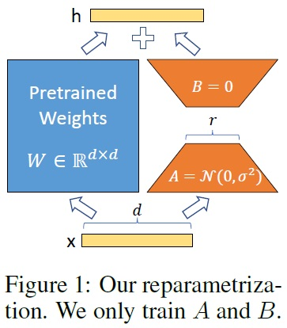
  

**내재 차원: 모델의 학습 또는 적응 과정에서 실제로 중요한 정보나 특성을 나타내는 차원의 수를 의미한다. 즉, 모델이 가진 많은 매개변수들 중에서 실제로 데이터의 패턴이나 구조를 학습하는 데 중요한 매개변수의 수가 상대적으로 적다는 것을 뜻한다.* 

**"저순위(low-rank)"라는 표현은 선형 대수학에서 나오는 개념으로, 행렬의 '순위(rank)'와 관련이 있다. 행렬의 순위는 그 행렬이 포함하고 있는 독립적인 정보의 양을 나타내는 척도로, 행렬이 포함할 수 있는 최대 독립 벡터의 수를 의미한다. 예를 들어, 순위가 낮은 행렬은 그 안에 많은 정보가 중복되거나 불필요하게 포함되어 있지 않음을 나타낸다.*

**LoRA는 기존 신경망의 밀집 층(Dense Layers)를 직접 변경하지 않고, 해당 층의 가중치 변화에 초점을 맞춘다. 'Rank Decomposition Matrices'는 가중치 행렬을 낮은 순위의 두 행렬의 곱으로 분해하는 방식을 의미한다. 예를 들어, 큰 가중치 행렬을 두 개의 작은 행렬로 분해하고, 이 두 행렬의 곱으로 원래 행렬의 중요한 특성을 근사하게 표현한다.*

## 2 PROBLEM STATEMENT
 - LoRA(Low-Rank Adaptation) 기법이 어떠한 특정한 학습 목표나 작업에 국한되지 않고 광범위하게 적용될 수 있으며, LoRA가 언어 모델링과 같은 특정한 작업에 특히 유용하게 사용될 수 있음을 평가한다.
 - 작업별 프롬프트가 주어진 조건부 확률의 최대화에 초점을 맞춘다.
 - 예로 GPT와 같은 Transformer 아키텍처에 기반한 모델을 든다.
 - 요약, 기계 독해(MRC), 자연어에서 SQL(NL2SQL)과 같은 downstream task에 적응시킨다.
 - 각 downstream task는 컨텍스트-타겟 쌍(context-target pairs)의 학습 데이터셋으로 표현된다.
 - 전체 조정(full fine-tuning)의 주요 단점 중 하나는 각 downstream task에 대해 사전 학습된 모델과 같은 크기의 파라미터 세트를 학습한다.
 - 따라서 큰 모델의 경우(예: GPT-3), 독립적으로 파인 튜닝된 모델을 저장하고 배포하는 것은 실용적이지 않다.
 - 본 논문에서는 작업별 매개변수 증가($∆Φ$)를 더 작은 크기의 매개변수 집합($\Theta$)으로 인코딩한다.
 - 이 접근 방식은 $\vert \Theta \vert$의 크기가 $\vert Φ0\vert$(사전 학습된 모델의 매개변수 크기)보다 훨씬 작다.
 - 따라서, $∆Φ$를 찾는 과제는 이제 $\Theta$에 대한 최적화로 변환된다. 즉, 전체 모델을 업데이트하는 대신 $\Theta$에 대해서만 최적화 진행을 의미한다.
 - 계산 및 메모리 효율적인 저순위 표현(low-rank representation)을 사용하여 $∆Φ$를 인코딩한다.
 - GPT-3 175B와 같은 모델에서는 학습 가능한 매개변수가 원래 모델의 0.01%만큼 작을 수 있다.

## 3 AREN’T EXISTING SOLUTIONS GOOD ENOUGH?
 - 모델 적응을 위한 기존 연구들(Section 6)
   - ① 어댑터 층 추가(adding adapter layer): Houlsby et al., 2019; Rebuffi et al., 2017; Pfeiffer et al., 2021; Ruckl et al., 2020.
   - ② 입력 층 활성화의 형태 최적화(optimizing some forms of the input layer activation): Li & Liang, 2021; Lester et al., 2021; Hambardzumyan et al., 2020; Liu et al., 2021.
   - 두 전략 모두 대규모 및 지연 시간에 민감한 생산 시나리오에 한계가 존재한다.
 - **Adapter Layers Introduce Inference Latency.**
   - 여러 어댑터 층 변형이 있으나 추론 지연 문제를 유발한다.
   - 층을 줄이거나 멀티 태스크 설정을 활용하여 지연을 줄일 수 있지만, 어댑터 층의 추가 계산을 우회할 방법은 없다.
   - 어댑터 층은 설계상 매개변수가 적고 병목 차원이 작기 때문에 추가되는 FLOP의 양에 제한이 있다.
   - 대규모 신경망에서는 하드웨어 병렬성에 의존하여 낮은 지연 시간을 유지하는데 어댑터 층은 순차적으로 처리되어야 한다. Table 1과 같이 이는 배치 크기가 작은 온라인 추론 설정에서 지연 시간을 증가시키는 요인이 된다.
   - 모델을 여러 GPU에 나누어 처리(샤드; shard)해야 하는 경우, 어댑터 층의 추가 깊이는 AllReduce와 Broadcast와 같은 더 많은 동기 GPU 작업을 필요로 하며, 이는 추가적인 지연을 초래할 수 있다.
 - **Directly Optimizing the Prompt is Hard**
   - 프리픽스 튜닝(Li & Liang, 2021)과 같은 방법은 최적화가 어렵고, 학습 가능한 매개변수 수에 따라 성능이 비단조적(즉, 일관되지 않게) 변화를 보인다.
   - 프롬프트 최적화를 위해 시퀀스 길이의 일부를 예약(reserving a part of the sequence length)하면, 이는 자연스럽게 downstream task를 처리할 수 있는 시퀀스 길이가 줄어든다.
   - 이로 인해 다른 방법들에 비해 프롬프트 튜닝의 성능이 떨어질 것으로 예상된다.(Section 5)

  

  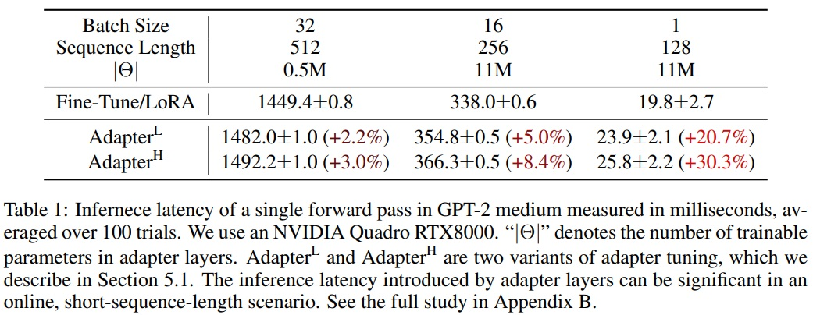
  

**reserving a part of the sequence length은 프롬프트 최적화나 프리픽스 튜닝과 같은 방법에서 사용되는 개념이다. sequence length는 모델이 한 번에 처리할 수 있는 토큰의 최대 개수를 의미하며, 프롬프트 최적화나 프리픽스 튜닝에서는 이 시퀀스 길이 중 일부를 적응(adaptation)이나 튜닝(tuning)을 위한 고정된 토큰(프롬프트)으로 'reserving' 한다.*

## 4 OUR METHOD
### 4.1 LOW-RANK-PARAMETRIZED UPDATE MATRICES
 - 신경망은 행렬 곱셈을 수행하는 많은 밀집 층을 포함한다.
 - 이 층들은 일반적으로 전순위 가중치 행렬을 갖는다.
 - Aghajanyan et al. (2020)에 영감을 받아 적응 중 가중치 업데이트가 낮은 '내재적 차원'를 가진다고 가정한다.
 - 사전 학습된 가중치 행렬 $W_0∈R^{d×k}$의 업데이트는 저순위 분해 $W_0+∆W=W_0+BA$로 표현한다. 여기서, $B∈R^{d×r}, A∈R^{r×k}$로, 순위 $r \ll $min(d, k)$이다.
 - 학습 과정에는 $W_0$는 고정되어 있으며 그라디언트 업데이트를 받지 않으며, $A$와 $B$에는 학습 가능한 매개변수가 포함된다.
 - 수정된 순방향 패스는 $h=W_0x + ∆Wx = W_0x + BAx$를 생성한다.
 - $A$에 대한 무작위 가우시안 초기화와 $B$에 대한 0 초기화를 사용하여 학습 시작 시 $∆W = BA$는 0이 된다.(Fig 1)
 - $∆Wx$를 $α/r$로 스케일링하여 $r$을 변화시킬 때 하이퍼파라미터 재조정의 필요성을 줄여준다(Yang & Hu, 2021).
 - **A Generalization of Full Fine-tuning.**
   - 사전 학습된 매개변수의 하위 집합을 학습하는 파인 튜닝의 일반적 형태이다.
   - LoRA는 적응 중 가중치 행렬의 누적된 그라디언트 업데이트가 전순위일 필요가 없다는 점에서 차별화된다.
   - 모든 가중치 행렬에 LoRA를 적용하고 모든 편향을 학습할 경우, 전체 파인 튜닝의 표현력을 대략적으로 회복한다.
 - **No Additional Inference Latency.**
   - 배포 시 $W = W_0 + BA$를 명시적으로 계산하여 저장하고 평소와 같이 추론을 수행할 수 있다.
   - 다른 downstream task로 전환 시 $W_0$를 빠르게 복구할 수 있으며, 추가적인 추론 지연을 도입하지 않는다.

**사전 학습된 가중치 행렬(W_0)에서 d와 k는 각각 행렬의 행과 열의 차원을 의미한다. 저순위 분해는 가중치 행렬의 업데이트를 더 작은 두 행렬의 곱으로 표현하는 방식으로 W_0 + ∆W = W_0 + BA는 원래 가중치 행렬 W_0에 추가적인 업데이트 ∆W를 적용한다는 것을 의미한다. ∆W는 BA의 곱으로 표현되며, 학습 가능한 새로운 매개변수이다. 이 접근법의 핵심은 모델의 가중치를 업데이트할 때 모든 원본 가중치를 직접 수정하지 않고, 저순위 행렬을 이용하여 모델을 효율적으로 조정하고, 파라미터 수를 크게 줄이는 것이다.*

### 4.2 APPLYING LORA TO TRANSFORMER
 - 신경망의 가중치 행렬 부분 집합에 LoRA를 적용하여 학습 가능한 매개변수 수 감소를 목표로 한다.
 - self-attention 모듈에는 네 개의 가중치 행렬($W_q$, $W_k$, $W_v$, $W_o$)과 MLP 모듈에 두 개의 가중치 행렬이 존재한다.
 - $W_q$(또는 $W_k$, $W_v$)를 $d_{model} \times d_{model}$ 차원의 단일 행렬로 취급한다.
 - 주로 only adapting the attention weights하고 MLP 모듈은 고정한다(downstream task에서 학습되지 않음).
 - **Practical Benefits and Limitations.**
   - 메모리 및 저장소 사용 감소가 주요 이점이다.
   - 특히 Adam으로 학습된 큰 트랜스포머에서 VRAM 사용량을 크게 줄이고, 학습 시간을 단축시킨다.
   - GPT-3 175B의 경우, 학습 중 VRAM 소비를 1.2TB에서 350GB로 감소시킨다.
   - 체크포인트 크기는 대략 10,000배 감소(350GB에서 35MB로)시킨다.
   - 적은 GPU로 학습 가능하며, I/O 병목 현상 회피한다.
   - 배포된 상태에서 작업 간 전환 시 모든 매개변수 대신 LoRA 가중치만 교체한다.
   - VRAM에 사전 학습된 가중치를 저장한 기계에서 맞춤형 모델로 즉시 교체하는 데 유리하다.
   - 전체 파인 튜닝 대비 GPT-3 175B에서 학습 중 25% 속도 향상한다.
   - LoRA의 한계
     - ① 서로 다른 작업에 대한 입력을 단일 순방향 패스로 일괄 처리하는 것이 직관적이지 않다.
     - ② 추론 지연이 중요하지 않은 시나리오에서 배치 내 샘플에 대한 LoRA 모듈을 동적으로 선택하는 것 가능하다.

## 5 EMPIRICAL EXPERIMENTS
### 5.1 BASELINES
 - **Fine-Tuning (FT)**
   - 모델이 사전 학습된 가중치와 편향으로 초기화되고 모든 모델 매개변수가 그라디언트 업데이트를 거친다.
   - 일부 레이어만 업데이트하고 다른 레이어를 고정하는 간단한 변형을 포함한다.
   - 마지막 두 레이어만 적응하는(**$FT^{Top2}$**)을 포함한다.
 - **Bias-only or BitFit**
   - 다른 모든 것을 고정하고 편향 벡터만 학습하는 기준선이다.
   - 최근 BitFit(Zaken et al., 2021)에 의해 연구되었다.
 - **Prefix-embedding tuning (PreEmbed)**
   - 입력 토큰 사이에 특별한 토큰을 삽입한다. 
   - 이 특별한 토큰들은 학습 가능한 단어 임베딩을 가지며 일반적으로 모델의 어휘에 포함되어 있지 않다.
   - 이러한 토큰을 어디에 배치하는지는 성능에 영향을 미칠 수 있다.
   - 접두사화(프롬프트 앞에 추가)와 중간 삽입(프롬프트 뒤에 추가)에 초점을 맞춘다(Li & Liang, 2021).
 - **Prefix-layer tuning (PreLayer)**
   - PreEmbed의 확장이다.
   - 특별한 토큰들의 단어 임베딩뿐만 아니라 모든 트랜스포머 아키텍처 내 레이어를 거친 후의 데이터 표현(활성화)을 학습한다.
   - 이전 레이어에서 계산된 활성화는 학습 가능한 것으로 단순히 교체된다.
   - 결과적으로 학습 가능한 매개변수의 수는 $\vert \Theta \vert = L \times d_{model} \times (l_p + l_i)$가 되며, $L$은 트랜스포머 레이어의 수이다.
 - **Adapter tuning**
   - self-attention 모듈과 MLP 모듈 사이에 어댑터 층(adapter layer)을 삽입한다.
   - 어댑터 층에는 두 개의 완전 연결 레이어와 중간의 비선형성이 있다.($Adapter^H$)
   - 여러 디자인(예: $Adapter^H$, $Adapter^L$, $Adapter^P$, $Adapter^D$)이 제안되었다.
 - **LoRA**
   - 기존 가중치 행렬에 병렬로 학습 가능한 순위 분해 행렬 쌍을 추가한다.
   - 대부분의 실험에서는 $W_q$와 $W_v$에만 LoRA를 적용한다.(Section 4.2)
   - 학습 가능한 매개변수의 수는 순위 $r$과 가중치의 형태에 의해 결정된다.

### 5.2 ROBERTA BASE/LARGE
 - RoBERTa (Liu et al., 2019)는 오리지날 BERT (Devlin et al., 2019a)에서 제안된 사전 학습 레시피를 최적화하고 많은 학습 가능한 매개변수를 추가하지 않고도 후자의 작업 성능을 향상시켰다. 
 - NLP 리더보드에서 큰 모델에 의해 추월되었지만 여전히 실무에서 사용되고 있다.
 - HuggingFace Transformers 라이브러리에서 RoBERTa base(125M)와 RoBERTa large(355M)를 사용한다.
 - GLUE 벤치마크의 작업에 대해 다양한 효율적인 적응 접근법의 성능을 평가한다.
 - Houlsby et al.(2019)와 Pfeiffer et al.(2021)의 설정을 복제하여 실험한다.
 - 공정한 비교를 보장하기 위해 어댑터와 비교할 때 LoRA를 평가하는 방법에 두 가지 중요한 변경 사항을 적용한다. 
   - ① 모든 작업에 대해 동일한 배치 크기를 사용하고 어댑터 기준선과 일치하도록 시퀀스 길이를 128로 설정한다. 
   - ② MRPC, RTE, STS-B에 대한 모델을 사전 학습된 모델로 초기화하고, 파인 튜닝 기준선처럼 이미 MNLI에 적응된 모델이 아닌 것으로 설정한다.
 - 실험 결과에 대한 상세 내용은 Table 2에서 보고한다.
 - 사용된 하이퍼파라미터에 대한 자세한 내용은 Appendix D.1에 있다.

  

  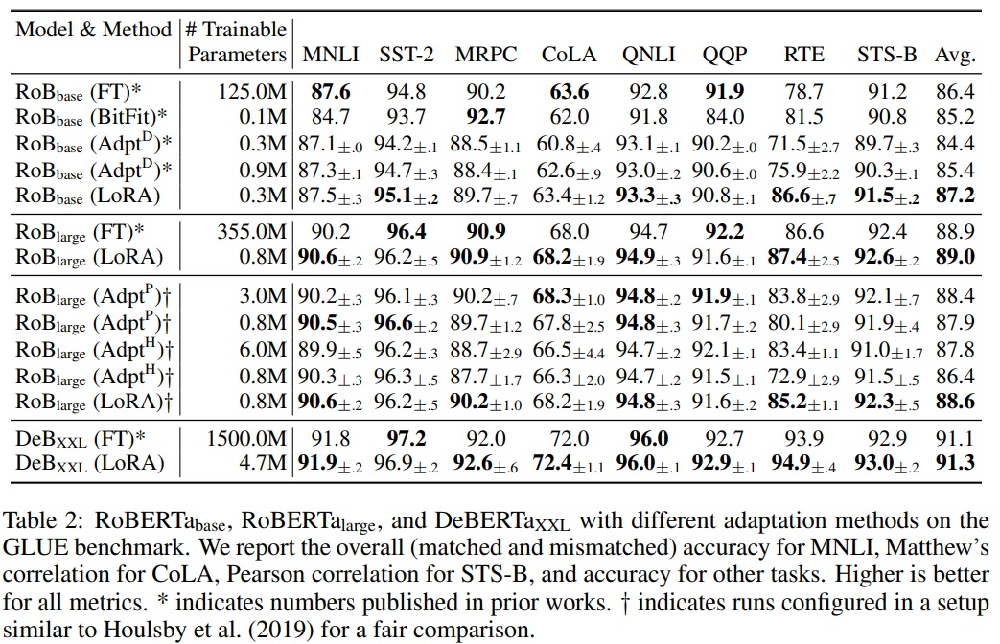
  

**MRPC (Microsoft Research Paraphrase Corpus): 이 데이터셋은 문장 쌍이 서로 같은 의미를 지니는지(즉, 서로가 재구성된 문장인지)를 평가하는 작업으로, 주로 문장 재구성 능력을 평가하는 데 사용된다.*

**RTE (Recognizing Textual Entailment): RTE는 주어진 두 문장 사이의 논리적 추론 관계를 판별하는 작업으로 한 문장이 다른 문장을 함축하는지(즉, 한 문장이 사실일 때 다른 문장도 사실인지)를 평가한다.*

**STS-B (Semantic Textual Similarity Benchmark): 이 데이터셋은 두 문장 사이의 의미적 유사성을 평가하는 작업으로 문장 쌍이 얼마나 의미적으로 유사한지를 0부터 5까지의 점수로 측정한다.*

**MNLI (Multi-Genre Natural Language Inference): MNLI는 다양한 장르와 소스에서 수집된 문장 쌍을 사용하여, 한 문장이 다른 문장을 함축, 모순 또는 중립적인지를 분류하는 작업을 평가한다.*

### 5.3 DEBERTA XXL
 - DeBERTa (He et al., 2021)는 BERT의 최신 변형으로, 훨씬 더 큰 규모에서 학습되어 GLUE (Wang et al., 2019) 및 SuperGLUE (Wang et al., 2020) 벤치마크에서 매우 경쟁력 있는 성능을 보인다.
 - 실험 목적으로 LoRA가 GLUE에서 완전하게 파인 튜닝된 DeBERTa XXL(1.5B)의 성능과 일치하는지 평가한다.
 - 실험 결과에 대한 상세 내용은 Table 2(하단 섹션)에서 보고한다.
 - 사용된 하이퍼파라미터에 대한 자세한 내용은 Appendix D.2에 있다.

### 5.4 GPT-2 MEDIUM/LARGE
 - LoRA가 자연어 생성(NLG) 모델, 특히 GPT-2 Medium과 Large에서도 경쟁력 있는지 평가한다.
 - 직접 비교를 위해 Li & Liang (2021)의 설정과 가능한 한 가깝게 유지한다.
 - E2E NLG Challenge에 대한 결과는 Table 3에서 제시한다.
 - WebNLG (Gardent et al., 2017) 및 DART (Nan et al., 2020)에 대한 결과는 F.1절에서 확인할 수 있다.
 - 사용된 하이퍼파라미터에 대한 자세한 내용은 Appendix D.3에 있다.

  

  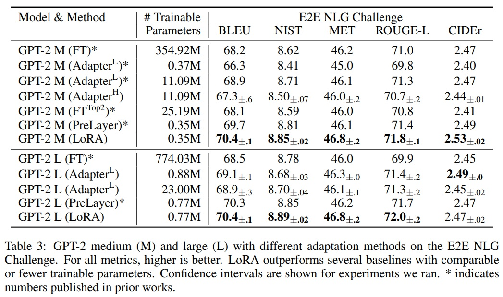
  

### 5.5 SCALING UP TO GPT-3 175B
 - LoRA를 1750억 개 매개변수를 가진 GPT-3으로 확장한다.
 - 높은 학습 비용으로 인해 각 항목에 대한 표준 편차 대신 주어진 작업에 대한 무작위 시드의 전형적인 표준 편차만 보고한다.
 - Table 4에 따르면 LoRA는 세 데이터셋 모두에서 파인 튜닝 기준선과 일치하거나 그 성능을 초과한다.
 - Fig 2와 같이 학습 가능한 매개변수가 많아져도 모든 방법이 단조롭게 혜택을 받지 않는다.
 - 우리는 접두사-임베딩 튜닝에 256개 이상의 특별 토큰을 사용하거나 접두사-레이어 튜닝에 32개 이상의 특별 토큰을 사용할 때 성능이 크게 떨어지는 것이 관찰된다.
 - 다양한 적응 접근법의 적은 데이터(low-data) 환경에서의 성능은 Section F.3에서 조사한다.
 - 사용된 하이퍼파라미터에 대한 자세한 내용은 Appendix D.4에 있다.

  

  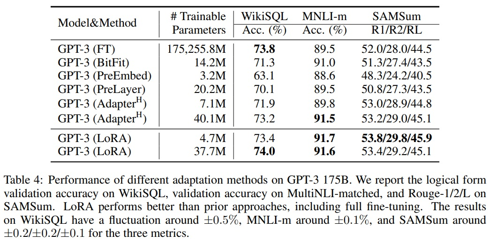
    
  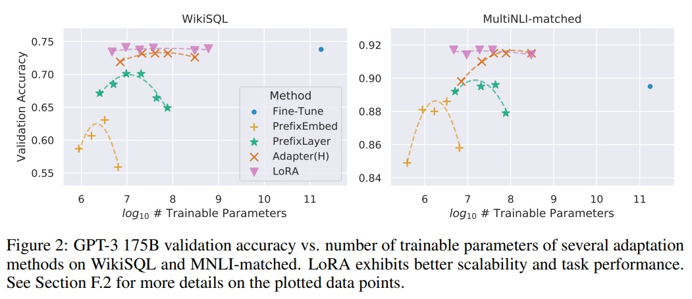
  

## 6 RELATED WORKS
 - **Transformer Language Models.**
   - 트랜스포머는 self-attention을 많이 사용하는 시퀀스-투-시퀀스 아키텍처다.
   - BERT와 GPT-2는 사전 학습 후 작업별 데이터로 파인 튜닝하는 새로운 패러다임을 도입했다.
   - 더 큰 트랜스포머를 학습하는 것은 일반적으로 더 나은 성능으로 이루어지며 현재 대세 방향이다.
 - **Prompt Engineering and Fine-Tuning.**
   - GPT-3 175B는 몇 가지 추가 학습 예제만으로도 행동을 조정할 수 있지만, 결과는 입력 프롬프트에 크게 의존한다(Brown et al., 2020).
   - 파인 튜닝은 모델을 일반 도메인에서 사전 학습된 상태에서 특정 작업으로 재학습하는 것이다(Devlin et al., 2019b; Radford et al., a).
    -  GPT-3 175B의 거대함은 사전 학습 때와 동일한 메모리 발자국(memory footprint)을 가지고 있어, 파인 튜닝을 평소 방식으로 수행하기 어렵게 만든다.
 - **Parameter-Efficient Adaptation.**
   - 기존 많은 연구에서 어댑터 층을 신경망의 기존 레이어 사이에 삽입하는 방법이 제안되었다(Houlsby et al., 2019; Rebuffi et al., 2017; Lin et al., 2020).
   - LoRA는 가중치 업데이트에 저순위 제약을 부과하는 유사한 병목 구조를 사용한다.
   - 핵심적인 기능적 차이점은 LoRA가 학습한 가중치를 추론 중에 주요 가중치와 병합할 수 있어서 추론 지연을 도입하지 않는다는 것이다(Section 3).
   - 실험 섹션에서  Li & Liang (2021)과의 비교한다.
 - **Low-Rank Structures in Deep Learning.**
    - 저순위 구조는 기계 학습에서 매우 흔하다.
    - 과도하게 매개변수화된 신경망을 가진 딥러닝 작업에서 저순위 특성을 보인다.(Li et al., 2016; Cai et al., 2010; Li et al., 2018b; Grasedyck et al., 2013).
   - 일부 이전 연구에서는 신경망 학습 시 저순위 제약을 명시적으로 부과했다.
   - 기존 연구들은 downstream task에 대한 적응을 위해 고정된 모델에 저순위 업데이트를 고려하지 않았다.
   - 신경망이 저순위 구조를 가진 개념 클래스에 대해 다른 학습 방법보다 우수하다는 것이 이론적으로 알려져 있다.
   - 저순위 적응이 적대적 학습에 유용할 수 있다는 이론적 결과가 있다.

## 7 UNDERSTANDING THE LOW-RANK UPDATES
 - 저순위 구조는 하드웨어 진입 장벽을 낮추고, 업데이트된 가중치와 사전 학습된 가중치 간의 상관 관계를 더 잘 해석할 수 있게 한다.
 - GPT-3 175B에 초점을 맞추며, 작업 성능에 부정적인 영향 없이 학습 가능한 매개변수를 최대 10,000배 줄였다.
 - 하기 질문에 대답하기 위해 경험적 연구 수행한다.
   - ① 매개변수 예산 제약이 주어졌을 때, downstream 성능을 최대화하기 위해 어떤 가중치 행렬 부분 집합을 적응시켜야 하는가?
   - ② "최적"의 적응 행렬 $∆W$는 순위가 부족한가? 실제로 사용하기에 좋은 순위는 무엇인가?
   - ③ $∆W$와 $W$ 사이의 연결은 무엇인가? $∆W$는 $W$와 높은 상관관계를 가지는가? $∆W$의 크기는 $W$에 비해 어느 정도인가?

### 7.1 WHICH WEIGHT MATRICES IN TRANSFORMER SHOULD WE APPLY LORA TO?
 - 제한된 매개변수 예산 하에서, downstream 작업에서 최고의 성능을 얻기 위해 적응할 가중치 유형을 결정한다.
 - 자기주의 모듈의 가중치 행렬만을 고려한다.
 - GPT-3 175B에서 18M 매개변수 예산(대략 FP16으로 저장된 경우 35MB)을 설정한다.
 - 이는 하나의 attention weight 유형을 적응하는 경우 $r = 8$, 두 가지 유형을 적응하는 경우 $r = 4$로 설정한다.
 - 실험 결과는 Table 5에 보고되어있다.
 - $∆W_q$나 $∆W_k$에 모든 매개변수를 넣는 것은 현저히 낮은 성능을 가져오는 반면, $W_q$와 $W_v$를 모두 적응하는 것이 최고의 결과를 가져온다.
 - 네 가지 순위가 $∆W$에서 충분한 정보를 포착하여 하나의 가중치 유형을 더 큰 순위로 적응하는 것보다 더 많은 가중치 행렬을 적응하는 것이 바람직하다.

  

  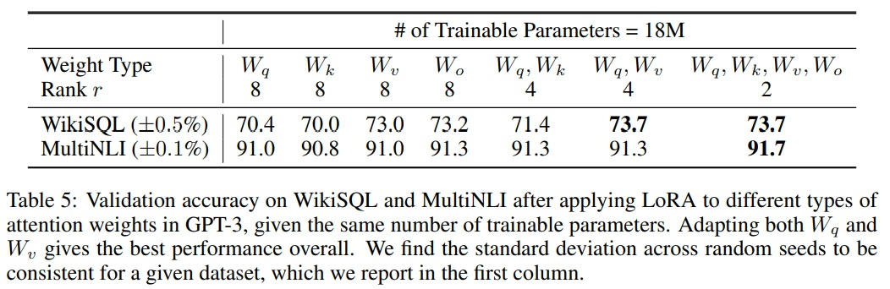
  

### 7.2 WHAT IS THE OPTIMAL RANK $r$ FOR LORA?
 - LoRA를 적용할 때 선택하는 순위 $r$이 모델의 성능에 어떤 영향을 미치는지를 조사하는 것에 초점을 맞춘다.
 - 여기서 순위 $r$은 LoRA가 적용되는 가중치 행렬의 저순위 특성을 정의한다.
 - Table 6과 같이 {$W_q$, $W_v$}, {$W_q$, $W_k$, $W_v$, $W_c$}, 그리고 $W_q$에만 LoRA를 적용하여 비교한다.
 - 실험 결과는 LoRA가 작은 순위 $r$로도 경쟁력 있는 성능을 보인다는 것을 보인다.
 - 이는 LoRA의 업데이트 행렬 $∆W$가 실제로는 매우 낮은 '내재적 차원'의 특성을 가지고 있음을 시사한다.
 - 다양한 $r$ 값과 무작위 시드를 사용하여 LoRA를 학습할 때 생성되는 부공간의 중첩을 분석한다.
 - 순위 $r$의 증가가 반드시 더 의미 있는 부공간을 포함하지 않을 수 있음을 보여준다.
 - **Subspace similarity between different $r$.**
   - Fig 3은 $r$ = 8과 64를 사용하여 학습된 적응 행렬 $A_r=8$과 $A_r=64$의 부공간 유사성을 분석한다.
   - 상위 $i$ 특이 벡터가 $j$ 특이 벡터의 부공간에 얼마나 포함되어 있는지 측정한다.
   - 상위 특이 벡터 방향이 $A_r=8$과 $A_r=64$ 간에 상당히 중첩됨을 관찰되며, 이는 LoRA가 작은 순위로도 효과적일 수 있음을 시사한다.
 - **Subspace similarity between different random seeds.**
   - 같은 순위 $r = 64$를 사용하지만 서로 다른 무작위 시드로 학습된 모델 간의 부공간 유사성을 분석한다.
   - $∆W_q$는 $∆W_v$보다 "내재적 차원"가 더 높음을 발견한다.
   - 두 무작위 가우시안 행렬과의 비교도 수행한다.

  

  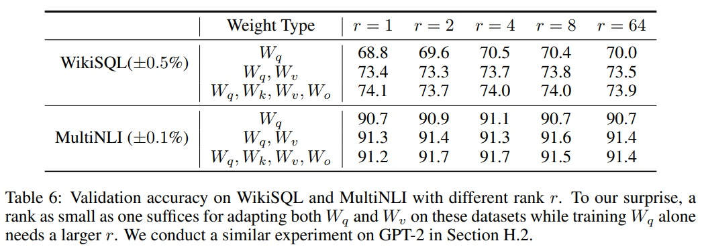
   
  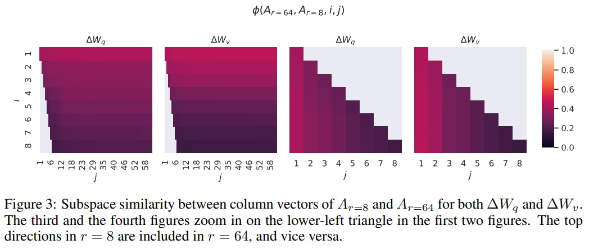
  

### 7.3 HOW DOES THE ADAPTATION MATRIX $∆W$ COMPARE TO $W$?
 -  적응 행렬 $∆W$가 사전 학습된 모델의 원래 가중치 $W$와 어떤 상관관계를 가지는지, 그리고 $∆W$의 크기가 $W$와 비교해 얼마나 큰지를 조사한다. 이를 통해 적응 행렬이 원래 가중치와 어떻게 상호작용하는지 이해하기 용이하다.
 - $∆W$의 $r$차원 부공간에 $W$를 투영하여 두 가중치 간의 관계를 더 구체적으로 분석한다.
 - $∆W$의 $r$차원 부공간으로 $W$를 투영한다($U^\top WV^\top$ 계산).
 - $\Vert U^\top WV^\top \Vert _F$와 $\Vert W \Vert _F$의 프로베니우스 노름(Frobenius norm)을 비교한다.
 - $U$와 $V$는 $∆W$의 좌우 특이 벡터 행렬이며, 이를 통해 $W$를 $∆W$의 부공간에 매핑한다.
 - $∆W$는 무작위 행렬과 비교하여 $W$와 더 강한 상관관계를 가진다.
 - $∆W$가 $W$에 이미 존재하는 특정 특징을 강화한다는 것을 시사한다.
 - $∆W$는 $W$의 상위 특이 방향을 단순히 반복하는 것이 아니라 $W$에서 강조되지 않은 방향을 강화한다는 것을 나타낸다.
 - $∆W$의 증폭 인자는 상당히 크다(예: $r = 4$의 경우 약 $21.5 ≈ 6.91/0.32$).
 - 서로 다른 $r$에 대한 적응 행렬 간 그리고 무작위 시드 간의 부공간 유사성을 분석한다.
 - 이는 다양한 설정에서 $∆W$가 어떻게 학습되는지 이해하는 데 도움이 된다.
 - 저순위 적응 행렬이 특정 downstream task에 대한 중요한 특징을 증폭할 수 있음을 시사한다.

  

  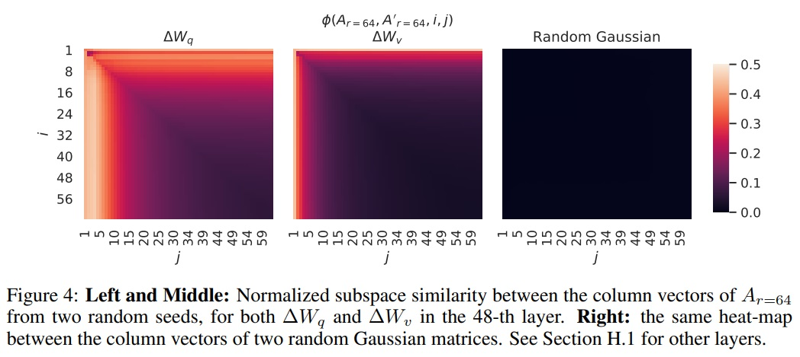
   
  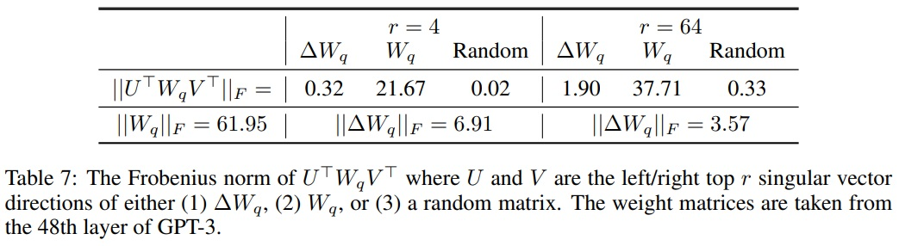
  

## 8 CONCLUSION AND FUTURE WORK
 - 거대한 언어 모델을 파인 튜닝하는 것은 필요한 하드웨어 측면과 다양한 작업에 대한 독립적인 인스턴스를 호스팅하는 데 드는 저장/전환 비용 측면에서 지나치게 비용이 많이 든다.
 - LoRA는 추론 지연을 도입하지 않고 입력 시퀀스 길이를 줄이지 않으면서 높은 모델 품질을 유지한다.
 - LoRA는 서비스로 배포될 때 빠른 작업 전환을 가능하게 한다.
 - 트랜스포머 언어 모델에 초점을 맞추었지만 dense layer가 있는 어떤 신경망에도 일반적으로 적용될 수 있다.
 - 향후 연구 방향
   - ① LoRA는 다른 효율적인 적응 방법과 결합될 수 있다.
   - ② 파인 튜닝이나 LoRA의 메커니즘이 아직 명확하지 않다.
   - ③ LoRA를 적용할 가중치 행렬을 선택하는 데에는 대부분 휴리스틱에 의존한다. 이를 더 원칙적인 방법으로 할 수 있는 방법이 필요하다.
   - ④ $∆W$의 순위 결핍성(rank-deficiency)은 W도 순위 결핍일 수 있음을 시사하며, 이는 향후 연구의 영감의 원천이 될 수 있다.

**rank-deficiency: 행렬이 가질 수 있는 최대 순위보다 낮은 순위를 가지고 있을 때 사용된다. 행렬의 순위는 해당 행렬에서 선형 독립인 행 또는 열의 최대 수를 의미한다. 예를 들어, 언어 모델의 경우 "rank-deficiency"는 모델이 학습 과정에서 데이터의 일부만을 학습하거나, 데이터 내 중요하지 않은 특성에 집중하고 있음을 나타낼 수 있습니다.*