*시각-언어 사전 학습(Vision-Language Pre-training, VLP)은 많은 시각-언어 작업의 성능을 향상시켰다. 그러나 대부분의 기존 사전 학습된 모델들은 이해 기반 작업이나 생성 기반 작업 중 하나에서만 뛰어나다. 또한, 성능 향상은 대부분 웹에서 수집된 잡음이 많은 이미지-텍스트 쌍을 데이터셋에 확장함으로써 이루어졌는데, 이는 최적의 감독 원천이 아니다. 이 논문에서는 시각-언어 이해와 생성 작업 모두에 유연하게 전환할 수 있는 새로운 VLP 프레임워크인 BLIP을 제안한다. BLIP은 캡셔너가 합성 캡션을 생성하고 필터가 잡음이 많은 것들을 제거하는 캡션 부트스트래핑을 통해 잡음이 많은 웹 데이터를 효과적으로 활용한다. 본 논문에서는 이미지-텍스트 검색(평균 recall@1에서 +2.7%), 이미지 캡셔닝(CIDEr에서 +2.8%), VQA(VQA 점수에서 +1.6%) 등 다양한 시각-언어 작업에서 최고의 성과를 달성했다. BLIP은 또한 제로샷 방식으로 비디오-언어 작업에 직접 전환될 때 강력한 일반화 능력을 보여준다. 코드, 모델, 데이터셋은 이 [HTTP URL](https://github.com/salesforce/BLIP){:target="_blank"}에서 공개된다.*

## 📋 Table of Contents

- [1.Introduction](#1introduction)
- [2.Related Work](#2related-work)
- [3.Method](#3method)
- [4.Experiments and Discussions](#4experiments-and-discussions)
- [5.Comparison with State-of-the-arts](#5comparison-with-state-of-the-arts)
- [6.Additional Ablation Study](#6additional-ablation-study)
- [7.Conclusion](#7conclusion)
- [A.Downstream Task Details](#adownstream-task-details)
- [B.Additional Examples of Synthetic Captions](#badditional-examples-of-synthetic-captions)
- [C.Pre-training Dataset Details](#cpre-training-dataset-details)

## 1.Introduction
- 모델 관점: 인코더 기반은 텍스트 생성에 한계, 인코더-디코더 기반은 검색 작업에 한계 존재한다.
- BLIP(Bootstrapping Language-Image Pre-training)은 통합된 시각-언어 이해 및 생성을 위한 새로운 VLP 프레임워크로, 기존 방법들보다 더 넓은 범위의 다운스트림 작업을 가능하게 한다.
- 데이터 관점에서의 기여점:
  - ① Multimodal mixture of Encoder-Decoder (MED)는 이미지-텍스트 대조 학습, 이미지-텍스트 매칭, 이미지 조건부 언어 모델링을 활용하여 사전 학습한다.
  - ② Captioning and Filtering (CapFilt)는 노이즈가 많은 이미지-텍스트 쌍에서 학습하기 위한 데이터셋 부트스트래핑 방법이다.

  

  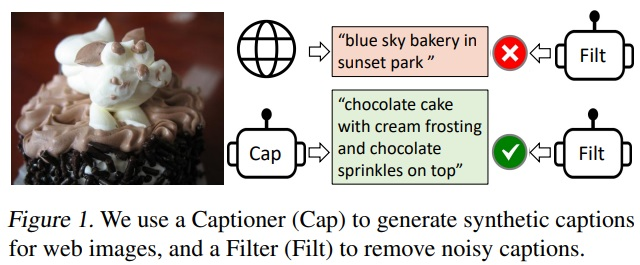
  

## 2.Related Work
### 2.1.Vision-language Pre-training
- 대규모 이미지-텍스트 쌍으로 사전 학습하고 다운스트림 작업의 성능을 향상시키는 것을 목표로 한다.
- 레이블링 작업의 한계를 해결하기 위해 웹에서 크롤링한 이미지와 대체 텍스트(alt-text)쌍을 활용한다.
- 웹 크롤링한 이미지 데이터셋은 노이즈가 심하여 모델 성능에 영향을 미친다.
- Understanding-based tasks(e.g. image-text retrieval)와 generation-based tasks(e.g. image captioning)은 VL 테스크를 싱글 프레임워크로 통합하고자 하였다.
- 기존 인코더 기반과 인코더-디코더 모델의 성능은 한계가 있었고, BLIP은 멀티모달 믹스처 오브 인코더-디코더 모델을 제안하여 문제 해결한다.

### 2.2.Knowledge Distillation
- 교사 모델로부터 지식을 추출하여 학생 모델의 성능을 향상하는 것을 목표로 한다.
- BLIP에서는 "CapFilt"을 제안하며, "Cap(캡셔너)"가 합성 캡션을 통해 지식을 전달하고, "Filt(필터)"가 잡음이 많은 캡션을 제거함으로써 지식을 증류하는 방식을 사용한다

### 2.3.Data Augmentation
- 데이터 증강은 컴퓨터 비전 테스크에서 널리 사용되지만, 언어 테스크에서는 DA가 직관적이지 않다.
- BLIP은 대규모 시각-언어 사전 학습에서 합성 캡션의 장점을 갖는다.

## 3.Method

  

  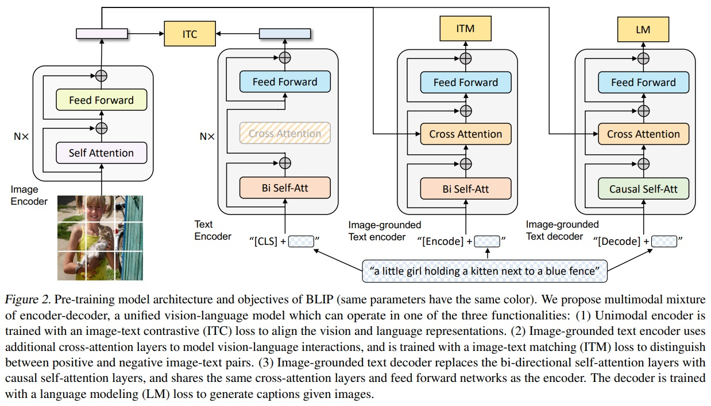
  

### 3.1.Model Architecture
- ViT 사용: 이미지 인코딩을 위해 vision transformer를 사용한다.
- MED: 이미지와 텍스트를 처리할 수 있는 멀티테스크 모델이다.
- **Unimodal encoder**
  - 이미지와 텍스트를 별도로 인코딩한다.
  - 텍스트 인코더는 BERT와 동일하며, 문장 요약을 위해서 텍스트 입력의 시작부분에 [CLS] 토큰이 추가된다.
- **Image-grounded text encoder**
  - 시각 정보를 텍스트 인코딩에 통합한다. 각 transformer 블록의 Self-Attention(SA) layer와 Feed Forward Network(FFN) 사이에 추가적인 Cross-Attention(CA) layer를 삽입하여 시각 정보를 주입한다.
  - 테스크 특정 [Encode] 토큰이 텍스트에 추가되며, [Encode]의 출력 임베딩은 이미지-텍스트 쌍의 멀티모달 표현으로 사용한다.
- **Image-grounded text decoder**
  - bidirectional self-attention layers을  causal self-attention layers으로 대체하여 주어진 이미지에 대한 텍스트 생성한다.
  - [Decode] 토큰은 생성 과정의 시작과 끝에 쓰인다.

### 3.2.Pre-training Objectives
- 사전 학습 동안 이해 기반 목표 두개와 생성 기반 목표 하나로 구성하여 최적화한다.
- 각 이미지-텍스트 쌍은 계산적으로 더 무거운 시각 트랜스포머를 통해 한 번의 전방 패스를 필요로 하며, 텍스트 트랜스포머를 통해 세 번의 전방 패스를 필요로 한다.
- 다양한 기능이 활성화되어 세가지 손실을 계산한다.
- **이미지-텍스트 대조 손실(Image-Text Contrastive Loss, ITC)**
  - Unimodal encoder를 활성화시키고, vision transformer와 text transformer의 feature space를 얼라인한다.
  - 이는 긍정적인 이미지-텍스트 쌍이 부정적인 쌍과 대비되도록 유사한 표현을 갖게 한다. 
  - 시각 및 언어 이해를 개선하는데 효과적이다.
- **이미지-텍스트 매칭 손실(Image-Text Matching Loss, ITM)**
  - 이미지 기반 텍스트 인코더를 활성시키고, 이미지와 텍스트 간의 fine-grained 정렬을 포착하는 multimodal representation 을 학습하는 것을 목표로 한다.
  - 이미지-텍스트 쌍이 긍정적(일치)인지 부정적(불일치)인지를 예측하는 이진 분류 작업이다.
- **언어 모델링 손실(Language Modeling Loss, LM)**
  - 이미지 기반 텍스트 디코더를 활성시키고, 주어진 이미지에 대한 텍스트 설명을 생성하는 것을 목표로 한다.
  - Autoregressive 방식으로 텍스트의 likelihood를 극대화하려는 cross entropy loss를 최적화함으로써 달성한다.
- 인코더와 디코더 간의 테스크 차이가 두드러지는 Self-Attention(SA) layer를 제외한 embedding layer, FFN, CA layer는 모든 매개변수를 공유한다.
- 인코더와 디코드는 각각 입력 토큰에 대한 representation을 구축하거나 다음 토큰을 예측하기 위해 SA layer를 사용한다.

### 3.3.CapFilt
- 인간이 작업한 고품질 주석은 비용이 높고, 웹에서 자동으로 수집된 이미지와 대체 텍스트 쌍은 종종 정확하지 않아 noisy signal이 많다.
- 이러한 잡음이 많은 데이터는 시각-언어 학습에 부적합이다.
- CapFilt는 이러한 잡음이 많은 이미지-텍스트 쌍의 텍스트 코퍼스의 품질 개선하고, 더 나은 시각-언어 정렬 학습을 위해 설계되었다.
- Fig 3은 새로운 방법으로 캡셔닝 및 필터링(CapFilt)를 제안한다.
- CapFilt는 두가지 모듈로 구성된다.
  -  캡셔너: 웹 이미지를 기반으로 합성 캡션을 생성한다. 캡셔너는 이미지-기반 텍스트 디코더로서, 이미지를 주어진 상태에서 텍스트를 디코드하는 목적으로 LM(언어 모델링) 목표를 가지고 Fine-tuning한다.
  - 필터: 웹 텍스트와 합성 텍스트에서 잡음이 많은 콘텐츠를 제거한다. 필터는 이미지-기반 텍스트 인코더로서, ITC(이미지-텍스트 대조)와 ITM(이미지-텍스트 매칭) 목표를 가지고 Fine-tuning된다. 잡음으로 간주되는 텍스트는 필터에 의해 제거된다.
  - 필터링된 이미지-텍스트 쌍은 human-annotation과 결합하여 새로운 데이터셋을 형성한다.

  

  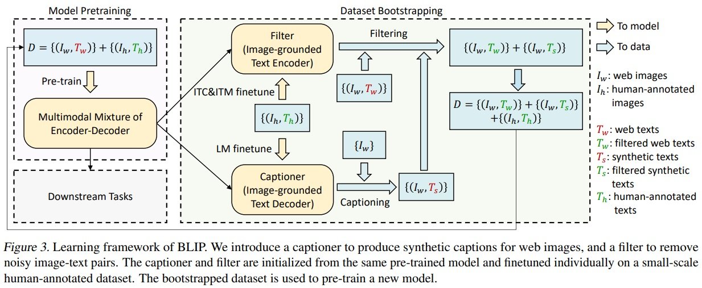
  

## 4.Experiments and Discussions
#### 4.1.Pre-training Details
- 모델은 PyTorch에서 구현되었고, 두 개의 16-GPU 노드에서 사전 학습되었다.
- 이미지 트랜스포머는 ImageNet에서 사전 학습된 ViT로 초기화되었고, 텍스트 트랜스포머는 BERTbase로 초기화되었다.
- ViT의 두 가지 변형(ViT-B/16과 ViT-L/16)이 탐구되었다. 대부분의 결과는 ViT-B를 사용하였다.
- 모델은 20 epoch 동안 사전 학습되었으며, 배치 크기는 ViT-B의 경우 2880, ViT-L의 경우 2400이다.
- AdamW 옵티마이저와 0.05의 가중치 감소를 사용했으며, 학습률은 3e-4(ViT-B) / 2e-4(ViT-L)까지 웜업 후 0.85의 비율로 선형적으로 감소한다.
- 사전 학습 중에는 224 × 224 해상도의 이미지 크롭을 사용하고, fine-tuning 중에는 384 × 384 해상도로 늘렸다.
- Li et al. (2021a)과 동일한 사전 학습 데이터셋이 사용되었으며, COCO, Visual Genome, Conceptual Captions, Conceptual 12M, SBU 캡션 등을 포함하는 총 14M 이미지가 포함되었다.
- 더 많은 잡음이 있는 텍스트를 포함하는 115M 이미지의 LAION(Schuhmann et al., 2021) 데이터셋도 실험적으로 사용되었다.

### 4.2.Effect of CapFilt
- Table 1과 같이 Fine-tuning과 제로샷 그리고 비전 백본 등 다양한 환경에서 CapFilt의 효과성을 평가했다.
- 이미지-텍스트 검색 및 이미지 캡셔닝과 같은 작업에 미세 조정 및 제로샷 설정을 포함한다.
- 데이터와 모델 크기가 가장 큰 상태에서 캡셔너와 필터 모두를 활용하였을 때, 가장 효과가 좋았다.
- 데이터 크기와 모델 크기 모두에서 확장 가능성을 입증한다.
- Fig 4에서는 캡셔너가 새로운 텍스트 설명을 생성하는 효과와 필터가 원래 웹 텍스트와 합성 텍스트 모두에서 잡음이 많은 캡션을 제거하는 효과를 질적으로 보여주는 몇 가지 예시 캡션과 해당 이미지를 보여준다.

  

  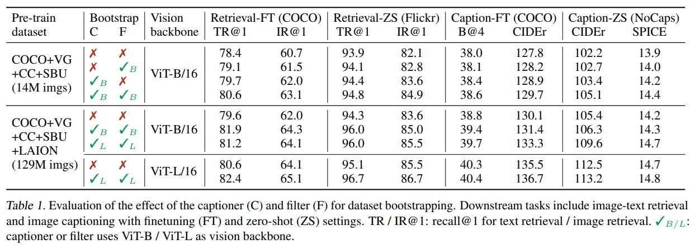
    
  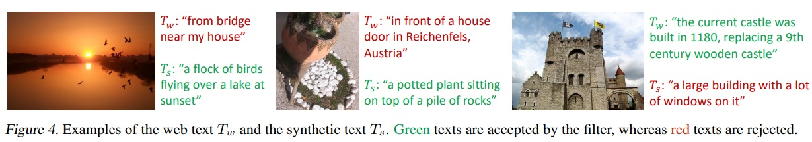
  

### 4.3.Diversity is Key for Synthetic Captions
- CapFilt에서는 합성 캡션을 생성하기 위해 핵 샘플링(Nucleus Sampling, Holtzman et al., 2020)이라는 확률적 디코딩 방법을 사용한다.
- Table 2에서는 최고 확률로 캡션을 생성하는 결정론적 디코딩(deterministic decoding) 방법인 빔 검색(Beam Search)1과 비교한다.
- 핵 샘플링은 잡음이 많음에도 더 다양하고 놀라운 캡션을 생성한다. 따라서 새로운 데이터 케이스를 얻을 수 있다.
- 빔 검색(Beam Search)은 데이터셋에서 흔한 캡션을 생성하는 경향이 있어 extra knowledge 제공이 어렵다는 한계가 있다.

  

  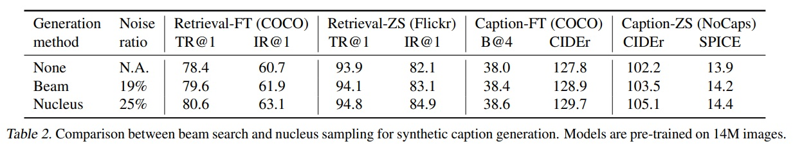
  

**빔 검색(Beam Search)1는 시퀀스를 생성하는 결정론적 디코딩 방법 중 하나로, 이 방법에서는 각 단계에서 가능한 최상위 N개의 후보(빔 너비라고 함)를 유지하면서, 최종적으로 가장 높은 확률을 가진 시퀀스를 선택한다.*

### 4.4.Parameter Sharing and Decoupling
- 사전 학습 동안 텍스트 인코더와 디코드는 자기 주의(Self-Attention, SA)  layer를 제외한 모든 매개변수를 공유하므로써 모델 크기를 줄이고 학습 효율성을 향상된다.
- Table 3에서 14M 이미지와 웹 텍스트로 수행된 사전 학습에서 다양한 매개변수 공유 전략을 사용하여 사전 학습된 모델들을 평가한다.
- Table 4와 같이 캡셔너와 필터가 매개변수를 공유하면 confirmation bias으로 인해 다운스트림 테스크의 성능이 감소한다.
- 캡셔너가 생성한 잡음이 많은 캡션들이 필터에 의해 걸러지지 않을 가능성이 높아지기 때문이다.

  

  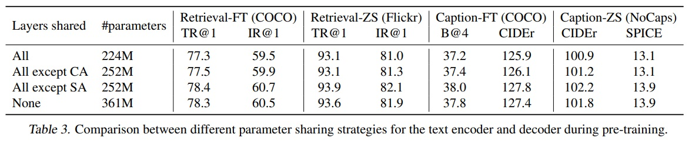
    
  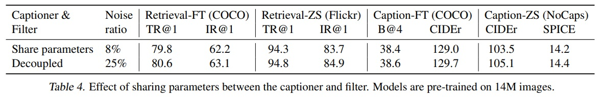
  

## 5.Comparison with State-of-the-arts
### 5.1.Image-Text Retrieval
- BLIP은 COCO와 Flickr30K (Plummer et al., 2015) 데이터셋에서 image-to-text retrieval(TR) 그리고 text-to-image retrieval(IR)에 대해 평가를 진행했다.
- 모델은 ITC와 ITM 손실을 사용하여 사전 학습된 모델을 fine-tuning 했다.
- 추론 속도를 올리기 위해 이미지-텍스트 특징 유사성을 기반으로 k개의 후보를 정하고, 쌍별로 ITM 점수에 따라 후보들을 재정렬했다.
- Table 5와 같이 BLIP은 기존 방법들과 비교하여 성능 향상을 달성했다.
- 기존 SOTA모델인 ALBEF보다 recall이 +2.7% 향상했다.
- Table 6와 같이 BLIP은 COCO 데이터셋으로 fine-tuning한 모델을 Flickr30K에 직접 적용하여 zero-shot retrieval을 수행했다.
- Appendix에 따르면 BLIP은 COCO와 Flickr30K 모두에 대해 Karpathy 분할(Karpathy & Li, 2015)을 사용했다. COCO에는 학습/검증/테스트용으로 113k/5k/5k 이미지가 포함되어 있으며, Flickr30K에는 학습/검증/테스트용으로 29k/1k/1k 이미지가 포함했다.

  

  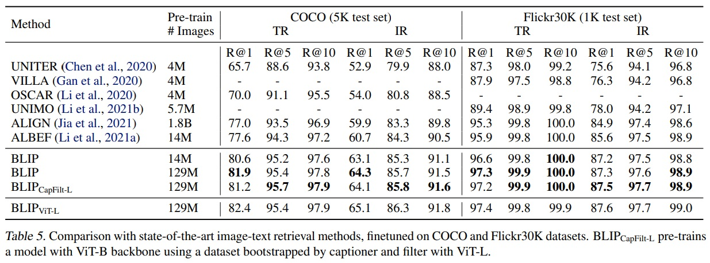
    
  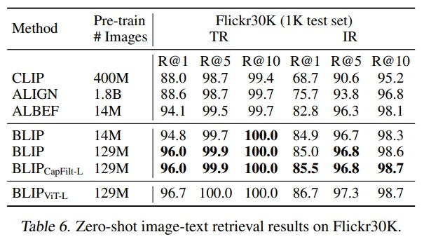
  

### 5.2.Image Captioning
- COCO에서 LM Loss로 fine-tuning된 모델을 사용하여 NoCaps (Agrawal et al., 2019)와 COCO를 평가했다.
- SimVLM (Wang et al., 2021)과 유사하게 각 캡션의 시작 부분에 "a picture of"라는 프롬프트를 추가했고 더 나은 결과를 얻었다.
- Table 7에서 보여지듯이, 14M 사전 학습 이미지를 사용한 BLIP는 유사한 양의 사전 학습 데이터를 사용하는 방법들을 크게 능가했다.
- 129M 이미지로 BLIP는 200M 이미지를 사용한 LEMON보다 성능이 향상되었다.
- LEMON은 상대적으로 높은 해상도(800x1333) 이미지가 필요하고, BLIP 더 낮은 해상도(384x384) 이미지로 충분했다.
- Appendix에 따르면 추론 중에는 beam 크기가 3인 beam search를 사용하고 최대 생성 길이를 20으로 설정한다.

  

  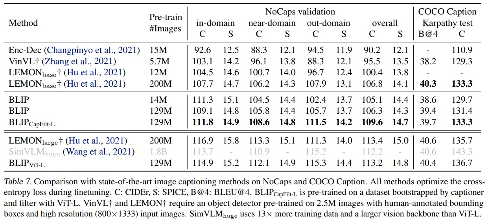
  

### 5.3.Visual Question Answering(VQA)
- VQA (Antol et al., 2015)는 모델이 이미지와 질문이 주어졌을 때 답변을 예측하도록 요구한다.
- BLIP는 VQA를 다중 답변 분류 task가 아닌 열린 형식의 답변을 생성하는 task로 간주했다.
- Fig 5(a)와 같이 fine-tuning 중 이미지-질문 쌍이 멀티모달 임베딩으로 인코딩되고, 이어서 답변을 생성하는 디코더에 전달한다.
- 모델은 실제 답변을 목표로 하여 LM loss로 fine-tuing한다.
- Table 8과 같이 BLIP는 14M 이미지를 사용하여 VQA 테스트 세트에서 ALBEF를 +1.64%만큼 향상했다.
- 129M 이미지를 사용할 때 13배 더 많은 사전 학습 데이터와 더 큰 vision 백본을 사용하는 SimVLM보다 성능이 뛰어났다.
- Appendix에 따르면 Wang et al. (2021)을 따라 480 × 480 이미지를 사용했다.
- Appendix에 따르면 VQA2.0 데이터셋(Goyal et al., 2017)을 실험에 사용하며, 이 데이터셋은 학습/검증/테스트용으로 83k/41k/81k 이미지를 포함하고 있다.
- Appendix에 따르면 VQA 추론 시 BLIP은 디코더를 사용하여 3,128개의 후보 답변(Li et al., 2021a; Kim et al., 2018)을 순위매겼다.

  

  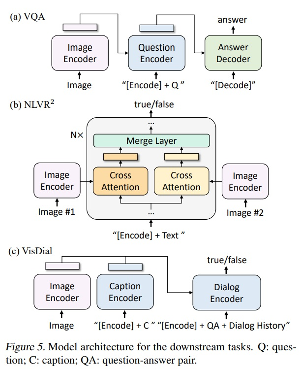
    
  
  

### 5.4.Natural Language Visual Reasoning(NLVR2)
- NLVR2는 모델에게 주어진 문장이 이미지 쌍을 설명하는지 예측하도록 한다.
- Fig 5(b)와 같이 이미지 기반 텍스트 인코더의 각 트랜스포머 블록에는 두 이미지를 처리하기 위한 두 개의 cross-attention(CA) layers이 있으며, 이들의 출력은 병합되어 다음 층에 전달(FFN)한다. 즉, 두 이미지에 대한 추론을 가능하게 하기 위해 사전 학습된 BLIP 모델은 간단한 수정을 거쳐 계산 효율성을 높인다.
- Table 8과 같이 BLIP은 extra step of customized pre-training을 한 ALBEF보다 뛰어나지 못했다.
- 웹 데이터와 다운스트림 데이터 간의 도메인 차이일 것으로 판단된다.
- Appendix에 따르면 실험을 위해 공식 분할(Suhr et al., 2019)을 했다.

  

  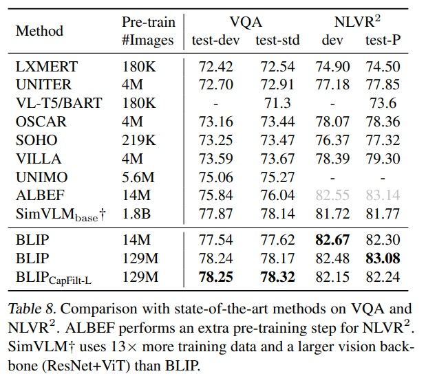
  

### 5.5.Visual Dialog (VisDial)
- VisDial (Das et al., 2017)은 VQA를 대화형 설정으로 확장한 task이다.
- 모델은 이미지와 질문 쌍에 기반하여 답변을 예측할 뿐만 아니라 대화 이력과 이미지의 캡션도 고려해야 한다.
- discriminative setting(모델이 답변 후보군을 순위 매김)을 수행했다.
- Fig 5(c)에서 보여지듯이 BLIP 모델의 구조는 이미지와 캡션 임베딩을 concat하고, 이를 cross-attention을 통해 다이얼로그 인코더에 전달한다. 다이얼로그 인코더는 ITM 손실을 사용하여, 전체 다이얼로그 이력과 이미지-캡션 임베딩을 고려하여 질문에 대한 답변이 참인지 거짓인지를 구별하도록 학습된다.
- BLIP는 VisDial v1.0 검증 세트에서 최고의 성능을 달성했다.
- VisDial v1.0의 학습 분할에서 미세 조정을 하고 검증 세트에서 평가했다.

### 5.6.Zero-shot Transfer to Video-Language Tasks
- BLIP의 이미지-언어 모델은 비디오-언어 task로 일반화된다. 이는 모델이 이미지와 언어의 상호작용을 이해하는 능력이 비디오 데이터에도 적용될 수 있음을 의미한다.
- Table 10과 Table 11에서 text-to-video retrieval and video question answering으로 제로샷 전이를 수행한다.
- 비디오 입력을 처리하기 위해 비디오당 일정 수의 프레임(n = 8 for 검색 및 n = 16 for QA)을 샘플링하고 이를 concat 한다.
- BLIP 모델은 시간적 정보를 고려하지 않았지만, 가장 뛰어난 성능을 보였다.
- BLIP 모델을 사용하여 시간적 모델링을 포함한 비디오-언어 모델을 초기화하고 비디오 데이터에 미세 조정하면 성능이 더 향상될 수 있다.

  

  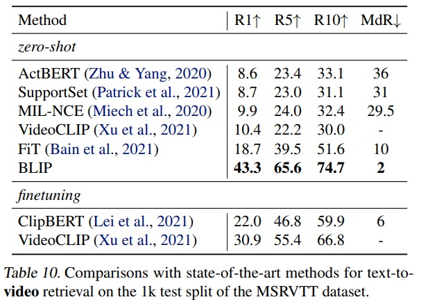
    
  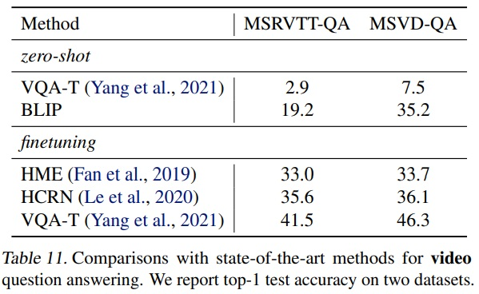
  

## 6.Additional Ablation Study
- 부트스트랩된 데이터셋이 원래 데이터셋보다 많은 텍스트를 포함하기 때문에 동일한 epoch 수의 학습이 더 오래 걸릴 뿐 학습 기간이 길어서 성능 개선이 된 것이 아니다. Table 12와 같이 단순히 노이지가 많은 웹 텍스트를 이용하여 더 긴 시간 학습을 해도 성능 향상이 되지 않는다.
- 부트스트랩된 데이터셋은 새로운 모델을 사전 학습에 사용되며, 이전에 사전 학습된 모델을 계속 학습하는 것은 효과가 없다. 즉, 새로운 데이터셋에 대한 새로운 모델의 사전 학습이 중요하며, Table 13과 같이 기존 모델의 지속적인 학습만으로는 충분하지 않다.

  

  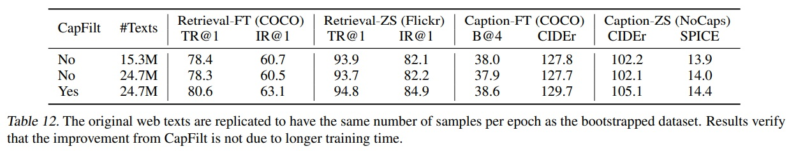
    
  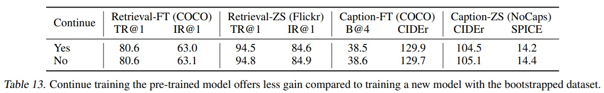
  

## 7.Conclusion
- 새로운 VLP 프레임워크인 BLIP를 제안한다.
- 이해 기반 및 생성 기반 작업을 포함한 다양한 다운스트림 시각-언어 작업에서 최고의 성능을 보인다.
- 대규모 잡음이 많은 이미지-텍스트 쌍에서 부트스트랩된 데이터셋을 사용한다.
- 다양한 합성 캡션을 주입하고 잡음이 많은 캡션을 제거하여 멀티모달 인코더-디코더 모델을 사전 학습한다.
- 성능 향상을 위한 잠재적인 방향이 있다.
  - ① 데이터셋 부트스트래핑의 다중 라운드
  - ② 사전 학습 코퍼스를 더욱 확장하기 위해 이미지당 여러 합성 캡션을 생성
  - ③ 다양한 캡셔너와 필터를 학습하여 CapFilt에서 그것들의 forces을 결합하는 모델 앙상블