*본 기술 문서는 비디오 데이터에 대한 대규모 생성 모델 학습을 탐구한다. 구체적으로 다양한 기간, 해상도 및 종횡비의 비디오 및 이미지에 대해 텍스트 조건부 확산 모델을 공동으로 학습한다. 본 연구는 비디오 및 이미지 잠재 코드의 시공간 패치에서 작동하는 변환기 아키텍처를 활용한다. 가장 큰 모델인 Sora는 고해상도 비디오의 1분을 생성할 수 있다. 본 연구의 결과는 비디오 생성 모델의 확장이 물리적 세계의 일반 목적 시뮬레이터를 구축하는 유망한 경로라는 것을 제안한다.*

## 📋 Table of Contents

- [Turning visual data into patches](#turning-visual-data-into-patches)
- [Video compression network](#video-compression-network)
- [Spacetime latent patches](#spacetime-latent-patches)
- [Scaling transformers for video generation](#scaling-transformers-for-video-generation)
- [Variable durations, resolutions, aspect ratios](#variable-durations-resolutions-aspect-ratios)
- [Language understanding](#language-understanding)
- [Prompting with images and videos](#prompting-with-images-and-videos)
- [Image generation capabilities](#image-generation-capabilities)
- [Emerging simulation capabilities](#emerging-simulation-capabilities)
- [Discussion](#discussion)

## 
* 본 기술 문서는 [OpenAI 링크](https://openai.com/research/video-generation-models-as-world-simulators){:target="_blank"}의 내용이다.
* 모든 유형의 시각적 데이터를 생성 모델의 대규모 학습을 가능하게 하는 통합 표현으로 변환방법과 Sora의 기능과 한계에 대한 질적 평가에 중점을 둔다.
* 모델 및 구현 세부정보는 포함하지 않는다.
* Sora는 시각적 데이터의 일반 모델로 다양한 지속 시간, 종횡비 및 해상도에 걸쳐 최대 1분 분량의 고화질 비디오에 이르는 비디오 및 이미지를 생성한다.

<iframe width="560" height="315" src="https://www.youtube.com/watch?v=tRSdt5kmeW0" frameborder="0" allow="accelerometer; autoplay; clipboard-write; encrypted-media; gyroscope; picture-in-picture" allowfullscreen></iframe>

## Turning visual data into patches
- 인터넷 규모의 데이터에 대한 학습을 통해 일반적인 능력을 습득하는 대규모 언어 모델에서 영감을 받았다.
- 텍스트의 다양한 모달리티(코드, 수학, 다양한 자연 언어 등)를 우아하게 통합하는 토큰 사용의 성공적인 사례를 참고한다.
- LLM은 텍스트 토큰을 사용하는 반면 Sora는 시각적 패치를 사용한다.
- 패치가 시각적 데이터 모델에 대한 효과적인 표현으로 이전에 입증된 바 있다.
- 패치를 다양한 유형의 비디오와 이미지에 대한 생성 모델 학습을 위한 매우 확장 가능하고 효과적인 표현으로 발견한다.
- 비디오를 패치로 변환하기 위해 비디오를 낮은 차원의 잠재 공간으로 먼저 압축한 후, 시공간 패치로 표현을 분해한다.

   

   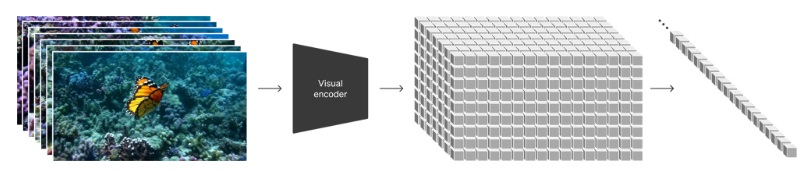 
   

## Video compression network
- 시각적 데이터의 차원을 줄이기 위한 네트워크를 학습한다.
- 원시 비디오를 입력으로 받는다.
- 시간적으로도 공간적으로도 압축된 잠재 표현을 출력한다.
- Sora는 이 압축된 잠재 공간 내에서 학습 후 압축된 잠재 공간 내에서 비디오를 생성한다.
- 생성된 잠재 변수를 다시 픽셀 공간으로 매핑하는 디코더 모델을 학습한다.

## Spacetime latent patches
- 압축된 입력 비디오로부터 시공간 패치의 순서를 추출한다.
- 이 패치들은 트랜스포머 토큰으로 작용한다.
- 이미지는 단일 프레임의 비디오로 간주되므로 이미지에 대해서도 동일하게 적용한다.
- 패치 기반 표현을 통해 Sora는 다양한 해상도, 기간, 종횡비를 가진 비디오와 이미지에 대해 학습이 가능하다.
- 추론 시, 무작위로 초기화된 패치를 적절한 크기의 그리드에 배치함으로써 생성된 비디오의 크기를 제어할 수 있다.

## Scaling transformers for video generation
- Sora는 diffusion model이다.
- Sora는 주어진 입력 노이지 패치와 조건부 정보(예: 텍스트 프롬프트)를 기반으로 원본 "clean" 패치를 예측하도록 학습된다.
- Sora는 diffusion transformer로 언어 모델링, 컴퓨터 비전, 이미지 생성 등 다양한 도메인에서 뛰어난 확장 성능을 보여주었다.
- diffusion transformer는 비디오 모델로서도 효과적으로 확장될 수 있음이 확인되었다.
- 학습이 진행됨에 따라 고정된 시드와 입력을 가진 비디오 샘플의 품질이 현저하게 개선되는 것이 관찰되었다.
- 샘플 품질은 학습에 사용되는 계산량이 증가함에 따라 명확하게 향상된다.

   

   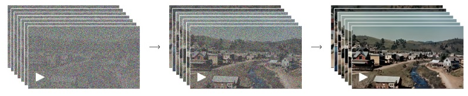
   

## Variable durations, resolutions, aspect ratios
- 과거에는 비디오를 표준 크기(예: 256x256 해상도의 4초 비디오)로 조정, 자르기, 트리밍하는 방식이 일반적인 접근 방식이었다.

### Sampling flexibility
- Sora는 와이드스크린 1920x1080p 비디오, 세로 1080x1920 비디오 및 그 사이의 모든 사이즈로 샘플링할 수 있다.
- 다양한 기기의 원래 종횡비에서 직접 콘텐츠 생성 가능하다.
- 전체 해상도에서 생성하기 전에 낮은 크기에서 콘텐츠를 빠르게 프로토타입할 수 있다.

   

   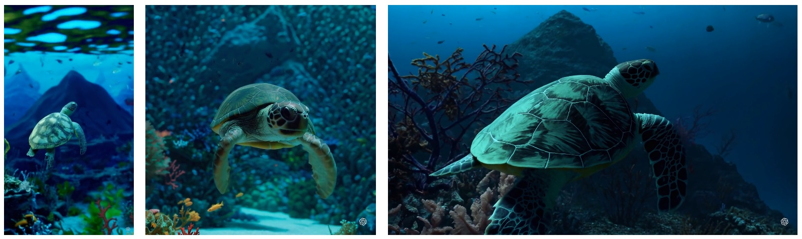
   

### Improved framing and composition
- 원래 종횡비에서 비디오에 대한 학습이 구성과 구도를 개선한다는 것을 경험적으로 발견했다.
- 정사각형으로 자른 학습 비디오를 사용하는 일반적인 관행과 비교했을 때, Sora는 개선된 구도의 비디오를 생성한다.
- 정사각형 크롭으로 학습된 모델은 주제가 부분적으로만 보이는 비디오(Fig 4(좌))를 생성하는 반면, Sora에서의 비디오(Fig 4(우))는 구도가 개선된다.

   

   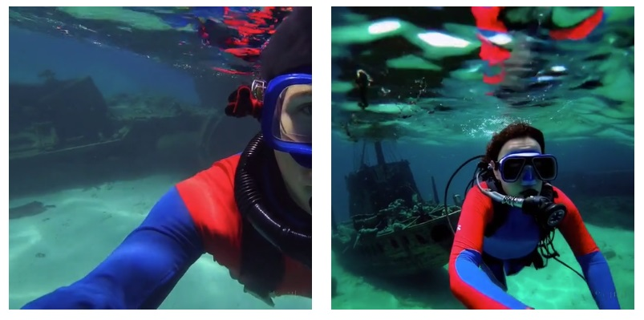
   

## Language understanding
- 텍스트-비디오 생성 시스템을 학습하기 위해서는 해당하는 텍스트 캡션이 포함된 대량의 비디오가 필요하다.
- DALL·E 3에서 소개된 재캡션(re-captioning) 기법을 비디오에 적용한다.
- descriptive captioner 모델을 먼저 학습하고, 이를 활용하여 학습 세트의 모든 비디오에 대한 텍스트 캡션을 생성한다.
서술적 비디오 캡션의 효과
- 위 학습을 통하면 전반적인 비디오 품질과 텍스트의 충실도(fidelity)를 향상시킨다.
- DALL·E 3과 유사하게 짧은 사용자 프롬프트를 긴 자세한 캡션으로 변환하기 위해 GPT를 활용한다.
- 이를 통해 Sora는 사용자 프롬프트를 정확하게 따르는 고품질의 비디오를 생성할 수 있다.

## Prompting with images and videos
- Sora는 기존 이미지나 비디오와 같은 다른 입력을 통해 메시지를 표시할 수도 있다.
- 완벽하게 반복되는 비디오 생성, 정지 이미지 애니메이션, 비디오 시간적 확장 등 다양한 편집 작업 수행이 가능하다.

### Animating DALL·E images
- 이미지와 프롬프트를 입력으로 받아 비디오 생성 기능을 지원한다.

### Extending generated videos
- 비디오를 시간적으로 앞이나 뒤로 확장할 수 있다.
- 모든 비디오가 다른 시작점에서 시작하더라도 같은 결말로 이어지는 방식으로 확장된다.
- 비디오를 앞뒤로 확장하여 끊김 없는 무한 루프 생성이 가능하다.

### Video-to-video editing
- Diffusion 모델을 사용하면 텍스트 프롬프트에서 이미지와 비디오를 편집하는 다양한 방법이 가능해진다.
- 비디오 스타일 및 환경 변환 방법 중 하나인 SDEdit 적용한다.
- 제로샷으로 입력 비디오의 스타일과 환경을 변환 가능하다.

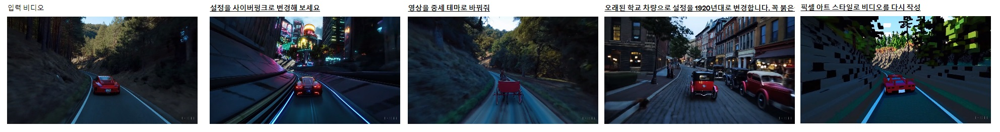

### Connecting videos
- 두 입력 비디오 사이를 점진적으로 보간하여 끊김 없는 전환 생성이 가능하다.
- 완전히 다른 주제와 장면 구성을 가진 비디오 사이의 부드러운 전환이 가능하다.

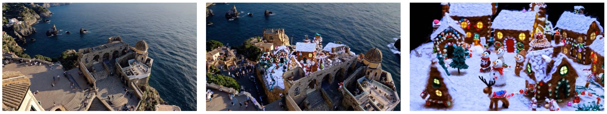 
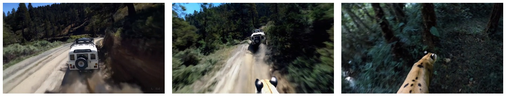 
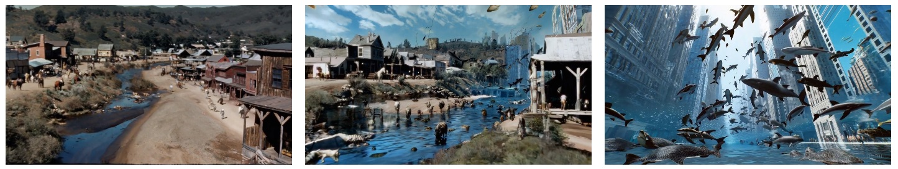 

## Image generation capabilities
- Sora는 이미지를 생성할 수 있는 기능도 있다.
- 이미지 생성을 위해 가우시안 노이즈의 패치를 시간적 범위가 한 프레임인 공간 그리드에 배열한다.
- 모델은 다양한 크기의 이미지를 생성할 수 있으며, 최대 2048x2048 해상도까지 생성할 수 있다.

   

   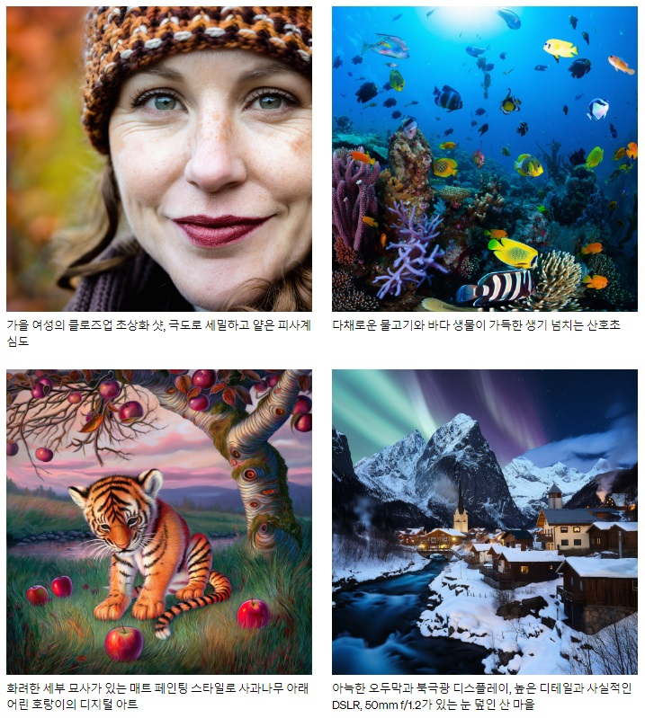
   

## Emerging simulation capabilities
- 대규모로 학습할 때 비디오 모델이 여러 흥미로운 새로운 능력을 발견했다.
- 물리적 세계의 사람들, 동물들 및 환경의 일부 측면을 시뮬레이션할 수 있게 한다.
- 이러한 속성은 3D, 객체 등에 대한 명시적인 귀납적 편향 없이 나타내며, 순수 스케일의 현상이다.
- **3D consistency.**
   - 동적 카메라 모션을 포함하는 비디오 생성 가능하다.
   - 카메라 이동 및 회전 시 사람 및 장면 요소가 3차원 공간을 통해 일관되게 움직인다.
- **Long-range coherence and object permanence.**
   - 비디오 생성 시스템의 중요한 과제 중 긴 비디오 샘플링 시 시간적 일관성을 유지해야 한다.
   - Sora는 종종 short- and long-range 종속성을 효과적으로 모델링한다.
   - 예를 들어 객체가 가려지거나 프레임에 벗어나는 경우 시간적 일관성을 유지한다.
   - 단일 샘플에서 동일 캐릭터의 여러 샷을 비디오 전체에 걸쳐 일관되게 생성한다.
- **Interacting with the world.**
   - 상태에 영향을 미치는 간단한 행동 시뮬레이션 가능하다.
   - 예를 들어 화가의 캔버스에 남기는 획, 햄버거를 먹는 남자의 물린 자국.
   
   

   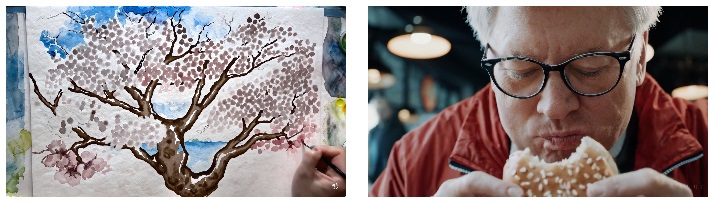
   

- **Simulating digital worlds.**
   - 인공적인 프로세스 및 비디오 게임 시뮬레이션 가능하다.
   - 예를 들어 Minecraft에서 플레이어 제어 및 세계 렌더링할 수 있다.
   - "Minecraft" 언급 등의 프롬프트를 통해 제로샷으로 유도할 수 있다.

   

   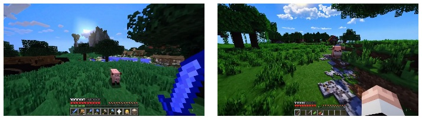
   

## Discussion
- Sora는 현재 시뮬레이터로서 많은 한계를 보이고 있다.
- 예를 들어 유리 깨짐과 같은 많은 기본 상호 작용의 물리학을 정확하게 모델링을 못 한다.
- 음식 먹기와 같은 다른 상호 작용이 항상 개체 상태에 올바른 변화를 가져오는 것은 아니다.
- 장기간 샘플에서 발생하는 비일관성, 객체의 갑작스러운 출현 등의 실패 모드가 존재한다.
- 비디오 모델의 지속적인 확장은 물리적 및 디지털 세계와 그 안에 사는 객체, 동물, 사람들을 시뮬레이션할 수 있는 시뮬레이터 개발로 가는 유망한 경로로 보인다.
- Sora가 현재 가지고 있는 능력으로 앞으로의 발전 가능성을 시사한다.

   

   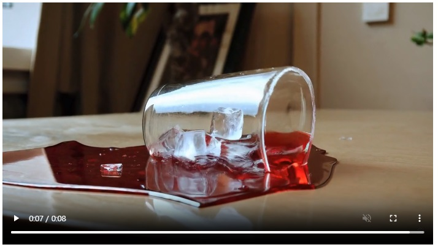
   
