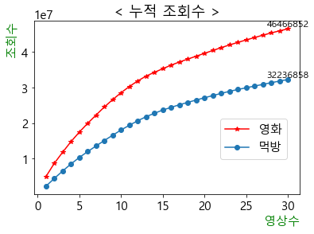

# 튜브둥둥

### 유튭을 더 재밌게 -> 튜브둥둥  
1. 유툽 검색결과(이번 달, 조회순 많은 순)를 파일로 한눈에 볼 수 있게 정리   
2. 검색키워드별 누적 조회수를 비교하여 관심 정도 확인  
3. 영상제목의 키워드를 워드클라우드로 시각화  
    -> 영상검색, 마케팅 등 의사결정 정보로 활용 


```python
import sys 
import os 
import time   
import warnings
warnings.filterwarnings('ignore') 

import chromedriver_autoinstaller  
import pandas as pd 
import numpy as np 
from selenium import webdriver
```

## 1. 자료추출


```python
# user = input("어떤 제품을 검색할래요? ")
user = "먹방"
```


```python
path = chromedriver_autoinstaller.install()
driver = webdriver.Chrome(path)
driver.get("https://www.youtube.com/results?search_query={}".format(user))
time.sleep(1)
```


```python
driver.find_element_by_css_selector('.style-scope.ytd-toggle-button-renderer.style-text').click()
time.sleep(1)
```


```python
driver.find_element_by_link_text("이번 달").click( ) # 이번 달 기준으로 필터링
```


```python
# 스크롤 내리기
def scroll_down(driver):
    driver.execute_script("window.scrollTo(0, 21431049)")
    
n = 10 # 숫자가 클수록 데이터 많이 가져옴
i = 0
while i < n: # 이 조건이 만족되는 동안 반복 실행
    scroll_down(driver) # 스크롤 다운
    i = i+1
    time.sleep(0.5)
```


```python
# aria-label 있는 a태그 id 자료 가져오기

a_id = "#video-title"
raws = driver.find_elements_by_css_selector(a_id)
len(raws)
```


    128


```python
# 1번 for문 - raw_data

aria_list = []  # list
url_list = []

for raw in raws: 
    aria = raw.get_attribute('aria-label')
    aria_list.append(aria)
    
for u in raws:
    url = u.get_attribute('href')
    url_list.append(url)

print(len(aria_list), len(url_list))
```

    128 128
    

## 2. 데이터정제 및 분류


```python
# none값 제거  (리스트 타입 영상엔 aria-label 속성이 없음)

dt = list(filter(None,aria_list))
url_list = list(filter(None, url_list))

print(len(dt), len(url_list))
```

    128 128
    


```python
dt[0]
```


    '[ENG]사장님 "어머 유튜버 OO보다 많이 먹었어!!" 가뿐하게 부산가서 신기록 세우고 왔습니다..^^ 떡볶이꼬치 최대 몇개까지 먹어봤니? 게시자: 웅이woongei 22시간 전 13분 24초 조회수 344,543회'


```python
# 2번 for문 - aria_list 데이터 분류

title_list = []     # 영상제목
view_cnt_list =[]   # 조회수

for i in range(len(dt)):
    content = dt[i].split(' 게시자: ') 
    title = content[0]  
    title_list.append(title)
    
    t_remain = content[1].split(' ')
    view_cnt = t_remain[-1]
    view_cnt = view_cnt.replace('회','')  # '회'글자 제거
    view_cnt = view_cnt.replace(',','')   # 중간 ',' 제거
    view_cnt = view_cnt.replace('없음','0') # 조회수 없는 영상은 '없음'이라고 표시됨
    # view_cnt = re.findall('/d+',view_cnt)
        # 정규표현식 활용하려 했지만 int 변환이 복잡해져 pass
    view_cnt_list.append(int(view_cnt))   # int로 변경  

time.sleep(1)
```


```python
print(len(title_list), len(view_cnt_list), len(url_list))
```

    128 128 128
    

## 3. DF 정렬 및 파일저장


```python
# 데이터프레임 만들기
df = pd.DataFrame({'title':title_list, 'view_cnt':view_cnt_list, 'url':url_list})

# 조회수 높은 순으로 정렬
df = df.sort_values('view_cnt',ascending=False)
df = df.reset_index(drop=True) # 인덱스 리셋

df.head(2)
```


<div>
<style scoped>
    .dataframe tbody tr th:only-of-type {
        vertical-align: middle;
    }

    .dataframe tbody tr th {
        vertical-align: top;
    }

    .dataframe thead th {
        text-align: right;
    }
</style>
<table border="1" class="dataframe">
  <thead>
    <tr style="text-align: right;">
      <th></th>
      <th>title</th>
      <th>view_cnt</th>
      <th>url</th>
    </tr>
  </thead>
  <tbody>
    <tr>
      <th>0</th>
      <td>편의점 사장님 어리둥절🙄 짜파게티 김밥 만두 편의점 털기ㅋㅋ</td>
      <td>4967815</td>
      <td>https://www.youtube.com/watch?v=t3Bt1ooBrnk</td>
    </tr>
    <tr>
      <th>1</th>
      <td>리얼먹방:) 밥도둑 "묵은지 닭볶음탕" ★ 바삭바삭 부추전 ㅣKimchi Dak-b...</td>
      <td>3716054</td>
      <td>https://www.youtube.com/watch?v=6fPTXRA2apQ</td>
    </tr>
  </tbody>
</table>
</div>


```python
df.to_csv("tube_dungdung({}).csv".format(user), encoding='utf-8-sig')
```

## 4. 둥둥 시각화


```python
## 라이브러리 import
import pandas as pd
import matplotlib.pyplot as plt # 시각화
import matplotlib as mpl
from matplotlib import font_manager, rc # font 설정
import nltk # natural language toolkit : 자연어 처리
```


```python
# 한글폰트 설정 
mpl.rcParams['font.family'] = 'Malgun Gothic'
mpl.rcParams['font.size'] = 15
mpl.rcParams['axes.unicode_minus'] = False    # 마이너스 깨짐 방지
```


```python
# 맛집영상 조회수 상위 30개 가져오기
dung = pd.read_csv('./tube_dungdung(영화).csv')
dung = dung.drop(['Unnamed: 0'], axis=1) # 불필요한 unnamed 삭제
dung = dung.head(30)
```


```python
# 먹방영상 조회수 상위 30개 가져오기
dung2 = pd.read_csv('./tube_dungdung(먹방).csv')
dung2 = dung2.drop(['Unnamed: 0'], axis=1) # 불필요한 unnamed 삭제
dung2 = dung2.head(30)
```

### 라인차트 그리기 (키워드 조회수 비교)


```python
# x축, y축 세팅
x = range(1,31)
y1 = dung['view_cnt'].cumsum()
y2 = dung2['view_cnt'].cumsum()
```


```python
y1[-1:]
```


    29    32236858
    Name: view_cnt, dtype: int64


```python
plt.plot(x, y2, marker = '*', label='영화', color='r')
plt.plot(x, y1, marker = 'o', label='먹방')
plt.xlabel('영상수', color='g', loc='right')
plt.ylabel('조회수', color='g', loc='top')
plt.title('< ' + '누적 조회수 ' + '>')
plt.legend(loc=(0.7, 0.2))

plt.text(x[29], y1[-1:] + 0.25, '%d' %y1[-1:], ha='center', va='bottom', size=12)    
plt.text(x[29], y2[-1:] + 0.25, '%d' %y2[-1:], ha='center', va='bottom', size=12);    
    # 이번 달 업로드 영상 중 상위 30개의 누적 조회수
    # 영화(4.6천만) vs 먹방(3.2천만)
```


    

    


```python
# 워드클라우드 IMPORT

from konlpy.tag import Okt # 형태소분석기 : Openkoreatext
from collections import Counter # 빈도 수 세기
from wordcloud import WordCloud, STOPWORDS # wordcloud 만들기
```


```python
script = dung2['title']
script.head(2)
```


    0                    편의점 사장님 어리둥절🙄 짜파게티 김밥 만두 편의점 털기ㅋㅋ
    1    리얼먹방:) 밥도둑 "묵은지 닭볶음탕" ★ 바삭바삭 부추전 ㅣKimchi Dak-b...
    Name: title, dtype: object


```python
script.to_csv('word.txt', encoding='utf-8-sig')
```


```python
text = open('word.txt', encoding='utf-8-sig').read()
```


```python
# 형태소 분석기를 통해 명사만 추출하는 함수
def token_konlpy(text):
    okt=Okt()
    return [word for word in okt.nouns(text) if len(word)>1] # 1글자 명사는 제외    
```


```python
noun = token_konlpy(text)
len(noun)
```


    257


```python
noun_set = set(noun)
len(noun_set)
```


    192


```python
# 텍스트 파일로 저장
f = open('noun_set.txt','w', encoding='utf-8')
f.write(str(noun_set))
f.close()
```


```python
# 추출된 명사들의 빈도수 카운트 
count = Counter(noun)
count.pop('먹방') # 검색 키워드는 제외
len(count)
```


    191


```python
# 빈도수 상위 50개 까지 딕셔너리 형태로 자료 변환 {'noun':'key'}
word = dict(count.most_common(30))
```


```python
#wordcloud 만들기
wc = WordCloud(max_font_size=200, font_path = 'C:\Windows\Fonts\malgun.ttf',background_color="white",width=2000, height=500).generate_from_frequencies(word) # font 경로 개별적으로 설정해야함

plt.figure(figsize = (40,40))
plt.imshow(wc)
plt.tight_layout(pad=0)
plt.axis('off')
plt.show()
```


    

    


```python
dt[1]
```


    '[만칼로리먹방] 다이어트 시작하기 전에 먹고 싶은 거 다~~먹기😍불닭+타코야끼,뿌링클,콘소메이징,스초생,글레이즈드도넛,육개장,청년피자 에그콘+매드쉬림프피자,엽떡,딸기초코케이크 게시자: 살빼조DietJo 2일 전 36분 조회수 803,932회'


```python
content = dt[0].split(' 게시자: ')
title = content[0]
title
```


    '[ENG]사장님 "어머 유튜버 OO보다 많이 먹었어!!" 가뿐하게 부산가서 신기록 세우고 왔습니다..^^ 떡볶이꼬치 최대 몇개까지 먹어봤니?'


```python
t_remain = content[1].split(' ')
t_remain
```


    ['웅이woongei', '22시간', '전', '13분', '24초', '조회수', '344,543회']


```python
view_cnt = t_remain[-1] # 마지막인덱스
view_cnt = view_cnt.replace('회','')   # '회'글자 제거
view_cnt = view_cnt.replace(',','')    # 중간 ',' 제거
print(view_cnt, type(int(view_cnt)))  # 리스트에 추가할 땐 int로 추가할 것임 
```

    344543 <class 'int'>
    


```python
# bar 차트 그리기

def showGraph(wordInfo):
    
    font_location = 'C:\Windows\Fonts\HANDotumB.ttf' # font 경로 설정
    font_name = font_manager.FontProperties(fname=font_location).get_name()
    # matplotli.rc('font', family=font_name. font_size='30')
    
    plt.xlabel('주요 단어',fontsize=80)
    plt.ylabel('빈도수', fontsize=80)
    plt.grid(True)
    
    Sorted_Dict_Values = sorted(wordInfo.values(), reverse=True)
    Sorted_Dict_Keys = sorted(wordInfo, key=wordInfo.get, reverse=True)

    plt.bar(range(len(wordInfo)), Sorted_Dict_Values, align='center')
    plt.xticks(range(len(wordInfo)), list(Sorted_Dict_Keys), rotation='70')
    plt.rcParams["figure.figsize"] = (50,30)
    mpl.rcParams["font.size"] = 70

    plt.show()
```


```python
word2= dict(count.most_common(10)) # 빈도 수 상위 10개로 word2 생성
```


```python
showGraph(word2)
```


    

    


```python

```
