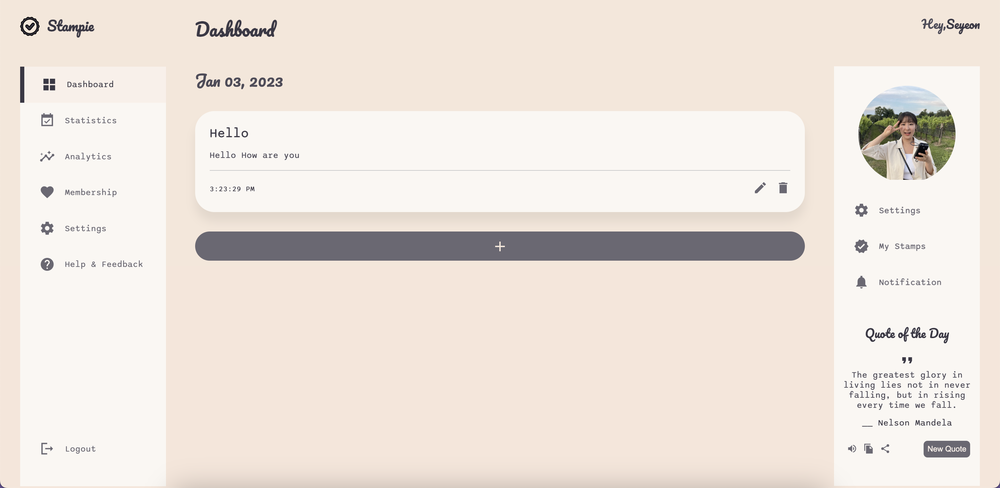
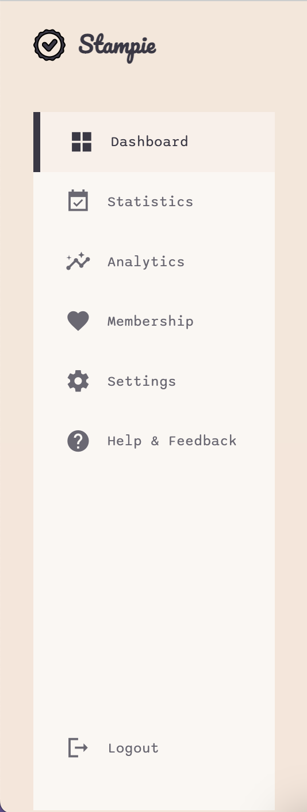
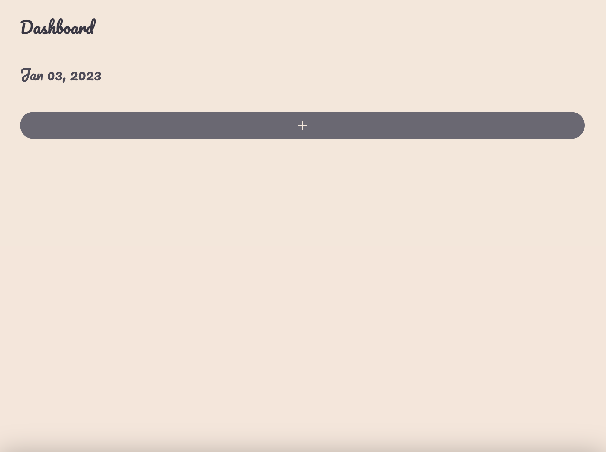
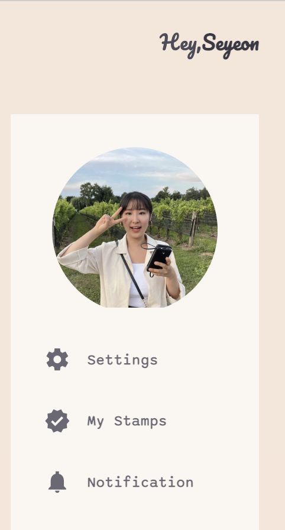
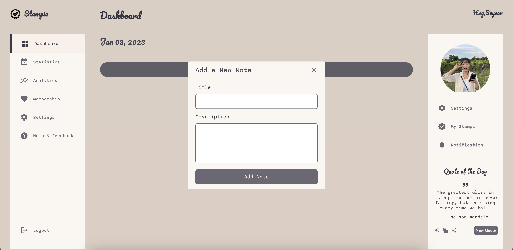



📋 This is the tutorial archives to help me keep track of what I am studying!

- Reference tutorial link: <https://www.youtube.com/watch?v=BOF79TAIkYQ&list=PLdsPvzbHCocyBcFLG4-2W8rQevvj77XDV&index=6&t=4768s>
- Reference tutorial link: <https://www.youtube.com/watch?v=AkIUtUWpyZs&list=PLdsPvzbHCocyBcFLG4-2W8rQevvj77XDV&index=5>
- Reference tutorial link: <https://www.youtube.com/watch?v=I0v9ZOY3_0k&list=PLdsPvzbHCocyBcFLG4-2W8rQevvj77XDV&index=4&t=935s>
  

<div class="notice--danger">{{ notice-2 | markdownify }}</div>

## Jounal Web app

{: .align-left .width-quarter}

[Link to Journal web app](https://seyeon-jo.github.io/gbc-journal-app/)

[Link to Demo of Journal web app](https://vimeo.com/785598962)

[Link to Github](https://github.com/Seyeon-Jo/gbc-journal-app)

## Left Sidebar - Options Sidebar

{: .align-left .width-sm}

### HTML

```
<aside>
  <div class="top">
    <div class="logo">
      
      <h2>Stampie</h2>
    </div>
    <div class="close" id="close-btn">
      <span class="material-icons-sharp"> close </span>
    </div>
  </div>

  <div class="sidebar">
    <a href="#" class="active">
      <span class="material-icons-sharp"> grid_view </span>
      <h3>Dashboard</h3>
    </a>
    <a href="#">
      <span class="material-icons-sharp"> event_available </span>
      <h3>Statistics</h3>
    </a>
    <a href="#">
      <span class="material-icons-sharp"> insights </span>
      <h3>Analytics</h3>
    </a>
    <a href="#">
      <span class="material-icons-sharp"> favorite </span>
      <h3>Membership</h3>
    </a>
    <a href="#">
      <span class="material-icons-sharp"> settings </span>
      <h3>Settings</h3>
    </a>
    <a href="#">
      <span class="material-icons-sharp"> help </span>
      <h3>Help & Feedback</h3>
    </a>
    <a href="#">
      <span class="material-icons-sharp"> logout </span>
      <h3>Logout</h3>
    </a>
  </div>
</aside>
```

### CSS

```
/* ---------------------- Start of aside ---------------------- */
aside {
  height: 100vh;
  z-index: 1;
}

aside .top {
  display: flex;
  align-items: center;
  justify-content: space-between;
  margin-top: 1.4rem;
}

aside .logo {
  display: flex;
  gap: 0.8rem;
}

aside .logo img {
  width: 2rem;
  height: 2rem;
  margin-top: 0.3rem;
}

aside .logo h2 {
  font-family: pacifico, serif;
}

aside .close {
  display: none;
}
/* ---------------------- End of aside ---------------------- */

/* ---------------------- Start of sidebar ---------------------- */
aside .sidebar {
  background: var(--color-secondary);
  display: flex;
  flex-direction: column;
  height: 86vh;
  position: relative;
  top: 3rem;
}

aside h3 {
  font-weight: 500;
}

aside .sidebar a {
  display: flex;
  color: var(--color-info-dark);
  margin-left: 2rem;
  gap: 1rem;
  align-items: center;
  position: relative;
  height: 3.7rem;
  transition: all 300ms ease;
}

aside .sidebar a span {
  font-size: 1.6rem;
  transition: all 300ms ease;
}

aside .sidebar a:last-child {
  position: absolute;
  bottom: 2rem;
  width: 100%;
}

aside .sidebar a.active {
  background: var(--color-light);
  color: var(--color-primary);
  margin-left: 0;
}

aside .sidebar a.active:before {
  content: "";
  width: 6px;
  height: 100%;
  background: var(--color-primary);
}

aside .sidebar a.active span {
  color: var(--color-primary);
  margin-left: calc(1rem - 3px);
}

aside .sidebar a:hover {
  color: var(--color-primary);
}

aside .sidebar a:hover span {
  margin-left: 1rem;
}
/* ---------------------- End of sidebar ---------------------- */
```

<br>

## Main Section

{: .align-left .width-sm}

### HTML

```
<!----------------------- Start of main ----------------------->
<main>
  <h1>Dashboard</h1>
  <div class="date">
    <p id="current-date"></p>
  </div>
  <button class="new-btn">
    <span class="material-icons-sharp"> add </span>
  </button>
</main>
<!----------------------- End of main ----------------------->
```

### CSS

```
/* ---------------------- Start of main ---------------------- */
main {
  margin-top: 1.4rem;
  position: relative;
}

main h1 {
  font-family: pacifico, serif;
}

main .date {
  display: inline-block;
  margin: 2.27rem 0 0.8rem;
}

main .date p {
  font-size: 1.6rem;
  font-family: pacifico, serif;
}

main .new-btn {
  border-radius: var(--card-border-radius);
  width: 100%;
  height: 3rem;
  display: block;
  margin: 2rem 0 3rem;
  padding-top: 0.3rem;
  background: var(--color-info-dark);
  color: var(--color-background);
  cursor: pointer;
}

main .new-btn:hover {
  background: var(--color-primary);
}

main .add-note {
  background: var(--color-secondary);
  padding: var(--card-padding);
  border-radius: var(--card-border-radius);
  margin-top: 1rem;
  box-shadow: var(--box-shadow);
  transition: all 300ms ease;
}

main .add-note:hover {
  box-shadow: none;
}

main .add-note .details {
  max-height: 10rem;
  overflow-y: auto;
}

main .add-note .details h3 {
  font-size: 1.3rem;
}

main .add-note .details p {
  margin: 1rem 0;
}

main .add-note .bottom-content {
  display: flex;
  align-items: center;
  justify-content: space-between;
  border-top: 1px solid #ccc;
  padding-top: 1rem;
}

main .add-note .bottom-content .note-settings span {
  margin-left: 0.3rem;
  font-size: 1.5rem;
  color: var(--color-info-dark);
}

main .add-note .bottom-content .note-settings span:hover {
  color: var(--color-primary);
}
/* ---------------------- End of main ---------------------- */
```

<br>

## Right Sidebar - User Sidebar

{: .align-left .width-sm}

### HTML

```

<!----------------------- Start of right ----------------------->
<div class="right">
  <!------------------ Start of top ------------------>
  <div class="top">
    <button id="menu-btn">
      <span class="material-icons-sharp"> menu </span>
    </button>
    <div class="greet">
      <p>Hey,<b>Seyeon</b></p>
    </div>
    <button id="user-btn">
      <span class="material-icons-sharp"> account_circle </span>
    </button>
  </div>
  <!------------------ End of top ------------------>

  <!------------------ Start of user ------------------>
  <div class="user">
    <div class="user-profile">
      <div class="user-photo">
        
      </div>
      <button class="user-close" id="user-close-btn">
        <span class="material-icons-sharp"> close </span>
      </button>
    </div>
    <div class="user-sidebar">
      <a href="#">
        <span class="material-icons-sharp"> settings </span>
        <h3>Settings</h3>
      </a>
      <a href="#">
        <span class="material-icons-sharp"> verified </span>
        <h3>My Stamps</h3>
      </a>
      <a href="#">
        <span class="material-icons-sharp"> notifications </span>
        <h3>Notification</h3>
      </a>
    </div>
  </div>
  <!------------------ End of user ------------------>
</div>
<!----------------------- End of right ----------------------->
</div>
```

### CSS

```
/* ---------------------- Start of right top ---------------------- */
.right {
  margin-top: 1.4rem;
}

.right .top {
  display: flex;
  justify-content: end;
  gap: 2rem;
}

.right .top button {
  display: none;
}

.right .top .greet p {
  font-size: 1.2rem;
  font-family: pacifico, serif;
}
/* ---------------------- End of right top ---------------------- */

/* ---------------------- Start of right user ---------------------- */
.user {
  z-index: 1;
  background: var(--color-secondary);
  display: flex;
  flex-direction: column;
  height: 86vh;
  position: relative;
  top: 3.3rem;
}

.user .user-profile {
  display: flex;
}

.user .user-profile .user-photo {
  display: block;
  margin: 2rem auto 1rem;
  width: 10rem;
  height: 10rem;
  border-radius: 50%;
  overflow: hidden;
}

.user .user-profile .user-close {
  display: none;
  cursor: pointer;
}

.user .user-sidebar a {
  display: flex;
  color: var(--color-info-dark);
  margin-left: 2rem;
  gap: 1rem;
  align-items: center;
  position: relative;
  height: 3.7rem;
  transition: all 300ms ease;
}

.user .user-sidebar a span {
  font-size: 1.6rem;
  transition: all 300ms ease;
}

.user .user-sidebar a.active span {
  color: var(--color-primary);
  margin-left: calc(1rem - 3px);
}

.user .user-sidebar a:hover {
  color: var(--color-primary);
}

.user .user-sidebar a:hover span {
  margin-left: 1rem;
}
/* ---------------------- End of right user ---------------------- */
```

<br>

## Pop-up Box

{: .align-left .width-sm}

### HTML

```
<!------------------ Start of popup box ------------------>
<div class="popup-box">
  <div class="popup">
    <div class="content">
      <header>
        <p>Add a New Note</p>
        <span class="material-icons-sharp"> close </span>
      </header>
      <form action="#">
        <div class="row title">
          <label>Title</label>
          <input type="text" />
        </div>
        <div class="row description">
          <label>Description</label>
          <textarea></textarea>
        </div>
        <button>Add Note</button>
      </form>
    </div>
  </div>
</div>
<!------------------ End of popup box ------------------>
```

### CSS

```
/* ------------------ Start of popup box ------------------ */
main .popup-box {
  position: fixed;
  top: 0;
  left: 0;
  width: 100%;
  height: 100%;
  background: var(--color-shadow);
}

main .popup-box .popup {
  display: flex;
  align-items: center;
  justify-content: space-between;
  position: absolute;
  top: 50%;
  left: 50%;
  z-index: 3;
  max-width: 400px;
  width: 100%;
  border-radius: var(--border-radius-1);
  transform: translate(-50%, -50%);
  justify-content: center;
}

main .popup-box,
.popup-box .popup {
  opacity: 0;
  pointer-events: none;
  transition: all 0.25s ease;
}

main .popup-box.show,
.popup-box.show .popup {
  opacity: 1;
  pointer-events: auto;
}

main .popup-box .popup .content {
  width: calc(100% - 15px);
  background: var(--color-secondary);
  border-radius: var(--border-radius-1);
}

main .popup-box .popup .content header {
  display: flex;
  align-items: center;
  justify-content: space-between;
  padding: 1rem 1.5rem;
  border-bottom: 1px solid #ccc;
  display: flex;
  align-items: center;
  justify-content: space-between;
}

main .popup-box .popup .content header p {
  font-size: 1.3rem;
  font-weight: 500;
}

main .popup-box .popup .content header span {
  color: var(--color-info-dark);
  cursor: pointer;
  font-size: 1.4rem;
}

main .popup-box .popup .content header span:hover {
  color: var(--color-primary);
}

main .popup-box .popup .content form {
  margin: 1rem 1.5rem;
}

main .popup-box .popup .content form .row {
  margin-bottom: 1rem;
}

main .popup-box .popup .content form .row label {
  display: block;
  font-size: 1rem;
  margin: 0.7rem 0;
}

main .popup-box .popup .content form :where(input, textarea) {
  width: 100%;
  height: 3rem;
  outline: none;
  padding: 0 1rem;
  border: 1px solid var(--color-info-dark);
  border-radius: var(--border-radius-1);
  font-family: sono, sans-serif;
}

main .popup-box .popup .content form textarea {
  height: 8rem;
  resize: none;
  padding: 1rem;
}

main .popup-box .popup .content form button {
  width: 100%;
  height: 3rem;
  font-family: sono, sans-serif;
  font-size: 1rem;
  background: var(--color-info-dark);
  outline: none;
  border-radius: var(--border-radius-1);
  color: var(--color-light);
}

main .popup-box .popup .content form button:hover {
  background: var(--color-primary);
}
/* ---------------------- End of pop-up ---------------------- */
```

<br>

## Random Quote

{: .align-left .width-sm}

### HTML

```

<!---------------- Start of quote ---------------->
<div class="quote-of-the-day">
  <header>Quote of the Day</header>
  <div class="content">
    <div class="quote-area">
      <span class="material-icons-sharp"> format_quote </span>
      <p class="quote">
        The greatest glory in living lies not in never falling, but in
        rising every time we fall.
      </p>
    </div>
    <div class="author">
      <span>__</span>
      <span class="name">Nelson Mandela</span>
    </div>
  </div>
  <div class="buttons">
    <div class="features">
      <ul>
        <li class="sound">
          <span class="material-icons-sharp"> volume_up </span>
        </li>
        <li class="copy">
          <span class="material-icons-sharp"> file_copy </span>
        </li>
        <li class="share">
          <span class="material-icons-sharp"> share </span>
        </li>
      </ul>
      <button class="new-quote">New Quote</button>
    </div>
  </div>
</div>
<!---------------- End of quote ---------------->
```

### CSS

```
/* ---------------------- Start of right quote ---------------------- */
.quote-of-the-day {
  margin-top: 2.3rem;
  text-align: center;
}

.quote-of-the-day header {
  font-size: 1.2rem;
  font-family: pacifico, serif;
}

.quote-of-the-day .content {
  margin: 1rem 0;
}
.quote-of-the-day .quote {
  margin-bottom: 0.8rem;
}

.quote-of-the-day .quote-area span {
  font-size: 1.5rem;
}

.quote-of-the-day .buttons .features {
  display: flex;
  align-items: center;
  justify-content: space-between;
  margin: 1.3rem 1rem 0;
}

.quote-of-the-day .buttons .features ul {
  display: flex;
}

.quote-of-the-day .buttons .features ul li {
  margin: 0 0.3rem;
}

.quote-of-the-day .buttons .features ul span {
  font-size: 1.1rem;
  color: var(--color-info-dark);
  margin-top: 0.22rem;
}

.quote-of-the-day .buttons .features ul span:hover {
  color: var(--color-primary);
}

.quote-of-the-day .buttons .features .new-quote {
  background: var(--color-info-dark);
  padding: 0.4rem;
  border-radius: var(--border-radius-1);
  color: var(--color-light);
  font-size: 0.8rem;
}

.quote-of-the-day .buttons .features .new-quote:hover {
  background: var(--color-primary);
  color: var(--color-light);
}

.quote-of-the-day .buttons .features .new-quote.loading {
  opacity: 0.7;
  pointer-events: none;
}
/* ---------------------- End of right quote ---------------------- */
```

<br>

## Media Queries

```
/* --------------- Start of media queries for lg tablet --------------- */
@media screen and (max-width: 1200px) {
  .container {
    width: 94%;
    grid-template-columns: 7rem auto 14rem;
  }
  /* End of container */

  aside .logo h2 {
    display: none;
  }

  aside .sidebar h3 {
    display: none;
  }

  aside .sidebar {
    width: 5.6rem;
  }

  aside .sidebar a:last-child {
    position: relative;
    margin-top: 1.8rem;
  }
  /* End of aside */

  /* .user .user-profile .user-photo {
    width: 2rem;
    height: 2rem;
    border-radius: 50%;
    overflow: hidden;
  }
  .user .user-sidebar h3 {
    display: none;
  }
  .user .user-sidebar span {
    align-items: center;
  }
  .user .quote-of-the-day {
    display: none;
  }
  End of user */
}
/* --------------- End of media queries for lg tablet --------------- */

/* --------------- Start of media queries for sm tablet --------------- */
@media screen and (max-width: 847px) {
  .container {
    width: 100%;
    grid-template-columns: 1fr;
  }
  /* End of container */

  aside {
    position: fixed;
    left: -100%;
    background: var(--color-secondary);
    width: 18rem;
    z-index: 3;
    box-shadow: 1rem 3rem 4rem var(--color-shadow);
    height: 100vh;
    padding-right: var(--card-padding);
    display: none;
    animation: showMenu 400ms ease forwards;
  }

  @keyframes showMenu {
    to {
      left: 0;
    }
  }

  aside .logo {
    margin-left: 1rem;
  }

  aside .logo h2 {
    display: inline;
  }

  aside .sidebar h3 {
    display: inline;
  }

  aside .sidebar {
    width: 100%;
  }

  aside .sidebar a {
    width: 100%;
    height: 3.7rem;
  }

  aside .sidebar a:last-child {
    position: absolute;
    bottom: 3.3rem;
  }

  aside .close {
    display: inline-block;
    cursor: pointer;
  }
  /* End of aside */

  .user {
    position: fixed;
    right: -100%;
    top: 0;
    background: var(--color-secondary);
    width: 17rem;
    z-index: 3;
    box-shadow: 1rem 3rem 4rem var(--color-shadow);
    height: 100vh;
    padding: 0 1.5rem;
    display: none;
    animation: showUser 400ms ease forwards;
    box-shadow: 1rem 3rem 4rem var(--color-shadow);
  }

  @keyframes showUser {
    to {
      right: 0;
    }
  }

  .user .user-profile .user-close {
    display: inline-block;
    background: transparent;
    position: absolute;
    right: 1rem;
    top: 2rem;
  }
  /* End of user */

  main {
    position: relative;
    padding: 0 2rem;
  }

  main .new-btn {
    margin-top: 1rem;
  }

  main .add-note {
    margin: 1rem 0 0 0;
    width: 100%;
  }
  /* End of main */

  .right {
    width: 94%;
    margin: 0 auto 4rem;
  }

  .right .top {
    position: fixed;
    top: 0;
    left: 0;
    align-items: center;
    padding: 0 0.8rem;
    height: 4.6rem;
    background-color: var(--color-background);
    width: 100%;
    margin: 0;
    z-index: 2;
    box-shadow: 0 0.5rem 0.8rem var(--color-shadow);
  }

  .right .top .greet {
    display: none;
  }

  .right .top #menu-btn {
    display: inline-block;
    background: transparent;
    cursor: pointer;
    color: var(--color-primary);
    position: absolute;
    left: 1rem;
  }

  .right .top #menu-btn span {
    font-size: 2rem;
  }

  .right .top #user-btn {
    display: inline-block;
    background: transparent;
    cursor: pointer;
    color: var(--color-primary);
    position: absolute;
    right: 1rem;
    top: 1.3rem;
  }
  .right .top #user-btn span {
    font-size: 2rem;
  }
  /* End of right */
}
/* --------------- End of media queries for sm tablet --------------- */
```

<br>

## JS: Adding interaction to web app

```
//--------------- Start of showing-hiding sidebar menu ---------------//
const sideMenu = document.querySelector("aside");
const menuBtn = document.querySelector("#menu-btn");
const closeBtn = document.querySelector("#close-btn");
const userSideMenu = document.querySelector(".user");
const userBtn = document.querySelector("#user-btn");
const userCloseBtn = document.querySelector("#user-close-btn");

menuBtn.addEventListener("click", () => {
  sideMenu.style.display = "block";
});

closeBtn.addEventListener("click", () => {
  sideMenu.style.display = "none";
});

userBtn.addEventListener("click", () => {
  userSideMenu.style.display = "block";
});

userCloseBtn.addEventListener("click", () => {
  userSideMenu.style.display = "none";
});
//--------------- End of showing-hiding sidebar menu ---------------//

//--------------- Start of random quote generator ---------------//
const quoteText = document.querySelector(".quote");
const authorName = document.querySelector(".author .name");
const quoteBtn = document.querySelector(".new-quote");

// random quote function
function randomQuote() {
  quoteBtn.innerText = "Loading Quote...";
  // fetching random quotes/data from the API and parsing it into JavaScript object
  fetch("https://api.quotable.io/random")
    .then((res) => res.json())
    .then((result) => {
      console.log(result);
      quoteText.innerText = result.content;
      authorName.innerText = result.author;
      quoteBtn.innerText = "New Quote";
    });
}

quoteBtn.addEventListener("click", randomQuote);
//--------------- End of random quote generator ---------------//

//----------------- Start of show current date -----------------//
const months = [
  "Jan",
  "Feb",
  "Mar",
  "Apr",
  "May",
  "Jun",
  "Jul",
  "Aug",
  "Sep",
  "Oct",
  "Nov",
  "Dec",
];

let currentDate = document.getElementById("current-date");
let today = new Date();
let month = months[today.getMonth()];
let day = `${today.getDate() < 10 ? "0" : ""}${today.getDate()}`;
let year = today.getFullYear();

currentDate.textContent = `${month} ${day}, ${year}`;
//----------------- End of show current date -----------------//

//----------------- Start of adding note -----------------//
const newBtn = document.querySelector(".new-btn");
const popupBox = document.querySelector(".popup-box");
const popupTitle = popupBox.querySelector("header p");
const closeIcon = popupBox.querySelector("header span");
const titleTag = popupBox.querySelector(".row input");
const descTag = popupBox.querySelector(".row textarea");
const addBtn = popupBox.querySelector(".content button");

// const months = [
//   "Jan",
//   "Feb",
//   "Mar",
//   "Apr",
//   "May",
//   "Jun",
//   "Jul",
//   "Aug",
//   "Sep",
//   "Oct",
//   "Nov",
//   "Dec",
// ];
// getting localstorage notes if exist and parsing them to js object else passing an empty array to notes
const notes = JSON.parse(localStorage.getItem("notes") || "[]");
let isUpdate = false,
  updateId;

newBtn.addEventListener("click", () => {
  titleTag.focus();
  popupBox.classList.add("show");
});

closeIcon.addEventListener("click", () => {
  isUpdate = false;
  titleTag.value = "";
  descTag.value = "";
  addBtn.innerText = "Add Note";
  popupTitle.innerText = "Add a New Note";
  popupBox.classList.remove("show");
});

function showNotes() {
  document.querySelectorAll(".add-note").forEach((note) => note.remove());
  notes.forEach((note, index) => {
    let liTag = `<li class="add-note">
                    <div class="details">
                        <h3>${note.title}</h3>
                        <p>${note.description}</p>
                    </div>
                    <div class="bottom-content">
                        <small>${note.date}</small>
                        <div class="note-settings">
                            <span onclick="updateNote(${index}, '${note.title}', '${note.description}')" class="material-icons-sharp"> edit </span>
                            <span onclick="deleteNote(${index})" class="material-icons-sharp"> delete </span>
                        </div>
                    </div>
                </li>`;
    newBtn.insertAdjacentHTML("beforebegin", liTag);
  });
}
showNotes();

function deleteNote(noteId) {
  let confirmDel = confirm("Are you sure you want to delete this note?");
  if (!confirmDel) return;
  notes.splice(noteId, 1); // removing selected note from array/tasks
  // saving updated notes to localstorage
  localStorage.setItem("notes", JSON.stringify(notes));
  showNotes();
}

function updateNote(noteId, title, desc) {
  isUpdate = true;
  updateId = noteId;
  newBtn.click();
  titleTag.value = title;
  descTag.value = desc;
  addBtn.innerText = "Update Note";
  popupTitle.innerText = "Update a Note";
}

addBtn.addEventListener("click", (e) => {
  e.preventDefault();
  let noteTitle = titleTag.value,
    noteDesc = descTag.value;

  if (noteTitle || noteDesc) {
    // getting month, day, year from the current date
    let dateObj = new Date(),
      time = dateObj.toLocaleTimeString();
    // month = months[dateObj.getMonth()],
    // day = dateObj.getDate(),
    // year = dateObj.getFullYear();

    let noteInfo = {
      title: noteTitle,
      description: noteDesc,
      date: `${time}`,
      //date: `${month} ${day}, ${year}`,
    };

    if (!isUpdate) {
      notes.push(noteInfo); // adding new note to notes
    } else {
      isUpdate = false;
      notes[updateId] = noteInfo; // updating specified note
    }

    // saving notes to localstorage
    localStorage.setItem("notes", JSON.stringify(notes));
    closeIcon.click();
    showNotes();
  }
});
//----------------- End of adding note -----------------//
```

---

<br>

    🖋️ This is my self-taught blog! Feel free to let me know
    if there are some errors or wrong parts 😆

[Back to Top](#){: .btn .btn--primary }{: .align-right}
