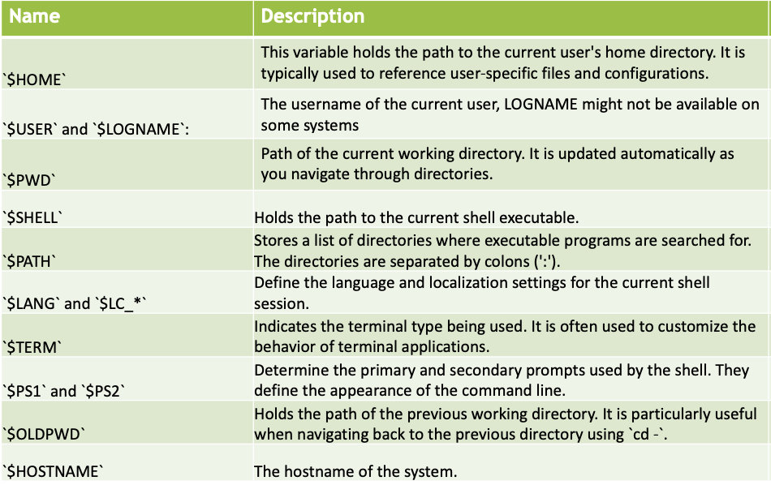
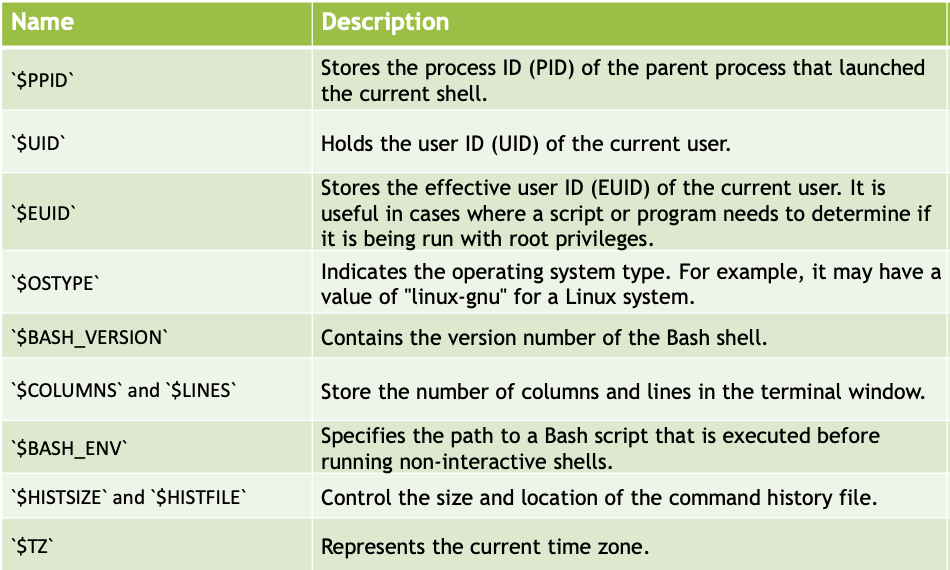
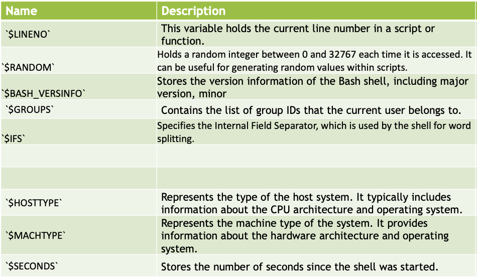

<!-- 

📋 This is my note-taking from what I learned in the Unix/Linux Tutorial!

- Reference link: <https://www.tutorialspoint.com/unix/index.htm>
  

<div class="notice--danger">{{ notice-2 | markdownify }}</div> -->



📋 This is my note-taking from what I learned in the Unix/Linux course!


<div class="notice--danger">{{ notice-2 | markdownify }}</div>

<!-- 📋 This is my note-taking from what I learned in the UNIX/LINUX Tutorial!
{: .notice--danger} -->

<br>

# What is a Shell Script?

- User interacts with the kernel via a command interpreter – shell
- We enter commands and the shell executes it.
- If you have to do the same tasks often, it is better to accumulate the commands into a file and then execute that file.
- The first line of the file must be the pathname of the shell.
- You may use the echo command to send output to the screen and the read command that read input from the keyboard.
- You may use variable to store values.
- Control structure are supported.
- You may put any command that you would normally execute at the prompt into the shell script.
- A shell program is normally assembled line by line.

<br>

# First Shell Script

```
#!/bin/bash

# Author: Narendra
# Name: shell00.sh
# Date: April 17, 2023
# Purpose: To demonstrate the following:
# 1) comments
# 2) sending output to the user
# 3) running a simple command

echo Narendra Pershad #this is also a comment
echo COMP301
ls -l
```

Output:

```
Narendra Pershad
COMP301
total 56
drwxr-xr-x@  2 seyeonjo  staff     64 16 Jun 13:37 backup
-rw-r--r--   1 seyeonjo  staff     70 12 Jul 08:41 file
-rwxr-xr-x   1 seyeonjo  staff    257 18 Jul 21:52 hello.sh
-rw-r--r--@  1 seyeonjo  staff  10194  9 Jun 16:51 lab.txt
drwxr-xr-x@ 15 seyeonjo  staff    480 15 Jul 19:34 lab3
drwxr-xr-x@  4 seyeonjo  staff    128  9 Jun 16:33 lab4
drwxr-xr-x@  4 seyeonjo  staff    128 23 Jun 13:04 lab6
-rw-r--r--@  1 seyeonjo  staff    854 23 Jun 13:07 lab6.txt
drwxr-xr-x@  6 seyeonjo  staff    192 11 Jul 22:40 lab7
-rwxr-xr-x@  1 seyeonjo  staff   1086 16 Jun 13:37 q5.sh
```

<br>

# Running the Shell Script

- Ensure that the first line of the file is the pathname of the shell.
- Change the permission of the file to be executable.
  : - chmod 755 «script_name»
  : - chmod +x «script_name»
- To run the script, invoke it from the command prompt.
  : - ./«script_name»
- Scripts are not compiled, instead they are interpreted by the linux shell.
- If an error is encountered, execution halts.

```
(base) seyeonjo@seyeonjos-MacBook-Pro Unix:Linux % chmod +x hello.sh
(base) seyeonjo@seyeonjos-MacBook-Pro Unix:Linux % ./hello.sh
```

<br>

# Variables

- The shell can access Environment variables.
  : - Are normally upper-cased
  : - Such as: HOME, PATH
- You may also define your own working variables in shell scripts (shell variables).
- You can prevent modification of a variable by marking it read-only.
- You may remove a variable using the unset command.
- The `printenv` command will display all the environment variables.

## Variable Names

- Avoid using dollar sign in variable names.
- Use descriptive names that reflects the purpose of contents of the variable.
- Use capitalization appropriately and consistently.
- If a variable name is to consist of two or more words, use underscores between the words.
- Variables are case sensitive.
- Prefer snake casing.

## More on Variables

- Omit spaces when you assign a variable without using single/double quotation marks around value.
- To assign a variable that must contain spaces, enclose value in “” or ‘’.
- To reference a variable, use a $ in front of it or enclose it in { }.
- Use [ ] to refer to a specific value in an array.
- Variables are local to the current sell session or script.
- Avoid modifying environment variables.
- You may export a shell variable to make the variable available to other scripts.
- If you need to make a variable available to sub-process, use the export command.
- In this course, we will use a pair of single quotes to represent a variable.





<br>

# Shell Operators

Bash shell operators are divided into four groups:

- Assignment Operators: Used to assign values to variables. Example: `=` (simple assignment), `+=` (append assignment), etc.
- Comparison Operators: Used to compare values or expressions. Example: `-eq` (equal to), `-ne` (not equal to), `-lt` (less than), `-gt` (greater than), etc.
- Logical Operators: Used to perform logical operations. Example: `&&` (logical AND), `||` (logical OR), `!` (logical NOT), etc.
- Arithmetic Operators: Used for arithmetic calculations. Example: `+` (addition), `-` (subtraction), `*` (multiplication), `/` (division), `%` (modulo), etc.
- String Operators: Used for string manipulation. Example: `=` (string equality), `!=` (string inequality), `+` (string concatenation), etc.
- File Test Operators: Used to test various properties of files. Example: `-e` (existence), `-r` (readable), `-w` (writable), `-x` (executable), etc.
- Conditional Operators: Used for conditional expressions and flow control. Example: `if`, `case`, `[[ ... ]]`, etc.
- Redirection Operators: Used to redirect input/output streams. Example: `>` (output redirection), `<` (input redirection), `>>` (append output), `|` (pipe), etc.

<br>

# Second Shell Script

```
#!/bin/bash

# Author: Narendra
#   Name: shell00b.sh
#   Date: April 18, 2023
#
# Purpose: To demonstrate environment variables.
#   Note, most of these variables are uppercased
#   to get the value of the variable, use the
#   $ expansion operator

echo $USER    #prints: npersh
echo $SHELL     #prints: /bin/bash
echo $NAME    #prints: PR-LA230-NARENDRAPERSHAD
echo $PWD     #prints: /mnt/c/progs/COMP301/progs
echo $LOGNAME     #prints: npersh
echo $HOME    #prints: /home/npersh
echo $BASH    #prints: /bin/bash
echo $BASH_VERSION    #prints: 5.1.16(1)-release
echo $OSTYPE    #prints: linux-gnu
echo the machine type is $MACHTYPE    #prints: The machine type is x86_64-pc-linux-gnu
```

```
(base) seyeonjo@seyeonjos-MacBook-Pro hello % chmod +x hello1.sh
(base) seyeonjo@seyeonjos-MacBook-Pro hello % ./hello1.sh
```

<br>

# Third Shell Script

```
echo " name of the script: $0" #prints: ./shell00c.sh
echo " first argument to the script: $1" #prints: mary
echo " second argument to the script: $2" #prints: had
echo " number of arguments to the script: $#" #prints: 5
echo " all the arguments to the script: $@" #prints: mary had a little lamb
echo " all the arguments to the script: $*" #prints: mary had a little lamb
echo " process id of the script: $$" #prints: 96
echo "the exit code for the last command: $?" #prints: 0
```

```
(base) seyeonjo@seyeonjos-MacBook-Pro hello % chmod +x hello2.sh
(base) seyeonjo@seyeonjos-MacBook-Pro hello % ./hello2.sh Mary had a little lamb
```

<br>

# Fourth Shell Script

```
#!/bin/bash

# Author: Narendra
# Name: shell00d.sh
# Date: April 17, 2023
#
# Purpose: To demonstrate the following:
# 1) no quotes (strongly discouraged)
# 2) single quotes (does not evaluate variables)
# 3) double quotes (Allows you to evaluate a variable)
# 4) back tick (Allows you to runs a command and assigns the result to a variable)
# 5) user-defined variables: names of variable must not start with a digit

greeting=Hello      #no quotes (don’t use)
first='Narendra K.'       #the preferred way of defining a variable
last="Pershad"      #this is possible, but should be reserved for variable expansion

raw='$greeting world from $first $last'       #no shell expansion
echo $raw       #prints: $greeting world from $first $last

name="$greeting world from $first $last"      #shell expansion
echo $name      #prints: Hello world from Narendra K. Pershad

lscript='wc -l shell00d.sh'       #normal variable
echo $lscript       #prints: wc -l shell00d.sh

lscript=`wc -l shell00d.sh`       #the results of a command is stored
echo $lscript       #prints: 28 shell00d.sh

echo `wc -l shell00d.sh`      #also prints: 28 shell00d.sh
```

- `wc`: The command stands for "word count" and is used to count lines, words, and characters in a file or input.
- `-l`: This is an option for wc which specifies that we want to count the number of lines.
- `shell00d.sh`: This is the file name or path of the file on which we want to perform the line count.

So, when you run the command `wc -l shell00d.sh`, the output will display the number of lines in the file `shell00d.sh`.

<br>

---

<br>

    🖋️ This is my self-taught blog! Feel free to let me know
    if there are some errors or wrong parts 😆

[Back to Top](#){: .btn .btn--primary }{: .align-right}
