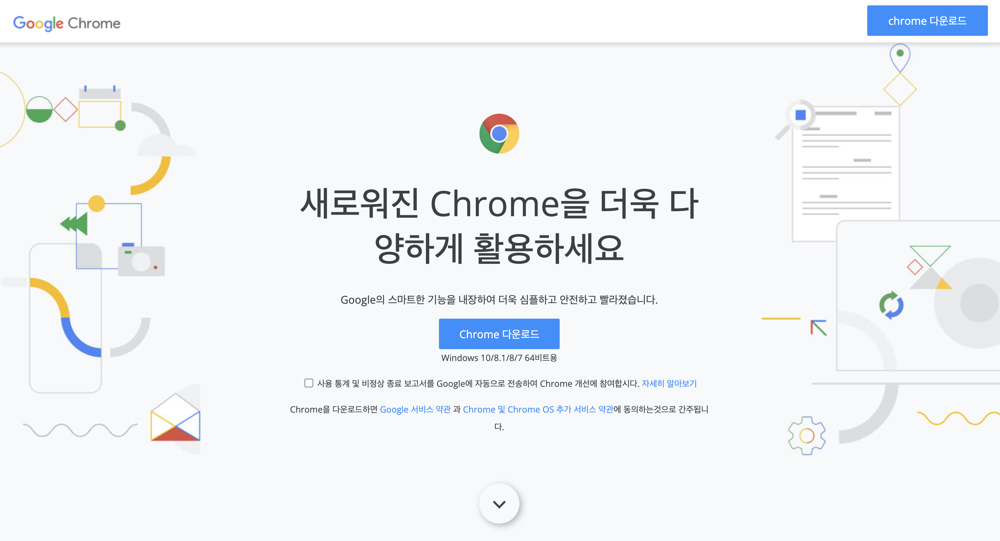
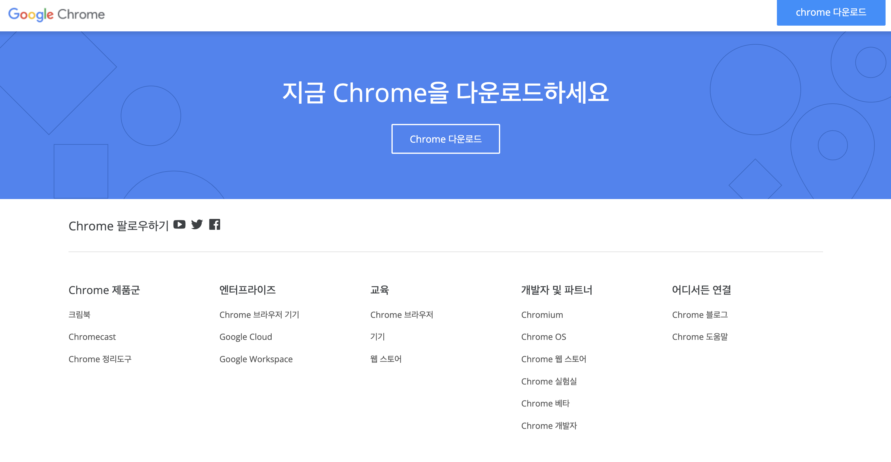

### 크롬 브라우저 프로젝트 정리
> 코딩웍스 강사님의 크롬브라우저 만들기 프로젝트 정리 및 복습을 위해 작성하였습니다.

<br>

### 프로젝트 소개(코딩웍스 강사님)
인프런의 코딩웍스(Coding Works)강사님의 수업중 하나인 [실전 퍼블리싱2 내용](https://www.inflearn.com/course/%EC%9B%B9-%ED%8D%BC%EB%B8%94%EB%A6%AC%EC%8B%B1-%EC%8B%A4%EC%A0%84-%EC%8B%9C%EC%A6%8C2/dashboard)
중에서 크롬브라우저 다운로드 프로젝트(클론코딩) 복습

> 몇백만원 국비학원만큼 정말 퀄리티가 좋은 강의입니다.
> 백엔드 개발자라면 토이프로젝트 진행을 할 때 자신이 원하는대로 컴포넌트 배치를 할 수 있고 스타일 맞추는데 시간을 크게 허비하지 않을수 있습니다.
> 
퍼블리싱 시즌2 강의도 시즌1에서 배웠던 내용 + 최신 트렌드에 맞는 다양한 기술등을 많이 알려주셔서 추천드립니다.
(홍보 알바생X)

<br>

> 프로젝트 결과물
> 




#### 와이어 프레임(레이아웃)

```
.container

    header
        .logo > img
        .download > a.btn-download
    section.welcome
        .heading
        img
        h1 
        p
        .download-content
            a.btn-download
            span
        .statics
            p
                label > input[type=checkbox], a
            p > a*2
        .next-section
            a > i

    section.feature.solution
        .inner
            .desc
                img
                h1
                p
                a.read-more
            .photo
                img
    section.feature.smart
        .inner
            .photo
                img
            .desc
                img
                h1
                p
                a.read-more
    section.feature.secure
        .inner
            .desc
                img
                h1
                p
                a.read-more
            .photo
                img
    section.feature.edit
        .inner
            .photo
                img
            .desc
                img
                h1
                p
                a.read-more
    section.callaction
        .inner
            h1
            a.btn-download
    
    footer
        .footer-inner
            .sns-outer
                .sns
                    b, span > (a > i)*3
                .sitemap
                    div
                        b
                        a*4
                .copyright
                    .logo-footer
                        img
                    .policy
                        a*3
                    .language
                        i, select

기본 폰트 글꼴 : Open Sans
기본 폰트 색상 : #3c4043
기본 폰트 크기 : 16px
컨텐츠 영영 : 1250px
헤더 높이 : 65px
```

#### header 만들기
```html
<!DOCTYPE html>
<html lang="en">
<head>
    <meta charset="UTF-8">
    <meta http-equiv="X-UA-Compatible" content="IE=edge">
    <meta name="viewport" content="width=device-width, initial-scale=1.0">
    <title>크롬 브라우저 다운로드</title>
    <link href="https://fonts.googleapis.com/css2?family=Noto+Sans+KR:wght@100;300;400;500;700;900&display=swap" rel="stylesheet">
    <link rel="icon" href="image/google-dev.png">
    <style>
        *{
            box-sizing: border-box;
            outline: none;
        }
        body{
            font-family: 'Open Sans', sans-serif;
            margin: 0;
            font-size: 16px;
            color: #3c4043;
            line-height: 1.6em;
        }
        a{
            text-decoration: none;
            color: #3c4043;
        }

        /* Common CSS */
        /* 공통으로 쓰이는것 */
        .btn-download{
            background-color: dodgerblue;
            color: #fff;
            display: inline-block;
            width: 180px;
            padding: 10px;
            text-align: center;
            border-radius: 2px;
        }
        .btn-download:hover{
            background-color: #174EA6;
        }

        /* Header */
        header{
            height: 65px;
            background-color: #fff;
            box-shadow: 0 5px 5px rgba(0, 0, 0, 0.1);
            position: fixed;
            width: 100%;
            z-index: 100;
            padding: 0 20px;
        }
        .logo{
            float : left;
            padding-top: 20px;
        }
        .download{
            float : right;
            padding-top: 10px;
        }
    </style>
</head>
<body>
    <div class="container">
        <header>
            <div class="logo">
                <a href="index.html" title="chrome 다운로드"></a>
            </div>
            <div class="download">
                <a href="" class="btn-download">
                    chrome 다운로드
                </a>
            </div>
        </header>
        <section class="welcome"></section>
        <section class="feature solution"></section>
        <section class="feature smart"></section>
        <section class="feature secure"></section>
        <section class="feature edit"></section>
        <section class="callaction"></section>
        <footer></footer>
    </div>
</body> 
</html>
```

#### welcome section
``` html
<!DOCTYPE html>
<html lang="en">
<head>
    <meta charset="UTF-8">
    <meta http-equiv="X-UA-Compatible" content="IE=edge">
    <meta name="viewport" content="width=device-width, initial-scale=1.0">
    <title>크롬 브라우저 다운로드</title>
    <link rel="icon" href="image/google-dev.png">
    <style>
        /* Google Web Fonts CDN */
        @import url('https://fonts.googleapis.com/css2?family=Open+Sans:wght@300;400&display=swap');

        /* XEICON CDN  */
        @import url('http://cdn.jsdelivr.net/npm/xeicon@2.3.3/xeicon.min.css');

        *{
            box-sizing: border-box;
            outline: none;
        }
        body{
            font-family: 'Open Sans', sans-serif;
            margin: 0;
            font-size: 16px;
            color: #3c4043;
            line-height: 1.6em;
        }
        a{
            text-decoration: none;
            color: #3c4043;
        }

        /* Reset CSS */
        h1,h2,h3,h4,h5,h6 {
            margin: 0;
        }

        /* Common CSS */
        /* 공통으로 쓰이는것 */
        .btn-download{
            background-color: dodgerblue;
            color: #fff;
            display: inline-block;
            width: 180px;
            padding: 10px;
            text-align: center;
            border-radius: 2px;
        }
        .btn-download:hover{
            background-color: #174EA6;
        }

        /* Header */
        header{
            height: 65px;
            background-color: #fff;
            box-shadow: 0 5px 5px rgba(0, 0, 0, 0.1);
            position: fixed;
            width: 100%;
            z-index: 100;
            padding: 0 20px;
        }
        .logo{
            float : left;
            padding-top: 20px;
        }
        .download{
            float : right;
            padding-top: 10px;
        }

        /* Welcome */
        section.welcome{
            border: 1px solid #000;
            height: 100vh;
            background: #F8F9FB url(image/hero-back-large-desktop.jpg) no-repeat center center;
            position: relative;
        }
        .heading{
            position: absolute;
            width: 630px;
            top: 50%;
            left: 50%;
            transform: translate(-50%, -50%);
            text-align: center;
        }
        .heading img{
            width: 65px;;
        }
        .heading h1{
            font-size : 52px;
            font-weight: 500;
            line-height: 1.3em;
            /* h태그에 margin이 너무 크니까 이거를 조절할 수 있도록 reset CSS 해준다. */
            margin: 30px 0;
        }
        .download-content {}
        .download-content span{
            display: block;
            font-size: 13px;
        }
        .statics{
            font-size : 13px;
        }
        .statics a{
            color: dodgerblue;
        }
        .statics a:hover{
            color: rgb(22, 96, 171);
        }
        /* input type 체크박스와 글이 정확이 가운데에 안맞아서 맞춰주기 위함 */
        .statics label input[type=checkbox]{
            /* 
            vertical-align : middle 을 주면 가운데로 준다.
            이 속성은 inline-block에만 사용가능하다.

            vertical-align: middle; 
            margin-top: -1px ;
            
            이렇게 맞춰줄수 있고 또는 밑에 방법으로 대체 가능
            */
            transform: translateY(1px);
        }
        .next-section{
            position: absolute;
            bottom: 50px;
            left: 50%;
            transform: translateX(-50%);
        }
        .next-section a{
            /* 인라인은 당연히 크기값을 가질수 없다. 이것을 block이나 inline-block요소로 변경 필요 */
            width: 60px;
            height: 60px;
            display: block;
            border-radius: 50%;
            box-shadow: 3px 3px 10px rgba(0,0,0,0.3); 
            /* box-shadow(x축, y축, 퍼짐정도, 컬러) */
            text-align: center;
            font-size: 36px;
            line-height: 65px;
        }
        .next-section a i{
            animation: next 1.2s linear infinite;
        }

        @keyframes next{
            0%{
                transform: translateY(-3px);
            }
            50%{
                transform: translateY(3px);
            }
            100%{
                transform: translateY(-3px);
            }
        }
    </style>
</head>
<body>
    <div class="container">
        <header>
            <div class="logo">
                <a href="index.html" title="chrome 다운로드"></a>
            </div>
            <div class="download">
                <a href="" class="btn-download">
                    chrome 다운로드
                </a>
            </div>
        </header>
        <section class="welcome">
            <div class="heading">
                
                <h1>새로워진 Chrome을 더욱 다양하게 활용하세요</h1>
                <p>
                    Google의 스마트한 기능을 내장하여 더욱 심플하고 안전하고 빨라졌습니다.
                </p>
                <div class="download-content">
                    <a href="#none" class="btn-download">
                        Chrome 다운로드
                    </a>
                    <span>Windows 10/8.1/8/7 64비트용</span>
                </div>
                <div class="statics">
                    <p>
                        <label>
                            <!-- label에 for를 안넣어야지 라인 어디를 클릭해도 checkbox 체크 가능 -->
                            <input type="checkbox">
                            사용 통계 및 비정상 종료 보고서를 Google에 자동으로 전송하여 Chrome 개선에 참여합시다.
                        </label>
                        <a href="#none">자세히 알아보기</a>
                    </p>
                    <p>
                        Chrome을 다운로드하면 <a href="#none">Google 서비스 약관</a> 과
                        <a href="#none">Chrome 및 Chrome OS 추가 서비스 약관</a>에 동의하는것으로 간주됩니다.
                    </p>
                </div>

            </div>
            <div class="next-section">
                <a href="#none">
                    <i class="xi-angle-down-min"></i>
                </a>
            </div>
        </section>
        <section class="feature solution"></section>
        <section class="feature smart"></section>
        <section class="feature secure"></section>
        <section class="feature edit"></section>
        <section class="callaction"></section>
        <footer></footer>
    </div>
</body> 
</html>

```

#### feature section
```html
<!DOCTYPE html>
<html lang="en">
<head>
    <meta charset="UTF-8">
    <meta http-equiv="X-UA-Compatible" content="IE=edge">
    <meta name="viewport" content="width=device-width, initial-scale=1.0">
    <title>크롬 브라우저 다운로드</title>
    <link rel="icon" href="image/google-dev.png">
    <style>
        /* Google Web Fonts CDN */
        @import url('https://fonts.googleapis.com/css2?family=Open+Sans:wght@300;400&display=swap');

        /* XEICON CDN  */
        @import url('http://cdn.jsdelivr.net/npm/xeicon@2.3.3/xeicon.min.css');

        *{
            box-sizing: border-box;
            outline: none;
        }
        /* 
            [important]
            next 클릭시 다음 next id로 이동하는게 스무스하지 않고 그냥 바로 이동하기 때문에 보기 불편할때 아래와 같이 사용 가능(앵커 태그 움직임 부드럽게 하기 위해서)
            굳이 jquery 를 사용할 필요가 없다.
            [IE에서는 동작 X?] 
            html{
                scroll-behavior: smooth;
            }
        */
        html{
            scroll-behavior: smooth;
        }
        body{
            font-family: 'Open Sans', sans-serif;
            margin: 0;
            font-size: 16px;
            color: #3c4043;
            line-height: 1.6em;
        }
        a{
            text-decoration: none;
            color: #3c4043;
        }

        /* Reset CSS */
        h1,h2,h3,h4,h5,h6 {
            margin: 0;
            font-weight: 500;
        }

        /* Common CSS */
        /* 공통으로 쓰이는것 */
        .btn-download{
            background-color: dodgerblue;
            color: #fff;
            display: inline-block;
            width: 180px;
            padding: 10px;
            text-align: center;
            border-radius: 2px;
        }
        .btn-download:hover{
            background-color: #174EA6;
        }

        /* Common Feature */
        section.feature{
            padding: 50px 0;
        }

        /* 
            [important]
            처음에 배치할때는 기존방식 float를 이용해서 하자.
            그래도 안되면 flex 사용.
            float : 사용하면 부모는 높이값을 잃는다 명심.
            overflow : hidden(부모)
            높이 조절이 안맞으면 padding-top으로 조절

            구 버전
            .inner{
                overflow: hidden; 
            }
            .inner > div{
                float : left;
                width: 50%; 
            }
            .desc{
                padding-top: 100px;
            }
       */
            /*
                flex 사용법
                1. 부모에 display : flex 넣어준다
                2. 자식들에게 flex : 1 넣어준다.
                3. 세로 가운데 정렬 원하면 부모에 : align-items : center 넣어준다.
            */
        .inner{
            width: 1250px;
            margin: auto;
            display: flex;
            overflow: hidden;
            /* align-items: center; */
            /* 정확하게 세로로 가운데 정렬 해준다. 꼭 꼭 명심하고 잘 사용하자!!!!  */
        }
        /* inner 바로 아래 div */
        .inner > div{
           /* 
            float를 쓰면 부모 inner가 높이값을 잃게 된다. 
            부모에 overflow : hidden으로 준다.
            */
            /* /* float : left; */
            width: 50%; 
            /* flex: 1; */
        }
        .desc{
            padding: 0 50px;
            padding-top: 100px;

        }
        .desc h1{
            font-size: 42px;
            line-height: 1.2em; 
        }
        .photo img{
            width: 100%;
        }
        .read-more{
            color: purple;
        }
        .read-more:after{
            content : '\e907';
            font-family: xeicon;
            margin-left: 5px;
            /* 기본적으로 inline 속성이라서 transform이 안먹힌다. 그래서 block이나 inline-block으로 변경해주어야 하지만 block의 경우 다음줄로 이동하니까 inline-block 사용 */
            display: inline-block;
            transition: 0.35s;
        }
        .read-more:hover:after{
            /* transform 은 inline요소에는 적용되지 않는다. 어떻게 보면 당연함. inline은 width, height를 못가지니까 */
            transform: translateX(5px);
        }
        /* Header */
        header{
            height: 65px;
            background-color: #fff;
            box-shadow: 0 5px 5px rgba(0, 0, 0, 0.1);
            position: fixed;
            width: 100%;
            z-index: 100;
            padding: 0 20px;
        }
        .logo{
            float : left;
            padding-top: 20px;
        }
        .download{
            float : right;
            padding-top: 10px;
        }

        /* Welcome */
        section.welcome{
            height: 100vh;
            background: #F8F9FB url(image/hero-back-large-desktop.jpg) no-repeat center center;
            position: relative;
        }
        .heading{
            position: absolute;
            width: 630px;
            top: 50%;
            left: 50%;
            transform: translate(-50%, -50%);
            text-align: center;
        }
        .heading img{
            width: 65px;;
        }
        .heading h1{
            font-size : 52px;
            font-weight: 500;
            line-height: 1.3em;
            /* h태그에 margin이 너무 크니까 이거를 조절할 수 있도록 reset CSS 해준다. */
            margin: 30px 0;
        }
        .download-content {}
        .download-content span{
            display: block;
            font-size: 13px;
        }
        .statics{
            font-size : 13px;
        }
        .statics a{
            color: dodgerblue;
        }
        .statics a:hover{
            color: rgb(22, 96, 171);
        }
        /* input type 체크박스와 글이 정확이 가운데에 안맞아서 맞춰주기 위함 */
        .statics label input[type=checkbox]{
            /* 
            vertical-align : middle 을 주면 가운데로 준다.
            이 속성은 inline-block에만 사용가능하다.

            vertical-align: middle; 
            margin-top: -1px ;
            
            이렇게 맞춰줄수 있고 또는 밑에 방법으로 대체 가능
            */
            transform: translateY(1px);
        }
        .next-section{
            position: absolute;
            bottom: 50px;
            left: 50%;
            transform: translateX(-50%);
        }
        .next-section a{
            /* 인라인은 당연히 크기값을 가질수 없다. 이것을 block이나 inline-block요소로 변경 필요 */
            width: 60px;
            height: 60px;
            display: block;
            border-radius: 50%;
            box-shadow: 3px 3px 10px rgba(0,0,0,0.3); 
            /* box-shadow(x축, y축, 퍼짐정도, 컬러) */
            text-align: center;
            font-size: 36px;
            line-height: 65px;
        }
        .next-section a i{
            animation: next 1.2s linear infinite;
        }

        @keyframes next{
            0%{
                transform: translateY(-3px);
            }
            50%{
                transform: translateY(3px);
            }
            100%{
                transform: translateY(-3px);
            }
        }
    </style>
</head>
<body>
    <div class="container">
        <header>
            <div class="logo">
                <a href="index.html" title="chrome 다운로드"></a>
            </div>
            <div class="download">
                <a href="" class="btn-download">
                    chrome 다운로드
                </a>
            </div>
        </header>
        <section class="welcome">
            <div class="heading">
                
                <h1>새로워진 Chrome을 더욱 다양하게 활용하세요</h1>
                <p>
                    Google의 스마트한 기능을 내장하여 더욱 심플하고 안전하고 빨라졌습니다.
                </p>
                <div class="download-content">
                    <a href="#none" class="btn-download">
                        Chrome 다운로드
                    </a>
                    <span>Windows 10/8.1/8/7 64비트용</span>
                </div>
                <div class="statics">
                    <p>
                        <label>
                            <!-- label에 for를 안넣어야지 라인 어디를 클릭해도 checkbox 체크 가능 -->
                            <input type="checkbox">
                            사용 통계 및 비정상 종료 보고서를 Google에 자동으로 전송하여 Chrome 개선에 참여합시다.
                        </label>
                        <a href="#none">자세히 알아보기</a>
                    </p>
                    <p>
                        Chrome을 다운로드하면 <a href="#none">Google 서비스 약관</a> 과
                        <a href="#none">Chrome 및 Chrome OS 추가 서비스 약관</a>에 동의하는것으로 간주됩니다.
                    </p>
                </div>

            </div>
            <div class="next-section">
                <a href="#next">
                    <i class="xi-angle-down-min"></i>
                </a>
            </div>
        </section>
        <section class="feature solution" id="next">
            <div class="inner">
                <div class="desc">
                    
                    <h1>어떤 일이든 더 빠르게 해내는 방법</h1>
                    <p>크든 작든, 일이든 놀이든, 웹을 이용할 때는 목적이 있을 것입니다. Chrome은 업무 처리나 창의적 작업, 인터넷 탐색에 필요한 스마트한 기능과 빠른 속도를 제공합니다.</p>
                    <a href="#none" class="read-more">살펴보기</a>
                </div>
                <div class="photo">
                    
                </div>
            </div>
        </section>
        <section class="feature smart">
            <div class="inner">
                <div class="photo">
                    
                </div>
                <div class="desc">
                    
                    <h1>원하는 기능을 모두 갖춘 Google의 스마트함</h1>
                    <p>Chrome은 웹을 최대한 활용하는 데 필요한 모든 기능을 제공합니다. 주소 표시줄에 답이 표시되고, 클릭 한 번으로 콘텐츠를 번역하고, 스마트폰에서 내게 맞는 읽을거리를 추천합니다.</p>
                    <a href="#none" class="read-more">살펴보기</a>
                </div>
            </div>
        </section>
        <section class="feature secure">
            <div class="inner">
                <div class="desc">
                    
                    <h1>마치 초능력 같은 Chrome 보안 기능</h1>
                    <p>웹에서는 어떤 문제든 발생할 수 있지만 일일이 아실 필요는 없습니다. Chrome이 피싱이나 위험한 사이트 같은 보안 문제로부터 자동으로 보호해 드립니다.</p>
                    <a href="#none" class="read-more">살펴보기</a>
                </div>
                <div class="photo">
                    
                </div>
            </div>
        </section>
        <section class="feature edit">
            <div class="inner">
                <div class="photo">
                    
                </div>
                <div class="desc">
                    
                    <h1>어디서나, 어떤 작업이든</h1>
                    <p>Chrome은 모든 운영체제에서, 어떤 기기에서나 작동합니다. 노트북과 휴대전화를 마음대로 오가고 원하는 대로 맞춤설정하며 더 많은 작업을 할 수 있습니다.</p>
                    <a href="#none" class="read-more">살펴보기</a>
                </div>
            </div>
        </section>
        <section class="callaction"></section>
        <footer></footer>
    </div>
</body> 
</html>

```

#### callaction section
``` html
<!DOCTYPE html>
<html lang="en">
<head>
    <meta charset="UTF-8">
    <meta http-equiv="X-UA-Compatible" content="IE=edge">
    <meta name="viewport" content="width=device-width, initial-scale=1.0">
    <title>크롬 브라우저 다운로드</title>
    <link rel="icon" href="image/google-dev.png">
    <style>
        /* Google Web Fonts CDN */
        @import url('https://fonts.googleapis.com/css2?family=Open+Sans:wght@300;400&display=swap');

        /* XEICON CDN  */
        @import url('http://cdn.jsdelivr.net/npm/xeicon@2.3.3/xeicon.min.css');

        *{
            box-sizing: border-box;
            outline: none;
        }
        /* 
            [important]
            next 클릭시 다음 next id로 이동하는게 스무스하지 않고 그냥 바로 이동하기 때문에 보기 불편할때 아래와 같이 사용 가능(앵커 태그 움직임 부드럽게 하기 위해서)
            굳이 jquery 를 사용할 필요가 없다.
            [IE에서는 동작 X?] 
            html{
                scroll-behavior: smooth;
            }
        */
        html{
            scroll-behavior: smooth;
        }
        body{
            font-family: 'Open Sans', sans-serif;
            margin: 0;
            font-size: 16px;
            color: #3c4043;
            line-height: 1.6em;
        }
        a{
            text-decoration: none;
            color: #3c4043;
        }

        /* Reset CSS */
        h1,h2,h3,h4,h5,h6 {
            margin: 0;
            font-weight: 500;
        }

        /* Common CSS */
        /* 공통으로 쓰이는것 */
        .btn-download{
            background-color: dodgerblue;
            color: #fff;
            display: inline-block;
            width: 180px;
            padding: 10px;
            text-align: center;
            border-radius: 2px;
        }
        .btn-download:hover{
            background-color: #174EA6;
        }

        /* Common Feature */
        section.feature{
            padding: 50px 0;
        }

        /* 
            [important]
            처음에 배치할때는 기존방식 float를 이용해서 하자.
            그래도 안되면 flex 사용.
            float : 사용하면 부모는 높이값을 잃는다 명심.
            overflow : hidden(부모)
            높이 조절이 안맞으면 padding-top으로 조절

            구 버전
            .inner{
                overflow: hidden; 
            }
            .inner > div{
                float : left;
                width: 50%; 
            }
            .desc{
                padding-top: 100px;
            }
       */
            /*
                flex 사용법
                1. 부모에 display : flex 넣어준다
                2. 자식들에게 flex : 1 넣어준다.
                3. 세로 가운데 정렬 원하면 부모에 : align-items : center 넣어준다.
            */
        .inner{
            width: 1250px;
            margin: auto;
            display: flex;
            overflow: hidden;
            /* align-items: center; */
            /* 정확하게 세로로 가운데 정렬 해준다. 꼭 꼭 명심하고 잘 사용하자!!!!  */
        }
        /* inner 바로 아래 div */
        .inner > div{
           /* 
            float를 쓰면 부모 inner가 높이값을 잃게 된다. 
            부모에 overflow : hidden으로 준다.
            */
            /* /* float : left; */
            width: 50%; 
            /* flex: 1; */
        }
        .desc{
            padding: 0 50px;
            padding-top: 100px;

        }
        .desc h1{
            font-size: 42px;
            line-height: 1.2em; 
        }
        .photo img{
            width: 100%;
        }
        .read-more{
            color: purple;
        }
        .read-more:after{
            content : '\e907';
            font-family: xeicon;
            margin-left: 5px;
            /* 기본적으로 inline 속성이라서 transform이 안먹힌다. 그래서 block이나 inline-block으로 변경해주어야 하지만 block의 경우 다음줄로 이동하니까 inline-block 사용 */
            display: inline-block;
            transition: 0.35s;
        }
        .read-more:hover:after{
            /* transform 은 inline요소에는 적용되지 않는다. 어떻게 보면 당연함. inline은 width, height를 못가지니까 */
            transform: translateX(5px);
        }
        /* Header */
        header{
            height: 65px;
            background-color: #fff;
            box-shadow: 0 5px 5px rgba(0, 0, 0, 0.1);
            position: fixed;
            width: 100%;
            z-index: 100;
            padding: 0 20px;
        }
        .logo{
            float : left;
            padding-top: 20px;
        }
        .download{
            float : right;
            padding-top: 10px;
        }

        /* Welcome */
        section.welcome{
            height: 100vh;
            background: #F8F9FB url(image/hero-back-large-desktop.jpg) no-repeat center center;
            position: relative;
        }
        .heading{
            position: absolute;
            width: 630px;
            top: 50%;
            left: 50%;
            transform: translate(-50%, -50%);
            text-align: center;
        }
        .heading img{
            width: 65px;;
        }
        .heading h1{
            font-size : 52px;
            font-weight: 500;
            line-height: 1.3em;
            /* h태그에 margin이 너무 크니까 이거를 조절할 수 있도록 reset CSS 해준다. */
            margin: 30px 0;
        }
        .download-content {}
        .download-content span{
            display: block;
            font-size: 13px;
        }
        .statics{
            font-size : 13px;
        }
        .statics a{
            color: dodgerblue;
        }
        .statics a:hover{
            color: rgb(22, 96, 171);
        }
        /* input type 체크박스와 글이 정확이 가운데에 안맞아서 맞춰주기 위함 */
        .statics label input[type=checkbox]{
            /* 
            vertical-align : middle 을 주면 가운데로 준다.
            이 속성은 inline-block에만 사용가능하다.

            vertical-align: middle; 
            margin-top: -1px ;
            
            이렇게 맞춰줄수 있고 또는 밑에 방법으로 대체 가능
            */
            transform: translateY(1px);
        }
        .next-section{
            position: absolute;
            bottom: 50px;
            left: 50%;
            transform: translateX(-50%);
        }
        .next-section a{
            /* 인라인은 당연히 크기값을 가질수 없다. 이것을 block이나 inline-block요소로 변경 필요 */
            width: 60px;
            height: 60px;
            display: block;
            border-radius: 50%;
            box-shadow: 3px 3px 10px rgba(0,0,0,0.3); 
            /* box-shadow(x축, y축, 퍼짐정도, 컬러) */
            text-align: center;
            font-size: 36px;
            line-height: 65px;
        }
        .next-section a i{
            animation: next 1.2s linear infinite;
        }

        @keyframes next{
            0%{
                transform: translateY(-3px);
            }
            50%{
                transform: translateY(3px);
            }
            100%{
                transform: translateY(-3px);
            }
        }

        /* Section : CallAction */
        section.callaction{
            height: 280px;
            background: #4285F4 url(image/download-bg-desktop.svg) no-repeat center center;
            padding-top: 90px;
        }
        .callaction-inner{
            text-align: center;
            
        }
        section.callaction h1{
            color: #fff;
            font-size : 42px;
            margin-bottom: 40px;
        } 
        section.callaction .btn-download{
            border: 2px solid #fff;
            background-color: transparent;
        }
        section.callaction .btn-download:hover{
            color: #000;
            background-color: #fff;
        }

        /* Footer */
        footer{}
        .footer-inner{
            width: 1250px;
            margin: auto;
        }
        .sns-outer{
            padding: 30px 0;
            border-bottom: 1px solid #ddd;
        }
        .sns{
            font-size: 20px;
        }
        .sns b{
            font-weight: normal;
        }
        .sns a{
            font-size: 24px;
        }

        .sitemap{
            padding: 50px 0;
        }
        .link-items{
            overflow: hidden;
            /* display: flex;
            align-items: center; */
        }
        .link-item{
            float: left;
            width: 20%;
            /* flex: 1; */
        }
        .link-item-title{
            font-size: 18px;
            font-weight: 500;
            margin-bottom: 10px;
        }
        .link-item-content{
            line-height: 2.3em;
        }
        .link-item-content a{
            display: block;
            font-size: 14px;
            color: #555;
        }
        .link-item-content a:hover{
            color: #000;
        }

        .copyright{
            height: 400px;
        }
        
    </style>
</head>
<body>
    <div class="container">
        <header>
            <div class="logo">
                <a href="index.html" title="chrome 다운로드"></a>
            </div>
            <div class="download">
                <a href="" class="btn-download">
                    chrome 다운로드
                </a>
            </div>
        </header>
        <section class="welcome">
            <div class="heading">
                
                <h1>새로워진 Chrome을 더욱 다양하게 활용하세요</h1>
                <p>
                    Google의 스마트한 기능을 내장하여 더욱 심플하고 안전하고 빨라졌습니다.
                </p>
                <div class="download-content">
                    <a href="#none" class="btn-download">
                        Chrome 다운로드
                    </a>
                    <span>Windows 10/8.1/8/7 64비트용</span>
                </div>
                <div class="statics">
                    <p>
                        <label>
                            <!-- label에 for를 안넣어야지 라인 어디를 클릭해도 checkbox 체크 가능 -->
                            <input type="checkbox">
                            사용 통계 및 비정상 종료 보고서를 Google에 자동으로 전송하여 Chrome 개선에 참여합시다.
                        </label>
                        <a href="#none">자세히 알아보기</a>
                    </p>
                    <p>
                        Chrome을 다운로드하면 <a href="#none">Google 서비스 약관</a> 과
                        <a href="#none">Chrome 및 Chrome OS 추가 서비스 약관</a>에 동의하는것으로 간주됩니다.
                    </p>
                </div>

            </div>
            <div class="next-section">
                <a href="#next">
                    <i class="xi-angle-down-min"></i>
                </a>
            </div>
        </section>
        <section class="feature solution" id="next">
            <div class="inner">
                <div class="desc">
                    
                    <h1>어떤 일이든 더 빠르게 해내는 방법</h1>
                    <p>크든 작든, 일이든 놀이든, 웹을 이용할 때는 목적이 있을 것입니다. Chrome은 업무 처리나 창의적 작업, 인터넷 탐색에 필요한 스마트한 기능과 빠른 속도를 제공합니다.</p>
                    <a href="#none" class="read-more">살펴보기</a>
                </div>
                <div class="photo">
                    
                </div>
            </div>
        </section>
        <section class="feature smart">
            <div class="inner">
                <div class="photo">
                    
                </div>
                <div class="desc">
                    
                    <h1>원하는 기능을 모두 갖춘 Google의 스마트함</h1>
                    <p>Chrome은 웹을 최대한 활용하는 데 필요한 모든 기능을 제공합니다. 주소 표시줄에 답이 표시되고, 클릭 한 번으로 콘텐츠를 번역하고, 스마트폰에서 내게 맞는 읽을거리를 추천합니다.</p>
                    <a href="#none" class="read-more">살펴보기</a>
                </div>
            </div>
        </section>
        <section class="feature secure">
            <div class="inner">
                <div class="desc">
                    
                    <h1>마치 초능력 같은 Chrome 보안 기능</h1>
                    <p>웹에서는 어떤 문제든 발생할 수 있지만 일일이 아실 필요는 없습니다. Chrome이 피싱이나 위험한 사이트 같은 보안 문제로부터 자동으로 보호해 드립니다.</p>
                    <a href="#none" class="read-more">살펴보기</a>
                </div>
                <div class="photo">
                    
                </div>
            </div>
        </section>
        <section class="feature edit">
            <div class="inner">
                <div class="photo">
                    
                </div>
                <div class="desc">
                    
                    <h1>어디서나, 어떤 작업이든</h1>
                    <p>Chrome은 모든 운영체제에서, 어떤 기기에서나 작동합니다. 노트북과 휴대전화를 마음대로 오가고 원하는 대로 맞춤설정하며 더 많은 작업을 할 수 있습니다.</p>
                    <a href="#none" class="read-more">살펴보기</a>
                </div>
            </div>
        </section>
        <section class="callaction">
            <div class="callaction-inner">
                <h1>
                    지금 Chrome을 다운로드하세요
                </h1>
                <a href="#none" class="btn-download">
                    Chrome 다운로드
                </a>
            </div>
        </section>
        <footer>
            <div class="footer-inner">
                <div class="sns-outer">
                    <div class="sns">
                        <b>Chrome 팔로우하기</b>
                        <span>
                            <a href="#none"><i class="xi-youtube-play"></i></a>
                            <a href="#none"><i class="xi-twitter"></i></a>
                            <a href="#none"><i class="xi-facebook-official"></i></a>
                        </span>
                    </div>
                </div>
                <div class="sitemap">
                    <div class="link-items">
                        <div class="link-item">
                            <div class="link-item-title">Chrome 제품군</div>
                            <div class="link-item-content">
                                <a href="#none">크림북</a>
                                <a href="#none">Chromecast</a>
                                <a href="#none">Chrome 정리도구</a>
                            </div>
                        </div>
                        <div class="link-item">
                            <div class="link-item-title">엔터프라이즈</div>
                            <div class="link-item-content">
                                <a href="#none">Chrome 브라우저 기기</a>
                                <a href="#none">Google Cloud</a>
                                <a href="#none">Google Workspace</a>
                            </div>
                        </div>
                        <div class="link-item">
                            <div class="link-item-title">교육</div>
                            <div class="link-item-content">
                                <a href="#none">Chrome 브라우저</a>
                                <a href="#none">기기</a>
                                <a href="#none">웹 스토어</a>
                            </div>
                        </div>
                        <div class="link-item">
                            <div class="link-item-title">개발자 및 파트너</div>
                            <div class="link-item-content">
                                <a href="#none">Chromium</a>
                                <a href="#none">Chrome OS</a>
                                <a href="#none">Chrome 웹 스토어</a>
                                <a href="#none">Chrome 실험실</a>
                                <a href="#none">Chrome 베타</a>
                                <a href="#none">Chrome 개발자</a>
                            </div>
                        </div>
                        <div class="link-item">
                            <div class="link-item-title">어디서든 연결</div>
                            <div class="link-item-content">
                                <a href="#none">Chrome 블로그</a>
                                <a href="#none">Chrome 도움말</a>
                            </div>
                        </div>
                    </div>
                </div>
            </div>
            
            <div class="copyright">copyright</div>
        </footer>
    </div>
</body> 
</html>
```

#### footer & copyright
```html
<!DOCTYPE html>
<html lang="en">
<head>
    <meta charset="UTF-8">
    <meta http-equiv="X-UA-Compatible" content="IE=edge">
    <meta name="viewport" content="width=device-width, initial-scale=1.0">
    <title>크롬 브라우저 다운로드</title>
    <link rel="icon" href="image/google-dev.png">
    <style>
        /* Google Web Fonts CDN */
        @import url('https://fonts.googleapis.com/css2?family=Open+Sans:wght@300;400&display=swap');

        /* XEICON CDN  */
        @import url('http://cdn.jsdelivr.net/npm/xeicon@2.3.3/xeicon.min.css');

        *{
            box-sizing: border-box;
            outline: none;
        }
        /* 
            [important]
            next 클릭시 다음 next id로 이동하는게 스무스하지 않고 그냥 바로 이동하기 때문에 보기 불편할때 아래와 같이 사용 가능(앵커 태그 움직임 부드럽게 하기 위해서)
            굳이 jquery 를 사용할 필요가 없다.
            [IE에서는 동작 X?] 
            html{
                scroll-behavior: smooth;
            }
        */
        html{
            scroll-behavior: smooth;
        }
        body{
            font-family: 'Open Sans', sans-serif;
            margin: 0;
            font-size: 16px;
            color: #3c4043;
            line-height: 1.6em;
        }
        a{
            text-decoration: none;
            color: #3c4043;
        }

        /* Reset CSS */
        h1,h2,h3,h4,h5,h6 {
            margin: 0;
            font-weight: 500;
        }

        /* Common CSS */
        /* 공통으로 쓰이는것 */
        .btn-download{
            background-color: dodgerblue;
            color: #fff;
            display: inline-block;
            width: 180px;
            padding: 10px;
            text-align: center;
            border-radius: 2px;
        }
        .btn-download:hover{
            background-color: #174EA6;
        }

        /* Common Feature */
        section.feature{
            padding: 50px 0;
        }

        /* 
            [important]
            처음에 배치할때는 기존방식 float를 이용해서 하자.
            그래도 안되면 flex 사용.
            float : 사용하면 부모는 높이값을 잃는다 명심.
            overflow : hidden(부모)
            높이 조절이 안맞으면 padding-top으로 조절

            구 버전
            .inner{
                overflow: hidden; 
            }
            .inner > div{
                float : left;
                width: 50%; 
            }
            .desc{
                padding-top: 100px;
            }
       */
            /*
                flex 사용법
                1. 부모에 display : flex 넣어준다
                2. 자식들에게 flex : 1 넣어준다.
                3. 세로 가운데 정렬 원하면 부모에 : align-items : center 넣어준다.
            */
        .inner{
            width: 1250px;
            margin: auto;
            display: flex;
            overflow: hidden;
            /* align-items: center; */
            /* 정확하게 세로로 가운데 정렬 해준다. 꼭 꼭 명심하고 잘 사용하자!!!!  */
        }
        /* inner 바로 아래 div */
        .inner > div{
           /* 
            float를 쓰면 부모 inner가 높이값을 잃게 된다. 
            부모에 overflow : hidden으로 준다.
            */
            /* /* float : left; */
            width: 50%; 
            /* flex: 1; */
        }
        .desc{
            padding: 0 50px;
            padding-top: 100px;

        }
        .desc h1{
            font-size: 42px;
            line-height: 1.2em; 
        }
        .photo img{
            width: 100%;
        }
        .read-more{
            color: purple;
        }
        .read-more:after{
            content : '\e907';
            font-family: xeicon;
            margin-left: 5px;
            /* 기본적으로 inline 속성이라서 transform이 안먹힌다. 그래서 block이나 inline-block으로 변경해주어야 하지만 block의 경우 다음줄로 이동하니까 inline-block 사용 */
            display: inline-block;
            transition: 0.35s;
        }
        .read-more:hover:after{
            /* transform 은 inline요소에는 적용되지 않는다. 어떻게 보면 당연함. inline은 width, height를 못가지니까 */
            transform: translateX(5px);
        }
        /* Header */
        header{
            height: 65px;
            background-color: #fff;
            box-shadow: 0 5px 5px rgba(0, 0, 0, 0.1);
            position: fixed;
            width: 100%;
            z-index: 100;
            padding: 0 20px;
        }
        .logo{
            float : left;
            padding-top: 20px;
        }
        .download{
            float : right;
            padding-top: 10px;
        }

        /* Welcome */
        section.welcome{
            height: 100vh;
            background: #F8F9FB url(image/hero-back-large-desktop.jpg) no-repeat center center;
            position: relative;
        }
        .heading{
            position: absolute;
            width: 630px;
            top: 50%;
            left: 50%;
            transform: translate(-50%, -50%);
            text-align: center;
        }
        .heading img{
            width: 65px;;
        }
        .heading h1{
            font-size : 52px;
            font-weight: 500;
            line-height: 1.3em;
            /* h태그에 margin이 너무 크니까 이거를 조절할 수 있도록 reset CSS 해준다. */
            margin: 30px 0;
        }
        .download-content {}
        .download-content span{
            display: block;
            font-size: 13px;
        }
        .statics{
            font-size : 13px;
        }
        .statics a{
            color: dodgerblue;
        }
        .statics a:hover{
            color: rgb(22, 96, 171);
        }
        /* input type 체크박스와 글이 정확이 가운데에 안맞아서 맞춰주기 위함 */
        .statics label input[type=checkbox]{
            /* 
            vertical-align : middle 을 주면 가운데로 준다.
            이 속성은 inline-block에만 사용가능하다.

            vertical-align: middle; 
            margin-top: -1px ;
            
            이렇게 맞춰줄수 있고 또는 밑에 방법으로 대체 가능
            */
            transform: translateY(1px);
        }
        .next-section{
            position: absolute;
            bottom: 50px;
            left: 50%;
            transform: translateX(-50%);
        }
        .next-section a{
            /* 인라인은 당연히 크기값을 가질수 없다. 이것을 block이나 inline-block요소로 변경 필요 */
            width: 60px;
            height: 60px;
            display: block;
            border-radius: 50%;
            box-shadow: 3px 3px 10px rgba(0,0,0,0.3); 
            /* box-shadow(x축, y축, 퍼짐정도, 컬러) */
            text-align: center;
            font-size: 36px;
            line-height: 65px;
        }
        .next-section a i{
            animation: next 1.2s linear infinite;
        }

        @keyframes next{
            0%{
                transform: translateY(-3px);
            }
            50%{
                transform: translateY(3px);
            }
            100%{
                transform: translateY(-3px);
            }
        }

        /* Section : CallAction */
        section.callaction{
            height: 280px;
            background: #4285F4 url(image/download-bg-desktop.svg) no-repeat center center;
            padding-top: 90px;
        }
        .callaction-inner{
            text-align: center;
            
        }
        section.callaction h1{
            color: #fff;
            font-size : 42px;
            margin-bottom: 40px;
        } 
        section.callaction .btn-download{
            border: 2px solid #fff;
            background-color: transparent;
        }
        section.callaction .btn-download:hover{
            color: #000;
            background-color: #fff;
        }

        /* Footer */
        footer{}
        .footer-inner{
            width: 1250px;
            margin: auto;
        }
        .sns-outer{
            padding: 30px 0;
            border-bottom: 1px solid #ddd;
        }
        .sns{
            font-size: 20px;
        }
        .sns b{
            font-weight: normal;
        }
        .sns a{
            font-size: 24px;
        }

        .sitemap{
            padding: 50px 0;
        }
        .link-items{
            overflow: hidden;
            /* display: flex;
            align-items: center; */
        }
        .link-item{
            float: left;
            width: 20%;
            /* flex: 1; */
        }
        .link-item-title{
            font-size: 18px;
            font-weight: 500;
            margin-bottom: 10px;
        }
        .link-item-content{
            line-height: 2.3em;
        }
        .link-item-content a{
            display: block;
            font-size: 14px;
            color: #555;
        }
        .link-item-content a:hover{
            color: #000;
        }

        .copyright{
            padding: 50px 0;
            border-top: 1px solid #ddd;
            padding-bottom: 70px;
        }
        .logo-footer{
            float : left;
            transform: translateY(-0px);
        }
        .policy{}
        .policy a{
            margin: 5px;
            float: left;
        }
        .policy a:after{
            content : '|';
            font-size: 14px;
            padding-left: 10px;
            color: #ccc;
        }
        .policy a:last-child:after{
            display : none;
        }
        .language{
            float: right;
        }
        .language i{
            font-size: 24px;
            /* vertical-align: middle;
            margin-top: -2px; */
            transform: translateY(4px);
        }
        .language select{
            font-size: 16px;
            padding: 3px;
        }        
    </style>
</head>
<body>
    <div class="container">
        <header>
            <div class="logo">
                <a href="index.html" title="chrome 다운로드"></a>
            </div>
            <div class="download">
                <a href="" class="btn-download">
                    chrome 다운로드
                </a>
            </div>
        </header>
        <section class="welcome">
            <div class="heading">
                
                <h1>새로워진 Chrome을 더욱 다양하게 활용하세요</h1>
                <p>
                    Google의 스마트한 기능을 내장하여 더욱 심플하고 안전하고 빨라졌습니다.
                </p>
                <div class="download-content">
                    <a href="#none" class="btn-download">
                        Chrome 다운로드
                    </a>
                    <span>Windows 10/8.1/8/7 64비트용</span>
                </div>
                <div class="statics">
                    <p>
                        <label>
                            <!-- label에 for를 안넣어야지 라인 어디를 클릭해도 checkbox 체크 가능 -->
                            <input type="checkbox">
                            사용 통계 및 비정상 종료 보고서를 Google에 자동으로 전송하여 Chrome 개선에 참여합시다.
                        </label>
                        <a href="#none">자세히 알아보기</a>
                    </p>
                    <p>
                        Chrome을 다운로드하면 <a href="#none">Google 서비스 약관</a> 과
                        <a href="#none">Chrome 및 Chrome OS 추가 서비스 약관</a>에 동의하는것으로 간주됩니다.
                    </p>
                </div>

            </div>
            <div class="next-section">
                <a href="#next">
                    <i class="xi-angle-down-min"></i>
                </a>
            </div>
        </section>
        <section class="feature solution" id="next">
            <div class="inner">
                <div class="desc">
                    
                    <h1>어떤 일이든 더 빠르게 해내는 방법</h1>
                    <p>크든 작든, 일이든 놀이든, 웹을 이용할 때는 목적이 있을 것입니다. Chrome은 업무 처리나 창의적 작업, 인터넷 탐색에 필요한 스마트한 기능과 빠른 속도를 제공합니다.</p>
                    <a href="#none" class="read-more">살펴보기</a>
                </div>
                <div class="photo">
                    
                </div>
            </div>
        </section>
        <section class="feature smart">
            <div class="inner">
                <div class="photo">
                    
                </div>
                <div class="desc">
                    
                    <h1>원하는 기능을 모두 갖춘 Google의 스마트함</h1>
                    <p>Chrome은 웹을 최대한 활용하는 데 필요한 모든 기능을 제공합니다. 주소 표시줄에 답이 표시되고, 클릭 한 번으로 콘텐츠를 번역하고, 스마트폰에서 내게 맞는 읽을거리를 추천합니다.</p>
                    <a href="#none" class="read-more">살펴보기</a>
                </div>
            </div>
        </section>
        <section class="feature secure">
            <div class="inner">
                <div class="desc">
                    
                    <h1>마치 초능력 같은 Chrome 보안 기능</h1>
                    <p>웹에서는 어떤 문제든 발생할 수 있지만 일일이 아실 필요는 없습니다. Chrome이 피싱이나 위험한 사이트 같은 보안 문제로부터 자동으로 보호해 드립니다.</p>
                    <a href="#none" class="read-more">살펴보기</a>
                </div>
                <div class="photo">
                    
                </div>
            </div>
        </section>
        <section class="feature edit">
            <div class="inner">
                <div class="photo">
                    
                </div>
                <div class="desc">
                    
                    <h1>어디서나, 어떤 작업이든</h1>
                    <p>Chrome은 모든 운영체제에서, 어떤 기기에서나 작동합니다. 노트북과 휴대전화를 마음대로 오가고 원하는 대로 맞춤설정하며 더 많은 작업을 할 수 있습니다.</p>
                    <a href="#none" class="read-more">살펴보기</a>
                </div>
            </div>
        </section>
        <section class="callaction">
            <div class="callaction-inner">
                <h1>
                    지금 Chrome을 다운로드하세요
                </h1>
                <a href="#none" class="btn-download">
                    Chrome 다운로드
                </a>
            </div>
        </section>
        <footer>
            <div class="footer-inner">
                <div class="sns-outer">
                    <div class="sns">
                        <b>Chrome 팔로우하기</b>
                        <span>
                            <a href="#none"><i class="xi-youtube-play"></i></a>
                            <a href="#none"><i class="xi-twitter"></i></a>
                            <a href="#none"><i class="xi-facebook-official"></i></a>
                        </span>
                    </div>
                </div>
                <div class="sitemap">
                    <div class="link-items">
                        <div class="link-item">
                            <div class="link-item-title">Chrome 제품군</div>
                            <div class="link-item-content">
                                <a href="#none">크림북</a>
                                <a href="#none">Chromecast</a>
                                <a href="#none">Chrome 정리도구</a>
                            </div>
                        </div>
                        <div class="link-item">
                            <div class="link-item-title">엔터프라이즈</div>
                            <div class="link-item-content">
                                <a href="#none">Chrome 브라우저 기기</a>
                                <a href="#none">Google Cloud</a>
                                <a href="#none">Google Workspace</a>
                            </div>
                        </div>
                        <div class="link-item">
                            <div class="link-item-title">교육</div>
                            <div class="link-item-content">
                                <a href="#none">Chrome 브라우저</a>
                                <a href="#none">기기</a>
                                <a href="#none">웹 스토어</a>
                            </div>
                        </div>
                        <div class="link-item">
                            <div class="link-item-title">개발자 및 파트너</div>
                            <div class="link-item-content">
                                <a href="#none">Chromium</a>
                                <a href="#none">Chrome OS</a>
                                <a href="#none">Chrome 웹 스토어</a>
                                <a href="#none">Chrome 실험실</a>
                                <a href="#none">Chrome 베타</a>
                                <a href="#none">Chrome 개발자</a>
                            </div>
                        </div>
                        <div class="link-item">
                            <div class="link-item-title">어디서든 연결</div>
                            <div class="link-item-content">
                                <a href="#none">Chrome 블로그</a>
                                <a href="#none">Chrome 도움말</a>
                            </div>
                        </div>
                    </div>
                </div>
                <div class="copyright">
                    <div class="logo-footer">
                        
                    </div>
                    <div class="policy">
                        <a href="#none">개인정보 보호 및 약관</a>
                        <a href="#none">Google 정보</a>
                        <a href="#none">Google 제품</a>
                    </div>
                    <div class="language">
                        <i class="xi-help"></i>도움말 
                        <select>
                            <option value="">한국어 - 대한민국</option>
                            <option value="">Bahasa Melayu - Malaysia</option>
                            <option value="">Català - Espanya</option>
                            <option value="">Dansk - Danmark</option>
                            <option value="">Deutsch - Deutschland</option>
                            <option value="">Eesti - Eesti</option>
                        </select>
                    </div>
                </div>
            </div>
            
        </footer>
    </div>
</body> 
</html>
```