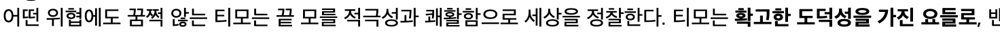

<br>

<br>

<br/>

- - -

<br/>

# 태그?

<br>

글자를 강조하고 싶을 때가 있을 것이다. 그럴땐 

```java
<strong> </strong>
```

태그를 사용해주면 된다. 

```html
어떤 위협에도 꿈쩍 않는 티모는 끝 모를 적극성과 쾌활함으로 세상을 정찰한다. 티모는 <strong>확고한 도덕성을 가진 요들로</strong>,
```

<br>
<br>

 

<br>
<br>

이렇게 진해진다 ㅎ 도덕성 강한 요들 티모가 더 강조가 된 것을 볼 수 있다 

위의 그림처럼 strong이란 것을 HTML에서는 문법적으로 태그라고 부른다. 또 

```html
<strong>creating <u>web</u> pages</strong>
```

이렇게 중첩해서 사용할 수도 있다.

옷을 살 때 붙어 있는것을 태그라고 말한다. 그 태그는 옷을 설명하고 가격도 설명한다.개발자들은 이 문법을 더 이해하기 쉽게 일상에서 자주 쓰는 말 중 이 문법과 비슷한 말을 찾았다. 그래서 일상생활의 태그에 은유(비유)하여 태그라고 불리우는 거다. 

# 
