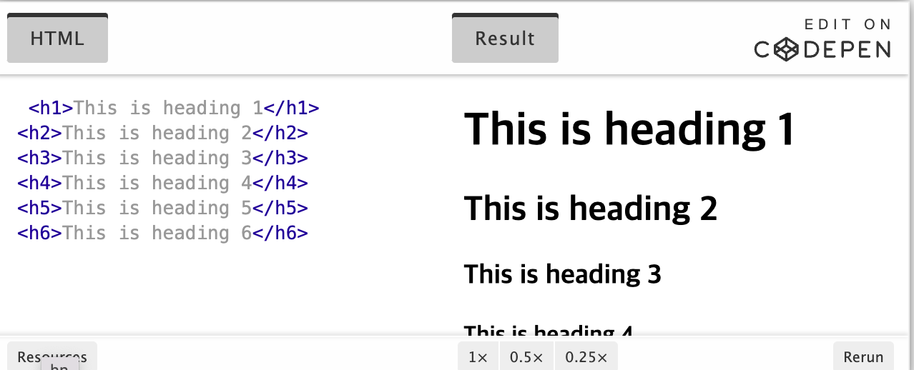
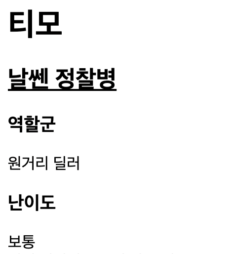

<br>

<br>

# h1은 어떤 기능?

<br>

<br>

앞의 공부를 통해서 h1이 무엇인지 아예 모르지는 않는다. 태그라는 사실을 알지만 기능을 모를뿐.. 

따라서 이게 태그라는 걸 알았으면 검색엔진을 이용해서 검색만 하면 기능을 쉽게 알 수 있다. 

이렇게 검색해보았다.

<strong>HTML h1 tag</strong>

<br>

<br>

 


<br>

<br>

정의를 먼저 보지말고 경험을 먼저 해보자.

글자가 두꺼워지고, 숫자가 커질수록 글자가 작아진다. 

추론을 바탕으로 정의를 보면

<br>

<br>

> The <h1> to <h6> tags are used to define HTML headings. <h1> defines the most important heading. <h6> defines the least important heading

<br>

<br>

h1은 가장 큰 제목 태그이고, 그 밑으로 갈 수록 작아지는 제목이라는 것을 알 수 있다.

이렇게 모르는 태그가 있으면 검색을 해서 알고 난 뒤 사용하면 된다.

이를 내 연습 html 파일에 적용시켜보았다.

<br>

<br>

```html
<h1>티모</h1>
<h2><u>날쎈 정찰병</u></h2>
<h3>역할군</h3>
원거리 딜러
<h3><strong>난이도</strong></h3>
보통
```

<br>

<br>

 

