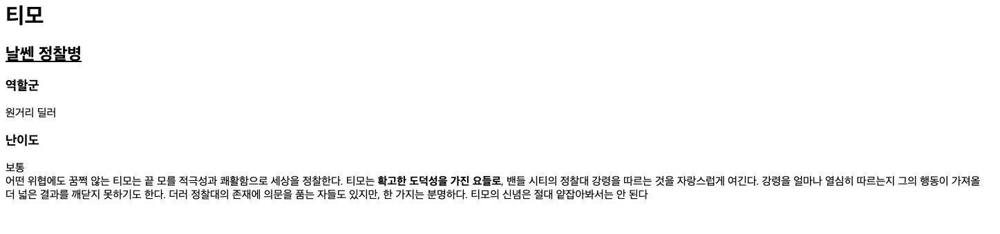
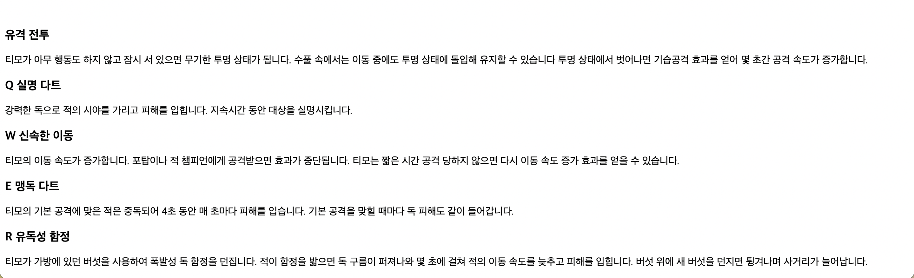

<br>

<br>

경쟁관계에 있는 br과 p에 대해서 배웠다

html에서는 줄바꿈을 하기 위해서는 줄바꿈을 해주는 태그가 필요하다.

안그러면 줄줄이 사탕으로 나온다. !

---

<br>
<br>
# br 태그

새로운 줄을 표현할 때는 

```
<br>
```

태그를 쓰면 된다.

<br>

<br>

```html
<h1>티모</h1>
<h2><u>날쎈 정찰병</u></h2>
<h3>역할군</h3>
원거리 딜러
<h3><strong>난이도</strong></h3>
보통
<br>
어떤 위협에도 꿈쩍 않는 티모는 끝 모를 적극성과 쾌활함으로 세상을 정찰한다. 티모는 <strong>확고한 도덕성을 가진 요들로</strong>, 밴들 시티의 정찰대 강령을 따르는 것을 자랑스럽게 여긴다. 강령을 얼마나 열심히 따르는지 그의 행동이 가져올 더 넓은 결과를 깨닫지 못하기도 한다. 더러 정찰대의 존재에 의문을 품는 자들도 있지만, 한 가지는 분명하다. 티모의 신념은 절대 얕잡아봐서는 안 된다
```

<br>

<br>

그런데 이 태그는 좀 특이한 면이 있다. 지금까지 배운 태그들은 열리는 태그와 닫히는 태그가 쌍으로 존재했지만, (ex h1...)

이 태그는 닫지 않고 있다.

HTML의 여러 태그 중에 무엇인가 설명하지 않는 태그들은 감싸야하는 컨텐츠가 없으므로 태그를 닫지 않는다는 규칙이있다. img,input,br,hr,meta 등이 이에 속한다.

<br>
<br/>

<br/>

- - -

<br>
<br>

# p   태그

<br>

<br>

p태그는 br 태그와 다르게 하나의 단락을 그룹핑 할 수 있도록, 열고 닫는 태그가 존재한다.

<br>

<br>

```html
<h3 style="margin-top:500px;"h3>유격 전투</h3> 
<p style="margin-top:10px;">티모가 아무 행동도 하지 않고 잠시 서 있으면 무기한 투명 상태가 됩니다. 수풀 속에서는 이동 중에도 투명 상태에 돌입해 유지할 수 있습니다 투명 상태에서 벗어나면 기습공격 효과를 얻어 몇 초간 공격 속도가 증가합니다.</p>
<h3>Q 실명 다트</h3> 
<p style="margin-top:10px;">강력한 독으로 적의 시야를 가리고 피해를 입힙니다. 지속시간 동안 대상을 실명시킵니다.</p>
<h3>W 신속한 이동</h3> 
<p style="margin-top:10px;">티모의 이동 속도가 증가합니다. 포탑이나 적 챔피언에게 공격받으면 효과가 중단됩니다. 티모는 짧은 시간 공격 당하지 않으면 다시 이동 속도 증가 효과를 얻을 수 있습니다.</p>
<h3>E  맹독 다트</h3> 
<p style="margin-top:10px;">티모의 기본 공격에 맞은 적은 중독되어 4초 동안 매 초마다 피해를 입습니다. 기본 공격을 맞힐 때마다 독 피해도 같이 들어갑니다.</p>
<h3>R  유독성 함정</h3> 
<p style="margin-top:10px;">티모가 가방에 있던 버섯을 사용하여 폭발성 독 함정을 던집니다. 적이 함정을 밟으면 독 구름이 퍼져나와 몇 초에 걸쳐 적의 이동 속도를 늦추고 피해를 입힙니다. 버섯 위에 새 버섯을 던지면 튕겨나며 사거리가 늘어납니다.</p>
```

<br>

<br>

단락을 표현할 땐 줄바꿈 태그 보다는 단락을 표현하는 태그인 p 태그가 더 좋은 선택이다

단락에 단락 태그를 사용하는 것이 웹페이지를 정보로서 보다 가치있게 해 주기 때문

br 태그는 줄바꿈을 의미할 뿐이다.

<br>

<br>

---

<br>
<br>

# p 태그의 단점

<br>

<br>

단락과 단락의 간격이 고정되어 있기 때문에 시각적으로 자유도가 떨어진다.

반면 br 태그는 쓰는 만큼 줄바꿈이 된다. 그래서 원하는 만큼 간격을 줄 수 있다.

그래서 많은 사람들이 br 태그를 선호한다.

하지만 웹에는 CSS 기술이 있다. 이를 이용하여 p 태그의 단점을 극복!

<br>

<br>

---

<br>
<br>

# CSS+< p > is better < br > !

<br>

<br>

css는 HTML과 완전히 다른 문법을 가진 언어다. HTML이 정보를 표현한다면, CSS는 정보를 꾸며준다.

<br>

<br>

```html
<h3 style="margin-top:500px;"h3>유격 전투</h3> 
<p style="margin-top:10px;">티모가 아무 행동도 하지 않고 잠시 서 있으면 무기한 투명 상태가 됩니다. 수풀 속에서는 이동 중에도 투명 상태에 돌입해 유지할 수 있습니다 투명 상태에서 벗어나면 기습공격 효과를 얻어 몇 초간 공격 속도가 증가합니다.</p>
<h3>Q 실명 다트</h3> 
<p style="margin-top:10px;">강력한 독으로 적의 시야를 가리고 피해를 입힙니다. 지속시간 동안 대상을 실명시킵니다.</p>
<h3>W 신속한 이동</h3> 
<p style="margin-top:10px;">티모의 이동 속도가 증가합니다. 포탑이나 적 챔피언에게 공격받으면 효과가 중단됩니다. 티모는 짧은 시간 공격 당하지 않으면 다시 이동 속도 증가 효과를 얻을 수 있습니다.</p>
<h3>E  맹독 다트</h3> 
<p style="margin-top:10px;">티모의 기본 공격에 맞은 적은 중독되어 4초 동안 매 초마다 피해를 입습니다. 기본 공격을 맞힐 때마다 독 피해도 같이 들어갑니다.</p>
<h3>R  유독성 함정</h3> 
<p style="margin-top:10px;">티모가 가방에 있던 버섯을 사용하여 폭발성 독 함정을 던집니다. 적이 함정을 밟으면 독 구름이 퍼져나와 몇 초에 걸쳐 적의 이동 속도를 늦추고 피해를 입힙니다. 버섯 위에 새 버섯을 던지면 튕겨나며 사거리가 늘어납니다.</p>
```

<br>

<br>

위의 코드에서 style="margin-top:500px; "이 CSS 코드에 해당한다. 

이는 h3태그와 p태그 위쪽에 각각 500px, 10px 만큼의 여백(margin)이 생긴다.

이것이 바로 CSS이다.

이처럼 p태그를 통해서 단락의 경계를 분명히 하며, CSS를 통해 p 태그의 디자인을 자유롭게 변경할 수 있기 때문에 br 태그보다 p 태그가 더 좋은 선택이다.

<br>

<br>

---

<br/>
<br/>

# 결과

<br>
<br>
 
<br>
<br>
여백을 500px만큼 주어서 스크롤을 내린 밑에 스킬 설명이 뜰 것이다
<br>
<br>

