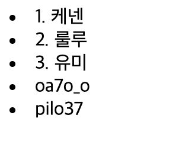
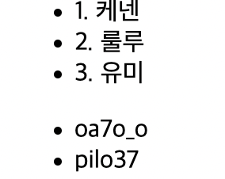
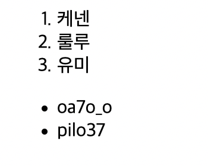

<br>

<br>

```html
<parent>
    <child></child>
</parent>
```

<br>

예로 들어 parent 태그에 대해서는 child 태그를 자식 태그라고 한다. (사실상 저런 이름의 태그는 없다)

또한 반대로 child 태그에 대해서 parent 태그를 부모 태그라고 한다.

<br>

예를 들어 아래 태그를 보면 p 태그가 a 태그의 부모, a 태그가 p태그의 자식이다.

<br>

```html
<p>
    <a href="https:naver.com">naver</a>
</p>
```

<br>

<br>

그런데 a 태그는 꼭 p 태그의 자식이어야 하는 것은 아니다. 마찬가지로 p태그도 a 태그의 부모일 필요는 없다. 

그러나 몇몇 태그들은 부모 자식 관계처럼 고정된 관계인 태그들이 있다.

<br>

<br>

---

<br>

<br>

# li 태그

<br>

<br>

목차는 영어로 list, 이 단어의 앞의 두글자만 딴 li 태그이다.

<br>

<br>

```html
    <li>1. 케넨</li>
    <li>2. 룰루</li>
    <li>3. 유미</li>
    <li>oa7o_o</li>
    <li>pilo37</li>
```

<br>

<br>

위에는 요들 캐릭터, 밑에는 나와 공부하는 친구의 아이디를 적어보았다.

<br>

<br>

 

<br>

<br>

구분이 가지 않는다 ! 

<br>

이렇듯 목록은 다른 목록과 구분 할 수 있도록 경계가 필요하다. 

이 때 사용되는 태그가 \<ul> 태그이다. 

<br>

<br>

```html
 <ul> 
    <li>1. 케넨</li>
    <li>2. 룰루</li>
    <li>3. 유미</li>
</ul>  
<ul>  
    <li>oa7o_o</li>
    <li>pilo37</li>
</ul>  
```

<br>

<br>

 

<br>

<br>

구분이 되었다.

<br>

<br>

이렇듯, li 태그는 ul 태그를 반드시 필요로 한다.

ul 태그 역시 li 태그가 없다면 존재 가치가 없다. 

이 둘은 서로 아주 밀접한 관계! 

<br>

<br>

# ol 태그

<br>

<br>

만약에 모든 챔피언들을 나열하고, 시간이 지나 캐릭터가 삭제되었을 때 이때까지 부여한 숫자들을 다시 새로 적어줘야한다. 엄청난 스트레스.. 이겠지 .

그럴 때 쓰는 ol태그이다. 숫자를 자동으로 내림차순으로 매겨즌다

<br>

<br>

```html
 <ol> 
    <li>케넨</li>
    <li>룰루</li>
    <li>유미</li>
</ol>  
<ul>  
    <li>oa7o_o</li>
    <li>pilo37</li>
</ul>  
```

<br>

<br>

 
