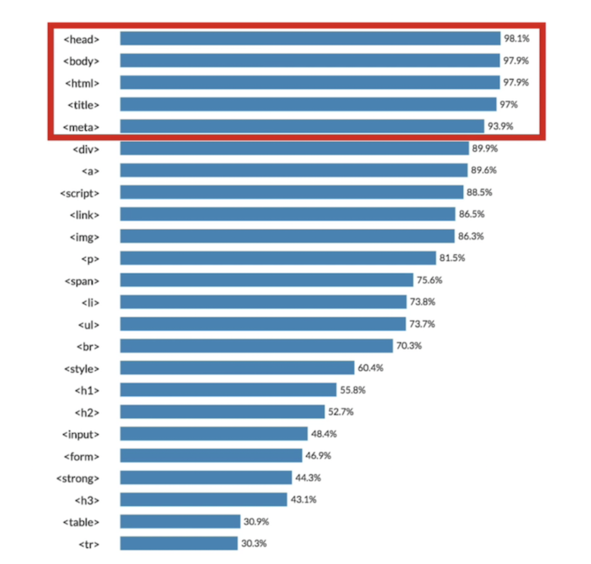
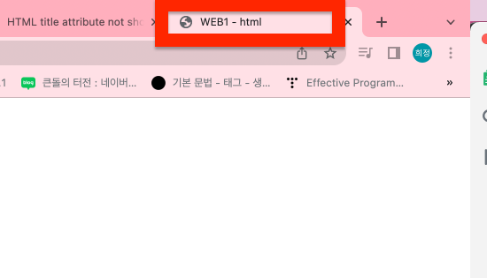
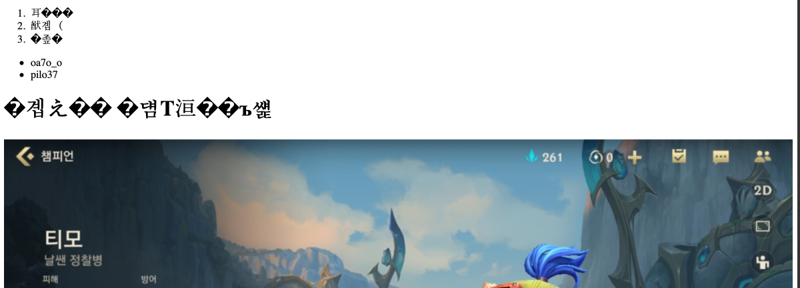

<br>

<br>

 

<br>

<br>

위에 다섯가지 태그들은 무슨 태그이길래 저렇게 많이 쓰이는 걸까.? 

사용량의 거의 90프로를 차지한다 

<br>

<br>

# \<title> 태그

<br>

<br>

먼저, 우리가 만든 웹페이지의 경우 제목이 이름을 지정해주고 싶다면 \<title> 태그를 사용해주면 된다.

```html
<title>WEB1 - html</title>
```

이렇게 지정을 해주었다.

그러면 

<br>

<br>



<br>

<br>

이렇게 바뀐다 !

<br>

<br>

# UTF-8 설정

<br>

<br>

크롬은 왜인진 모르겠지만 한글이 안깨진다 그러나 파이어폭스, 사파리 등은 이렇게 깨진다.

<br>

<br>

 

<br>

<br>

이를 해결하기 위해선 UTF-8로 인코딩 방식을 설정해줌 된다

```html
<meta charset="utf-8">
```

<br>

<br>

 

<br>

<br>

---

<br>

<br>

# HTML 태그/!doctype html 태그

그리고 또, body 태그와 head 태그를 감싸는 하나의 태그를 더 두기로 했다.

그것이 바로 HTML 태그이다.

또, 이 웹페이지가 HTML 로서 만들어졌다는 것을 표현하기 위해 문서의 시작에 아래와 같은 코드를 추가한다. 

```html
<!doctype html>
```

<br>

<br>

```html
<!DOCTYPE html>
<html>
<head>
    <title>WEB1 - html</title>
    <meta charset="utf-8">
</head>
<body>
    <ol> 
        <li>케넨</li>
        <li>룰루</li>
        <li>유미</li>
    </ol>  
    <ul>  
        <li>oa7o_o</li>
        <li>pilo37</li>
    </ul>  
    <h1>티모는 너무귀여워</h1>
    
    <h2><u>날쎈 정찰병</u></h2>
    <h3>역할군</h3>
    원거리 딜러
    <h3><strong>난이도</strong></h3>
    보통
    <br>
    어떤 위협에도 꿈쩍 않는 티모는 끝 모를 적극성과 쾌활함으로 세상을 정찰한다. 티모는 <strong>확고한 도덕성을 가진 요들로</strong>, 밴들 시티의 정찰대 강령을 따르는 것을 자랑스럽게 여긴다. 강령을 얼마나 열심히 따르는지 그의 행동이 가져올 더 넓은 결과를 깨닫지 못하기도 한다. 더러 정찰대의 존재에 의문을 품는 자들도 있지만, 한 가지는 분명하다. 티모의 신념은 절대 얕잡아봐서는 안 된다
    <h3 style="margin-top:200px;"h3>유격 전투</h3> 
    <p style="margin-top:10px;">티모가 아무 행동도 하지 않고 잠시 서 있으면 무기한 투명 상태가 됩니다. 수풀 속에서는 이동 중에도 투명 상태에 돌입해 유지할 수 있습니다 투명 상태에서 벗어나면 기습공격 효과를 얻어 몇 초간 공격 속도가 증가합니다.</p>
    <h3>Q 실명 다트</h3> 
    <p style="margin-top:10px;">강력한 독으로 적의 시야를 가리고 피해를 입힙니다. 지속시간 동안 대상을 실명시킵니다.</p>
    <h3>W 신속한 이동</h3> 
    <p style="margin-top:10px;">티모의 이동 속도가 증가합니다. 포탑이나 적 챔피언에게 공격받으면 효과가 중단됩니다. 티모는 짧은 시간 공격 당하지 않으면 다시 이동 속도 증가 효과를 얻을 수 있습니다.</p>
    <h3>E  맹독 다트</h3> 
    <p style="margin-top:10px;">티모의 기본 공격에 맞은 적은 중독되어 4초 동안 매 초마다 피해를 입습니다. 기본 공격을 맞힐 때마다 독 피해도 같이 들어갑니다.</p>
    <h3>R  유독성 함정</h3> 
    <p style="margin-top:10px;">티모가 가방에 있던 버섯을 사용하여 폭발성 독 함정을 던집니다. 적이 함정을 밟으면 독 구름이 퍼져나와 몇 초에 걸쳐 적의 이동 속도를 늦추고 피해를 입힙니다. 버섯 위에 새 버섯을 던지면 튕겨나며 사거리가 늘어납니다.</p>
</body>
</html>
```

<br>

<br>

---

<br>

<br>

이렇게 웹페이지 구조를 완성했다. 거의 모든 웹페이지가 이러한 구조를 가지고 있다.!

<br>

<br>

<sup>출처: 생활코딩 WEB1 강의 </sup>
