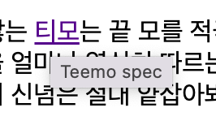

태그가 웹의 왕국이라면, 이 태그는 이 왕국의 제왕이다.

현대의 HTML은 150여개로 이루어져 있지만, 이들 모두  이 태그 아래에 있다. 

<br>

<br>

---

# \<a> 태그

<br>

<br>

이 태그의 이름은 anchor의 첫 글자 a 이다. 

앵커는 배가 정박할 때 사용하는 닻을 의미한다.

그럼 유추해볼 수 있는게 이 태그는 그럼 무슨 기능을 할까? 

바로 **링크**이다.

<br>

<br>

나의 프로젝트 내용 중에 티모라는 글자에 티모 공식 설명 페이지를 링크로 걸어보겠다.

```html
어떤 위협에도 꿈쩍 않는 <a href="https://www.leagueoflegends.com/ko-kr/champions/teemo/" target="_blank" 
     title = "Teemo spec" >티모</a>는 끝 모를 적극성과 쾌활함으로 세상을 정찰한다. 티모는 <strong>확고한 도덕성을 가진 요들로</strong>,
```

이와 같이 하면 된다. 

a는 anchor의 약자이고, href는 **H**yperText **Ref**erence의 약자이다.

그리고

target="\_blank"는 링크를 클릭했을 때 새창에서 페이지가 열리게 하는 속성이다.

또 title은 이 링크가 어떤 내용을 담고 있는지를 튤립으로 보여주는 기능이다.

<br>

<br>

 

<br>

<br>

이렇게 링크로 글자가 변환된다 ! 위에 커서를 올리면 어떤 내용인지 튤립으로 보여준다.
