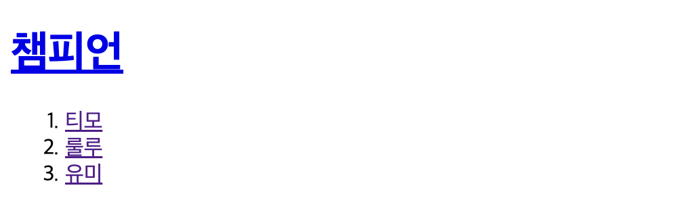
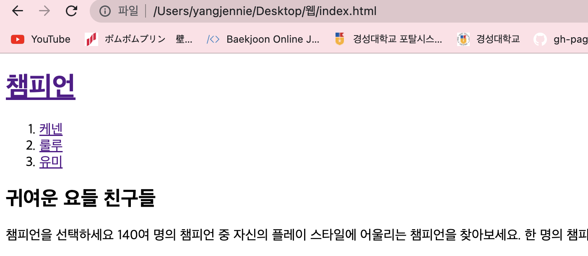
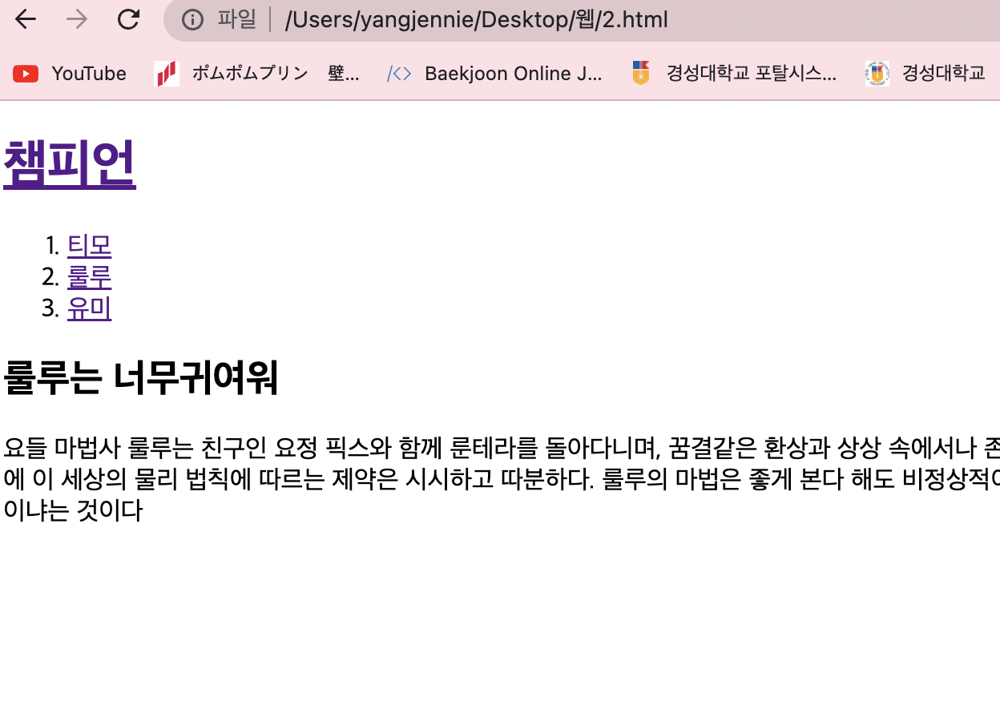

<br>

<br>

끝이 보인다 !

<br>

<br>

---

<br>

<br>

# 웹사이트란?

<br>

<br>

링크를 통해서 서로 결합되어 있는 웹페이지들의 그룹을 웹에서는 웹사이트(Web site)라고 한다.

<br>

<br>

---

<br>

<br>

# 실제 적용

<br>

<br>

```html
<!DOCTYPE html>
<html>
<head>
    <title>WEB1 - 티모</title>
    <meta charset="utf-8">
</head>
<body>
    <h1><a href="index.html">챔피언</a></h1>
    <ol> 
        <li><a href="1.html">티모</a></li>
        <li><a href="2.html">룰루</a></li>
        <li><a href="3.html">유미</a></li>
    </ol>   
```

<br>

<br>
 
<br>

<br>

이런 형태로 만들어준다. 각각 링크들을 걸어주었다.

그리고 각 파일을 내용에 맞게 수정해주었다.

<br>

<br>

## 기능 구현 결과

<br>

<br>

**챔피언 클릭 시**

<br>

<br>

 

<br>

<br>

해당 문서로 이동한다.

**룰루 클릭 시**

<br>

<br>

 

<br>

<br>

코드는 아래의 유형과 모두 동일하게 변경하였다.

<br>

<br>

```html
<!DOCTYPE html>
<html>
<head>
    <title>WEB1 - 룰루</title>
    <meta charset="utf-8">
</head>
<body>
    <h1><a href="index.html">챔피언</a></h1>
    <ol> 
        <li><a href="1.html">티모</a></li>
        <li><a href="2.html">룰루</a></li>
        <li><a href="3.html">유미</a></li>
    </ol>   
    <h2>룰루는 너무귀여워</h2>
    <p>
        요들 마법사 룰루는 친구인 요정 픽스와 함께 룬테라를 돌아다니며, 
        꿈결같은 환상과 상상 속에서나 존재할 법한 생명체를 만들어내는 것으로 유명하다. 
        룰루는 내키는 대로 현실을 빚어내고, 세상의 법칙을 비틀어 버린다.
         룰루가 보기에 이 세상의 물리 법칙에 따르는 제약은 시시하고 따분하다. 
         룰루의 마법은 좋게 본다 해도 비정상적이고 나쁘게 보면 위험하다고까지 할 수도 있겠지만, 
         룰루의 신념은 확고하다. 사람들에게 마법 한 번씩 맛보여 주는 게 뭐 그리 큰일이냐는 것이다
    </p>
</body>
</html>
```

<br>

<br>

head 내용은 똑같게하고, body의 내용을 다르게 해주었다. 간단한 실습이였다 ^-^!

<sub>출처: 생활코딩 - Web1</sub>
