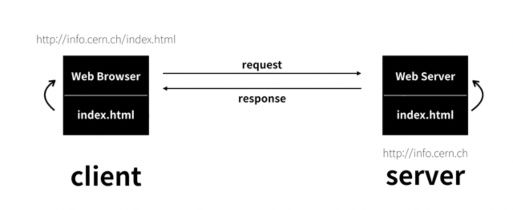
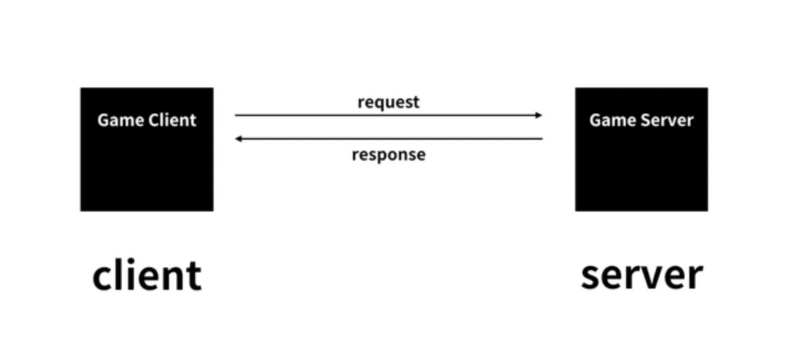

 

 

# 서론

 

 

인터넷이 동작하기 위해서는 컴퓨터가 최소 몇대 필요할까?

바로 2대이다. 

 

 

# 서버와 클라이언트

 

 

팀 버너스는 인터넷을 이용해서 웹을 만들기로 한다.

이를 위해서 인터넷으로 연결된 2대의 컴퓨터를 장만한다.

 

 

 

출처 : 생활코딩 

 

  

그리고 2개의 프로그램을 개발한다. 각 프로그램에 웹 브라우저와 웹서버라는 이름을 붙힌다.

웹 서버에는 info.cern.ch 주소를 부여

또 이 컴퓨터의 어떤 디렉토리에 index.html이라는 파일을 저장한다.

그리고 웹브라우저가 설치된 컴퓨터 주소창에 http://info.cern.ch/index.html 이라는 주소를 입력하고 엔터를 치면

 
 

 

출처 : 생활코딩 

 

 

웹브라우저가 설치된 컴퓨터는 인터넷을 통하여 전기적 신호를 info.cern.ch라는 주소의 컴퓨터에게  신호를 보낸다.

그 신호에는 'index.html'파일을 원한다 의 내용이 들어가있다.

그럼 info.cern.ch에 설치된 웹서버의 프로그램이 어떤 디렉토리의 index.html을 찾는다.

그리고 그 내용을 읽어 전기적 신호로 변경한 후 웹 브라우저가 설치된 컴퓨터에 신호를 보낸다.

그럼 웹 브라우저에서는 index.html의 코드가 도착한다. 웹브라우저는 이 코드를 읽어 웹페이지 화면에 출력한다.

여기서 보면, 웹 브라우저가 설치된 컴퓨터와 웹서버가 설치된 컴퓨터가 서로 정보를 주고 받는다.

이 중에서 웹서버가 깔린 컴퓨터는 정보를 응답하고, 웹클라이언트가 깔린 컴퓨터는 정보를 요청한다.

 

 

# 서버와 클라이언트의 유래

 

 

고객과 사업자는 자본주의 사회에서 가장 중요하다.

고객을 영어로 client , 사업자는 server

인터넷을 만든 사람은 이 비유를 사용하기로 결정한다.

요청하는 컴퓨터를 클라이언트 컴퓨터, 응답하는 컴퓨터를 서버 컴퓨터라고 부르기로 한다.

웹브라우저는 클라이언트 에서 동작한다. 그래서 웹브라우저를 다른말로는 웹 클라이언트라고도 한다.

웹 서버는 어떤 컴퓨터에서 동작할까? 이는 서버에서 동작한다. 따라서 웹 서버라고하는 것이다.

만약, 우리가 게임을 만든다면 사용자에게 설치된 프로그램을 게임 클라이언트라고 할 것이며,

게임회사의 서버 컴퓨터에 설치된 프로그램을 게임 서버라고 하는 것.

 
 

 

출처 : 생활코딩 

 

 

그럼 채팅 서버와, 클라이언트도 이와 같은 원리일 것.

이렇듯, 서버와 클라이언트는 인터넷을 이용하는 모든 정보 시스템에 적용되는 문법과도 같다. 이것을 이해한다면, 경험이 쌓일 수록 인터넷에 대한 이해가 높아질 것. 
