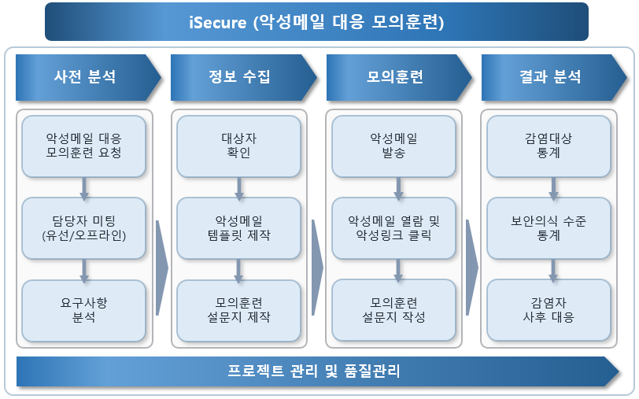
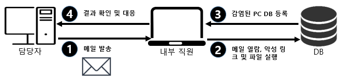

## 2. 모의훈련 분석 및 평가 방법

### 2.1. 모의 훈련 방법론

악성코드 대응 모의훈련은 `(주)아이시큐어의 고유 방법론`을 바탕으로 악성코드가 포함된 메일과 유사항 공격 패턴을 이용하여 진행한다.

### 2.2. 상세 수행 절차

| 구분 | 내용 |
| :----- | :----- |
| 사전분석 | - 모의훈련에 관한 전반적인 내용 협의 (진단 대상, 진단 일정, 시간 등) | 
| 정보 수집 | - 모의훈련 시 발송할 대상자의 메일 정보 수집   - 발송할 악성메일의 템플릿 제작   - 모의훈련 설문지 제작 |
| 모의훈련   1번안 |    - 악성 링크가 포함된 메일을 내부 직원에게 발송   - 내부 직원이 메일을 열람하고, 악성 링크를 클릭할 경우 DB에 기록   - 악성 링크를 클릭하면 모의훈련 설문지 사이트로 이동   - 감염자는 모의훈련 설문지를 작성하여 현재 보안 수준 확인 |
|모의훈련   2번안 |     - 악성 링크가 포함된 메일을 내부 직원에게 발송   - 내부 직원이 메일을 열람하고, 악성 링크를 클릭할 경우 DB에 기록   - 악성 링크를 클릭하면 모의훈련 설문지 사이트로 이동   - 감염자는 모의훈련 설문지를 작성하여 현재 보안 수준 확인   - 1차메일 발송 1시간후 1차메일 미열람 직원에게 2차메일 발송   - 감염확인시 보안담당자는 시스템관리에 주요시스템 확인요청   - 시스템관리자는 주요시스템 확인 및 조치후 보안담당자에게 보고 |

### 2.3. 평가 기준

평가 기준에 대한 내용은 생략합니다. 고객사의 경우 보고서를 통해서 평가기준등의 내용을 확인하실 수 있습니다.

