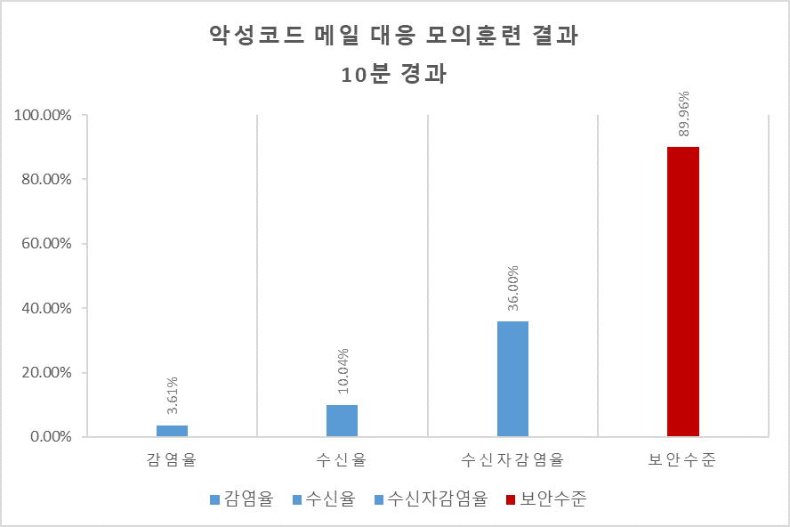
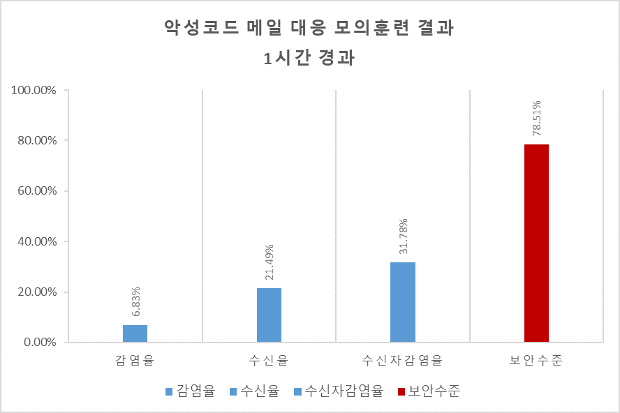
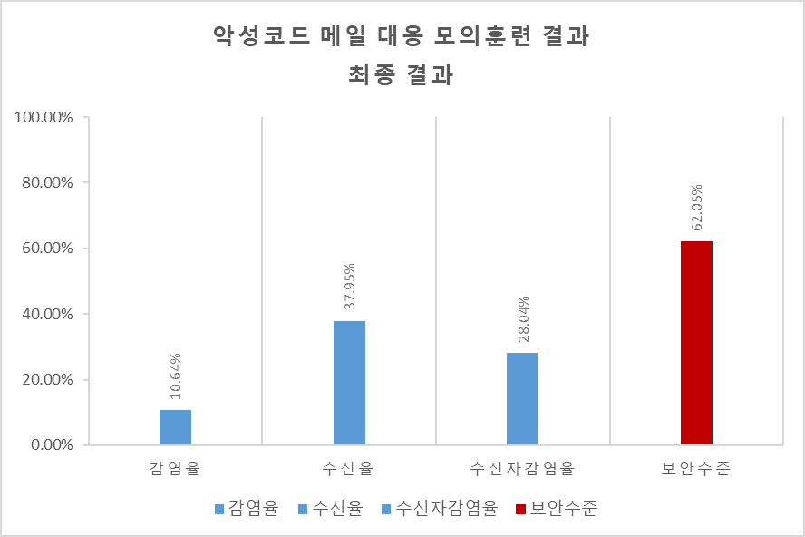
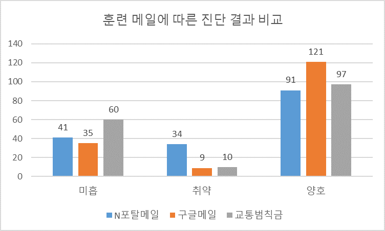
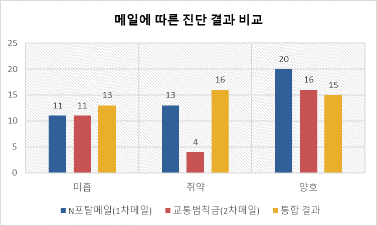
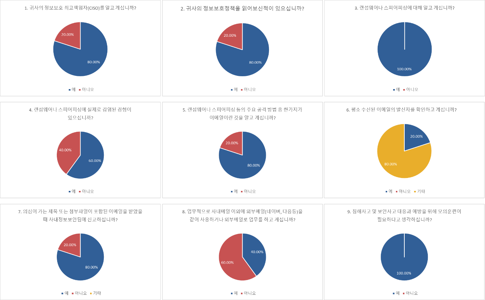

## 3. 모의훈련 결과

### 3.1. 총평

감염인원 및 취약인원에 대한 통계를 이용하여 보안수준을 측정.

아래 수치는 임의의 값을 적용한 수치입니다.
&nbsp;

|대상|메일구분|미열람|열람|클릭|설문|
|-----|-----|-----|-----|-----|-----|
| 167명 | 포탈메일로 위장한 악성코드 메일 | 75 | 75 | 34 | 9 |
| 165명 | 구글센터 메일로 위장한 악성코드 메일 | 44 | 44 | 9 | 1 |
| 165명 | 경찰청 교통위반 메일로 위장한 악성코드 메일 | 70 | 70 | 10 | 0 |
|합계|497|189|189|53|10|

&nbsp;

|시간|전체인원|미흡|취약|양호|감염율|수신율|보안수준|
|-----|-----|-----|-----|-----|-----|-----|-----|
|10분 경과|499|	33|18|448|3.61%|10.04%|89.96%|
|1시간 경과|499|73|34|391|6.83%|21.49%|78.51%|
|최종|	499|136|54|309|10.64%|37.95%|62.05%|

&nbsp;
  
| 메일 발송후 시간 경과 |
| :-----: |
|    |

&nbsp;

| 메일 구분에 따른 진단 결과 비교 |
| :-----: |
|   |

&nbsp;

| 설문조사 결과 |
| :-----: |
|  |

&nbsp;

### 3.2. 세부 훈련 결과 
 
 세부 훈련 결과는 생략합니다.