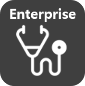

Personal version | Enterprise Version | Latest Version 
-------| ------- | -------
 |  |   

&nbsp;
기술 블로그에서는 Personal 버젼만 다운로드가 가능합니다. 그외에 엔터프라이즈와 관련된 사항은 담당자에게 문의해주세요.

&nbsp;
&nbsp;
## ToSee 버젼 구성

&nbsp;
&nbsp;
### 사용자에 따른 버전 구성
&nbsp;

||사용자에 따른 버전 구성|
|-----|-----|
|  | **ToSee Personal**   - 개인 사용자를 위한 취약점 진단, 파일트랩으로 랜섬웨어 차단, 네트워크   모니터링으로 자가진단이 가능.   - 개인용 버전은 매니져 시스템을 제공하지 않습니다. |
| | &nbsp; &nbsp; &nbsp; &nbsp; &nbsp; &nbsp; &nbsp; &nbsp; &nbsp; &nbsp; &nbsp; &nbsp;  &nbsp; &nbsp; &nbsp; &nbsp; &nbsp; &nbsp;  &nbsp; &nbsp; &nbsp; &nbsp; &nbsp; &nbsp;  |
|  | **ToSee Enterprise**   - Personal 기능을 포함   - 기업의 보안 수준 향상과 함께 ISMS 인증을 위한 PC 자산 관리를 위한 버전.   - 시스템 관리를 위한 매니져 시스템 제공 |
| | &nbsp; &nbsp; &nbsp; &nbsp; &nbsp; &nbsp;  &nbsp; &nbsp; &nbsp; &nbsp; &nbsp; &nbsp;  &nbsp; &nbsp; &nbsp; &nbsp; &nbsp; &nbsp;  &nbsp; &nbsp; &nbsp; &nbsp; &nbsp; &nbsp;    | 
|  | **ToSee Enterprise Custom**   - Enterprise 기능을 포함.   - 기업이 원하는 보안 진단 항목을 추가하고 파일트랩, 네트워크 모니터링 기능 제공   - BFE를 이용한 방화벽 기능 제공   - 기업 자체적으로 이용할 수 있는 별도의 서버를 구축하여 매니져 시스템을 제공. |

<ToSee 소개> 수정일자 2020.01.09