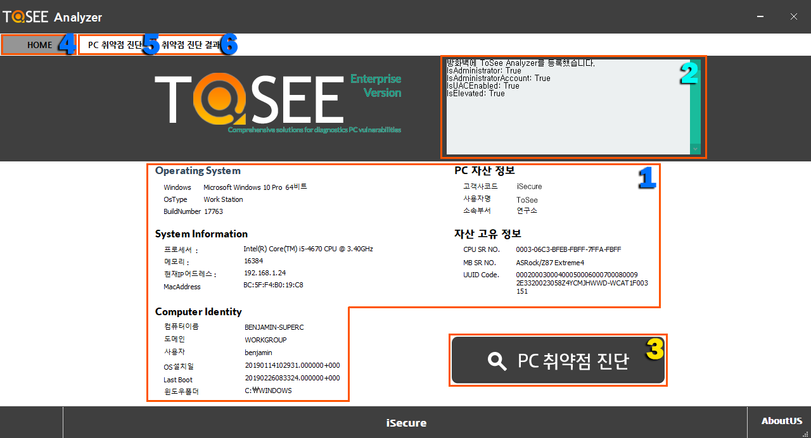
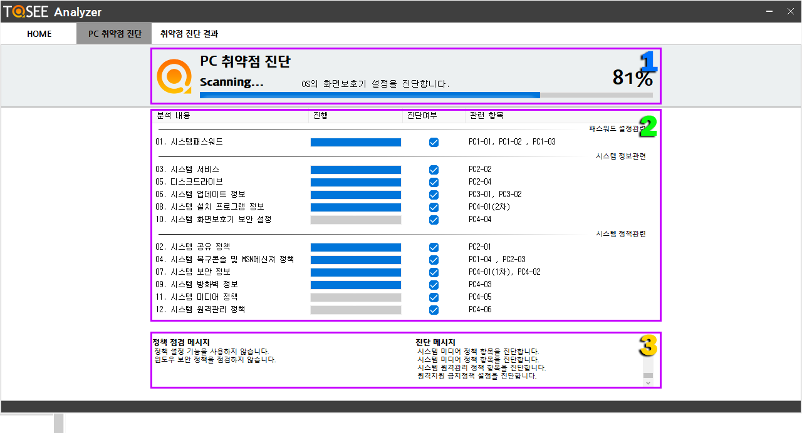
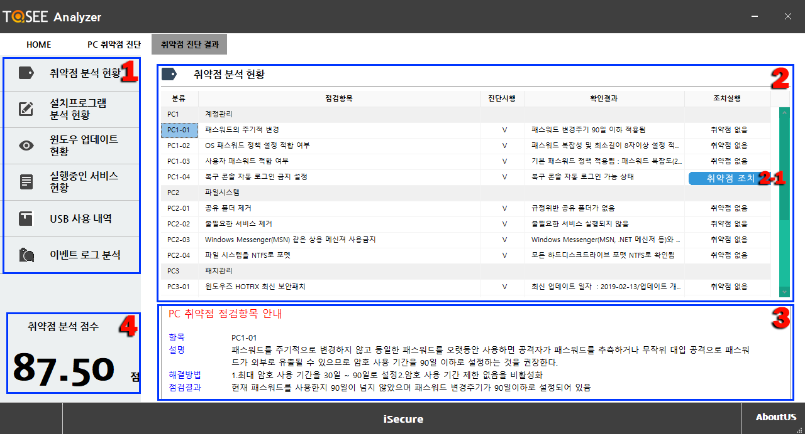

&nbsp;
## 취약점 진단 도구 ToSee Analyzer.
&nbsp;

### ToSee Analyzer 사용법

| ToSee Analyzer 사용법 - 홈화면 |
| :------------- |
|  |
| 1. 시스템 정보창 : 진단하고자 하는 시스템의 기본적인 정보를 나타낸다.   2. 진행 메세지 : 실행 및 진단중의 Status 메세지를 보여준다.   3. 취약점 진단 버튼 : 시스템의 취약점 진단을 시작한다.   4. 홈버튼 : 현재 보고 있는 홈화면을 보여주는 기능을 한다.   5. 취약점 진단 버튼 : 취약점 진단창을 보여준다.   6. 진단 결과창 버튼 : 진단 결과 화면을 보여준다. |

 

| ToSee Analyzer 사용법 - 진단 화면 |
| :------------- |
|  |
| 1. 진단 진행률 : 현재 진단하고 있는 항목과 전체 진단 진행도를 보여준다.   2. 진행 항목창 : 진단한 항목과 진단하고 있는 항목의 세부항목을 확인할 수 있다.   3. 진단 메시지 : 분석내용을 알려준다. |

 

| ToSee Analyzer 사용법 - 취약점 분석 현황 화면 |
| :------------- |
|  |
| 1. 진단 분석 항목 : 진단 및 분석이 완료된 항목을 선택하여 확인할 수 있다.   2. 취약점 분석 현황 : 취약점 분석한 세부 현황을 확인할 수 있으며 2-1과 같은 취약점 조치 버튼을 이용하여 취약점을 조치할 수 있다.   3. 점검 항목 안내 : 2번에서 선택한 항목에 대한 진단결과와 해결방법을 알려준다.   4. 취약점 분석 점수 : (양호한 목수 / 전체항목수) 를 백분율로 계산하여 점수로 표시해준다. |

 

| ToSee Analyzer 사용법 - 취약점 분석 현황 화면 |
| :------------- |
|  |
| 1. 진단 분석 항목 : 진단 및 분석이 완료된 항목을 선택하여 확인할 수 있다.   2. 취약점 분석 현황 : 취약점 분석한 세부 현황을 확인할 수 있으며 2-1과 같은 취약점 조치 버튼을 이용하여 취약점을 조치할 수 있다.   3. 점검 항목 안내 : 2번에서 선택한 항목에 대한 진단결과와 해결방법을 알려준다.   4. 취약점 분석 점수 : (양호한 목수 / 전체항목수) 를 백분율로 계산하여 점수로 표시해준다. |