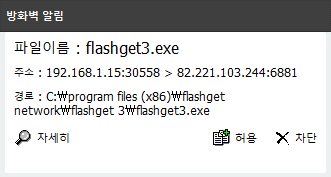
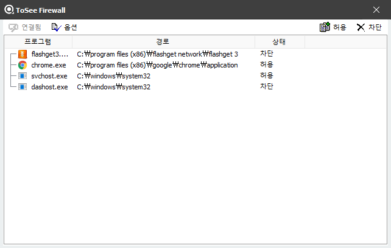

&nbsp;
&nbsp;
## FIREWALL PLUS
&nbsp;

### 방화벽 플러스 사용법

| 방화벽 알림 기능|
|:-----|
|  |
| - 윈도우 방화벽에서 기본적으로 관리하지 않는 Unknown 포트(1024 이후)를 사용하는 어플리케이션이 네트워크 송/수신을 하는 경우 우선 차단 후 사용자에게 허용여부를 물어본다. |

&nbsp;

| 방화벽 관리 어플리케이션 리스트 |
|:-----|
|  |
| - 방화벽플러스에서 관리하고 있는 어플리케이션과 그 상태에 대해서 리스트를 확인 할 수 있다. |

