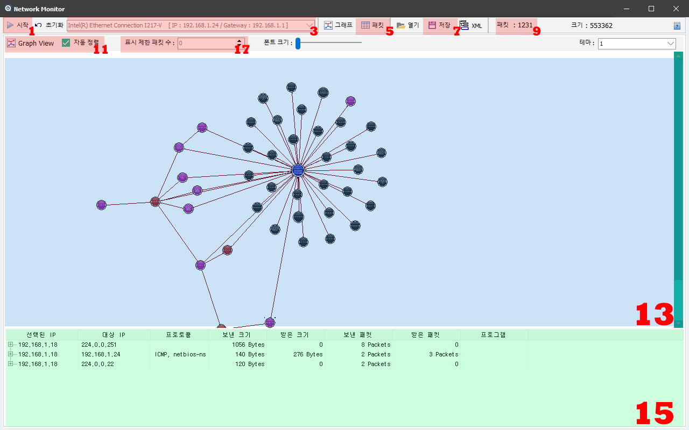
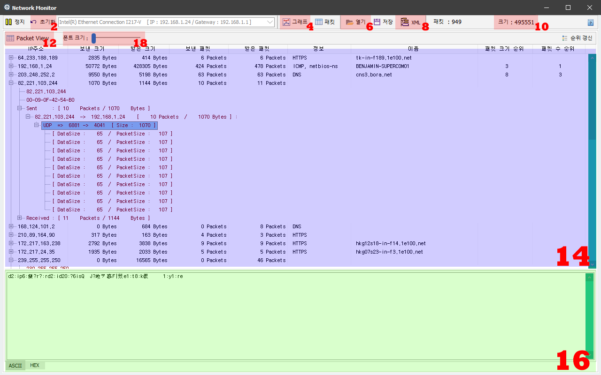

&nbsp;
## 네트워크 모니터
&nbsp;

### 네트워크 모니터 사용법

| 네트워크 모니터 사용법 |
| :------------- |
|     |
| 1. 시작/정지 버튼 : 네트워크 패킷의 캡쳐를 시작하거나 멈춘다.   2. 초기화 버튼 : 현재까지 캡펴한 데이타를 메모리상에서 삭제하고 초기화 한다.   3. 네트워크 아답터 선택 : 네트워크 아답터를 선택한다. 자동으로 네트워크를 사용중인 아답터가 선택되어 진다.   4. 그래프 모드 버튼 : 엘라스틱 벡터 그래픽으로 네트워크의 위상을 표시해주는 모드를 선택한다.   5. 텍스트 패킷 버튼 : IP주소 별로 패킷을 구분하여 리스트 형태로 표시해주는 모드를 선택한다.   6. 열기 버튼 : 저장해둔 결과 파일을 불러올 수 있다.   7. 저장 버튼 : 현재까지의 모니터링 결과를 바이너리 파일로 저장한다.   8. XML 저장 버튼 : 현재까지의 모니터링 결과를 XML 파일로 저장한다.   9. 패킷 : 현재까지 캡쳐된 패킷의 수를 나타낸다.   10. 데이터 크기 : 현재까지 캡쳐된 데이터의 크기를 나타낸다.   11. 그래프모드 표시 : 그래프모드에서의 자동정렬 기능을 선택할 수 있다.   12. 패킷모드 표시 : 현재 패킷모드임을 나타낸다.   13. 패킷 노드 그래프 : 캡쳐된 데이타의 위상을 엘라스틱 그래프로 표시한다.   14. 패킷 리스트 : 캡쳐된 데이타를 IP를 기준으로 정리된 리스트를 나타낸다.   15. 선택 노드 정보 : 13번 그래프상에서 선택한 노드의 패킷 관련정보를 모아서 보여준다.   16. 선택 패킷 정보 : 14번 패킷 리스트에서 선택한 패킷의 데이타정보를 아스키값과 Hexa 값으로 보여준다.   17. 표시 제한 패킷 수 : 그래프상에 나타낼 패킷의 최대 수를 지정한다. (현재 Disable 상태)   18. 폰트크기 : 패킷 리스트에 보여줄 폰트의 크기를 지정할 수 있다. |

*. NetMonitor 는 [WinPcap](https://www.winpcap.org/misc/copyright.htm) 의 패킷캡쳐기능을 이용한 어플리케이션입니다.

 