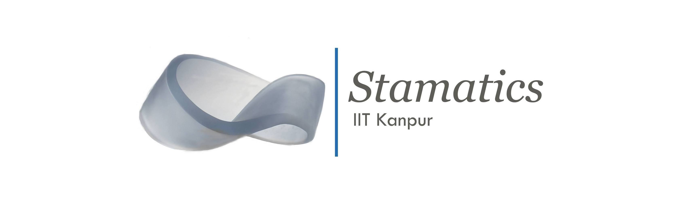

## About us  
**Stamatics** is a society of IIT Kanpur under the Department of Mathematics and Statistics. Throughout the year, Stamatics organises mathematical competitions, talks by various professors and students, workshops, and numerous other informal and formal sessions to guide students towards a fruitful life in the campus and outside.

Aimed at shedding more light and inculcating more interest in Mathematics, as well as making it fun and enjoyable, Stamatics distributes its newsletter full of interesting stuff ranging from groundbreaking scientific research articles to academic guidance by seniors and professors in various fields. In a nutshell, Stamatics is a group of individuals who strive to put all the opportunities, interesting researches, fun puzzles and the guidance of seniors, out in the open for everyone in the campus.
