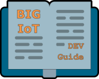

{:style="float: right;margin-right: 7px;margin-top: 7px;"}
By using our *BIG IoT API* (offered here as a *lib*), IoT platforms and services can **provide** their resources in a generic way. Using the same API lib, IoT applications (but also services) can **consume** those resources very easily. In this way, the BIG IoT API lib solves the today's interoperability issues between IoT providers and consumers.

Once a platform or service is using the lib, their resources can be registered as **offerings** on the *BIG IoT Marketplace*. For example, an IoT **platform** could offer data on the status of parking spots (occupied or available) within a city. An IoT **service** could provide the functionality to reserve resources. An **application** could access both with the BIG IoT API and combine them to enable reservation of parking spots.

The figure below illustrates the BIG IoT approach. All registered platforms and services are discoverable on the Marketplace. The API gives the functionality (discovery, data access, security, etc) to easily build IoT applications on top of this ecosystem.

