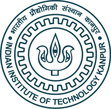
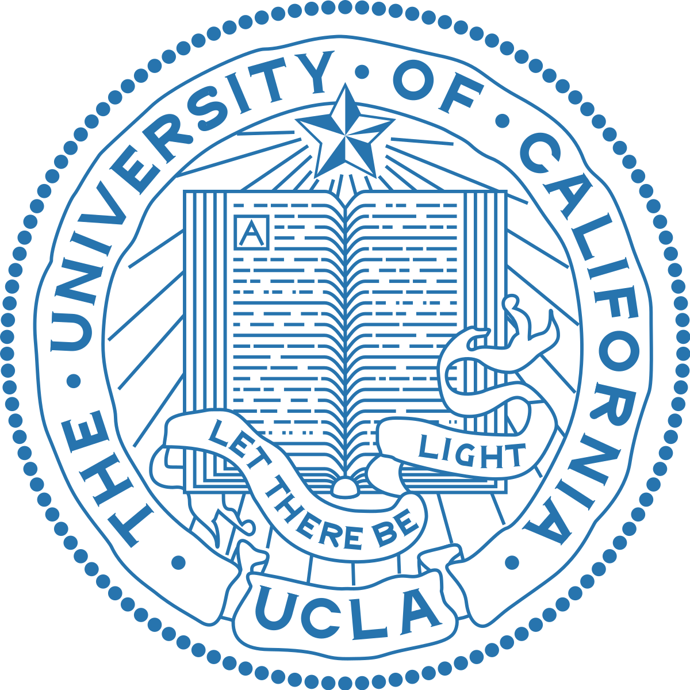

About Me
=========

Hi! I am **Vijit Malik** and I am a recently completed my undergraduate studies from **Indian Institute of Technology, Kanpur**. I *majored* in *Mechanical Engineering* with *minors* in *Machine Learning & Applications*. 

I conduct research in **Natural Language Processing** and **Artificial Intelligence**. 

At IIT Kanpur, I was fortunate enough to be advised by [Prof. Ashutosh Modi](https://ashutosh-modi.github.io/). 

Currently, I am a research intern at **UCLA's NLP Lab** advised by [Prof. Kai-Wei Chang](http://web.cs.ucla.edu/~kwchang/) and [Prof. Nanyun Peng](https://vnpeng.net/). I have been working closely with [Dr. Sunipa Dev](https://sunipa.github.io/), who is a postdoc at UCLA. 

I am an incoming Machine Learning Research Intern at [Observe.ai](https://www.observe.ai/) starting **July 2021**.

{: height="170px" width="170px" align="centre"}&nbsp;&nbsp;&nbsp;&nbsp;&nbsp;&nbsp;&nbsp;&nbsp;&nbsp;&nbsp;&nbsp;&nbsp;&nbsp;&nbsp;&nbsp;&nbsp;&nbsp;&nbsp;&nbsp;&nbsp;
{: height="170px" width="170px" align="centre"}&nbsp;&nbsp;&nbsp;&nbsp;&nbsp;&nbsp;&nbsp;&nbsp;&nbsp;&nbsp;&nbsp;&nbsp;&nbsp;&nbsp;&nbsp;&nbsp;&nbsp;&nbsp;
{: height="170px" width="170px" align="centre"}&nbsp;&nbsp;&nbsp;&nbsp;&nbsp;&nbsp;&nbsp;&nbsp;&nbsp;&nbsp;&nbsp;&nbsp;&nbsp;&nbsp;&nbsp;&nbsp;\
&nbsp;&nbsp;&nbsp;&nbsp;&nbsp;&nbsp;&nbsp;&nbsp;&nbsp;&nbsp;&nbsp;&nbsp;&nbsp;&nbsp;***IITK*** &nbsp;&nbsp;&nbsp;&nbsp;&nbsp;&nbsp;&nbsp;&nbsp;&nbsp;&nbsp;&nbsp;&nbsp;&nbsp;&nbsp;&nbsp;&nbsp;&nbsp;&nbsp;&nbsp;&nbsp;&nbsp;&nbsp;&nbsp;&nbsp;&nbsp;&nbsp;&nbsp;&nbsp;&nbsp;&nbsp;&nbsp;&nbsp;&nbsp;&nbsp;&nbsp;&nbsp;&nbsp;&nbsp;&nbsp;&nbsp;&nbsp;&nbsp;&nbsp;&nbsp; ***UCLA*** &nbsp;&nbsp;&nbsp;&nbsp;&nbsp;&nbsp;&nbsp;&nbsp;&nbsp;&nbsp;&nbsp;&nbsp;&nbsp;&nbsp;&nbsp;&nbsp;&nbsp;&nbsp;&nbsp;&nbsp;&nbsp;&nbsp;&nbsp;&nbsp;&nbsp;&nbsp;&nbsp;&nbsp;&nbsp;&nbsp;&nbsp;&nbsp;&nbsp;&nbsp;&nbsp;              ***Observe.ai***

Research
=========

My main research interests involve: *Applications of NLP in Legal domain*, *Bias detection and mitigation in low resource languages*, *Adversarial Attacks upon DNNs*, *Long Document Representation Learning*, *Controlled text generation in Language Models*. Although, I haven't worked intensively in Computer Vision, I am interested in *multimodal aspects of Deep Learning* as well. 

I am an aspiring PhD student and I have published papers at venues like **ACL** and **EACL**. Check out Publications section for more details!

News
======
* **29th May 2021**: I will be an *ML research intern* for six months at **Observe.ai** from 6th July!
* **6th May 2021**: Our paper on **LegalAI for India** got *accepted* at **ACL-IJCNLP2021** main conference!
* **8th Apr 2021**: Our paper got *accepted* at **SemEval-2021** co-located with **ACL-IJCNLP2021**!
* **25th Feb 2021**:  Our team BreakingBERT@IITK placed **5th** (Subtask A) and **1st** (Subtask B) in **SemEval2021** Task 5!
* **22nd Feb 2021**: I will be a Research Intern at  *@UCLA* this summer under **Prof. Kai-Wei Chang** and **Prof. Nanyun Peng**!
* **15th Jan 2021**: My first paper *accepted* at **EACL2021**. Check out the publications section!

Publications
=============

**2021**

* **Indian Legal Documents Corpus (ILDC) for Court Judgment Prediction and Explanation** [[arxiv]](https://arxiv.org/abs/2105.13562)\
&nbsp;&nbsp;&nbsp;&nbsp;&nbsp;&nbsp;&nbsp;&nbsp; ***Vijit Malik**, Rishabh Sanjay, Shubham Kumar Nigam, Kripa Ghosh, Shouvik Guha, Arnab Bhattacharya, Ashutosh Modi* \
&nbsp;&nbsp;&nbsp;&nbsp;&nbsp;&nbsp;&nbsp;&nbsp; Accepted @[ACL-IJCNLP2021](https://2021.aclweb.org/)

* **BreakingBERT@IITK at SemEval-2021 Task 9 : Statement Verification and Evidence Finding with Tables** [[arxiv]](https://arxiv.org/abs/2104.03071)\
&nbsp;&nbsp;&nbsp;&nbsp;&nbsp;&nbsp;&nbsp;&nbsp; *Aditya Jindal\*, Ankur Gupta\*, Jaya Srivastava\*, Preeti Menghwani\*, **Vijit Malik\***, Vishesh Kaushik\*, Ashutosh Modi*\
&nbsp;&nbsp;&nbsp;&nbsp;&nbsp;&nbsp;&nbsp;&nbsp; (\* = Equal Contribution)\
&nbsp;&nbsp;&nbsp;&nbsp;&nbsp;&nbsp;&nbsp;&nbsp; Accepted @[SemEval2021](https://semeval.github.io/SemEval2021/)

* **Adv-OLM: Generating Textual Adversaries via OLM**  [[arxiv]](https://arxiv.org/abs/2101.08523)\
&nbsp;&nbsp;&nbsp;&nbsp;&nbsp;&nbsp;&nbsp;&nbsp; ***Vijit Malik**, Ashwani Bhat, Ashutosh Modi*\
&nbsp;&nbsp;&nbsp;&nbsp;&nbsp;&nbsp;&nbsp;&nbsp; Accepted @[EACL2021](https://2021.eacl.org/)

