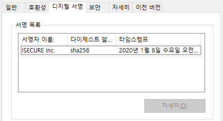
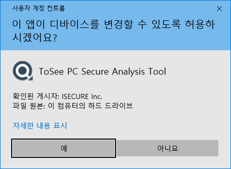
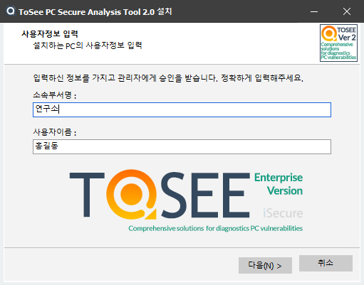
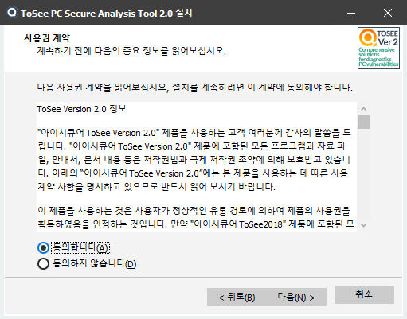
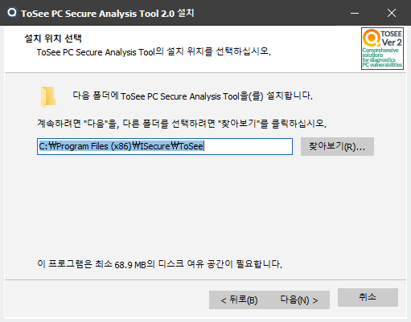
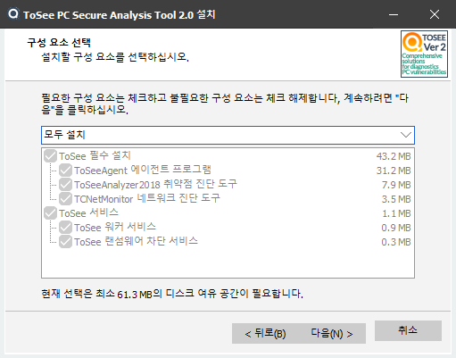
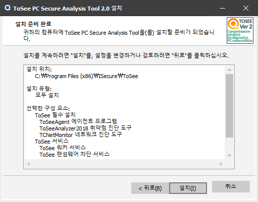
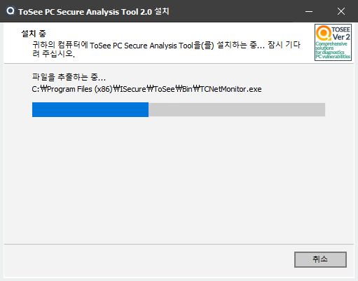
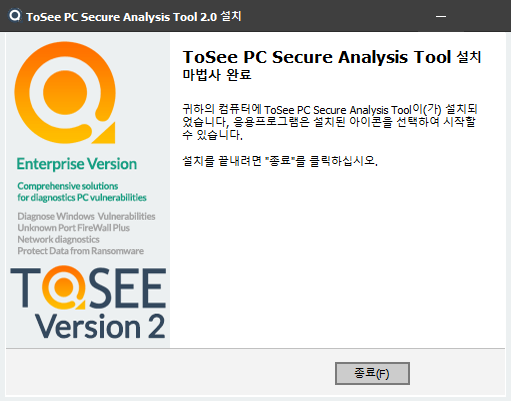

&nbsp;  &nbsp;

## ToSee 설치
&nbsp;

### ToSee 설치시 필요사항

|  ToSee 설치  |
|  :-----------------------:  |
| ToSee 설치는 Inno Setup 6.0.3 으로 개발되었습니다. 설치시 admin 권한을 필요로 합니다. 설치를 진행하면서   설치 대상폴더를 선택하도록 되어 있고, 현재 배포중인 솔루션들은 기본적인 것으로 모두 설치하게 되어 있어   선택적 설치가 되지는 않습니다. 이후 추가되는 기능들은 설치시 선택하도록 할 예정입니다. Enterprise 와   Personal 버젼의 가장 큰차이는 관리자에게 매니져 사이트의 접근권한을 주는 것으로 Personal 버젼에서는   해당 기능을 제공하지 않습니다.|
|  |

&nbsp;
### ToSee 설치프로그램 디지털서명
&nbsp;

|Ev인증서|
|  :-----------------------:  |
| ToSee는 프로그램과 개발사에 대한 기본적인 신뢰성과 안전성을 높이기 위해 Ev인증을 채택하고 있습니다. |
|  | 

&nbsp;
### ToSee 설치시 Admin 권한 요청
&nbsp;

|Admin권한 요청|
|  :-----------------------:  |
| ToSee는 관리자 권한을 필요로 하는 정보를 획득하고 관리하기 위해서 설치시 Admin 권한을 요청 합니다. ToSee의 설치를 위해서 관리자 권한을 허용해 주어야 합니다. |
|  | 

&nbsp;
### ToSee 설치시 언어 선택
&nbsp;

| 설치시 언어 선택 |
|  :-----------------------:  |
| ToSee를 설치할때 필요한 언어를 선택합니다. 한국어와 영어 2개 언어를 지원하고 있습니다. |
|  | 

&nbsp;
### 사용자 정보 입력
&nbsp;

| 사용자 정보 입력 |
|  :-----------------------:  |
| 사용자 정보를 받습니다. Personal 버젼의 경우에는 임의의 값을 입력해주셔도 됩니다.   Entereprise 버젼의 경우 소속회사의 부서와 이름을 적어주셔야 자산관리에 이용이 가능합니다. |
|  | 

&nbsp;
### 사용권 계약 동의
&nbsp;

| 사용권 계약 동의 |
|  :-----------------------:  |
| ToSee의 라이센스와 사용에 대한 계약에 동의를 요청합니다. Personal 버젼과 Enterprise 버젼의   사용권 계약이 다르게 적용되니 확인하시고 동의를 해주시기 바랍니다. |
|  | 

&nbsp;
### 설치 위치 선택
&nbsp;

| 설치 위치 선택 |
|  :-----------------------:  |
| ToSee를 설치할 폴더를 선택합니다. 기본 값으로 \Program Files (x86)\ISecure\ 에 설치를 합니다. |
|  | 

&nbsp;
### 구성 요소 선택
&nbsp;

| 구성 요소 선택 |
|  :-----------------------:  |
| ToSee 사용시 필요한 기능만 설치하기 위한 구성 요소 선택 화면입니다. Version 2.0까지는 대부분의   구성 요소를 설치해야만 합니다 |
|  | 

&nbsp;
### 설치 준비 완료
&nbsp;

| 설치 준비 완료 |
|  :-----------------------:  |
| ToSee 설치를 위해 선택된 내용과 설사용시 필요한 기능만 설치하기 위한 구성 요소 선택 화면입니다.   Version 2.0까지는 대부분의  구성 요소를 설치해야만 합니다 |
|  | 

&nbsp;
### 설치 중
&nbsp;

| 설치 중 |
|  :-----------------------:  |
| ToSee 설치의 진행정도를 프로그래스바를 통해 확인하고 현재 설치중인 파일들을 볼 수 있습니다. |
|  | 

&nbsp;
### 설치 완료
&nbsp;

| 설치 완료 |
|  :-----------------------:  |
| ToSee의 설치가 완료 되었음을 사용자에게 알리고 설치완료후 ToSee Agent를 실행합니다. |
|  | 